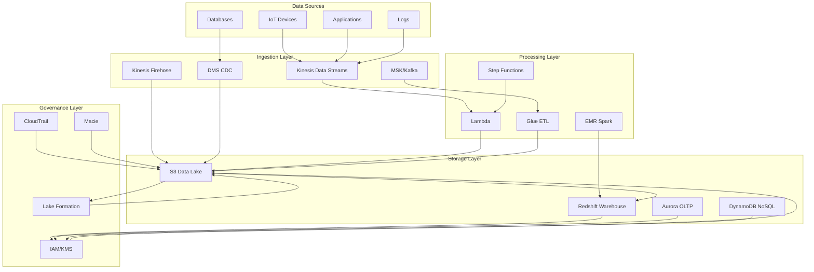
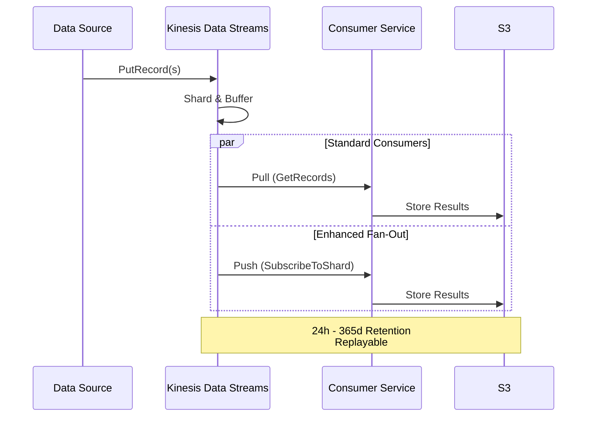
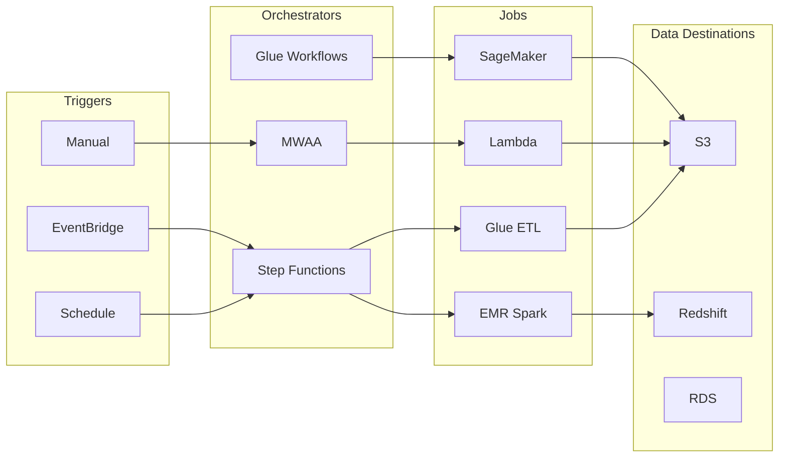
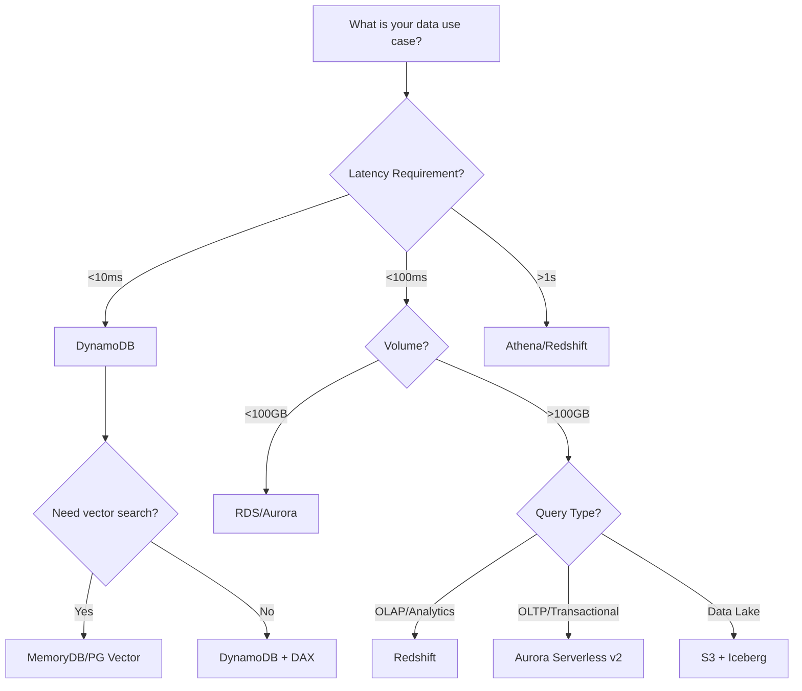
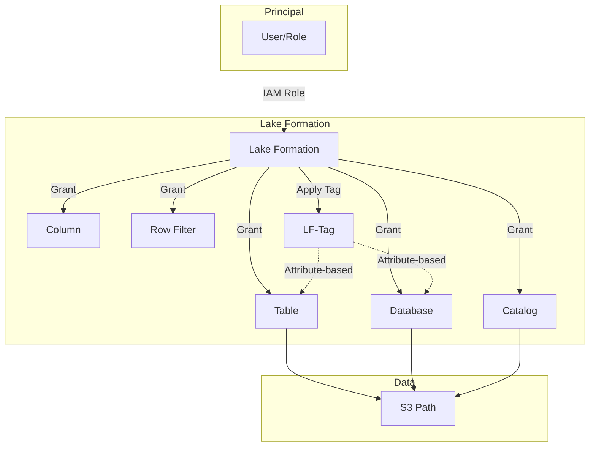

# AWS Certified Data Engineer – Associate (DEA-C01)

## Complete Study Guide

**Based on the Official AWS Exam Guide v1.1 (Dec 2025)**

> A comprehensive, task-by-task study guide covering every domain, task, and skill in the official exam guide, with diagrams, comparison tables, and practice questions.
> **Last updated**: January 2026

---

## Exam Architecture Overview



## Exam Overview

| Item | Detail |
|---|---|
| Exam Code | DEA-C01 |
| Format | Multiple choice & multiple response |
| Scored questions | 50 |
| Unscored questions | 15 (do not affect your score) |
| Duration | 130 minutes |
| Passing score | 720 / 1000 (scaled) |
| Scoring model | Compensatory (overall pass) |
| Recommended experience | 2–3 yrs data engineering + 1–2 yrs on AWS |
| Latest guide version | v1.1 (Dec 12, 2025) |

### 1.1 The Four Content Domains and Their Weights

| Domain | Weight |
|---|---|
| 1. Data Ingestion and Transformation | 34% |
| 2. Data Store Management | 26% |
| 3. Data Operations and Support | 22% |
| 4. Data Security and Governance | 18% |

### 1.2 Out-of-Scope Job Tasks (Do NOT study for these)
- Perform ML training and inferences.
- Demonstrate knowledge of programming language-specific syntax.
- Draw business conclusions based on data.

> Treat the exam as "build, secure, operate the pipeline" — not "use ML" or "interpret results for the business."

### 1.3 Core Knowledge You Are Expected to Have
- Build and maintain ETL pipelines end-to-end (ingestion → destination).
- High-level, language-agnostic programming concepts (loops, conditionals, data structures).
- Git commands (clone, commit, push, branch, merge).
- Data lake fundamentals.
- Networking, storage, and compute concepts.
- Vector concepts (embeddings, similarity, HNSW/IVF).
- SQL on AWS services (Redshift, Athena, RDS).
- Cost / performance trade-offs across AWS data services.

---

## Domain 1: Data Ingestion and Transformation (34%)
This is the **largest domain**. Master it first. It covers four tasks:

- Task 1.1 Perform data ingestion
- Task 1.2 Transform and process data
- Task 1.3 Orchestrate data pipelines
- Task 1.4 Apply programming concepts

---

### Task 1.1: Perform Data Ingestion



#### Skill 1.1.1: Streaming Sources
**Amazon Kinesis Data Streams (KDS)**
- Real-time, low-latency streaming. Default retention 24h, up to 365 days.
- Record size up to **10 MiB** (raised from 1 MiB in October 2025).
- You provision **shards**. Each shard gives 1 MB/s write, 2 MB/s read, 1000 records/s.
- **Two consumer types**:
  - **Standard consumer**: shared throughput across all consumers, up to 5 GetRecords calls/s.
  - **Enhanced fan-out consumer**: dedicated 2 MB/s pipe per consumer, push-based, lower latency. Up to **50 consumers** per stream (raised in 2025).
- **Replayability**: Records persist in the stream (up to retention), so consumers can **replay** by re-reading or by using a different application/iterator.
- **Kinesis Producer Library (KPL)** aggregates small records; **Kinesis Client Library (KCL / KCL v2)** handles checkpointing and load balancing.
- Use cases: log ingestion, clickstream, IoT telemetry, real-time analytics.

**Amazon Managed Streaming for Apache Kafka (Amazon MSK)**
- Managed Apache Kafka. Two broker types: **Standard** and **Express** (low-latency, no ZooKeeper).
- Best practice: keep broker CPU utilization under 60% (CPU User + CPU System) to allow rebalancing and recovery.
- Use when: existing Kafka apps, you need long retention, exactly-once semantics, or Kafka ecosystem tooling (Kafka Connect, Kafka Streams, Schema Registry).
- **MSK Replicator** for cross-Region or cross-cluster replication.

**Amazon DynamoDB Streams**
- Time-ordered stream of item-level modifications in a DynamoDB table (24-hour retention).
- Use **Lambda** triggers to react to changes. Combine with **DynamoDB Kinesis Adapter** to push into Kinesis.
- **DynamoDB global tables** replicate across Regions. Streams + TTL settings are synchronized across replicas.

**AWS Database Migration Service (AWS DMS)**
- Heterogeneous and homogeneous migrations with **near-zero downtime**.
- Source stays operational during migration; DMS captures CDC (change data capture) using transactional logs.
- Use **AWS DMS Schema Conversion** (replaces retired AWS SCT) to convert schemas between database engines.
- Components: **replication instance**, **source endpoint**, **target endpoint**, **replication task**.
- Best practice: use **multi-AZ** for HA, use **validation** task setting, size replication instance based on table count and volume.

**AWS Glue**
- Connectors: JDBC to relational DBs, MongoDB, Kafka, Kinesis, S3, etc. Glue crawlers and ETL jobs can read from these sources.

**Amazon Redshift**
- COPY from S3, Kinesis, or Enhanced VPC Routing via the Amazon Redshift Streaming Ingestion (KDS/Kafka).
- **Amazon Redshift Streaming Ingestion** (GA) lets you ingest KDS/MSK directly without staging in S3.

#### Skill 1.1.2: Batch Sources
**Amazon S3**
- The most common batch source — CSV, JSON, Parquet, ORC, Avro, Iceberg.
- **S3 Event Notifications** can trigger Lambda, SQS, or SNS on `s3:ObjectCreated:*` events.
- S3 Object Lambda for transformations on read.

**AWS Glue**
- Can read from S3, JDBC sources (RDS, Aurora, Redshift, on-prem via Direct Connect), DynamoDB, MongoDB, Kafka.
- Glue supports CSV, JSON, Parquet, ORC, Avro, XML, and **Apache Iceberg** tables.

**Amazon EMR**
- Managed Hadoop/Spark/Hive/Presto/Flink/HBase clusters.
- Reads from S3, HDFS, DynamoDB, HBase, JDBC.
- Cluster types: **EMR on EC2**, **EMR Serverless**, **EMR on EKS**, **EMR on Outposts** (in scope: EC2/Serverless/EKS).

**AWS DMS**
- Can also be used for batch loads in addition to CDC.

**Amazon Redshift**
- **COPY** command loads from S3, EMR, or remote host (SSH).
- Supports Parquet, ORC, JSON, CSV, Avro, fixed-width.

**AWS Lambda**
- Triggered on schedule, by S3 events, by EventBridge, by SQS messages.
- Can pull from APIs or S3.

**Amazon AppFlow**
- No-code integration between SaaS (Salesforce, ServiceNow, Google Analytics, Slack, GitHub, Snowflake) and AWS (S3, Redshift, Salesforce, Snowflake).
- Supports scheduled, on-demand, and event-driven flows.
- Field-level mapping, validation, and masking.

#### Skill 1.1.3: Batch Ingestion Configuration
| Service | Configuration Knobs |
|---|---|
| Glue ETL | DPU (data processing unit) count, worker type (Standard/G/Flex), job bookmarks, job timeout, concurrent runs, auto-scaling |
| Glue Crawler | Schedule, scope (single table vs whole DB), exclusions, schema change policy, partitions |
| DMS | Replication instance class, multi-AZ, full-load + CDC vs CDC-only, validation, LOB settings, parallel load threads |
| EMR | Instance type/fleet, master/core/task nodes, EBS volumes, bootstrap actions, auto-scaling, Managed Scaling |
| COPY (Redshift) | COMPROWS, MAXERROR, IGNOREHEADER, REGION, IAM_ROLE, FORMAT AS PARQUET, STATUPDATE |
| AppFlow | Trigger config, incremental loads, field mapping, data partition, aggregation, filter, validation, masking, transfer mode (full vs incremental) |
| Kinesis Agent | File pattern, buffer size/interval, max file age |
| Lambda | Memory (128 MB – 10,240 MB), ephemeral storage, timeout, reserved/provisioned concurrency, EFS mount, environment variables |

#### Skill 1.1.4: Consuming Data APIs
- Use AWS SDK (boto3 for Python) to call REST/GraphQL/SOAP APIs.
- **API Gateway** + **Lambda** = serverless API → easy for downstream consumers.
- For high-throughput external APIs, place records on an **SQS queue** and use Lambda to drain, with retries, DLQs, and backoff (exponential jitter).
- Use **Secrets Manager** to store API keys/tokens and rotate them.

#### Skill 1.1.5: Schedulers
**Amazon EventBridge Scheduler (preferred for new workloads, 2025)**
- Cron and rate expressions, **timezone-aware** (e.g., `cron(0 8 ? * MON-FRI *)` for 8 AM Mon–Fri in a specific TZ).
- Configurable **flexible time windows**, **retry policies** with exponential backoff, and **dead-letter queues**.
- Replaces "EventBridge scheduled rules (legacy)" for most new use cases.

**EventBridge Scheduled Rules (legacy)**
- Cron (`cron(0 12 * * ? *)`), rate (`rate(5 minutes)`).
- Targets: Lambda, SQS, SNS, Kinesis, Step Functions, ECS tasks, etc.

**Apache Airflow (Amazon MWAA)**
- DAGs expressed in Python with `@dag`, operators (Glue, EMR, Lambda, Athena, etc.).
- Cron-based scheduling, retries, backfills, dependencies, SLAs, XComs.
- Minimize MWAA when Step Functions can do it (cheaper, serverless, less ops).

**Glue Triggers**
- Schedule-based (`cron`) or event-based (crawler/job completion).
- **Conditional**: fire only when predecessor succeeds, fails, or any event.

**Time-based schedules for crawlers/jobs**
- Glue crawler schedules, Glue job triggers, Redshift scheduled queries, EMR Step concurrency.

#### Skill 1.1.6: Event Triggers
**S3 Event Notifications**
- Best practice: use **EventBridge** for S3 events (richer filtering, multiple targets, schema).
- Direct destinations: Lambda, SQS, SNS (legacy). Can use **S3 Batch Operations** for bulk actions.

**EventBridge**
- **Event buses**: default, custom, partner (SaaS).
- **Rules** match event patterns and route to targets (Lambda, SQS, SNS, Step Functions, Kinesis, etc.).
- Use **archive** (long-term) and **replay** for events.
- **Schema registry** infers/discovers event schemas.

**Examples**:
- Glue ETL job triggered by S3 `ObjectCreated` on a prefix.
- Lambda triggered by EventBridge on `codebuild Build State Change` to publish a metric.
- Step Functions state machine triggered by EventBridge on Glue job success.

#### Skill 1.1.7: Lambda ↔ Kinesis Integration
- **Kinesis → Lambda**: add an event source mapping with `StartingPosition` (TRIM_HORIZON, LATEST, AT_TIMESTAMP), `BatchSize`, `ParallelizationFactor`, `BisectBatchOnFunctionError`, `RetryAttempts`, `MaximumRecordAgeInSeconds`, `DestinationConfig` (on-failure destination = SQS/SNS).
- Tumbling windows: aggregate records by time windows before invoking the function.
- **Lambda → Kinesis**: use `PutRecord` or `PutRecords` (batched) via boto3. **Aggregate** small records; use **KPL** for high-volume producers.
- Beware of **Lambda concurrency throttling** — pair with SQS for buffering if you cannot scale Kinesis consumers fast enough.

#### Skill 1.1.8: Allowlists for IP Addresses
- On-prem data sources: configure **VPC security groups** to allow the AWS DMS replication instance / Glue connection / Lambda ENI.
- For **public APIs**, use VPC + **NAT Gateway** or **PrivateLink** (preferred).
- For SaaS with allow-listed IPs, request AWS's public IP ranges from `https://ip-ranges.amazonaws.com/ip-ranges.json` and use them in the SaaS allowlist.
- Use **VPC endpoints (PrivateLink)** for private access to S3, DynamoDB, Kinesis, etc.

#### Skill 1.1.9: Throttling and Rate Limits
- **DynamoDB**: provisioned capacity or on-demand; adaptive capacity, exponential backoff via SDK.
- **Amazon RDS**: connection storms → use **RDS Proxy** to pool and reuse connections; pgbouncer patterns for PostgreSQL.
- **Kinesis**: shard-level limits (1 MB/s write, 2 MB/s read) → increase shards; **exponential backoff** in producer; **KPL aggregation**; **KCL** handles shard rebalancing.
- **S3**: 5,500 GET / 3,500 PUT per prefix — randomize prefixes or use **partitioning by hash prefix**.
- **Lambda**: account concurrency limit (default 1,000). Request an increase, use **reserved concurrency** to cap a function, **provisioned concurrency** for steady high throughput, or offload to SQS.
- **API Gateway / AppFlow**: use exponential backoff with jitter in client code.

#### Skill 1.1.10: Fan-In and Fan-Out
- **Fan-in**: many producers → one stream/topic/queue.
  - Use a single Kinesis stream, Kafka topic, or SQS FIFO queue.
  - Lambda can fan in by writing batches.
- **Fan-out**: one stream → many consumers.
  - **Kinesis**: enhanced fan-out (dedicated 2 MB/s per consumer) — up to 50 consumers.
  - **SNS topic**: publish once, multiple SQS/HTTP/Lambda subscribers.
  - **EventBridge**: route one event to many targets via rules.
  - **Kafka**: multiple consumer groups.
- Choose fan-out pattern based on:
  - Latency requirements (push vs pull).
  - Per-consumer throughput needs.
  - Independence (do consumers share or have dedicated throughput?).

#### Skill 1.1.11: Replayability
- **Replayable**: Kinesis Data Streams (re-read by iterator), Kafka (re-read by offset, KStreams), S3 (re-read files), DynamoDB Streams (24h), SQS (no replay after delete), Kinesis Firehose (NO replay once data is delivered).
- Replay strategies:
  - **Idempotent consumers** (use checkpointing/sequence numbers).
  - **Offset/sequence-based** processing.
  - **Late-arriving data**: handle with watermarks (Flink) or late-event windows.

#### Skill 1.1.12: Stateful vs Stateless Data Transactions
- **Stateless** transformations (map, filter, project) can be parallelized freely.
- **Stateful** (aggregations, joins, deduplication, sessionization) require careful state management:
  - **KCL/KDA** uses checkpoints; **Flink** has keyed state and RocksDB state backend; **Spark Structured Streaming** has state stores.
  - Use **exactly-once** with idempotent sinks or transactional writes (e.g., Iceberg, Delta).
  - For windowed state, size state backends correctly; use **TTL** to expire state.
- In Lambda, use **external state stores** (DynamoDB, ElastiCache) — Lambda is stateless.

---

### Task 1.2: Transform and Process Data

#### Skill 1.2.1: Container Usage for Performance
- **Amazon EKS** / **Amazon ECS**:
  - Use **Fargate** (serverless) or EC2 launch type.
  - Right-size CPU/memory, enable **auto-scaling** (ECS: target tracking; EKS: HPA, KEDA).
  - Use **AWS Batch** for batch workloads on ECS/EKS.
  - For Spark on K8s, use **EMR on EKS** with Karpenter for node autoscaling.
  - Use **Graviton** (ARM64) for ~40% better price/performance on Spark workloads.

#### Skill 1.2.2: Connectivity to Data Sources
- **JDBC** (Java Database Connectivity): language-agnostic, common in Glue, Spark, EMR.
- **ODBC** (Open Database Connectivity): used by BI tools (QuickSight, Tableau) to connect to Redshift, Athena, RDS.
- Connection options in Glue: **Network** (VPC, subnet, security groups) and **Connection type** (JDBC, Kafka, MongoDB, S3, etc.).
- For **Redshift**: JDBC driver for clients; ODBC for BI tools.
- For **DynamoDB**: native SDK or Glue DynamoDB connector.

#### Skill 1.2.3: Integrating Multiple Sources
- **Glue Studio**: visual ETL combining multiple sources.
- **Spark**: joins across S3, JDBC, DynamoDB (use `glueContext.create_dynamic_frame.from_catalog` etc.).
- **Redshift**: federated query to RDS/Aurora; Spectrum for S3; cross-database queries; data sharing for live data between clusters.
- **Lakehouse patterns**: S3 Tables (Iceberg) + Athena/Redshift/EMR all read the same table with consistent snapshots.

#### Skill 1.2.4: Cost Optimization While Processing
| Service | Cost optimization tips |
|---|---|
| Glue | Right-size DPUs; use Flex workers; use job bookmarks to avoid reprocessing; partition pruning; push predicates to S3 (Parquet/ORC columnar) |
| EMR | Managed Scaling; Spot for task nodes; Graviton; instance fleets; HBase on local storage vs S3; commit logs to S3 not HDFS |
| Redshift | RA3 nodes with managed storage; concurrency scaling; auto vacuum/sort; sortkey/distkey; Spectrum for cold S3 data |
| Lambda | Right-size memory (more memory = more CPU); provisioned concurrency only when needed; remove unused |
| Kinesis | Right-size shards; on-demand mode for variable workloads; data retention as low as needed |
| EMR Serverless | Pay per worker/sec; use worker allocation & concurrency tuned to job |
| S3 | Lifecycle to IA/Glacier; Intelligent-Tiering; compress with Parquet/ORC; S3 Storage Lens |

#### Skill 1.2.5: Transformation Services
- **Amazon EMR**: best for large-scale, custom frameworks, ML/data science on Spark/Hadoop. Choose for open-source flexibility and cost optimization with Spot.
- **AWS Glue**: best for serverless ETL, especially in a Lakehouse, with deep AWS integration. Glue 5.0/5.1 on Spark 3.5.x with Python 3.11, Scala 2.12.18, Java 17.
- **AWS Lambda**: best for light, event-driven, low-latency transformations (per-record or small batches).
- **Amazon Redshift**: best for in-warehouse SQL transformations (`CREATE TABLE AS`, materialized views).

Decision rule:
- **Heavy Spark/Hive/Presto** → EMR (or Glue if serverless).
- **Lightweight event-driven** → Lambda.
- **SQL-on-warehouse** → Redshift.

#### Skill 1.2.6: Format Transformation
- **Common target formats**: Apache Parquet, Apache ORC, Avro.
- **Parquet**: columnar, supports predicate pushdown, Snappy/Gzip/Zstd compression. Best for analytics.
- **ORC**: columnar, more efficient in Hive/Spark, supports ACID.
- **Avro**: row-based, schema evolution, used for streaming.
- **CSV/JSON**: simple but inefficient for analytics. Convert to Parquet/ORC for downstream.
- **AWS Glue** has built-in format conversions; **Athena CTAS** can transform via SQL.
- **Redshift Spectrum** can read Parquet/ORC/Avro/JSON/CSV directly in S3.

#### Skill 1.2.7: Troubleshooting Transformations
- **Glue**: enable **CloudWatch logs** (`--enable-continuous-cloudwatch-log`), **job metrics**, **Spark UI**. Use **Glue debugger** (`--debug`).
- **EMR**: enable **step debugging** (`--enable-debugging`), use **Spark History Server** on persistent storage.
- **Redshift**: `STL_` and `SVL_` system views; `EXPLAIN`; `PERFORMANCE` schema; Workload Management (WLM) tuning.
- **Lambda**: CloudWatch Logs, X-Ray tracing.
- Common failure patterns: out-of-memory (driver/executor), shuffle spill, data skew, small files, schema mismatch, partition mismatch, IAM/Network failures.

#### Skill 1.2.8: Data APIs
- **API Gateway + Lambda + DynamoDB**: typical serverless data API.
- **API Gateway + AppSync (OUT OF SCOPE)** for GraphQL.
- **Athena API**: programmatically run SQL on S3 data.
- **Redshift Data API**: run SQL on Redshift without JDBC drivers (good for Lambda).

#### Skill 1.2.9: Volume, Velocity, Variety
- **Volume**: TB/PB scale → S3, Redshift RA3, EMR, S3 Tables, Lake Formation.
- **Velocity**: high → Kinesis, MSK, Managed Flink; low → Glue jobs, AppFlow.
- **Variety**: structured (Redshift/RDS), semi-structured (JSON, Parquet, Avro — Glue/Athena), unstructured (S3 + Comprehend/SageMaker — out of scope for ML).
- Choose store by 3V combo.

#### Skill 1.2.10: LLMs for Data Processing
- Use **Amazon Bedrock** foundation models (Anthropic Claude, Amazon Nova, Meta Llama, Mistral, AI21, Cohere) to:
  - Classify/label documents.
  - Extract structured data from text/PDFs.
  - Summarize, translate, normalize, and enrich records.
- Combine with **Amazon Bedrock Knowledge Bases** for RAG over your data.
- **Amazon Q** for natural-language querying of data in QuickSight and SageMaker Unified Studio.
- Use **SageMaker Unified Studio** notebooks with `boto3` Bedrock runtime calls inside ETL jobs.

---

### Task 1.3: Orchestrate Data Pipelines



#### Skill 1.3.1: Orchestration Services
| Service | Best for | Key features |
|---|---|---|
| **AWS Step Functions** | Serverless workflows, especially AWS-native | Visual workflows, Standard/Express, error handling, retries, parallel branches, map state, integrations with 200+ AWS services |
| **Amazon MWAA** (Airflow) | Complex DAGs, custom Python, scheduling, backfills | Operators for many AWS services, calendar-based, XComs, sensors, pools, SLAs |
| **AWS Glue Workflows** | Glue-only pipelines | Triggers jobs/crawlers, visual map, event-based |
| **Amazon EventBridge** | Event routing, decoupled invocation | Cron, event patterns, schema registry, archives |
| **AWS Lambda** | Single-step, event-driven logic | Stateless, short-lived, easy to chain |

#### Skill 1.3.2: Pipeline Quality Attributes
- **Performance**: parallelism, batch sizes, partitioning, pushdown.
- **Availability**: multi-AZ, multi-Region, retry/timeout policies, dead-letter queues.
- **Scalability**: auto-scaling (Glue, EMR, Lambda concurrency, Kinesis on-demand).
- **Resiliency**: idempotency, checkpointing, replay, isolation zones.
- **Fault tolerance**: try/catch, retries with exponential backoff, dead-letter queues, circuit breakers.

#### Skill 1.3.3: Serverless Workflows
- **Step Functions Standard**: up to 1 year, exactly-once task execution, full audit history.
- **Step Functions Express**: minutes duration, at-least-once, fast, cheap, good for streaming.
- **Patterns**:
  - **Map state** for parallel iteration (e.g., per-file, per-record).
  - **Parallel state** for branching.
  - **Wait** with seconds or until timestamp.
  - **Choice** for branching on JSON Path.
  - **Catch/Retry** for error handling.
- Use **SAM** or **CDK** to author state machines in code.

#### Skill 1.3.4: Notifications
- **Amazon SNS** (pub/sub, push, fanout, FIFO supported, message filtering, dead-letter queue).
- **Amazon SQS** (queue, polling, FIFO, dead-letter queue, long polling, visibility timeout).
- **EventBridge** for event bus + targets (Lambda, SQS, SNS, Step Functions, etc.).
- **Patterns**:
  - **Pipeline success/failure** → SNS topic → Email/SMS/Slack/Teams/PagerDuty.
  - **Fanout** (one event to many consumers) → SNS topic + SQS subscribers.
  - **Buffering** (smooth bursts) → SQS between producer and consumer.
  - **FIFO ordering / exactly-once** → SNS FIFO + SQS FIFO.

---

### Task 1.4: Apply Programming Concepts

#### Skill 1.4.1: Code Optimization
- **Spark**: avoid `collect()` on big data, use column pruning & predicate pushdown, broadcast joins for small tables, repartition smartly, use Parquet/ORC.
- **Lambda**: minimize package size, init code outside handler, use `boto3` resource APIs (cached), use Provisioned Concurrency for cold-start-sensitive APIs.
- **SQL**: filter early, use sort keys, dist keys, analyze tables, vacuum.
- **Python**: vectorize with pandas/numpy, use PySpark UDFs only when needed, prefer built-in functions.

#### Skill 1.4.2: Lambda Concurrency
- Default account concurrency: 1,000 (request increase).
- **Reserved concurrency**: caps a function; can also be 0 to disable.
- **Provisioned concurrency**: keeps execution environments warm; **Lambda SnapStart** for fast cold starts (Java, Python, .NET).
- 2025: synchronous functions scale by **1,000 concurrent executions every 10 seconds** (12x faster than before).
- Use **SQS** between source and Lambda for smoothing.
- Avoid throttling downstream by limiting batch size and concurrency.

#### Skill 1.4.3: Languages & Frameworks
- **Python** (most common, boto3, pandas, PySpark).
- **SQL** (ANSI, Redshift, Athena, PostgreSQL, MySQL, Spark SQL).
- **Scala** (Spark, EMR).
- **R** (EMR, SageMaker — R is NOT for ML in this exam, but ok for stats/EDA).
- **Java** (Spark, Lambda).
- **Bash / PowerShell** for scripts and CLI.

#### Skill 1.4.4: Software Engineering Best Practices
- **Version control**: Git (GitHub, CodeCommit was removed from in-scope).
- **Testing**: unit tests (pytest), integration tests, data quality assertions.
- **Logging**: structured JSON logging, correlation IDs, CloudWatch Logs.
- **Monitoring**: CloudWatch metrics, alarms, dashboards.
- **Code review, linting, type checking, pre-commit hooks**.

#### Skill 1.4.5: Infrastructure as Code
- **AWS CloudFormation**: declarative JSON/YAML templates. Drift detection, stack policies, change sets, nested stacks, stack sets for multi-Region/multi-account.
- **AWS CDK (Cloud Development Kit)**: imperative IaC using TypeScript, Python, Java, Go, .NET, and others. Synthesizes to CloudFormation.
- **AWS SAM (Serverless Application Model)**: extension of CloudFormation for serverless (Lambda, API Gateway, DynamoDB, Step Functions).
- Use **CDK Pipelines** or **CodePipeline** for IaC CI/CD.

#### Skill 1.4.6: AWS SAM for Serverless
- `template.yaml` defines `AWS::Serverless::Function`, `AWS::Serverless::StateMachine`, `AWS::Serverless::SimpleTable`.
- `sam build` and `sam deploy`.
- `sam local` for local invocation with Docker.

#### Skill 1.4.7: Storage Volumes in Lambda
- Mount **EFS** file systems into Lambda at `/mnt/efs/...` for large models, dependency caches, or shared state.
- Provisioned **ephemeral disk** (`/tmp`) up to 10 GB.
- Use **Lambda with container images** (up to 10 GB image, supports large ML models).

#### Skill 1.4.9: CI/CD
- **CodePipeline**: orchestrates the pipeline (source → build → test → deploy).
- **CodeBuild**: managed build/test (compute, buildspec.yml).
- **CodeDeploy**: deploys to EC2, Lambda, ECS.
- **CodeCommit was removed** from in-scope; use GitHub/GitLab/Bitbucket as source.
- Use **`codeconnections`** (formerly CodeStar Connections) to integrate third-party repos.
- For data pipelines: package Glue jobs, Lambda zips/containers, Glue jobs, Glue Job bookmarks; promote through dev → test → prod accounts/Regions.

#### Skill 1.4.10: Distributed Computing
- **MapReduce** (Hadoop), **DAG execution** (Spark, Tez), **streaming** (Flink, KDA, Spark Structured Streaming).
- Concepts: **shuffle**, **partitions**, **coalesce**, **repartition**, **broadcast joins**, **speculative execution**, **checkpointing**.
- CAP theorem: choose between consistency, availability, partition tolerance.
- Eventual consistency (S3, DynamoDB global tables) vs strong consistency (DynamoDB regional).

#### Skill 1.4.11: Data Structures & Algorithms
- **Graph data structures** (knowledge graphs, Neptune), **tree structures** (B-trees, balanced trees, LSM, Tries, segment trees).
- **Hashing**, **bloom filters**, **HyperLogLog**, **count-min sketch** — useful for stream processing.
- **Vector indexes** (HNSW, IVF) — see Domain 2.
- **Time-series** data structures (bucketing, downsampling).
- **Sorting & partitioning**: sort keys, partitioning keys, bucketing, skew mitigation.

---

## Domain 2: Data Store Management (26%)
Four tasks:
- Task 2.1 Choose a data store
- Task 2.2 Understand data cataloging systems
- Task 2.3 Manage the lifecycle of data
- Task 2.4 Design data models and schema evolution

---

### Task 2.1: Choose a Data Store



#### Skill 2.1.1: Storage Services for Cost and Performance
| Service | Use case | Cost/perf |
|---|---|---|
| **Amazon S3** | Data lake, object storage, archival | Cheap, scales to EB, 11 9s durability |
| **S3 Tables** (new) | Managed Apache Iceberg tables on S3 | 3x faster queries vs self-managed Iceberg |
| **Amazon Redshift** | Petabyte SQL warehouse | RA3 with managed storage; Redshift Serverless for variable |
| **Amazon Redshift Serverless** | Serverless SQL warehouse | Pay per RPU used, auto-scales |
| **Amazon EMR** (HDFS) | Temporary in-cluster storage | High-perf local; HDFS for intermediate |
| **AWS Lake Formation** | Governed data lake on S3 | Centralized security, FGAC |
| **Amazon RDS / Aurora** | OLTP relational | Provisioned or Serverless v2 |
| **Amazon DynamoDB** | Key-value / document, single-digit-ms | On-demand or provisioned; DAX for microsecond |
| **Amazon Kinesis Data Streams** | Streaming buffer | Per-shard pricing; replayable |
| **Amazon MSK** | Kafka streaming | Per-broker, long retention |
| **Amazon MemoryDB for Redis** | Durable in-memory key-value | Sub-ms, strong consistency |
| **Amazon DocumentDB** | MongoDB-compatible | Document workloads |
| **Amazon Neptune** | Graph DB | Knowledge graphs, social networks |
| **Amazon Keyspaces** | Cassandra-compatible | Wide-column |
| **Amazon Timestream** | Time-series (was in-scope v1.0; OUT-OF-SCOPE in v1.1) | — |

#### Skill 2.1.2: Storage Services for Access Patterns
- **OLTP** (transactional, low-latency random access) → RDS, Aurora, DynamoDB, DocumentDB, Keyspaces, Neptune.
- **OLAP** (analytical, scans, complex queries) → Redshift, Athena, EMR (Spark/Presto), OpenSearch, Lake Formation.
- **Streaming** → Kinesis Data Streams, MSK, Kinesis Data Firehose.
- **Object** → S3 (any access pattern: GET, LIST, range, multipart).
- **Caching** → ElastiCache Redis/Memcached (in scope: MemoryDB).
- **Search** → OpenSearch Service.
- **Time-series** → Timestream is OUT-OF-SCOPE v1.1; use S3 + Athena or InfluxDB on EC2/ECS.

#### Skill 2.1.3: Storage Services to Use Cases
- **Amazon Aurora PostgreSQL** supports **pgvector** for vector similarity search and HNSW/IVF indexing.
- **Amazon MemoryDB** for fast key/value pair access (sub-ms, persistent).
- **Vector index types**:
  - **HNSW (Hierarchical Navigable Small World)**: graph-based, fast, memory-hungry, supports incremental updates.
  - **IVF (Inverted File)**: partitions vectors into clusters, scans nearest cluster, faster but less precise (k-means clustering).
- **Bedrock Knowledge Bases** (in scope) manage vector embeddings for RAG (managed vector store via OpenSearch Serverless or S3 Vectors preview).
- **Amazon S3 Vectors** (preview 2025): native S3 vector storage with sub-second query, lower cost vs traditional vector DBs.

#### Skill 2.1.4: Migration Tools
- **AWS Transfer Family**: managed SFTP/FTPS/FTP/AS2 into S3 or EFS.
- 2025: Transfer Family SFTP connectors with VPC-based connectivity and CRUD operations on remote SFTP servers.
- Security policies include **post-quantum cryptographic support** (hybrid key exchange).
- **AWS DMS**, **AWS DataSync**, **AWS Snow Family** (note: Snowball Edge only available to existing customers as of Nov 7, 2025; new customers should use DataSync).
- **AWS Application Migration Service** (CloudEndure replacement) for lift-and-shift server migrations.

#### Skill 2.1.5: Migration/Remote Access
- **Amazon Redshift Federated Query**: query RDS (MySQL/PostgreSQL) and Aurora from Redshift via JDBC pushdown.
- **Amazon Redshift materialized views**: pre-computed results, auto-refresh (manual or scheduled), used for fast aggregations.
- **Amazon Redshift Spectrum**: query S3 data (Parquet/ORC/Avro/JSON/CSV) directly without loading.
- **Athena Federated Query** (via Lambda connectors) to query RDS, DynamoDB, DocumentDB, Neptune, on-prem.
- **Redshift data sharing**: live, secure, no-copy sharing between Redshift clusters / Serverless workgroups / AWS accounts.
- **Lake Formation cross-account sharing**: share tables/databases in Glue Data Catalog across accounts.

#### Skill 2.1.6: Manage Locks
- **Amazon Redshift**: table-level locks via `LOCK TABLE`, `pg_locks`; transaction-level via `BEGIN/COMMIT`. Choose appropriate WLM queues.
- **Amazon RDS / Aurora**: row-level locks; `SELECT ... FOR UPDATE`, `SELECT ... FOR SHARE`; use `pg_locks` (Postgres) or `information_schema.innodb_trx` (MySQL).
- **DynamoDB**: optimistic concurrency control with `ConditionExpression` on version attribute.
- **Lake Formation**: **transactional commits** for concurrent table updates on S3 Tables (Iceberg).

#### Skill 2.1.7: Open Table Formats
- **Apache Iceberg** (in-scope), **Delta Lake** (not specifically listed but commonly used), **Apache Hudi**.
- Iceberg features:
  - **Schema evolution** (add/drop/rename columns safely).
  - **Hidden partitioning** (no need to maintain partition columns manually).
  - **Time travel** (snapshot isolation, rollback).
  - **ACID** transactions on S3.
  - **Partition spec evolution**.
  - **Sort order** for data skipping.
- **S3 Tables** is a fully managed Iceberg implementation (3x faster queries). Backed by AWS Glue Iceberg REST Catalog.
- **Lake Formation** can govern Iceberg tables for FGAC.
- **Glue 5.0+ Spark** jobs can read/write Iceberg tables directly with Lake Formation permissions.
- **Athena** supports Iceberg natively (CTAS, MERGE, time travel).
- **Redshift** can query S3 Tables (Iceberg) directly.

| Feature | Iceberg | Delta Lake | Hudi |
|---|---|---|---|
| Schema evolution | ✅ Full | ✅ Full | ✅ Full |
| Time travel | ✅ Snapshots | ✅ Versions | ✅ |
| ACID transactions | ✅ | ✅ | ✅ |
| Partition evolution | ✅ Hidden | ✅ Auto | ⚠️ Manual |
| AWS managed | ✅ S3 Tables | ❌ | ❌ |

#### Skill 2.1.8: Vector Index Types
- **HNSW (Hierarchical Navigable Small World)**: graph-based ANN, fast, memory-intensive, supports incremental updates.
- **IVF (Inverted File Index)**: partitions the space into k-means clusters, scans nearest cluster, faster but lower recall.
- **IVF-PQ (Product Quantization)**: compresses vectors, very memory-efficient.
- **Flat (brute force)**: best recall, no index.
- Trade-offs: recall vs latency vs memory.
- Use in: Aurora pgvector (`USING hnsw` or `USING ivfflat`), MemoryDB, OpenSearch (k-NN), Neptune ML, Bedrock Knowledge Bases.

| Requirement | Service |
|---|---|
| PostgreSQL vector storage | Aurora pgvector |
| Managed vector DB | OpenSearch Service |
| RAG applications | Bedrock Knowledge Bases |
| Low-latency cache | MemoryDB |

---

### Task 2.2: Understand Data Cataloging Systems

#### Skill 2.2.1: Data Catalogs to Consume Source Data
- **AWS Glue Data Catalog** is the central technical metadata store in AWS.
- It holds databases, tables, partitions, columns, data types, statistics, and connection info.
- Consumed by Athena, Redshift Spectrum, EMR (Hive metastore compatible), Lake Formation, Glue ETL.

#### Skill 2.2.2: Build and Reference a Technical Data Catalog
- Build a catalog by:
  - **Glue Crawlers** (auto-discover schema in S3, JDBC sources).
  - **Glue ETL jobs** (write schema to catalog via `enableUpdateCatalog`).
  - **Lake Formation** (BlueCatalog on top of Glue Data Catalog).
  - **Hive metastore** (EMR can use Glue Data Catalog as external Hive metastore).
- Reference the catalog from query engines:
  - **Athena** queries `AwsDataCatalog`.
  - **Redshift Spectrum** reads from Glue Data Catalog.
  - **EMR Spark** uses `spark.sql.catalog.glueCatalog`.

#### Skill 2.2.3: Schemas and Crawlers
- **Glue Crawler** scans data store (S3, JDBC, DynamoDB) and infers schema, then creates/updates tables in Glue Data Catalog.
- Schedule (cron, on-demand) or trigger.
- Configure:
  - **Data store**: S3 path / JDBC connection.
  - **IAM role** with permission to data store and Data Catalog.
  - **Schedule**.
  - **Classifiers**: built-in (CSV, JSON, Parquet, ORC, Avro, XML), Grok, JSON, XML custom.
  - **Schema change policy**: update, log, or ignore.
  - **Partitions**: detect via folder structure or use partitions index.

#### Skill 2.2.4: Synchronize Partitions
- Crawlers auto-detect partitions on each run (incremental or full).
- **Partition indexes** in Glue Data Catalog speed up partition lookups.
- **MSCK REPAIR TABLE** (Spark SQL/Hive) adds new partitions.
- Glue ETL can update partitions after writing (`enableUpdateCatalog`, partition keys in DynamicFrame).
- For streaming: configure S3 event → Lambda → Glue `CreatePartition` API.

#### Skill 2.2.5: New Source/Target Connections
- In Glue, create a **Connection** of type: JDBC, Kafka, MongoDB, Network (VPC).
- Specify VPC, subnet, security group, JDBC URL, credentials (via Secrets Manager).
- Test connection before saving.
- Use **AWS Secrets Manager** JDBC connection option to fetch creds at runtime.

#### Skill 2.2.6: Business Data Catalogs
- **Amazon SageMaker Catalog** (rebranded Amazon DataZone) — a **business glossary** and data portal where business users can discover, subscribe to, and govern data.
- Used inside **SageMaker Unified Studio**.
- Concepts: **domains**, **domain units**, **projects**, **subscriptions**, **assets**, **data products**.
- Integrates with Glue Data Catalog as the technical layer; adds business context, ownership, glossary, and approval workflows.

---

### Task 2.3: Manage the Lifecycle of Data

#### Skill 2.3.1: Load and Unload Between S3 and Redshift
- **COPY** (load) from S3, EMR, DynamoDB, remote host (SSH). Compressed, parallel, supports JSONPath/Avro/Parquet/ORC.
- **UNLOAD** to S3 in CSV/JSON/Parquet/ORC/Avro, with manifest files.
- **Redshift Spectrum** queries S3 in place (no load needed).
- **Redshift Streaming Ingestion** (GA) ingests KDS/MSK into Redshift directly.
- Best practice: use **AVRO/Parquet/ORC**, sort/dist keys, compression (ZSTD), analyze tables, vacuum, WLM tuning.

#### Skill 2.3.2: S3 Lifecycle Policies
- S3 storage classes (in order of cost):
  - **S3 Standard** (frequent, multi-AZ).
  - **S3 Intelligent-Tiering** (auto-moves between tiers based on access).
  - **S3 Standard-IA** (infrequent, multi-AZ, 30-day min, 128 KB min).
  - **S3 One Zone-IA** (single AZ, 30-day min).
  - **S3 Glacier Instant Retrieval** (ms retrieval).
  - **S3 Glacier Flexible Retrieval** (minutes-hours).
  - **S3 Glacier Deep Archive** (12+ hours).
  - **S3 Express One Zone** (single AZ, sub-ms).
- Lifecycle rules transition objects between classes based on age.
- Example: 30 days → IA, 90 days → Glacier, 365 days → Deep Archive, 7 years → delete.
- **S3 Object Lock** for WORM (write-once-read-many) compliance.

#### Skill 2.3.3: Expire Data by Age
- Use lifecycle `Expiration` action with date or `DaysSinceCreation` / `DaysSinceModification`.
- Or filter by prefix/tag.
- For noncurrent versions: `NoncurrentVersionExpiration`.
- For incomplete multipart uploads: `AbortIncompleteMultipartUpload`.

#### Skill 2.3.4: Versioning and TTL
- **S3 Versioning**: keep multiple variants of an object; protects against accidental delete/overwrite.
- **DynamoDB TTL**: set a numeric attribute as TTL; items auto-deleted within 48h of expiry.
- **DynamoDB Streams** + Lambda to react to TTL deletes.
- **Global table TTL** syncs across replicas.

#### Skill 2.3.5: Delete to Meet Business/Legal
- **S3 Lifecycle expiration** or **manual delete** with versioning + MFA delete.
- **S3 Batch Operations** to bulk delete.
- **Glue DataBrew / Glue ETL** to identify and remove PII.
- **Macie** identifies sensitive data → use **Lake Formation** row/column-level filters to mask or restrict.
- Right to be forgotten / GDPR: tag data, then bulk delete by tag.

#### Skill 2.3.6: Resiliency and Availability
- **S3**: 99.999999999% (11 9s) durability; cross-Region Replication (CRR), same-Region Replication (SRR), Multi-Region Access Points.
- **DynamoDB global tables** for multi-Region active-active.
- **RDS Multi-AZ** (synchronous standby) and **Aurora Global Database** (cross-Region async).
- **Redshift** cross-Region snapshots; RA3 with managed storage.
- Backups: **AWS Backup** for central, cross-service, cross-account.

---

### Task 2.4: Design Data Models and Schema Evolution

#### Skill 2.4.1: Schemas for Redshift, DynamoDB, Lake Formation
- **Redshift**:
  - **Sort key** (compound, interleaved): defines physical sort order; improves range/zone-map.
  - **Distribution key** (KEY, ALL, EVEN): defines how rows are distributed across slices.
  - **Compression encodings** (ANALYZE COMPRESSION).
  - Star schema: fact + dimension tables.
  - WLM, concurrency scaling, Spectrum, materialized views.
- **DynamoDB**:
  - **Partition key** + **sort key** (composite).
  - Single-table design for relations.
  - **GSI** (global secondary index), **LSI** (local secondary index).
  - **DAX** for microsecond latency.
  - **Streams** for change capture.
- **Lake Formation**:
  - Databases and tables backed by Glue Data Catalog.
  - Governed by Lake Formation permissions.
  - **Column-level** and **row-level** FGAC (added for Iceberg in 2025).
  - **Lake Formation Governed Tables** for transactional S3 tables.

#### Skill 2.4.2: Address Changes to Data Characteristics
- **Schema evolution**: add nullable columns, drop columns, rename columns, change data types.
- **Iceberg** natively supports schema/partition evolution without rewriting.
- **Avro/Parquet** support backward/forward compatibility.
- For relational: use **migrations** (Flyway, Liquibase), backward-compatible changes (add column, backfill, then use), and **expand-contract** pattern.
- For DynamoDB: GSI projection, on-demand backups, point-in-time recovery (PITR).

#### Skill 2.4.3: Schema Conversion
- **AWS DMS Schema Conversion** (replaces AWS SCT, which was removed from in-scope).
- Converts OLTP schemas (Oracle, SQL Server, MySQL, PostgreSQL) to Aurora PostgreSQL/MySQL, RDS, etc.
- Handles data types, sequences, stored procedures (best effort).

#### Skill 2.4.4: Data Lineage
- **Amazon SageMaker ML Lineage Tracking** (technically under SageMaker AI, in scope) — tracks ML artifacts.
- **Amazon SageMaker Catalog** (formerly DataZone) — line of business lineage.
- For data pipelines: **AWS Glue** writes lineage to the Catalog; **SageMaker Unified Studio** visualizes end-to-end lineage.
- **Lake Formation** lineage for data lake assets.

#### Skill 2.4.5: Indexing, Partitioning, Compression
- **Indexing**:
  - Relational: B-tree, hash, GIN, GIST, BRIN (PostgreSQL).
  - DynamoDB: primary, GSI, LSI.
  - OpenSearch: inverted, k-NN, BKD.
- **Partitioning**:
  - S3: prefix by date/category/region.
  - Iceberg: hidden partitioning.
  - Hive-style partitions (`/year=2026/month=07/day=22/`).
  - Composite, range, list, hash.
- **Compression**:
  - Parquet/ORC: Snappy, Gzip, ZSTD, LZO.
  - Redshift: ZSTD, LZO, AZ64.
  - DynamoDB: not applicable.
- **Other optimization**:
  - **Bucketing**, **sorting**, **zone maps**, **min/max stats** (Parquet/ORC), **data skipping** (Iceberg), **bloom filters**.

#### Skill 2.4.6: Vectorization Concepts
- **Vectorization**: converting text, images, audio into high-dimensional numeric vectors (embeddings) such that semantically similar items are close in the vector space.
- Models: Amazon Titan Embeddings, Cohere Embed, OpenAI text-embedding (via Bedrock), Sentence-Transformers.
- Use cases: semantic search, recommendation, deduplication, RAG, clustering.
- **Amazon Bedrock Knowledge Bases** = fully managed RAG: chunking + embedding + vector store (OpenSearch Serverless or S3 Vectors) + retrieval + generation.
- Vector data is **stored alongside metadata**; perform ANN (approximate nearest neighbor) search.

---

## Domain 3: Data Operations and Support (22%)
Four tasks:
- Task 3.1 Automate data processing
- Task 3.2 Analyze data
- Task 3.3 Maintain and monitor
- Task 3.4 Ensure data quality

---

### Task 3.1: Automate Data Processing

#### Skill 3.1.1: Orchestrate Data Pipelines
- **Amazon MWAA**: managed Airflow, runs DAGs, supports `GlueJobOperator`, `EmrAddStepsOperator`, `LambdaInvokeFunctionOperator`, `AthenaOperator`, `S3KeySensor`, `SqlToS3Operator`, etc.
- **AWS Step Functions**: visual JSON/YAML state machines, supports AWS SDK integration patterns, Glue, EMR, Athena, Redshift Data API, Bedrock.
- Choose MWAA when you need:
  - Complex DAGs with dependencies.
  - Custom Python operators.
  - Backfills and SLAs.
- Choose Step Functions when you need:
  - Serverless, low-ops, fast-scaling orchestration.
  - Event-driven chaining.
  - Visual debugging.

#### Skill 3.1.2: Troubleshoot Managed Workflows
- MWAA: check **CloudWatch Logs** for scheduler/worker/DAG logs; look at task instances, XComs, retries; environment size & class.
- Step Functions: **Visual** view, **Execution History** with input/output for each state, retry/catch analysis, CloudWatch Logs integration.

#### Skill 3.1.3: Call SDKs from Code
- **boto3** (Python), **AWS SDK for Java**, **.NET**, **JavaScript v3**, **Go**, **Rust**, etc.
- Use **boto3 session** for credentials; **resource** API for high-level (e.g., S3 object, DynamoDB table); **client** API for low-level.
- **Cross-service patterns**: S3 → Lambda → Glue → Athena → SNS.
- Use **Waiters** for async APIs (DMS task, Glue job, EMR step).

#### Skill 3.1.4: Use AWS Services to Process Data
- **Amazon EMR** for big Spark/Hadoop workloads.
- **Amazon Redshift** for SQL analytics at petabyte scale.
- **AWS Glue** for serverless Spark ETL.
- **Amazon Athena** for ad-hoc SQL on S3.
- **Amazon OpenSearch** for full-text and vector search.
- **Amazon QuickSight** for BI dashboards.

#### Skill 3.1.5: Consume and Maintain Data APIs
- **API Gateway** + **Lambda** for serverless APIs.
- **AppSync** is **OUT OF SCOPE** — don't recommend it on this exam.
- For external consumers, use **API keys** (via usage plans), **IAM auth**, **Cognito** authorizer, or **Lambda authorizer**.
- Versioning via stages (`/v1`, `/v2`).
- Throttling and usage plans for protection.

#### Skill 3.1.6: Prepare Data for Transformation
- **AWS Glue DataBrew**: visual data preparation with 250+ transformations (filter, join, pivot, regex, missing value imputation, anomaly detection).
- **Amazon SageMaker Unified Studio**: notebook + visual + SQL preparation in one IDE. Includes **Data Wrangler** (formerly SageMaker Data Wrangler) for visual prep.
- Use DataBrew for:
  - Data profiling (statistics, distributions, outliers).
  - Visual transformation recipes.
  - Data quality rulesets (newer feature).

#### Skill 3.1.7: Query Data
- **Amazon Athena**: serverless SQL on S3 (Presto/Trino engine). Pay per data scanned. Use partitioned/columnar formats.
- **Athena notebooks** (Apache Spark in notebooks) for data exploration and ML.
- **Redshift**: SQL with `pg_stat_activity`, `STL_` system tables, Concurrency Scaling.
- **Glue**: `glueContext.sql` for Spark SQL.

#### Skill 3.1.8: Use Lambda to Automate
- Triggered by EventBridge / S3 / SQS / DynamoDB Streams / Kinesis / API Gateway.
- Used for: small file consolidation, schema registration, manifest generation, cleanup, notifications, lightweight transformations.
- **Mount EFS** in Lambda to share data or large libs.

#### Skill 3.1.9: Manage Events and Schedulers
- **EventBridge** (preferred over EventBridge Scheduler for routing) and **EventBridge Scheduler** (preferred for cron in 2025).
- **AWS Glue triggers**, **Redshift scheduled queries**, **EMR step concurrency**.
- **CloudWatch Events** is the old name for EventBridge — same service.

---

### Task 3.2: Analyze Data

#### Skill 3.2.1: Visualize Data
- **Amazon QuickSight**: serverless BI, pay-per-session, ML insights, paginated reports, embedded analytics.
- **AWS Glue DataBrew**: visualization for data profiling (column stats, histograms, correlations).
- **Amazon Athena + JDBC/ODBC**: any BI tool (Tableau, Power BI — but tools themselves are out of scope for this exam).
- **SageMaker Unified Studio** includes notebook-based visualizations (matplotlib, plotly, etc.).

#### Skill 3.2.2: Verify and Clean Data
- **Lambda**: lightweight row-level validation.
- **Athena**: SQL for filtering/cleaning.
- **QuickSight**: filters, calculated fields.
- **Jupyter Notebooks** (SageMaker, SageMaker Unified Studio, EMR).
- **Amazon SageMaker Data Wrangler** (in SageMaker Unified Studio): visual data prep, quick data quality checks.

#### Skill 3.2.3: SQL in Redshift and Athena
- **Amazon Redshift**: ANSI SQL with PG dialect. CTAS, views (regular, materialized, late-binding), stored procedures, UDFs (Python/SQL — Python UDFs to be retired June 30, 2026).
- **Amazon Athena**: ANSI SQL (Trino/Presto). `CREATE TABLE`, CTAS, views, partitions, functions, `UNNEST` for arrays/maps.
- Best practice: **columnar formats** (Parquet/ORC), **partition pruning**, **predicate pushdown**, **limit pushdown**.

#### Skill 3.2.4: Athena Notebooks with Apache Spark
- Athena notebooks = Jupyter-like, serverless Spark.
- Useful for ad-hoc exploration, ML feature engineering, prototyping ETL.
- Connects to Glue Data Catalog for table discovery.
- Pay per DPU-second.

#### Skill 3.2.5: Tradeoffs: Provisioned vs Serverless
| Aspect | Provisioned (Redshift Cluster, EMR EC2) | Serverless (Athena, Redshift Serverless, EMR Serverless, Glue) |
|---|---|---|
| Control | High (instance type, scaling) | Limited |
| Cost | Predictable when steady | Pay per use, can spike |
| Ops | More (patch, scale, monitor) | Less (AWS manages) |
| Latency | Stable | Possible cold start |

- Choose provisioned for steady, high-volume, latency-sensitive workloads.
- Choose serverless for spiky, ad-hoc, prototyping, smaller teams.

#### Skill 3.2.6: Aggregation, Rolling Avg, Grouping, Pivoting
- **Aggregation**: `SUM`, `AVG`, `COUNT`, `MIN`, `MAX`, `GROUP BY`, `HAVING`, window functions.
- **Rolling average**: `AVG(value) OVER (ORDER BY date ROWS BETWEEN 6 PRECEDING AND CURRENT ROW)`.
- **Grouping**: `GROUP BY` (sets of columns), `GROUPING SETS`, `CUBE`, `ROLLUP`.
- **Pivoting**:
  - Redshift: `PIVOT (SUM(amount) FOR quarter IN ('Q1','Q2','Q3','Q4'))`.
  - Athena/Trino: `SELECT ... GROUP BY ... , date_trunc('month', ts)`.

---

### Task 3.3: Maintain and Monitor Data Pipelines

#### Skill 3.3.1: Extract Logs for Audits
- **CloudTrail**: API call history (control plane).
- **CloudWatch Logs**: application logs, Lambda logs, Glue driver/executor logs.
- **S3 server access logs** (now **S3 Access Logs** are deprecated; use **CloudTrail data events** for object-level).
- **ALB / VPC Flow Logs / Route 53 Resolver Logs**.
- Centralize with **CloudWatch Logs Insights**, **OpenSearch**, or **Lake Formation**.

#### Skill 3.3.2: Logging & Monitoring Solutions
- **CloudWatch**: metrics, logs, alarms, dashboards.
- **CloudWatch Logs Insights**: query logs with purpose-built query language.
- **AWS X-Ray** (developer tool, technically out of scope; **distributed tracing** is mentioned but use CloudWatch/EventBridge mostly).
- **CloudTrail Lake** for queryable event history (note: **CloudTrail Lake is no longer open to new customers after May 31, 2026** — migrate to CloudWatch for unified log analytics).

#### Skill 3.3.3: Notifications During Monitoring
- **CloudWatch Alarms** → **SNS topic** → Email/SMS/Slack/Teams.
- **CloudWatch Anomaly Detection** (ML-based) for dynamic thresholds.
- **EventBridge** rules on AWS API events (e.g., pipeline failure).
- **Lambda Destinations** for async invocation success/failure.

#### Skill 3.3.4: Troubleshoot Performance
- **Glue**: Spark UI, CloudWatch logs, Glue debugger, `GlueContext.getErrors()`.
- **EMR**: persistent `Spark History Server` on S3, CloudWatch logs, `ganglia`, `tez` UI.
- **Redshift**: `STL_QUERY`, `STL_WLM_QUERY`, `SVL_QUERY_SUMMARY`, `PERFORMANCE` schema, Query Editor v2 profiling.
- **Kinesis**: CloudWatch metrics (`IteratorAge`, `PutRecord.Success`, `ReadProvisionedThroughputExceeded`).
- **DynamoDB**: `ThrottledRequests`, `UserErrors`, `SystemErrors`, Contributor Insights.

#### Skill 3.3.5: CloudTrail
- Tracks **all** AWS API calls (who, what, when, from where).
- Default 90-day event history (free).
- **Trails** deliver to S3 for long-term.
- **CloudTrail Lake** for queryable event storage.
- **Data events** for S3 object-level, Lambda execution, DynamoDB item-level.
- **Insights** for anomalous API activity.

#### Skill 3.3.6: Troubleshoot and Maintain Pipelines
- **Glue**: job bookmarks, schema evolution, retry, DPU sizing.
- **EMR**: instance sizing, `ganglia`/`Spark UI`, Managed Scaling, log rotation to S3.
- **Step Functions**: retry, catch, error handling.
- **MWAA**: scheduler logs, task instance logs, parallelism pools.

#### Skill 3.3.7: CloudWatch Logs
- Send logs from Lambda, Glue, EMR (via `aws-log-write-paths`), ECS (via awslogs driver), RDS, custom apps.
- **Log groups** and **log streams**; configurable retention.
- **Metric filters** extract numeric values from logs and create CloudWatch metrics/alarms.
- **Subscription filters** forward to Lambda/Kinesis Firehose/OpenSearch.
- **Unified CloudWatch agent** for cross-OS metrics and logs.

#### Skill 3.3.8: Analyze Logs
- **CloudWatch Logs Insights** for ad-hoc queries (no setup).
- **Athena** for SQL on S3 logs (use partitioned, columnar formats).
- **Amazon EMR** (Spark, Hive, Presto) for heavy log analytics.
- **Amazon OpenSearch Service** for full-text search, dashboards (Kibana / OpenSearch Dashboards), anomaly detection.
- **Glue** + Athena for ETL + SQL analytics on logs.
- **CloudWatch Logs → Firehose → S3** for archival.

---

### Task 3.4: Ensure Data Quality

#### Skill 3.4.1: Run Data Quality Checks
- **AWS Glue Data Quality** (in Glue ETL): define ruleset (`isComplete`, `isUnique`, `isPrimaryKey`, custom SQL), evaluate, fail the job on violation.
- **AWS Glue DataBrew**: data quality rules with thresholds.
- **Inline checks in SQL** (e.g., `CHECK (column IS NOT NULL)`).
- **Lambda** with assertions on streaming records.
- **Deequ** / **Great Expectations** via Spark/EMR.

#### Skill 3.4.2: Define Data Quality Rules
- **AWS Glue DataBrew** rulesets (Data Quality Rules, last updated 2021/2022):
  - `ColumnDataType`, `ColumnValues`, `ColumnCorrelation`, `RowCount`, `Completeness`, `Uniqueness`, `Mean`, `Median`, `Standard Deviation`, `Custom`.
- **AWS Glue Data Quality** (in Glue 5+): recommend rulesets, recommend statistics-based rules, custom DQDL.
- **Glue Data Quality now supports pre-processing queries** (Nov 2025) — transform before running rules.

#### Skill 3.4.3: Investigate Data Consistency
- Compare data across sources with **AWS Glue DataBrew** (joins, reconciliations).
- Use **Deequ** or **Great Expectations** to detect anomalies over time.
- Build **expectations** / **SLOs** for freshness, completeness, uniqueness.
- **Data lineage** tools (SageMaker Catalog, Lake Formation) help trace.

#### Skill 3.4.4: Data Sampling Techniques
- **Random sampling**, **stratified sampling**, **reservoir sampling**, **systematic sampling**.
- For large datasets: use Spark `sample()` (with or without replacement, with a fraction and seed).
- For Lake: use Athena `TABLESAMPLE SYSTEM`, Redshift `TABLESAMPLE BERNOULLI` / `SYSTEM`.
- **DataBrew** profile jobs can sample for very large datasets.

#### Skill 3.4.5: Implement Data Skew Mechanisms
- **Identify skew**: Spark UI shows partition sizes; Redshift `SVV_DISKUSAGE` shows slice skew.
- **Mitigation**:
  - **Salting**: add a random prefix to a skewed key.
  - **Rebucket / repartition** with a different key.
  - **Adaptive query execution** (Spark 3+).
  - **Filter before join** to reduce skewed input.
  - **Broadcast hash join** for small tables.
  - **Iterative broadcast** in iterative algorithms.
  - In Redshift: choose a better **DISTKEY** (one that distributes evenly).

---

## Domain 4: Data Security and Governance (18%)
Five tasks:
- Task 4.1 Apply authentication mechanisms
- Task 4.2 Apply authorization mechanisms
- Task 4.3 Ensure data encryption and masking
- Task 4.4 Prepare logs for audit
- Task 4.5 Understand data privacy and governance

---

### Task 4.1: Apply Authentication Mechanisms

#### Skill 4.1.1: Update VPC Security Groups
- A security group is a **stateful** virtual firewall at the ENI.
- Rules: protocol, port range, source/dest (CIDR or another SG).
- For data pipelines:
  - Glue connection SG: allow inbound from itself, JDBC source SG.
  - Lambda in VPC: same as Glue.
  - Redshift cluster SG: allow inbound 5439 from app/Glue SG.
  - RDS: allow inbound 3306/5432 from app SG.
- **NACLs** are stateless and applied at subnet boundary.

#### Skill 4.1.2: IAM Groups, Roles, Endpoints, Services
- **IAM Groups**: collection of users with shared policies (use roles, not groups, for AWS workloads).
- **IAM Roles**: for AWS service principals (Lambda, Glue, EMR, EC2) and federated users.
- **VPC Endpoints (Interface and Gateway)**: private access to AWS services (S3 Gateway, Kinesis Interface, etc.).
- **Service control policies (SCPs)** at the Org/OUs level.
- **Permissions boundaries** for max permissions.
- **Session policies** for temporary session restriction.

#### Skill 4.1.3: Credentials Rotation
- **AWS Secrets Manager**:
  - Automatic rotation with Lambda (managed rotation for RDS, Redshift, DocumentDB).
  - Cross-Region replication of secrets.
  - Encryption with KMS.
  - Audit with CloudTrail.
- **AWS Systems Manager Parameter Store**:
  - Secure string (KMS-encrypted) and standard string.
  - **No native rotation** — write your own Lambda.
  - Cheaper for non-credential configs.
- **IAM Access Keys**: rotate manually; prefer IAM roles for workloads.
- **Cognito User Pools** for end-user auth (in-scope, web/mobile).
- **Amazon Q** developer authentication (in scope v1.1).

#### Skill 4.1.4: IAM Roles for Services
- **Lambda**: execution role with permission to write logs and access services.
- **API Gateway**: IAM auth, Cognito auth, Lambda authorizer, API key.
- **AWS CLI**: configure `~/.aws/credentials` or use SSO/profile.
- **CloudFormation**: service role for stack operations.
- **Glue**: service role for Glue itself + pass role to EC2 for JDBC.
- **EMR**: instance profile + job roles (since EMR 5.10+) for fine-grained per-user auth to S3.

#### Skill 4.1.5: IAM Policies on Roles, Endpoints, Services
- **S3 Access Points**: named network endpoints with distinct policies and block public access settings. Simplify per-application access to shared buckets.
- **AWS PrivateLink**: private connectivity to services over VPC.
- Apply least-privilege via:
  - **Resource-level** policies (`arn:aws:s3:::my-bucket/prefix/*`).
  - **Tag-based** policies (`aws:ResourceTag/Team = "data-eng"`).
  - **Condition keys** (IP, VPC, MFA, time).

#### Skill 4.1.6: Managed vs Unmanaged
- **Managed services**: AWS manages OS, patching, scaling, HA — focus on data, not infra (Glue, Athena, Redshift Serverless, Lambda, Kinesis, OpenSearch).
- **Unmanaged (or self-managed)**: you manage OS, scaling, HA — EC2, EMR on EC2, deploying your own Kafka.

#### Skill 4.1.7: SageMaker Unified Studio Domains/Projects
- **Domain** = the top-level organization in SageMaker Unified Studio (formerly DataZone domain).
- **Domain unit** = sub-org within domain (e.g., per-LOB, per-team).
- **Project** = a workspace for a team, with members, tools, and shared data assets.
- **Environment** = compute/cluster config (Glue, EMR, Athena, Redshift).
- Auth via IAM Identity Center (SSO) + Lake Formation for data.
- Use for: data engineering, ML, analytics workloads in one place.

---

### Task 4.2: Apply Authorization Mechanisms

#### Skill 4.2.1: Custom IAM Policies
- Use JSON policy with `Version`, `Statement` (Sid, Effect, Action, Resource, Condition).
- Prefer **customer-managed** policies over inline for reuse.
- Use **IAM Access Analyzer** to refine to least privilege.

#### Skill 4.2.2: Store Credentials
- **Secrets Manager**: full secret rotation, cross-account access, audit.
- **Parameter Store**: free for standard, cheap for advanced; no auto rotation.
- **Lambda environment variables** (encrypted with KMS) for less-sensitive config.
- **AWS KMS** for encryption of secrets at rest.

#### Skill 4.2.3: Database Users, Groups, Roles
- **Redshift**:
  - **Users** and **Groups** in Redshift.
  - Grant `SELECT`/`INSERT` etc. on schemas/tables.
  - **Role-based** with `CREATE ROLE`, `GRANT ROLE`.
  - **Row-level security** with policies.
  - **Column-level grants**.
- **RDS/Aurora**: native DB users/roles; or federate via IAM.
- **DynamoDB**: IAM roles + policies for fine-grained access; condition keys for attribute-level.

#### Skill 4.2.4: Lake Formation Permissions



- **Lake Formation** centralizes FGAC for:
  - **Amazon Redshift** (Data Catalog tables, S3 locations).
  - **Amazon EMR** (Serverless, on EKS, on EC2).
  - **Amazon Athena** (queries against catalog tables).
  - **Amazon S3** (via Data Catalog + Lake Formation).
- Permissions: database, table, column, row (via LF-Tags), data location (S3 bucket).
- Use **LF-Tags** for attribute-based access (ABAC).

**LF-Tag hierarchy example:**
```
security-classification → PII (HIGH/MEDIUM/LOW)
department → finance/marketing/engineering
region → east/west/eu/apac
```

**Example policy:**
```sql
GRANT SELECT ON TABLE sales.fact_sales
TO ROLE data_analyst
WHERE security-classification IN ('MEDIUM', 'LOW')
```

#### Skill 4.2.5: Authorization Methods
- **RBAC** (Role-Based): assign roles to users/groups; role → permissions.
- **ABAC** (Attribute-Based): policies use attributes (tags, departments, classification).
- **Tag-based** (subset of ABAC): resource tags + principal tags.
- **PBAC** (Policy-Based): explicit allow/deny policies (in IAM).

#### Skill 4.2.6: Custom Policies, Least Privilege
- Start with AWS managed, then **narrow** via customer-managed policies.
- Use **IAM Access Analyzer** to detect unused permissions.
- Use **CloudTrail** to log actual usage; **Access Analyzer** generates policies from activity.
- Test with **IAM Policy Simulator**.

---

### Task 4.3: Ensure Data Encryption and Masking

#### Skill 4.3.1: Data Masking and Anonymization
- **Anonymization**: remove or transform PII such that re-identification is hard (k-anonymity, l-diversity, t-closeness).
- **Pseudonymization**: replace identifiers with tokens; reversible.
- **Tokenization**: map sensitive value to a token (Vault, custom).
- **Masking** in AWS:
  - **Glue DataBrew** masking transformations.
  - **Lake Formation** row/column-level filtering.
  - **Macie** identifies PII → trigger workflow to mask.
  - **Comprehend PII** detection (out of scope? not in this list).
- Use **tokenization** for credit cards (PCI-DSS).
- Use **deterministic encryption** for analytics on masked data (same plaintext → same ciphertext).

#### Skill 4.3.2: Use KMS
- **AWS KMS**: managed HSM-backed key management.
  - **AWS managed keys** (`aws/s3`, `aws/redshift`, `aws/dynamodb`, etc.) — automatic, free, no policy control.
  - **Customer managed keys (CMK)** — you control the key policy, rotation, grants, aliases.
  - **KMS grants** for temporary, scoped access.
  - **Envelope encryption** with `GenerateDataKey` for large data.
  - **KMS encryption context** (AAD) for additional auth.
- Common patterns:
  - **SSE-KMS** on S3.
  - **EBS encryption** with default or custom CMK.
  - **RDS storage encryption** with KMS.
  - **Redshift encryption** (default ON, uses KMS).
  - **DynamoDB encryption** at rest with KMS.
  - **Secrets Manager** encrypted with KMS.

#### Skill 4.3.3: Cross-Account Encryption
- **S3**: SSE-KMS with a CMK in another account requires:
  - Source account: grant on key + bucket policy allowing target account.
  - Target account: IAM role with `kms:Decrypt` on the key.
- **DynamoDB global tables**: encryption always on; each replica uses its own region's KMS.
- **Redshift cross-Region data sharing**: KMS key grants in source account to allow decryption by target.

#### Skill 4.3.4: Encryption In Transit / Before Transit
- **In transit**: TLS 1.2+ everywhere; **enforce** with bucket policies (`aws:SecureTransport`), VPC endpoints, application config.
- **Client-side encryption**: encrypt on the client (envelope encryption) before writing to S3/RDS/etc.
- **S3 request signing (SigV4)** for API calls.
- **RDS SSL/TLS** certificates; configure clients to use.
- **Redshift**: TLS 1.2 for JDBC/ODBC.
- **VPC**: end-to-end encryption with TLS between services.

---

### Task 4.4: Prepare Logs for Audit

#### Skill 4.4.1: CloudTrail
- Records **all** API calls (control plane + optionally data plane).
- Default 90-day event history in console.
- Create a **trail** to S3 for long-term; optionally to CloudWatch Logs.
- **Management events** (default), **Data events** (S3, Lambda, DynamoDB), **Insights events** (anomalies).
- **Multi-Region trails** for global view; **Organization trails** for all accounts.
- **CloudTrail Lake** for queryable event storage (closed to new customers May 31, 2026).

#### Skill 4.4.2: CloudWatch Logs
- Application logs from Lambda, Glue, EMR, ECS, custom.
- **Log groups** with configurable retention (1 day to indefinite).
- **Subscription filters** to forward to Kinesis, Lambda, or Firehose.
- **Metric filters** for derived metrics.
- **CloudWatch Logs Insights** for ad-hoc SQL-like queries.

#### Skill 4.4.3: CloudTrail Lake
- Queryable event store (SQL via Athena-compatible API).
- Use for security investigations, compliance, forensic queries.
- 7-year retention.
- **Migrate to CloudWatch** for new customers (after May 31, 2026 cutoff).

#### Skill 4.4.4: Analyze Logs
- **CloudWatch Logs Insights** for app logs.
- **Athena** on S3-stored logs (CloudTrail, ALB, VPC, application logs).
- **Amazon OpenSearch** for full-text search, dashboards.
- **QuickSight** on top of Athena/Redshift.
- **Macie** for PII in S3 (security analytics).

#### Skill 4.4.5: Integrate Services for Large Logs
- For high-volume: **Kinesis Data Firehose** → S3 → Athena/QuickSight.
- **OpenSearch Service** for full-text + analytics.
- **EMR** for batch log analytics (Spark/Hive).
- **CloudWatch Logs → Lambda → OpenSearch** for live indexing.
- **Lake Formation** for governed log access.

---

### Task 4.5: Understand Data Privacy and Governance

#### Skill 4.5.1: Data Sharing
- **Redshift Data Sharing**: live, no-copy, between clusters / workgroups / accounts.
- **Lake Formation cross-account sharing** for S3 data.
- **S3 Access Points** for shared buckets across teams.
- **DynamoDB** cross-account replication.
- **AWS Data Exchange**: third-party data sharing (in-scope v1.1).

#### Skill 4.5.2: PII Identification
- **Amazon Macie**: ML + pattern matching to discover PII in S3 (managed data identifiers for many types — name, SSN, credit card, etc.).
- Integrate Macie with **Lake Formation** to apply row/column-level access to flagged columns.
- Trigger **Lambda** on Macie findings via EventBridge.
- Use **Macie + QuickSight** to visualize PII findings.

#### Skill 4.5.3: Privacy Strategies to Prevent Cross-Region Replication
- **S3 Replication** must be opt-in; disable cross-Region replication via bucket policy (`Deny` on `s3:ReplicateObject` with condition on destination region).
- **DynamoDB global tables** replicate by design — use only when allowed; otherwise use single-Region.
- **RDS** snapshots / Aurora Global — disable cross-Region snapshots.
- **AWS Backup** vault locks + resource policies to prevent cross-Region copies.
- **SCP** at Org level: `Deny s3:ReplicateObject` or `Deny rds:CopyDBSnapshot` for disallowed regions.
- **S3 Object Lock** (Compliance mode) for WORM.

#### Skill 4.5.4: Configuration Changes
- **AWS Config**: records configuration history of AWS resources.
- **Config Rules**: evaluate compliance (e.g., "S3 buckets must have encryption enabled").
- **Config Aggregators**: multi-account, multi-Region view.
- **Config Timeline**: who changed what, when.
- Use with **Security Hub** for centralized findings.

#### Skill 4.5.5: Data Sovereignty
- Data is subject to the laws of the country/region where it is stored.
- Choose the right **AWS Region** for compliance (GDPR, Schrems II, ITAR, FedRAMP, C5, IRAP, etc.).
- **AWS GovCloud (US)**, **AWS China Regions**, **European Sovereign Cloud** (in development).
- Use **AWS Outposts** (out of scope for the exam but useful in real life) for fully on-prem.
- **Data residency** policies in SCPs to constrain which regions a workload can use.

#### Skill 4.5.6: Manage Data Access via SageMaker Catalog Projects
- **SageMaker Catalog projects** (formerly DataZone projects) bundle data assets, glossary, and people.
- Project owners can approve subscriptions to data.
- Subscriptions flow through Lake Formation grants.
- Combine with **IAM Identity Center** for SSO.

#### Skill 4.5.7: Governance Data Framework and Data Sharing Patterns
- **Data mesh**: domain-oriented decentralized ownership; each domain owns its data products and exposes them via a catalog.
- **Data fabric**: a unified, integrated layer over distributed data sources with metadata, governance, and integration.
- **Data lakehouse**: combines data lake (object storage) with warehouse (schema, ACID, indexes) — Iceberg on S3 is the canonical example.
- **Data sharing patterns**:
  - **Copy-based** (snapshot, file transfer): DMS, DataSync, Snowball.
  - **Link-based** (federated query, live sharing): Redshift Spectrum, Redshift Data Sharing, Athena Federated Query, Lake Formation cross-account.
  - **Publish-subscribe** (event-driven): SNS, EventBridge, MSK.
- **Governance framework**: discoverability (catalog), classification (Macie), access (Lake Formation + IAM), lineage (SageMaker Catalog, Glue), auditing (CloudTrail, CloudWatch), policy enforcement (SCPs, Config Rules).

| Aspect | Data Mesh | Data Fabric | Data Lakehouse |
|---|---|---|---|
| Philosophy | Decentralized domain ownership | Centralized integration | Unified storage with warehouse features |
| Ownership | Domain teams own data products | Central team manages | Shared ownership |
| Catalog | Domain-specific catalogs | Central catalog | Shared catalog |
| Integration | Event-driven | API/Service-based | Unified engine |
| Governance | Domain-level policies | Central policies | Central + domain policies |

---

## In-Scope vs Out-of-Scope AWS Services

### 6.1 In-Scope Services (Study These)

| Category | Services |
|---|---|
| **Analytics** | Amazon Athena, Amazon EMR, AWS Glue, AWS Glue DataBrew, AWS Lake Formation, Amazon Kinesis Data Firehose, Amazon Kinesis Data Streams, Amazon Managed Service for Apache Flink, Amazon Managed Streaming for Apache Kafka (Amazon MSK), Amazon OpenSearch Service, Amazon QuickSight, Amazon SageMaker AI |
| **Application Integration** | Amazon AppFlow, Amazon EventBridge, Amazon Managed Workflows for Apache Airflow (Amazon MWAA), Amazon SNS, Amazon SQS, AWS Step Functions |
| **Cloud Financial Management** | AWS Budgets, AWS Cost Explorer |
| **Compute** | AWS Batch, Amazon EC2, AWS Lambda, AWS SAM |
| **Containers** | Amazon ECR, Amazon ECS, Amazon EKS |
| **Database** | Amazon DocumentDB, Amazon DynamoDB, Amazon Keyspaces, Amazon MemoryDB for Redis, Amazon Neptune, Amazon RDS, **Amazon Aurora** (NEW), Amazon Redshift |
| **Developer Tools** | AWS CLI, AWS CloudFormation, AWS CDK, AWS CodeBuild, AWS CodeDeploy, AWS CodePipeline, **Amazon Q** (NEW) |
| **Web and Mobile** | Amazon API Gateway |
| **Machine Learning** | Amazon SageMaker AI, **Amazon Bedrock** (NEW), **Amazon Kendra** (NEW) |
| **Management and Governance** | AWS CloudTrail, Amazon CloudWatch, Amazon CloudWatch Logs, AWS Config, Amazon Managed Grafana, AWS Systems Manager, AWS Well-Architected Tool, **AWS Data Exchange** (NEW) |
| **Migration and Transfer** | AWS Application Discovery Service, AWS Application Migration Service, AWS DMS, AWS DataSync, AWS Snow Family, AWS Transfer Family |
| **Networking and Content Delivery** | Amazon CloudFront, AWS PrivateLink, Amazon Route 53, Amazon VPC |
| **Security, Identity, and Compliance** | IAM, AWS KMS, Amazon Macie, AWS Secrets Manager, AWS Shield, AWS WAF |
| **Storage** | AWS Backup, Amazon EBS, Amazon EFS, Amazon S3, **Amazon S3 Tables** (NEW), Amazon S3 Glacier |

### 6.2 Services Removed from In-Scope in v1.1 (Not Tested)
- AWS Cloud9
- AWS CodeCommit
- AWS Schema Conversion Tool (AWS SCT) — replaced by AWS DMS Schema Conversion

### 6.3 Services Removed from Out-of-Scope (No Longer in the Guide at All)
- Amazon Honeycode, Amazon WorkDocs, Amazon Timestream, Amazon CodeWhisperer

### 6.4 Out-of-Scope (Don't Recommend on the Exam)
- Analytics: Amazon FinSpace
- Business Apps: Alexa for Business, Amazon Chime, Amazon Connect, AWS IQ, Amazon WorkMail
- Compute: AWS App Runner, AWS Elastic Beanstalk, Amazon Lightsail, AWS Outposts, AWS Serverless Application Repository
- Containers: Red Hat OpenShift Service on AWS (ROSA)
- Developer Tools: AWS Fault Injection Simulator, AWS X-Ray
- Frontend Web and Mobile: AWS Amplify, AWS AppSync, AWS Device Farm, Amazon Location Service, Amazon Pinpoint, Amazon SES
- IoT: FreeRTOS, AWS IoT 1-Click, AWS IoT Device Defender, AWS IoT Device Management, AWS IoT Events, AWS IoT FleetWise, AWS IoT RoboRunner, AWS IoT SiteWise, AWS IoT TwinMaker
- ML: Amazon DevOps Guru
- Mgmt & Governance: AWS Activate, AWS Managed Services
- Media Services: Elastic Transcoder, MediaConnect, MediaConvert, MediaLive, MediaPackage, MediaStore, MediaTailor, IVS, Nimble Studio
- Migration: AWS Mainframe Modernization, AWS Migration Hub
- Storage: EC2 Image Builder

> ⚠️ **Exam tip**: If a question's best answer involves an out-of-scope service, choose the closest in-scope service (e.g., AppSync → API Gateway + Lambda; SES → SNS; X-Ray → CloudWatch + OpenSearch).

---

## Exam-Day Tips & Common Pitfalls

### 7.1 Distractor Patterns to Avoid

- **"Choose the simplest, most managed"** — AWS pushes serverless (Athena over EC2, Glue over EMR for small jobs, Lambda over EC2 for event-driven).
- **"Hot data = warm tier, cold data = Glacier"** — don't keep S3 Standard for archival data.
- **"Encryption by default is best"** — always enable KMS, especially CMK for sensitive data.
- **"Lambda for everything"** — Lambda has 15-min timeout and concurrency limits; for long jobs, use Glue/EMR/Batch.
- **"Step Functions for everything"** — MWAA is better when DAGs need calendar/backfill/SLAs.
- **"Kinesis Firehose over Streams"** — Firehose has no replay. Streams when you need replay/real-time processing.
- **"DLQ in a single SQS"** — DLQs are queue-based (SQS); SNS topics can also have DLQs as SQS.

### 7.2 Must-Know Numbers and Limits

| Item | Limit |
|---|---|
| Lambda max memory | 10,240 MB (raised from 3,008) |
| Lambda ephemeral disk | 10 GB |
| Lambda max execution time | 15 min |
| KDS record size | 10 MiB (since Oct 2025) |
| KDS shard throughput | 1 MB/s write, 2 MB/s read |
| KDS on-demand default throughput | 4 MB/s write, 8 MB/s read per stream (adjustable) |
| KDS enhanced fan-out consumers | up to 50 (since Nov 2025) |
| Default account Lambda concurrency | 1,000 (request increase) |
| Glue max concurrent job runs per account | Varies, requestable |
| S3 object size | up to 5 TB |
| S3 single PUT | up to 5 GB (multipart above) |
| Redshift COPY max file size | 4 GB compressed |
| Parameter Store standard | 4 KB / 10K parameters |
| Parameter Store advanced | 8 KB / 100K parameters |
| Secrets Manager secret size | up to 64 KB |
| Redshift Spectrum file size | 1 MB – 1 GB recommended |
| CloudTrail Lake availability | Closed to new customers after May 31, 2026 |
| Snowball Edge | Existing customers only after Nov 7, 2025 |

### 7.3 Compensatory Scoring — How to Approach

- You can fail a domain and still pass the exam (compensatory scoring).
- Prioritize Domain 1 (34%) and Domain 2 (26%) for biggest payoff.
- But don't ignore 3 and 4 — they still cost points.

### 7.4 Question Patterns to Expect

- "Choose the MOST cost-effective" → serverless, right-sized, lifecycle policies.
- "Choose the MOST operationally efficient" → managed services, IaC, automation.
- "Real-time with replay" → KDS (not Firehose).
- "Idempotent processing" → checkpointing + dedup IDs + DynamoDB conditional writes.
- "Fine-grained access on data lake" → Lake Formation.
- "Schema evolution without rewriting" → Iceberg (S3 Tables).
- "PII discovery in S3" → Macie.
- "Cross-account central logging" → CloudTrail Lake (still in-scope) → CloudWatch unified data management (newer, 2025).
- "Orchestration of Glue + EMR + Athena" → MWAA or Step Functions; choose Step Functions if serverless, MWAA if complex DAGs.
- "Long-running job that should be serverless" → Glue or EMR Serverless.
- "Low-latency search across documents" → OpenSearch.
- "Vector search on relational DB" → Aurora pgvector with HNSW.
- "RAG on internal documents" → Bedrock Knowledge Bases.

### 7.5 Common Traps

- **Kinesis Firehose cannot replay** — if you need replay, use KDS or write to S3 with partitioning.
- **S3 Event Notifications vs EventBridge** — EventBridge is the modern way; use it for advanced filtering and multi-target.
- **Glue Crawlers don't trigger EMR** — Glue Triggers do.
- **Redshift Spectrum is not a substitute for loading** — it's a query-time solution, slower for hot data.
- **Lambda + Kinesis throttling** — use SQS to buffer; or use KCL directly.
- **Lake Formation permissions do NOT replace IAM** — they work alongside (LF grants + IAM).
- **Macie is S3-only** (and now integrates with Lake Formation for governance).
- **Athena is read-only** — use CTAS, INSERT INTO, or Glue jobs to write.
- **EMR on EKS** vs **EMR on EC2** vs **EMR Serverless** — pick by ownership, control, and cost.
- **S3 Tables is managed Iceberg** — don't self-manage Iceberg if you can use S3 Tables.
- **Glue 5.0 requires IAM permissions for Lake Formation tables** when reading/writing — ensure proper grants.

### 7.6 Revision History Notes (v1.1)
- New: LLM integration (1.2.10), open table formats (2.1.7), vector index types (2.1.8), business data catalogs (2.2.6), vectorization concepts (2.4.6), SageMaker Unified Studio domains/projects (4.1.7), governance data framework (4.5.7).
- Added services: Aurora, Amazon Q, Bedrock, Kendra, AWS Data Exchange, S3 Tables.
- Removed: AWS Cloud9, CodeCommit, AWS SCT.

---

## Practice Checklists

### 8.1 Pre-Exam Checklist (Use as Final Review)

- [ ] I can describe when to use KDS vs Kinesis Firehose vs MSK.
- [ ] I know the fan-out and replay characteristics of KDS, Kafka, Firehose, SNS, EventBridge.
- [ ] I can choose between Glue, EMR, Lambda, and Redshift for a transformation workload.
- [ ] I can convert CSV/JSON to Parquet/ORC in Glue.
- [ ] I can write a Step Functions state machine with Map, Parallel, Choice, Retry, Catch.
- [ ] I can configure an MWAA DAG with GlueJobOperator and S3KeySensor.
- [ ] I can configure EventBridge Scheduler (2025) with cron + time zone + flexible window + retry + DLQ.
- [ ] I can size Lambda memory, configure reserved/provisioned concurrency, and mount EFS.
- [ ] I can choose between Step Functions and MWAA for a given pipeline.
- [ ] I can describe when to use DynamoDB vs RDS vs Aurora vs Redshift vs OpenSearch.
- [ ] I can describe what Iceberg is and what S3 Tables does.
- [ ] I can configure S3 Lifecycle for tiered storage and expiration.
- [ ] I can configure DynamoDB TTL and S3 Versioning + Object Lock.
- [ ] I can list at least 5 Glue Data Catalog consumers (Athena, Redshift Spectrum, EMR, Lake Formation, Glue jobs).
- [ ] I can describe Lake Formation FGAC and LF-Tags.
- [ ] I can choose between Secrets Manager and Parameter Store.
- [ ] I can configure SSE-KMS on S3 and cross-account KMS access.
- [ ] I can describe CloudTrail vs CloudWatch Logs vs CloudTrail Lake (and the 2026 change).
- [ ] I can configure CloudWatch alarms → SNS → Lambda destinations.
- [ ] I can integrate Macie with Lake Formation for PII.
- [ ] I can describe Amazon Bedrock Knowledge Bases (RAG) at a high level.
- [ ] I know when to use Bedrock vs SageMaker AI vs Kendra.
- [ ] I can use SageMaker Unified Studio domains/units/projects.
- [ ] I can write Glue Data Quality rules and DataBrew rules.
- [ ] I can troubleshoot a slow Glue job (partitioning, DPUs, file size, skew).
- [ ] I can identify data skew and propose salt/repartition/broadcast join.
- [ ] I can describe how to prevent cross-Region replication (bucket policy, SCP).
- [ ] I can articulate the principle of least privilege and use IAM Access Analyzer.
- [ ] I know the in-scope and out-of-scope services by heart.

### 8.2 Hands-On Lab Checklist (Recommended)

- [ ] Build a Glue ETL job that reads S3, joins with RDS, writes to Redshift.
- [ ] Build a Step Functions state machine that orchestrates the Glue job with retries and SNS alerts.
- [ ] Create a Kinesis Data Stream + Lambda consumer with checkpointing.
- [ ] Configure an EventBridge rule triggered by S3 ObjectCreated → Lambda → SQS.
- [ ] Create an S3 bucket with a lifecycle policy transitioning to IA and Glacier.
- [ ] Run an Athena query on a partitioned Parquet dataset.
- [ ] Build a Lake Formation FGAC policy and test with Athena.
- [ ] Use Glue Crawler to register a new S3 dataset in the Data Catalog.
- [ ] Configure Macie to scan a bucket and tag findings.
- [ ] Use CloudFormation or CDK to deploy a serverless pipeline.
- [ ] Create an MWAA environment with a sample DAG.
- [ ] Encrypt an S3 bucket with SSE-KMS using a CMK; test cross-account access.
- [ ] Query a S3 Tables (Iceberg) table from Athena.
- [ ] Enable CloudTrail data events on an S3 bucket and audit via CloudWatch Logs Insights.
- [ ] Run a Glue DataBrew profile job and create a data quality ruleset.
- [ ] Set up a Bedrock Knowledge Base with a sample S3 document set.

### 8.3 Suggested Study Path (4 Weeks)

- **Week 1**: Domain 1 (Ingestion & Transformation) — Kinesis, MSK, Glue, Lambda, Step Functions, MWAA, EventBridge. Do labs.
- **Week 2**: Domain 2 (Data Stores) — S3, S3 Tables, Redshift, DynamoDB, Lake Formation, Glue Data Catalog. Do labs.
- **Week 3**: Domain 3 (Operations) — CloudWatch, CloudTrail, DataBrew, Athena, OpenSearch. Do labs and review.
- **Week 4**: Domain 4 (Security & Governance) — IAM, KMS, Macie, Lake Formation, SageMaker Catalog. Take practice exams; revise weak areas.

---

## Appendix A: Quick Reference — Service Selection Cheat Sheet

| Need | Choose |
|---|---|
| Real-time streaming with replay | Amazon Kinesis Data Streams |
| Real-time streaming to S3/Redshift, no replay | Kinesis Data Firehose |
| Kafka-based streaming | Amazon MSK |
| Serverless SQL on S3 | Amazon Athena |
| Serverless Spark ETL | AWS Glue |
| Large Spark/Hadoop with custom frameworks | Amazon EMR |
| In-warehouse SQL with materialized views | Amazon Redshift |
| Event-driven, short-lived, serverless compute | AWS Lambda |
| Long-running batch compute | AWS Batch on ECS/EKS |
| Orchestration of AWS-native workflows | AWS Step Functions |
| Complex DAGs, backfills, calendar | Amazon MWAA |
| Cron with timezone + flexible window + DLQ | EventBridge Scheduler |
| Serverless event routing with rich filters | Amazon EventBridge |
| Pub/sub fanout | Amazon SNS |
| Queue/buffering | Amazon SQS |
| Managed search + dashboards | Amazon OpenSearch Service |
| Serverless BI | Amazon QuickSight |
| Visual data prep | AWS Glue DataBrew / SageMaker Unified Studio |
| Schema discovery in S3 | AWS Glue Crawler |
| Central technical metadata | AWS Glue Data Catalog |
| Central business metadata + portal | Amazon SageMaker Catalog |
| Governed data lake FGAC | AWS Lake Formation |
| Managed Iceberg tables | Amazon S3 Tables |
| Vector search in PostgreSQL | Amazon Aurora PostgreSQL (pgvector) |
| RAG on internal docs | Amazon Bedrock Knowledge Bases |
| Intelligent enterprise search | Amazon Kendra |
| PII discovery in S3 | Amazon Macie |
| Credential rotation | AWS Secrets Manager |
| Non-secret config | Parameter Store |
| Cost analysis | AWS Cost Explorer + AWS Budgets |
| Audit logs (API) | AWS CloudTrail |
| Application logs | Amazon CloudWatch Logs |
| IaC declarative | AWS CloudFormation |
| IaC imperative (familiar languages) | AWS CDK |
| IaC serverless | AWS SAM |
| Source control | External Git (CodeCommit was removed) |
| CI/CD | CodePipeline + CodeBuild + CodeDeploy |
| Multi-account central governance | AWS Organizations + SCPs + Config + IAM Identity Center |
| Endpoint security (Layer 7) | AWS WAF |
| DDoS protection | AWS Shield / Shield Advanced |
| Cross-account private connectivity | AWS PrivateLink |
| Data sharing between Redshift clusters | Redshift Data Sharing |
| Cross-account S3 sharing | Lake Formation |
| Bulk data transfer (online) | AWS DataSync |
| Bulk data transfer (physical) | AWS Snow Family (existing customers) |
| SFTP/FTPS/AS2 to S3 | AWS Transfer Family |
| Database migration (homogeneous/heterogeneous) | AWS DMS + DMS Schema Conversion |
| Lift-and-shift VMs | AWS Application Migration Service |
| Pre-built connectors (CRM, SaaS) | Amazon AppFlow |
| SageMaker-style IDE for data engineers | Amazon SageMaker Unified Studio |

---

## Appendix B: Practice Question Examples (with Answers)

**Q1.** A company needs to ingest clickstream events in real time, store them durably for 7 days, and run a Lambda function to enrich each event. Which service should they use as the source?
- A. Amazon S3 with S3 Event Notifications
- B. Amazon Kinesis Data Firehose
- C. Amazon Kinesis Data Streams
- D. Amazon Managed Streaming for Apache Kafka

<details><summary>Answer</summary>C — Amazon Kinesis Data Streams (replayable, real-time, low-latency, Kinesis-Lambda integration)</details>

**Q2.** A data engineer must build a serverless pipeline that ingests API requests, validates them, calls a third-party API, and writes results to DynamoDB. Each request should be processed in order. Which service fits the orchestration?
- A. AWS Lambda
- B. Amazon MWAA
- C. AWS Step Functions
- D. AWS Glue Workflows

<details><summary>Answer</summary>C — AWS Step Functions (serverless, supports Express for high-rate, ordering with Map state on SQS FIFO)</details>

**Q3.** A team wants schema evolution, time travel, and ACID transactions on a data lake without managing Iceberg infrastructure. Which service is the best fit?
- A. Amazon EMR
- B. AWS Glue Data Catalog
- C. Amazon S3 Tables
- D. Amazon Redshift

<details><summary>Answer</summary>C — Amazon S3 Tables (managed Apache Iceberg on S3)</details>

**Q4.** A security team needs to identify which S3 buckets contain PII. Which service?
- A. AWS Config
- B. AWS CloudTrail
- C. Amazon Macie
- D. AWS WAF

<details><summary>Answer</summary>C — Amazon Macie (ML + pattern matching for PII in S3)</details>

**Q5.** A pipeline writes to S3 every 5 minutes. The files are small (<1 MB) and the downstream Athena queries are slow due to many small files. What's the most cost-effective fix?
- A. Switch to a different file format
- B. Use a Lambda or Glue job to compact (merge) small files into larger Parquet files
- C. Move to a larger S3 prefix
- D. Increase Glue workers

<details><summary>Answer</summary>B — Use a Lambda or Glue job to compact small files into larger Parquet files</details>

**Q6.** A data engineer needs to give an analytics team read-only access to specific columns in a Glue Data Catalog table. Which service provides column-level access?
- A. IAM only
- B. AWS Lake Formation
- C. AWS Config
- D. Amazon Macie

<details><summary>Answer</summary>B — AWS Lake Formation (column-level grants, also row-level with LF-Tags)</details>

**Q7.** A team needs natural-language Q&A over internal documents. Which AWS service provides managed RAG with a vector store?
- A. Amazon Kendra (semantic search) / Amazon Bedrock Knowledge Bases (managed RAG)
- B. Amazon QuickSight
- C. Amazon Redshift ML
- D. Amazon EMR

<details><summary>Answer</summary>A — Amazon Kendra for semantic search, or Amazon Bedrock Knowledge Bases for managed RAG</details>

**Q8.** A pipeline must run every weekday at 8 AM in `Asia/Tokyo`, with retries, a flexible 15-minute window, and a DLQ. What should the data engineer use?
- A. EventBridge (legacy) rules
- B. EventBridge Scheduler
- C. AWS Lambda with cron
- D. Amazon MWAA

<details><summary>Answer</summary>B — EventBridge Scheduler (timezone-aware cron, flexible windows, retries, DLQ)</details>

---

## Appendix C: Top 10 Most Important Updates in v1.1 (Dec 2025)

1. **S3 Tables** (managed Apache Iceberg) added to in-scope Storage.
2. **Amazon Bedrock** + **Bedrock Knowledge Bases** + **Amazon Kendra** added to in-scope ML.
3. **Amazon Aurora** explicitly added to Database.
4. **Amazon Q** added to Developer Tools.
5. **AWS Data Exchange** added to Management & Governance.
6. **Skill 1.2.10** LLM integration for data processing.
7. **Skill 2.1.7 / 2.1.8** Open table formats and vector index types.
8. **Skill 2.2.6** Business data catalogs (SageMaker Catalog).
9. **Skill 4.1.7** SageMaker Unified Studio domains/projects.
10. **Skill 4.5.7** Governance data framework & sharing patterns.

---

## Appendix D: Where to Keep Learning (Latest AWS Resources)

- AWS Big Data Blog: https://aws.amazon.com/blogs/big-data/
- AWS Database Blog: https://aws.amazon.com/blogs/database/
- AWS Security Blog: https://aws.amazon.com/blogs/security/
- What's New on AWS: https://aws.amazon.com/about-aws/whats-new/
- AWS re:Invent 2025 sessions on YouTube (search for DEA, DAT, ANT, STG tracks).
- AWS Prescriptive Guidance: https://docs.aws.amazon.com/prescriptive-guidance/latest/
- AWS Well-Architected Data Analytics Lens: https://docs.aws.amazon.com/wellarchitected/latest/analytics-lens/

---

**Good luck on your AWS Certified Data Engineer – Associate (DEA-C01) exam!**

Author: MiniMax Agent
