# AWS Certified Developer – Associate (DVA-C02)

This course follows the **DVA-C02 Exam Guide v2.1**. The exam has 50 scored questions, 15
unscored questions, 130 minutes, and a scaled passing score of 720. Read each scenario as a
production boundary: who waits, who owns state, which identity acts, and what happens when a
dependency fails.

## Course map

| Domain | Weight | Core question |
|---|---:|---|
| Development with AWS Services | 32% | Build request, event, Lambda, and data paths |
| Security | 26% | Establish identity and protect data |
| Deployment | 24% | Promote known artifacts safely |
| Troubleshooting and Optimization | 18% | Diagnose with evidence and improve measured bottlenecks |

## Domain 1: Development with AWS Services (32%)

### Task 1: Develop code for applications hosted on AWS
**Plain-language goal.** Build APIs and service interactions that remain correct when
traffic spikes, consumers change, or an external dependency is slow.
**End-to-end scenario.** An order endpoint validates a request, records an order, publishes
`OrderCreated`, and returns quickly. Inventory, billing, and email process the event
independently. A customer must never be charged twice merely because a retry occurred.
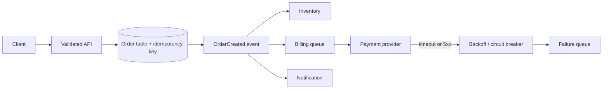
#### Architecture concept studio
**Monolith.** One deployable application contains the order API, inventory logic, and
billing logic. It is often the lowest-operational-overhead answer for a small, cohesive
product and one release cadence. It becomes limiting only when components need independent
ownership, scaling, or release schedules.

**Microservices.** Separate Orders, Inventory, and Billing services can deploy and scale
independently, but every boundary now needs a network contract, authentication,
observability, and failure handling. “Microservices” is not an automatic best practice; it
is a trade for independent change.

**Event-driven architecture and choreography.** After the API persists an order, it
publishes the fact `OrderCreated`. Inventory and Email react independently. This is
choreography: no central coordinator tells them to run. It is ideal when a new consumer can
be added without changing order acceptance.

**Orchestration with Step Functions.** When the business rule is *charge payment, then
reserve inventory, then ship; otherwise compensate*, use a Step Functions state machine. It
keeps durable workflow state, makes order/retry/catch behavior visible, and can invoke
compensating work. Do not choose it merely to broadcast a notification.

**Pub/sub fanout.** SNS gives each subscription a copy of a message; EventBridge routes
structured events to matching targets. One SQS queue instead load-balances each message to
one worker. Attach SQS queues to fanout consumers that need buffering and independent
retries.

| Comparison | State and coupling | Choose it when | Exam trap |
|---|---|---|---|
| Monolith | One deployment; in-process calls | One small cohesive application | Treating it as inherently obsolete |
| Microservices | Network contracts; separate deployment | Independent teams or scaling justify complexity | Ignoring service-to-service failures |
| Choreography | Event contracts; no central workflow state | Reactions are independent | Using it for strictly ordered steps |
| Step Functions orchestration | Central durable state machine | Ordered, retryable, compensating workflow | Calling it pub/sub |
| SNS/EventBridge fanout | Independent copies/targets | Many consumers need the same fact | Using one SQS queue for copies |

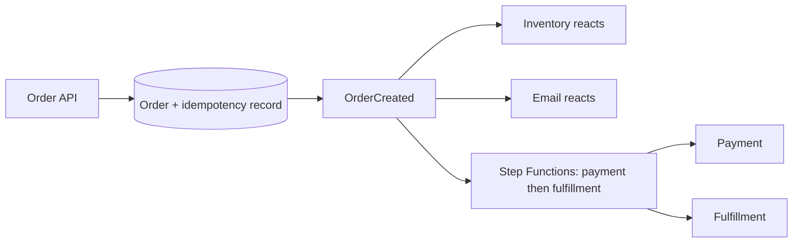

**Stateful versus stateless.** Keep compute **stateless**: do not put a cart, session, or
workflow solely in Lambda/container memory. Persist it in DynamoDB, a session store, or Step
Functions so any healthy instance can continue. A **stateful** workflow is valid when its
durable state is deliberately owned and recoverable.

**Tightly versus loosely coupled; synchronous versus asynchronous.** An API → payment →
email chain is tightly coupled and synchronous: the caller waits and every slow dependency
can fail acceptance. A durable event/queue makes producer and consumer loosely coupled and
asynchronous: the API can accept the order and consumers retry independently. Keep
synchronous work only where the caller must know now, such as validation or a price; hand
off slow/bursty work asynchronously.

**Idempotency and retries.** At-least-once delivery means duplicate requests/messages are
expected. Store an idempotency key and prior business result before charging or writing.
Retry transient timeout/5xx failures with a short timeout, bounded exponential backoff, and
jitter; never retry malformed input. After attempts are exhausted, preserve work in a DLQ or
failure workflow.

#### Decision table
| Requirement cue | Select | Reason |
|---|---|---|
| Caller needs result now | API Gateway + synchronous Lambda/service | HTTP response is part of the contract |
| Durable background work, one worker group | SQS | Buffers bursts and isolates worker failures |
| One business event, content-based routes | EventBridge | Rules route structured events to many targets |
| Simple push notification to many subscribers | SNS | Pub/sub fanout; pair subscriptions with SQS for durability |
| Stateful multi-step business process | Step Functions | Visible orchestration, state, retries, catches |
| Continuous ordered records | Kinesis | Stream processing and consumer checkpoints |
#### Implementation walkthrough
1. Define a request schema and validate it at API Gateway and in code. Return 400 for invalid client input; do not retry a malformed request.
2. Use an idempotency key stored with the business result. On a duplicate request, return the prior outcome instead of repeating the side effect.
3. Persist the accepted order before publishing follow-up work, or use a deliberate transactional/outbox-style design so a successful response does not silently lose the event.
4. Publish a stable event envelope: source, detail-type, timestamp, correlation ID, version, and detail. Consumers must tolerate additive fields.
5. Use SDK clients with the runtime role. Set short timeouts, retry only transient errors with exponential backoff and jitter, and bound attempts.
6. For a third-party payment service, open a circuit after repeated failures; route
recoverable work to a queue or failure workflow rather than holding the client request
indefinitely.
7. Write unit tests with representative API and event payloads. Assert status code,
validation, idempotency, and the outgoing event—not implementation details.
#### What fails in production, and how to respond
- **A worker crashes after receiving a message:** SQS visibility timeout returns the message. Make processing idempotent and send repeatedly failing messages to a DLQ for investigation.
- **The payment API slows down:** A timeout prevents thread or Lambda exhaustion. The circuit breaker and bounded retry prevent a retry storm.
- **A new consumer cannot parse an event:** Version the event contract and make consumers ignore unknown additive fields; do not silently repurpose an existing field.
#### Why tempting alternatives are wrong
- A synchronous chain API → inventory → billing → email makes order acceptance depend on all three services; it violates quick response and failure isolation.
- Using one SQS queue for unrelated independent consumers load-balances messages; it does not give each consumer a copy. Use fanout.
- Retrying every 4xx response repeats bad input. Client errors normally require correction, not backoff.

#### Skill 1.1.1 — Architecture patterns: monoliths, services, events, orchestration, and fanout

A monolith is one deployment where code calls code locally.
Microservices are independently deployed services joined by network contracts.
Start with a monolith for one cohesive product and release cadence.
Split only when independent ownership, scaling, or release schedules justify network
complexity.

A synchronous API → payment → email chain fails order acceptance when email
is slow. *Independent consumers* points to events/fanout; *ordered, stateful, compensating
workflow* points to Step Functions.

Persist an order, publish a versioned `OrderCreated`, and route it to
Inventory, Email, and Analytics: that is choreography and fanout.
If payment must happen before fulfillment, a state machine does charge → reserve → fulfill
with `Catch` compensation.
#### Skill 1.1.2 — Stateful and stateless application design

Stateless compute remembers nothing between requests, so any healthy Lambda can serve the
next one.
Important state can still exist: place carts, sessions, idempotency outcomes, and workflow
progress in DynamoDB, a deliberate session store, or Step Functions where it survives
retries and replacement.

- Keep handlers stateless when they must scale or be replaced transparently. Choose durable state when progress must survive a cold start, retry, or another instance.

A cart held only in Lambda memory disappears on cold start or
a concurrent instance. *Any instance can continue* means stateless compute plus durable
state, not sticky sessions.

The API writes `{idempotencyKey, result}` to DynamoDB, then
returns that stored result on a duplicate.
A Step Functions execution owns workflow state; Lambda reads input, updates durable state,
and exits.
#### Skill 1.1.3 — Coupling and stable service contracts

Tightly coupled parts must be available and agree at the same moment.
Loosely coupled parts exchange a stable API or event contract, allowing a producer and
consumer to deploy, scale, and recover independently.
Use direct calls only when an immediate answer is required.
Use SQS, SNS, or EventBridge for independently retryable work or separately owned consumers.

Reusing a field with a new meaning breaks old consumers.
Queues reduce runtime dependency but do not eliminate the contract.

Publish an envelope with `source`, `detail-type`, version,
correlation ID, and additive detail fields.
Consumers validate supported versions and ignore unknown additive fields.
#### Skill 1.1.4 — Synchronous and asynchronous application flow

Synchronous work is a phone call: the caller waits.
Asynchronous work is a tracked package: the producer makes a durable handoff and another
worker completes it later.
Keep validation, authorization, and an immediately required price
synchronous.
Hand off email, image processing, fulfillment, and bursty third-party work through SQS, SNS,
or EventBridge.

A queue is wrong if the caller requires the computed response now.
A long synchronous dependency chain exhausts concurrency during an outage.

API Gateway synchronously invokes Lambda to validate and save an order, then
Lambda emits `OrderCreated`; an SQS-backed billing worker handles it later.
#### Skill 1.1.5 — Retries, idempotency, and controlled recovery

A network can lose the reply after a card was charged.
Idempotency makes a duplicate return the original outcome instead of repeating the side
effect; retries give temporary faults a bounded second chance.

- Retry timeouts, throttles, and selected 5xx responses with exponential backoff and jitter. Never retry malformed input or authorization failures.

Retrying every error causes a storm; a DLQ is terminal
handling, not the retry policy. *At-least-once delivery* requires an idempotent consumer.

Atomically record the idempotency key and result in DynamoDB
before or with the side effect.
On duplicate, return the result.
#### Skill 1.1.6 — API design, validation, and HTTP contracts

An API is an agreement about valid requests, responses, and status codes.
Validation rejects malformed input before irreversible work; authorization still decides
whether an authenticated caller may act.
Use API Gateway for managed HTTP routing, validation, throttling, and
integration.
Keep tenant/ownership decisions in application code when they need domain context.

Returning `200` for every fault hides responsibility; trusting a
tenant ID in the body permits cross-tenant reads.
API Gateway validation complements handler validation.

Define `POST /orders`, validate its JSON schema, derive tenant from
a verified identity, then return `201` for creation, `400` for invalid input, `401/403` for
identity/permission failures, and safe `5xx` errors for server faults.
Carry a correlation ID into the event.
#### Skill 1.1.7 — Unit tests and AWS SAM local Lambda invocation

A unit test proves business behavior; SAM local checks the packaged handler with a real
event envelope.
Deployed integration tests still own IAM and VPC evidence.

```python
def total(quantity: int, unit_price: int) -> int:
    if quantity < 1 or unit_price < 0:
        raise ValueError("invalid order")
    return quantity * unit_price

def handler(event, _context):
    try:
        body = event["body"]
        return {"statusCode": 201, "body": str(total(body["quantity"], body["unitPrice"]))}
    except (KeyError, TypeError, ValueError):
        return {"statusCode": 400, "body": "invalid order"}
```

```python
from app import handler, total

def test_order_and_bad_input():
    assert total(2, 7) == 14
    assert handler({"body": {"quantity": 0, "unitPrice": 7}}, None)["statusCode"] == 400
```

```json
{
  "body": {"quantity": 2, "unitPrice": 7},
  "requestContext": {"requestId": "test-order-1"}
}
```

```bash
sam build && sam local invoke OrderFunction --event events/order.json
```

A unit test proves one decision without AWS; SAM local invocation runs the packaged handler
with a realistic event.
Use both: one makes logic fast to test, the other catches handler/event wiring before
deployment.

Unit tests cannot prove IAM, VPC, or API Gateway mapping; deployed
integration tests cover those.
A happy-path local invoke is not release evidence—also test invalid input and duplicate
delivery.

Separate business logic from the handler: Save a realistic payload as
`events/order.json`, then run `sam local invoke OrderFunction --event events/order.json`.
The fixture must be the actual API Gateway/SQS/EventBridge envelope, not an invented bare
body.
#### Skill 1.1.8 — SQS, SNS, and EventBridge messaging in code

The accepted order can route to separate durable consumers: the event is a fact, while a
queue is a worker backlog.

```typescript
await eventBridge.putEvents({
  Entries: [{ Source: "shop.orders", DetailType: "OrderCreated",
    Detail: JSON.stringify({ orderId, version: 1 }), EventBusName: "shop" }]
});
```

SQS is a durable to-do list for one worker group.
SNS pushes a copy to every subscription.

One SQS queue load-balances; it does not fan out.
Set a visibility timeout longer than processing, a DLQ, and duplicate-safe consumers.

The order API publishes `OrderCreated` to EventBridge; a rule
sends billing work to SQS while analytics receives another target.
Use SNS for simple push fanout, commonly with an SQS subscription when a consumer needs
buffering.
#### Skill 1.1.9 — AWS SDK calls with temporary roles, pagination, and exceptions

Pagination is correctness: a successful first page is not the collection.
Let the runtime role supply credentials and distinguish retryable responses from denial.

```python
import boto3
from botocore.exceptions import ClientError

s3 = boto3.client("s3")
try:
    for page in s3.get_paginator("list_objects_v2").paginate(Bucket="approved-artifacts"):
        for item in page.get("Contents", []):
            print(item["Key"])
except ClientError as err:
    code = err.response["Error"]["Code"]
    if code in {"Throttling", "ServiceUnavailable"}:
        raise
    if code == "AccessDenied":
        raise PermissionError("role lacks bucket access") from err
    raise
```

The SDK is application code’s AWS control panel.
The default credential provider obtains short-lived credentials from the Lambda/EC2 role.

Give an execution role only required actions/resources, use paginators for
list APIs, and distinguish retryable throttling from access denied and invalid input.
**Concrete implementation.** Configure region/resource names externally; inspect service
error code and request ID.

One list call silently misses later pages.
Catching every exception and returning success hides outages.
#### Skill 1.1.10 — Kinesis streams, checkpoints, batches, and duplicate-safe consumers

Kinesis is an ordered, durable log divided into shards.
A consumer reads batches and checkpoints progress, but a retry can replay records, so
business effects must tolerate duplicates.
Choose Kinesis for ordered near-real-time stream processing, replay,
and multiple consumers.
Choose SQS for a simple durable worker queue without stream retention semantics.

A failed batch can replay already successful records; never charge per
delivery without idempotency.
Ordering is within the shard/partition-key path, not globally.

Producers choose a partition key so related order updates share a shard.
A consumer records an event ID idempotently, writes output, then checkpoints after safe
handling.
#### Skill 1.1.11 — Safe use of Amazon Q Developer

Amazon Q Developer can draft code, tests, and explanations, but it cannot approve its own
output.
Treat it like a fast new teammate whose pull request needs review.

- Ask it for a test matrix, SDK-error explanation, or IaC draft after defining constraints. Never paste secrets, tokens, customer data, or a production payload into prompts.

Generated code can use broad permissions, static credentials,
or a wrong event shape.
Review and test it; “accept generated output without review” is never the safe answer.

Ask for a test against a stated handler contract, review
permissions/dependencies, run the test and `sam local invoke` using safe fixtures, and
compare output to documentation and least-privilege needs.
#### Skill 1.1.12 — EventBridge buses, rules, schemas, archives, and replay

A bus receives application facts; rules inspect event fields and deliver matching events.
Schemas document shape, and archives retain events for a bounded replay after a consumer is
repaired.
Use a custom bus for application isolation, rules for content-based
routing, archives/replay for historical reprocessing, and a queue DLQ for target delivery
failure handling.

Replay re-delivers events, so consumers remain idempotent.
A schema documents a contract; it is not authorization.

Put `OrderCreated` with `source: shop.orders` and a versioned
detail on the `shop` bus.
A rule matching source/region routes to fulfillment.
#### Skill 1.1.13 — Resilience for third-party dependencies

A third-party API is outside your control.
Short timeouts, bounded retries, circuit breaking, and durable handoff stop its outage from
consuming every application request slot.
Call synchronously only if the customer needs the answer now;
otherwise queue work.
Use a fallback only when it keeps the real business meaning, such as “payment pending,”
never a fabricated “paid.”

Infinite retries amplify outages; retrying 4xx repeats bad requests.
*Isolate external outage/graceful degradation/durable retry* is the resilience pattern.

A billing worker receives a durable message, calls the provider with
connection/read timeouts and an idempotency key, retries transient errors with jitter, opens
a circuit after repeated failures, and alarms on provider error rate.

### Task 2: Develop code for AWS Lambda
**Plain-language goal.** Configure event-driven functions so their networking, permissions,
scaling, and failure behavior match the trigger.
**End-to-end scenario.** An image upload to S3 starts a Lambda that validates metadata,
writes a DynamoDB record, and emits a notification.
A separate SQS consumer resizes images.
Both functions must reach a private database, but only one needs public internet egress.
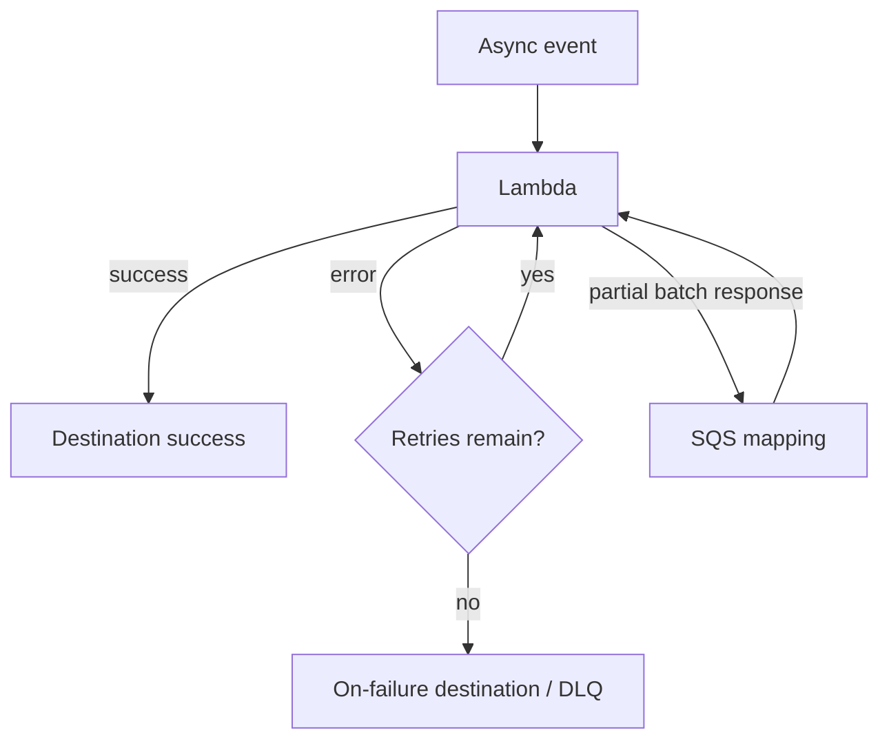
#### Decision table
| Situation | Configuration | Why |
|---|---|---|
| Lambda reaches private RDS | VPC private subnets + security group | Creates network path to private resource |
| VPC Lambda calls public API | NAT path from private subnet | VPC attachment alone has no internet access |
| Async invoke fails | Destination or DLQ | Captures terminal invocation outcome |
| SQS event source fails | Visibility timeout, retries, DLQ, partial batch response | Source mapping controls redelivery |
| Protect downstream database | Reserved concurrency | Caps this function's parallelism |
| Reduce cold-start impact | Provisioned concurrency after measurement | Keeps environments initialized |
#### Implementation walkthrough
1. Start with the event source: API Gateway is synchronous; EventBridge and S3 invoke asynchronously; SQS, Kinesis, and DynamoDB Streams use event source mappings. Their retry ownership differs.
2. Grant the execution role only the S3, DynamoDB, KMS, or log permissions the handler needs. Environment variables configure names and endpoints; they are not a substitute for secret storage.
3. Set timeout slightly above measured normal duration but below the caller or queue visibility design. Increase memory after measuring because Lambda memory also changes CPU allocation.
4. Put SDK clients and database connection initialization outside the handler when reusable. Reuse connections, but still handle a stale connection on the next invocation.
5. For batch sources, make each record independently safe to retry. Report failed item identifiers when partial batch response is supported so successful records are not needlessly repeated.
6.
Use test events matching the real trigger shape.
A hand-written JSON body is not equivalent to an SQS Records envelope or API Gateway request
context.
#### Configuration mechanics
| Knob | Primary effect | Common mistake |
|---|---|---|
| Memory | Memory and CPU allocation | Increasing it without measuring duration/cost |
| Timeout | Maximum invocation time | Making it longer than upstream timeouts |
| Reserved concurrency | Ceiling and isolation | Starving other functions unintentionally |
| Batch size | Throughput per invoke | Making retries replay too much work |
| Visibility timeout | Time before SQS redelivery | Setting it shorter than Lambda runtime |
#### What fails in production, and how to respond
- **Timeout while processing an event:** The invocation may be retried. Make writes idempotent, set a safe timeout, inspect duration, and send terminal failures to the configured destination.
- **Database connection exhaustion:** Limit concurrency, use RDS Proxy when appropriate, reuse connections, and avoid opening one connection per record.
- **Function cannot reach the internet:** Check subnet route tables and NAT. A security group permits traffic but does not create an egress route.
#### Why tempting alternatives are wrong
- Putting a Lambda in a public subnet does not assign it a public IP or magically provide internet egress.
- Raising timeout alone does not fix CPU-bound work; measure and tune memory or redesign the work.
- A DLQ is not a retry policy. It receives exhausted failures; configure source and function behavior first.
#### Skill 1.2.1 — Understanding Lambda access to private VPC resources through subnets, security groups, DNS, and routes

Attach the Lambda to private subnets that can route to the database, allow the Lambda
security group to reach the database security group on its port, and ensure VPC DNS can
resolve the private endpoint.
VPC attachment is for private-resource access; it is not required for
ordinary public AWS API calls.

A Lambda in a public subnet receives no public IP; a private-subnet
function needs NAT plus a route for public internet egress.

Test one database query from the deployed function and inspect subnet
routes, security-group rules, and DNS if it fails.
#### Skill 1.2.2 — Configuring environment variables, memory, concurrency, timeout, runtime, handler, layers, extensions, triggers, and destinations

Lambda memory also allocates CPU; timeout caps one invocation; reserved concurrency caps or
reserves concurrent executions; layers add shared runtime dependencies; destinations receive
asynchronous outcomes.

- Put nonsecret names in environment variables and runtime flags in AppConfig; use Secrets Manager for rotating secrets.

Raising timeout does not cure CPU pressure or downstream
overload, and provisioned concurrency is for initialization latency rather than a queue
backlog.

Declare handler, runtime, memory, timeout, trigger, and
destination in SAM/CloudFormation, then invoke a real trigger-shaped fixture.
#### Skill 1.2.3 — Handling event lifecycle and errors with code, Lambda Destinations, dead-letter queues, and source-specific retry behavior

API Gateway synchronous errors return to the caller; asynchronous Lambda invokes retry
before an on-failure destination or DLQ; SQS/Kinesis/DynamoDB stream mappings own source
retry and redelivery.
Use Lambda Destinations when the receiver needs invocation metadata; use an
SQS DLQ to isolate exhausted source records.

A DLQ is where terminal failures land, not a substitute for
configuring retries or a visibility timeout.

Make each record idempotent and return `batchItemFailures` for
supported partial-batch processing.
#### Skill 1.2.4 — Testing Lambda test code using AWS services and tools such as SAM

Unit-test business logic with fake dependencies, use `sam local invoke` with the actual API
Gateway/SQS/EventBridge envelope, and run deployed integration tests for IAM and networking.
SAM local catches handler/package/event-shape mistakes; it cannot
prove a VPC route or resource policy.

A bare JSON body is not an SQS `Records` event, so a happy-path local
invoke is insufficient evidence.

Store a valid event and an invalid/duplicate event under `events/`, run
both, and assert response plus durable state.
#### Skill 1.2.5 — Integrate Lambda with API Gateway, S3, EventBridge, SQS, DynamoDB Streams, and other AWS services using least privilege

API Gateway invokes Lambda synchronously; S3 and EventBridge are asynchronous; SQS, DynamoDB
Streams, and Kinesis use event source mappings that poll and batch.

- Match the trigger to the caller contract and grant the function only its needed action on the specific bucket, table, queue, or bus.

Giving Lambda an IAM role does not automatically permit S3 or
EventBridge to invoke it.

In IaC, add both the trigger permission/resource policy and the
execution-role permission, then send a representative event.
#### Skill 1.2.6 — Tune Lambda by measuring duration, errors, throttles, memory use, initialization cost, and downstream limits

Compare Duration, Errors, Throttles, ConcurrentExecutions, Max Memory Used, init duration,
and downstream latency before changing a Lambda setting.
Increase memory for measured CPU-bound work; cap reserved concurrency or
buffer with SQS when a database/provider is the bottleneck.

More provisioned concurrency reduces cold-start exposure but
cannot make a slow SQL query fast.

Load-test two memory settings with the same payload and compare p95
duration and cost.
#### Skill 1.2.7 — Using Lambda for near-real-time transformation, validation, enrichment, and routing of event or stream records

An event-source mapping batches stream or queue records into Lambda; the handler validates,
enriches from an approved store, transforms, and routes only safe output.
Use Lambda for short near-real-time per-record work; use a durable
workflow or larger processing service when work exceeds Lambda’s event/runtime model.

A failed batch can be replayed, so enrichment writes cannot assume
exactly-once delivery.

Decode each record, attach an idempotency/event ID, return partial failures,
and publish a versioned output event.

### Task 3: Use data stores in application development
**Plain-language goal.** Choose a store and data model from the reads and writes the
application must perform, then make cost and latency predictable.
**End-to-end scenario.** A marketplace needs product lookup by ID, a seller’s products
ordered by update time, popular-product reads under low latency, automatic expiration for
temporary carts, and full-text product search.
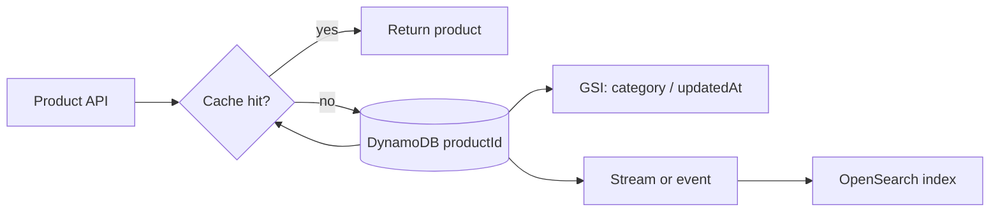
#### Decision table
| Access pattern | Model or service | Explanation |
|---|---|---|
| One item by known key | DynamoDB GetItem | Direct primary-key lookup |
| All seller products newest first | Partition key sellerId, sort key updatedAt; Query | Targeted partition and ordered range |
| Lookup by category | GSI with category key | Alternate access pattern needs alternate index |
| Search words/relevance | OpenSearch Service | Inverted-index search, not transactional source of truth |
| Repeated safe reads | ElastiCache | Low-latency cache with expiry/invalidation |
| Expire temporary data | DynamoDB TTL / S3 lifecycle | Managed lifecycle, not a cron deletion loop |
#### Implementation walkthrough
1. Write the access patterns before declaring a DynamoDB key. A partition key selects a collection; a sort key orders and filters within that collection.
2. Use a high-cardinality partition key such as seller ID or a deliberately distributed key. Avoid a low-cardinality key such as `status` when it concentrates writes.
3. Use Query when you know the partition key. Use Scan only for intentional table-wide work; a filter expression removes returned items after capacity has been consumed.
4. Create a GSI when the application must query a different partition key. A GSI has its own keys and can be eventually consistent; project only attributes the index needs.
5. Serialize application objects deliberately: preserve numeric/string types, validate input, use a schema version for evolving objects, and tolerate missing old fields.
6.
Use cache-aside for safe repeated reads: read cache, load miss from authoritative store,
populate cache, and invalidate or expire after a write.
#### Configuration mechanics
| Operation | Needs partition key? | Reads broad data? | Typical use |
|---|---:|---:|---|
| GetItem | Yes | No | Exact primary key |
| Query | Yes | No | One key collection/range |
| Scan | No | Yes | Administrative or exceptional bulk work |
| GSI Query | GSI partition key | No | Alternate lookup |
| Filter expression | Depends | It can | Refine result, not avoid reads |
#### What fails in production, and how to respond
- **Hot partition throttles:** Redistribute key design, add write sharding when genuinely required, and use SDK backoff. Increasing total capacity does not cure one hot key.
- **Customer sees stale value:** Choose strongly consistent DynamoDB reads only where the immediate latest value is required; otherwise eventual reads and cache expiry may be acceptable.
- **Expired cart still appears briefly:** TTL is asynchronous cleanup. The application should treat an item past its expiry timestamp as absent if immediate behavior matters.
#### Why tempting alternatives are wrong
- A Scan plus filter is not a substitute for a Query or GSI; it still reads broadly.
- OpenSearch is not normally the source of truth for transactions; synchronize it from a durable system of record.
- Caching every response without a safe key or invalidation plan can return another user’s data.
#### Skill 1.3.1 — Understanding high-cardinality partition keys and balanced partition access

DynamoDB distributes a partition key’s items together, so a high-cardinality key such as
`customerId` spreads load better than `status`.
Design a key from the write/read access pattern; add deliberate write
sharding only after a measured hot key.

More table capacity does not solve a single hot partition.

Graph consumed capacity and throttles by key pattern, then test a synthetic
burst against the candidate key.
#### Skill 1.3.2 — Understanding strongly consistent and eventually consistent database reads and their trade-offs

A strongly consistent DynamoDB read returns the latest successful write from the table,
while eventually consistent reads can briefly return an older replica value and cost less.

- Request strong consistency only for an explicit read-after-write requirement such as an account-state confirmation.

GSIs do not provide strongly consistent reads, so an index
cannot meet an immediate-latest-read requirement.

Set `ConsistentRead=True` on the required base-table
GetItem/Query path and test immediately after a write.
#### Skill 1.3.3 — Understanding Query versus Scan operations and their capacity implications

`Query` targets one partition key and can use a sort-key condition; `Scan` examines every
item, and a filter removes results only after reads consume capacity.
Query a primary key or GSI for application traffic; reserve Scan for
deliberate administrative/bulk work.

A filter expression is not an index and does not make a Scan
inexpensive.

Write the key condition first and examine `ConsumedCapacity` under
realistic data volume.
#### Skill 1.3.4 — Understanding DynamoDB primary keys, sort keys, and secondary indexes from access patterns

A composite primary key groups related items by partition key and orders them by sort key; a
GSI creates a separately queryable alternate key.
Model each known access pattern before creating the table, using a GSI
only when the application must query another partition dimension.

You cannot query a GSI with the base table’s key unless that key is in the
index design.

For seller history, use `sellerId` plus `updatedAt` and query a date range;
project only required GSI fields.
#### Skill 1.3.5 — Serialize and deserialize persistence data safely across application and schema changes

Persist explicit types and a schema/version attribute so newer code can accept missing
legacy fields and readers do not reinterpret old data.

- Use backward-compatible additive changes before destructive renames; migrate only when a new reader cannot safely support both shapes.

JSON-looking data can still lose numeric/type semantics if an
SDK marshaller is used incorrectly.

Round-trip a current object and a saved old-version fixture
through serializer/deserializer tests.
#### Skill 1.3.6 — Managing appropriate data stores with SDK operations, permissions, capacity, backups, and error handling

Application SDK calls require scoped IAM, chosen capacity mode, error handling,
backups/recovery, and metrics that match the store.
Use on-demand capacity for unpredictable traffic and provisioned/autoscaled
capacity when the workload is known; use managed backups/PITR instead of application-copy
scripts.

Broad `dynamodb:*` permissions are not a fix for an access
pattern or capacity problem.

Test an allowed operation, an intentional denied operation, and a
throttled retry path.
#### Skill 1.3.7 — Managing data lifecycle with DynamoDB TTL, S3 lifecycle rules, and retention requirements

DynamoDB TTL marks items for asynchronous expiry from an epoch timestamp; S3 lifecycle rules
transition or expire objects by age, prefix, or tag.
Use TTL for temporary items such as carts and S3 lifecycle for object
retention/cost tiering.

TTL deletion is not immediate and is not a scheduling guarantee.

Store an application expiry timestamp too when an expired cart must
disappear immediately, and test lifecycle rules on a nonproduction prefix.
#### Skill 1.3.8 — Using data caching services with safe keys, expiration, and invalidation

Cache-aside reads a tenant-safe key, loads a miss from the authoritative store, writes a
bounded-TTL cache entry, and invalidates/updates after a write.

- Cache repeated data that can be briefly stale; do not cache authorization-sensitive output without every response-varying dimension in the key.

A cache improves latency but does not replace DynamoDB as the
source of truth.

Track hit rate, miss latency, and stale-read behavior while
exercising write invalidation.
#### Skill 1.3.9 — Choose specialized stores such as OpenSearch Service based on search access patterns

OpenSearch indexes analyzed text for relevance, token matching, filters, and aggregations;
DynamoDB is the system of record for predictable key access.
Use OpenSearch for words/relevance/facets, not for a transactional GetItem
lookup.

Search results can be stale or incomplete during indexing, so do
not make the index the only transactional authority.

Replicate versioned product changes from the durable source to an
index and tolerate index lag in the UI.

## Domain 2: Security (26%)

### Task 1: Implement authentication and/or authorization for applications and AWS services
**Plain-language goal.** Prove identity, authorize the requested action, and use temporary
AWS credentials instead of long-lived keys.
**End-to-end scenario.** A customer signs in to a shopping application through Cognito.
The browser sends a JWT to API Gateway.
The API must only return records for the customer’s tenant.
The Lambda uses its execution role to read DynamoDB, and a reporting service in another
account assumes a narrowly scoped role.
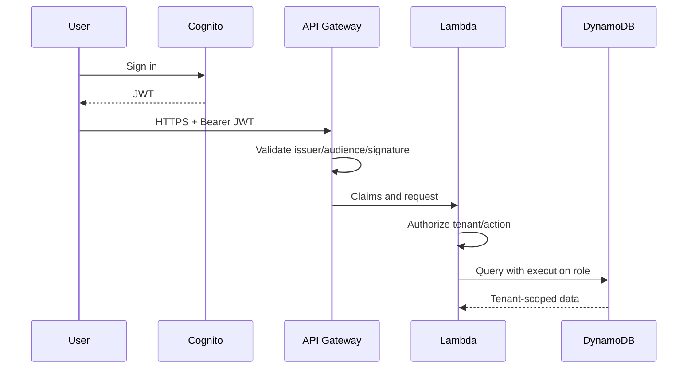
#### Decision table
| Need | Correct control | Why |
|---|---|---|
| Application-user sign-in | Cognito user pool / federation | Issues user identity tokens |
| API caller proof | Validate JWT or API authorizer | Token must be valid before handler trusts claims |
| Workload calls AWS | IAM execution role | Temporary credentials supplied automatically |
| Cross-account workload access | STS AssumeRole + trust policy | Temporary delegated credentials |
| Tenant record isolation | Claim-aware application authorization and data condition | Authentication alone is not permission to all records |
| Service-to-service call | Service role / signed AWS request | Avoid passing user secrets between services |
#### Implementation walkthrough
1. Separate authentication from authorization. Authentication establishes a principal; authorization checks action, resource, tenant, ownership, and context.
2. Validate bearer token signature, issuer, audience, expiry, and relevant claims at a trusted boundary. Use HTTPS because anyone holding an unprotected bearer token can present it.
3. Use the SDK default credential provider chain in AWS. Lambda and EC2 should receive temporary role credentials; do not embed access key pairs.
4. For AssumeRole, configure both sides: the target role trust policy allows the caller, and the caller has permission to call `sts:AssumeRole`.
5. Tie DynamoDB keys or query conditions to a verified tenant claim. Never accept a tenant identifier from an untrusted request body without comparing it to the authenticated context.
6.
Use least privilege with action, resource, and condition.
Test denied cases as carefully as allowed cases.
#### Configuration mechanics
| Identity | Used by | Credential lifetime model | Do not confuse with |
|---|---|---|---|
| Cognito user token | Application user | Expiring JWT | AWS workload role |
| Lambda execution role | Lambda code | Temporary AWS credentials | End-user identity |
| STS assumed role | Delegated/cross-account caller | Temporary AWS credentials | IAM user access key |
| Resource policy | Resource-side trust | Grants/limits principal | Application tenant check |
#### What fails in production, and how to respond
- **Valid user reads another tenant:** The token only proves identity. Enforce tenant ownership in authorization and the data access pattern.
- **Cross-account AssumeRole is denied:** Inspect target trust policy and caller identity policy; both must permit the relationship.
- **Leaked access key in source:** Revoke or rotate it, remove it from history where required, and migrate workload code to a role.
#### Why tempting alternatives are wrong
- An IAM user for every mobile app user is an operational and security anti-pattern; use application identity/federation.
- A valid JWT does not automatically grant DynamoDB access or tenant-level authorization.
- Putting AWS keys in a browser, Lambda code, or repository creates long-lived credentials outside AWS rotation controls.
#### Skill 2.1.1 — Using identity providers such as Amazon Cognito and IAM federation for federated access

Cognito user pools authenticate application users and issue JWTs; federation maps an
external identity provider into an AWS-recognized identity flow.
Use Cognito/federation for browser or mobile users and IAM roles for
workloads calling AWS APIs.

Creating IAM users for every app customer is not the scalable
application-authentication design.

Configure redirect/callback URLs and token validation, then test both a
signed-in user and a denied unauthenticated request.
#### Skill 2.1.2 — Secure applications with bearer-token validation and protected transport

A bearer JWT must be validated for signature, issuer, audience, expiry, and relevant claims
before the handler treats it as identity; HTTPS protects its transport.

- Use an API Gateway/Cognito authorizer for boundary validation and retain application authorization for tenant ownership decisions.

Decoding a JWT without verifying its signature is not
authentication, and TLS does not authorize the caller.

Reject an expired, wrong-audience, and missing token in
integration tests.
#### Skill 2.1.3 — Configuring programmatic AWS access with credential providers and temporary credentials

AWS SDK credential providers obtain temporary credentials from Lambda/EC2/ECS roles or STS
and refresh them automatically.
Use the default provider chain in workloads; use a profile only for local
development, never hard-coded access keys in deployed code.

Environment variables can carry temporary credentials locally
but are not a reason to store long-lived IAM user keys.

Remove explicit credential arguments, attach the narrow execution
role, and test with `sts:GetCallerIdentity`.
#### Skill 2.1.4 — Make authenticated AWS service calls with valid signed requests and scoped permissions

AWS SDKs sign requests with SigV4 using the active role credentials, and IAM evaluates
action, resource, and conditions.
Use SDK/service integrations for AWS calls rather than inventing
shared API secrets.

A valid signature proves the caller identity; it does not bypass an
explicit deny or missing resource permission.

Scope a role to an exact S3 prefix or DynamoDB table and verify both
permitted and forbidden calls.
#### Skill 2.1.5 — Assume IAM roles through STS using a matching trust policy and caller permission

`sts:AssumeRole` issues temporary credentials only when the caller policy permits
assume-role and the target role trust policy trusts that caller.

- Use AssumeRole for cross-account delegation or a distinct privilege boundary, not copied credentials.

Adding only `sts:AssumeRole` to the caller cannot overcome a
missing target trust relationship.

Set a specific principal/condition in the target trust policy,
call STS, then use the returned session for the target action.
#### Skill 2.1.6 — Understanding least-privilege permissions for IAM principals with identity and resource policies

Identity policies grant a principal actions, while resource policies can grant or restrict
access at S3, SQS, KMS, and similar resource boundaries; explicit deny wins.
Grant the smallest action/resource/condition set and use a resource policy
for cross-account/resource-side access.

`Action: *` or `Resource: *` is rarely least privilege and can
conceal the missing condition the question tests.

Use IAM policy simulation or a denied integration test before
broadening a statement.
#### Skill 2.1.7 — Implementing fine-grained application authorization using claims, ownership, tenant context, and resource checks

Authentication supplies claims; authorization maps those claims to an action and resource,
such as requiring `tenantId` from the verified token to equal the item’s tenant partition.
Enforce ownership/tenant rules in the backend even if the UI hides
another tenant’s controls.

A valid JWT is not permission to read every record.

Derive the partition key from claims, reject a body/path tenant mismatch,
and test cross-tenant access returns 403/empty by policy.
#### Skill 2.1.8 — Handling cross-service authentication in microservices through service identities and signed AWS calls

Each microservice calls AWS with its own execution/task role and signed request, leaving
user JWTs for user context rather than workload credentials.

- Use service roles/SigV4 for AWS-to-AWS access; propagate only minimal user claims when downstream authorization truly needs them.

Passing a shared static secret between services defeats
rotation and audit boundaries.

Give the producer permission to publish to its bus/queue and the
consumer its own data permission, then test each boundary.

### Task 2: Implement encryption by using AWS services
**Plain-language goal.** Protect data in transit and at rest, then ensure the right
principal can use the key or certificate without exposing key material.
**End-to-end scenario.** A document API accepts HTTPS uploads, stores objects with SSE-KMS,
and lets a compliance role in another AWS account decrypt approved files.
Internal services use private certificates for mutual trust.

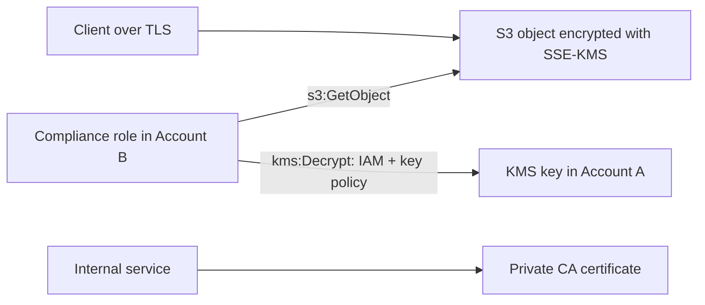
#### Decision table
| Requirement | Choose | Why |
|---|---|---|
| Protect network traffic | TLS/HTTPS | Encrypts data while moving |
| Encrypt object after AWS receives it | Server-side encryption, often SSE-KMS | Service performs encryption and integrates with KMS |
| Encrypt before cloud receives plaintext | Client-side encryption | Application controls plaintext boundary |
| Private internal PKI | AWS Private CA | Issues and manages private certificates |
| Cross-account KMS use | Key policy plus caller IAM permission | KMS authorization needs both sides considered |
| Planned KMS key lifecycle | Rotation configuration | New key material/managed rotation behavior, not application rewrite |
#### Implementation walkthrough
1. Use TLS for every client and service endpoint that carries sensitive data. Encryption at rest does not encrypt traffic; TLS does not encrypt stored copies.
2. Choose server-side encryption when AWS can handle plaintext within the service boundary and you need managed integration. Choose client-side encryption when plaintext must never reach the service unencrypted.
3. For SSE-KMS, give the application role access to the S3 object and required KMS action. KMS permissions and S3 permissions solve different gates.
4. A key policy controls key access. Cross-account designs must explicitly permit the external principal or account path and the caller also needs a suitable IAM policy.
5. Use ACM for appropriate public certificate management and AWS Private CA concepts for private certificates. Store private keys safely and never commit SSH keys.
6.
Understand rotation as a key management control.
Rotating material does not retroactively turn an unauthorized principal into an authorized
one.
#### What fails in production, and how to respond
- **S3 read works but decrypt is denied:** The caller may have S3 permission without KMS permission; inspect IAM policy and KMS key policy.
- **HTTPS client rejects certificate:** Check certificate trust chain, hostname, validity, and whether public versus private trust is appropriate.
- **Sensitive data crosses a service in plaintext:** Add TLS; at-rest encryption only protects media after persistence.
#### Why tempting alternatives are wrong
- SSE-S3, SSE-KMS, and client-side encryption are not interchangeable when the question requires control of KMS keys or no plaintext at the service boundary.
- A KMS key policy alone does not grant S3 object access.
- A certificate is not an encryption-at-rest mechanism, and an SSH key is not a TLS certificate.
#### Skill 2.2.1 — Understanding encryption at rest and in transit as separate protections

TLS encrypts data while it moves over a connection; server-side/client-side encryption
protects persisted bytes, with distinct controls and threats.
Apply both when the requirement says protect uploads/downloads and
stored objects.

SSE-KMS does not encrypt traffic, and a TLS certificate does not encrypt an
object at rest.

Enforce HTTPS at the endpoint and set bucket/table encryption, then verify a
non-TLS request is rejected where policy requires it.
#### Skill 2.2.2 — Understanding certificate issuance, trust, renewal, and private certificate management including AWS Private CA

A certificate binds a public key to a hostname/identity through a trusted issuer; clients
validate hostname, validity period, and chain.
AWS Private CA issues certificates trusted only by managed internal trust stores.

- Use ACM/public trust for public endpoints and Private CA for internal PKI/mTLS scenarios.

An SSH key pair is for administrative access, not a substitute
for a TLS certificate.

Automate renewal/deployment and test a client with the intended
trust chain.
#### Skill 2.2.3 — Compare client-side encryption with server-side encryption

Server-side encryption lets AWS service receive plaintext then encrypt it; client-side
encryption encrypts before the service receives data and leaves key/material handling to the
application.
Prefer SSE-S3/SSE-KMS for managed service integration; choose client-side
encryption when plaintext must not cross the cloud service boundary.

Choosing client-side encryption adds key distribution/rotation
complexity and is not required merely because data is sensitive.

For SSE-KMS, set the key and test object read plus decrypt
permissions.
#### Skill 2.2.4 — Using encryption keys to encrypt or decrypt data through AWS KMS APIs and permissions

KMS encrypt/decrypt APIs use keys without exposing key material; envelope encryption
commonly encrypts data with a data key protected by a KMS key.
Use service-integrated SSE-KMS for supported storage and direct KMS
APIs/envelope encryption only when application-side control is needed.

S3 permission and KMS permission are separate authorization checks.

Grant the role `kms:Decrypt`/`GenerateDataKey` as needed and include an
encryption context consistently.
#### Skill 2.2.5 — Generate and manage certificates and SSH keys securely for development

TLS certificates bind a hostname to a public key through a trusted issuer; clients validate the hostname, validity period, and chain. Keep the certificate private key protected. SSH is separate: its public/private key pair authenticates an administrator or automation client, not a TLS endpoint.

Choose ACM for AWS-integrated public TLS with managed issuance and renewal, ACM Private CA for an internal PKI and private trust, and an imported ACM certificate only when an external CA must remain the issuer and the team owns renewal. SSH public keys belong on approved hosts; protect each operator’s private key through the approved key-management process. Base64 is not encryption, and no certificate or SSH private key belongs in a repository, ticket, environment file, or log.

- Request or import the certificate for the exact DNS name, validate domain control, attach it to the CloudFront distribution, ALB listener, or API custom domain, then test the hostname and full chain from a client.
- For internal TLS, issue from ACM Private CA only when the organization needs a private trust hierarchy; distribute its root/intermediate trust only to managed clients. Monitor imported certificates, replace them before expiry, and test the replacement chain.
- Create distinct SSH keys for people and automation, authorize only public keys, remove a departed user’s key, and rotate immediately after suspected exposure. For a hostname error or leaked private key, remove the affected authorization, issue replacement material, verify access, and inspect logs for misuse.

#### Skill 2.2.6 — Using encryption across account boundaries with KMS key policy and IAM permission design

Cross-account SSE-KMS access requires an S3/bucket permission path and KMS authorization via
the key policy plus appropriate IAM permission for the external role.
Grant the specific external role/account rather than making a key broadly
usable.

Bucket access alone produces AccessDenied when KMS decryption is
not authorized.

Test `GetObject` and decrypt as the target role and inspect
CloudTrail/KMS errors for the failed gate.
#### Skill 2.2.7 — Enable and disable key rotation according to the key and compliance requirement

KMS rotation changes backing key material according to the key type/configuration while
preserving the logical key identifier used by applications.
Enable rotation when policy/compliance requires periodic material
rotation; do not confuse it with deleting/recreating a key.

Rotation does not grant a new principal access or repair a missing key
policy.

Document the key owner, rotation setting, grants/policies, and recovery
plan, then verify the application still decrypts existing data.

### Task 3: Manage sensitive data in application code
**Plain-language goal.** Classify sensitive values, retrieve secrets at runtime, prevent
disclosure, and enforce tenant boundaries in the backend.
**End-to-end scenario.** A healthcare scheduling service stores database credentials in
Secrets Manager, logs request IDs but not patient notes, shows only the last four digits of
an insurance identifier, and requires every query to use the tenant from a verified user
claim.
#### Decision table
| Data/control | Correct action | Why |
|---|---|---|
| Database password/API token | Secrets Manager | Central retrieval and rotation workflows |
| Sensitive configuration | Encrypted environment variable with restricted access | Configuration is not source code, but still needs protection |
| PII/PHI in logs | Sanitize or omit | Logs spread to operators and tools |
| User-facing confirmation | Mask value | Reveal minimum useful portion |
| Multi-tenant record | Bind query to verified tenant claim | Prevent horizontal access |
| Nonsecret config | Parameter/AppConfig where suitable | Do not use a secret store for every ordinary setting |
#### Implementation walkthrough
1. Classify fields before coding: PII identifies a person; PHI is health-related protected information. Classification changes access, logging, encryption, retention, and response design.
2. Retrieve secrets at runtime through a permitted role. Cache safely only as long as rotation and outage requirements allow; never print the fetched object on errors.
3. Treat environment variables as configuration. Encrypt sensitive values with KMS and restrict who can view function configuration or decrypt the key.
4. Create a logging allowlist: request ID, route, safe outcome, duration, and error class. Redact tokens, passwords, full identifiers, and payload fields not needed for diagnosis.
5. Mask for display, sanitize for output/logging, and authorize for access. These are three distinct controls.
6.
Make the tenant context server-derived from a validated identity and include it in the
partition key, condition, or query constraint.
#### What fails in production, and how to respond
- **Secret appears in a stack trace:** Remove it from error serialization, rotate it, and review logs/observability pipelines for disclosure.
- **Tenant ID is supplied in JSON body:** Treat it as untrusted; compare or replace it with token-derived tenant context.
- **Rotated database secret breaks clients:** Use a retrieval/refresh strategy and managed rotation-compatible connection handling rather than hard-coding a cached password forever.
#### Why tempting alternatives are wrong
- Base64 encoding is not encryption.
- Masking a response does not stop an unauthorized backend read.
- A secret in source control is not made safe by adding an environment variable with the same value.

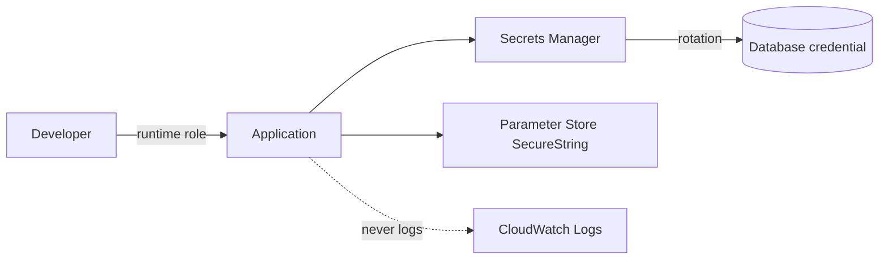
#### Skill 2.3.1 — Understanding classification including PII and PHI

PII identifies or can identify a person; PHI is health information tied to a person and
carries stricter handling obligations in relevant systems.
Classify before selecting logs, retention, access, and encryption
controls.

A field can be sensitive even when it is not a password, so ‘not a secret’
does not mean safe to log.

Maintain a field inventory marking identifiers, health fields, secrets, and
safe operational fields; test serializers/loggers against it.
#### Skill 2.3.2 — Encrypt environment variables containing sensitive data and restrict their access

Lambda environment variables are encrypted at rest with a KMS key, but principals able to
read configuration or decrypt can still obtain values.

- Put rotating credentials in Secrets Manager; use encrypted environment variables for sensitive configuration that fits their lifecycle.

Encryption at rest does not make a secret safe if broad
console/API read permission remains.

Restrict `lambda:GetFunctionConfiguration` and KMS decrypt, and
confirm logs/error handling never echo variables.
#### Skill 2.3.3 — Using secret management services to secure sensitive data

Secrets Manager stores sensitive values, applies resource/KMS controls, and supports
rotation workflows; the workload role retrieves the current version at runtime.
Use it for database credentials/API tokens that rotate; use Parameter
Store/AppConfig for ordinary nonsecret configuration where appropriate.

A secret copied into code or a deployment template is no longer
managed securely.

Call `GetSecretValue` through the role, cache with a rotation-aware
TTL, and test refresh after rotation.
#### Skill 2.3.4 — Sanitize sensitive data before logs, errors, analytics, or external calls

A logging boundary should emit an allowlist such as request ID, route, outcome, duration,
and safe error class, while redacting tokens, passwords, and payload fields.
Sanitize before the logger, analytics client, exception serializer, or
external webhook—not after a sink already received the value.

Debug logging is not exempt from privacy controls.

Add a test that sends a token/identifier and asserts it does not appear in
captured logs.
#### Skill 2.3.5 — Implementing application-level masking and sanitization for least disclosure

Masking shows a minimum useful portion to a legitimate viewer; sanitization removes/escapes
dangerous or private content; authorization decides whether data may be read at all.

- Mask an insurance identifier in confirmation UI and omit it entirely from an operator log unless needed.

Masking output cannot repair an unauthorized database query.

Centralize response/log formatting and test that full identifiers
and tokens never leave the boundary.
#### Skill 2.3.6 — Implementing multi-tenant access patterns that bind authorization and data access to verified tenant context

The service derives tenant context from validated claims and constrains data keys/conditions
to that value, preventing a caller-chosen ID from crossing tenants.
Use a tenant-prefixed partition key or policy condition aligned to the
verified tenant; do not rely on separate frontend routes.

UI filtering and client-provided tenant IDs are not
authorization controls.

Replace body `tenantId` with token context and run a negative test
requesting another tenant’s item.

## Domain 3: Deployment (24%)

### Task 1: Prepare application artifacts to be deployed to AWS
**Plain-language goal.** Produce an immutable, repeatable artifact containing only required
code and dependencies, while keeping environment values outside it.
**End-to-end scenario.** A Python API is packaged for Lambda.
The same source moves through test and production, while URLs and feature flags differ.
A native image dependency may require a container-image package in ECR.
#### Decision table
| Need | Packaging choice | Reason |
|---|---|---|
| Small handler + dependencies | ZIP archive | Simple Lambda artifact |
| Shared dependency used by functions | Layer | Reuse compatible dependency bundle |
| Native/large dependency or container workflow | Container image in ECR | Container packaging model |
| Runtime feature flag | AppConfig | Controlled dynamic configuration |
| Environment endpoint/name | Parameter/environment configuration | Keep artifact portable |
| Reproducible infrastructure | SAM/CloudFormation template | Versioned desired state |
#### Implementation walkthrough
1. Keep source, tests, templates, and build output distinct. The handler path in the package must match the runtime configuration.
2. Pin dependency versions and build in an environment compatible with the Lambda runtime architecture. Do not assume a developer laptop binary will run in Lambda.
3. Tag artifacts immutably or with a traceable commit identifier. “latest” makes an integration test impossible to reproduce.
4. Declare memory, timeout, architecture, and required permissions in IaC rather than clicking a different configuration in each environment.
5. Keep secrets out of the artifact. Supply environment-specific endpoints and feature settings through approved configuration mechanisms.
6.
Push container images to ECR and deploy the exact approved digest/tag; scan and test before
promotion.
#### Configuration mechanics
| Artifact | What is versioned | What stays external |
|---|---|---|
| Lambda ZIP | Handler and dependencies | Environment names, secrets, flags |
| Layer | Shared dependency bundle | Function-specific config |
| ECR image | Image digest/tag | Runtime variables and role |
| SAM/CloudFormation | Desired infrastructure | Parameter values/secrets references |
#### What fails in production, and how to respond
- **Handler not found after deploy:** Inspect package directory and handler declaration; source layout differs from runtime import path.
- **Native library fails only in Lambda:** Build against a compatible Linux/runtime architecture or choose an appropriate container image workflow.
- **Production URL baked into code:** The same artifact cannot safely move through environments; externalize nonsecret configuration.
#### Why tempting alternatives are wrong
- A layer is not always a speed optimization; it adds version and compatibility management.
- Using an untagged/latest container image defeats approved-version testing.
- Putting a production secret in `template.yaml` or a repository is not environment management.

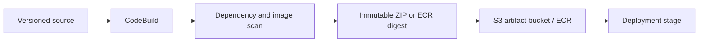
#### Skill 3.1.1 — Managing code-module dependencies, environment references, configuration files, and container images inside the package boundary

A Lambda ZIP contains handler code and runtime-compatible dependencies; a layer supplies a
shared compatible dependency bundle; an ECR image packages a container filesystem.
Use ZIP for ordinary functions, layers for genuinely shared
dependencies, and an image for native/large/container-based requirements.

A layer is not automatically faster and a local native binary may fail in
the Lambda runtime.

Pin dependencies, build for the target architecture, and deploy an immutable
tag/digest.
#### Skill 3.1.2 — Organize deployment files and directories so tools find handlers, templates, tests, and artifacts predictably

SAM/CloudFormation resolves `CodeUri`, handler paths, templates, and artifacts relative to
declared project structure; test fixtures must match the code’s expected event shape.

- Keep source, tests, templates, and build output separate so packaging does not accidentally include stale artifacts or omit the handler.

‘Handler not found’ usually means package layout and
configured module/function do not match.

Run `sam build` and inspect the built handler path before
deployment.
#### Skill 3.1.3 — Using code repositories as versioned deployment inputs

A repository commit/tag is an immutable-ish, reviewable deployment input that can start a
pipeline and link a release to code.
Trigger production from approved branches/tags and artifacts built from
them, not a developer workstation.

A floating branch tip alone is weaker release evidence than a
specific commit/tag.

Record commit SHA in the build/deployment metadata and require
reviews/status checks on the release branch.
#### Skill 3.1.4 — Applying measured application resource requirements such as memory and cores

Runtime memory/CPU requirements come from measured peak memory, p95 duration, startup time,
and CPU/I/O profile, not a guessed default.
Raise Lambda memory when testing shows CPU-bound duration improves;
choose container task CPU/memory reservations from observed usage.

Increasing timeout only permits a slow function to run longer.

Benchmark fixed representative load at two adjacent sizes and select the
lowest setting meeting the SLO.
#### Skill 3.1.5 — Prepare environment-specific configuration, including AWS AppConfig where runtime rollout control is needed

One artifact promotes across environments while endpoint names, feature flags, and rollout
rules remain external; AppConfig can validate and deploy runtime configuration
progressively.

- Use environment variables/parameters for static environment references and AppConfig for safely rolled-out dynamic settings.

Baking the production URL or a secret into the artifact
prevents safe promotion.

Give each environment a configuration profile, validate a schema,
and test a bad configuration rollback.

### Task 2: Test applications in development environments
**Plain-language goal.** Test deployed integration boundaries in a safe environment, not
only pure functions on a laptop.
**End-to-end scenario.** A staging API Gateway invokes a deployed Lambda, which calls a
mocked payment endpoint, writes a test DynamoDB table, and publishes an EventBridge event
captured by a test consumer.
#### Decision table
| Test level | Answers | AWS-oriented example |
|---|---|---|
| Unit | Does one code unit behave? | Handler validation with fake SDK client |
| Integration | Do components connect correctly? | Deployed Lambda + test table + IAM role |
| Contract/event | Is payload shape accepted? | EventBridge detail schema and consumer test |
| End-to-end | Does user flow succeed? | Staging API request through persistence |
| Mock | Can external dependency be deterministic? | Payment API error/timeout simulation |
#### Implementation walkthrough
1. Create a distinct development or staging endpoint/stage, account, or stack. Test code must not share production data or credentials.
2. Deploy the same IaC shape to staging with environment parameters. This catches IAM, mappings, event sources, and networking that unit tests cannot prove.
3. Mock nondeterministic or paid third-party APIs at their boundary. Test both their expected success shape and realistic timeout/error shapes.
4. For events, assert the producer envelope, routing rule, target permission, consumer processing, retry behavior, and failure destination.
5. Use test data with known assertions and cleanup/TTL. Make test output identify environment and version.
6.
Promote only an artifact already tested; rebuilding during promotion changes the thing being
approved.
#### What fails in production, and how to respond
- **Unit tests pass but API returns 502:** Inspect API Gateway integration/mapping, Lambda permission, deployed handler, and logs; unit tests did not exercise wiring.
- **Staging invokes production payment provider:** Use environment-specific endpoint configuration and network controls; test isolation is a design requirement.
- **Event reaches no consumer:** Check event pattern, bus, target permission, and dead-letter configuration—not just producer success.
#### Why tempting alternatives are wrong
- A local handler test cannot prove IAM permission or API Gateway mapping.
- Testing directly in production is not a substitute for a staging environment.
- Mocking every AWS service can hide deployment mistakes; deploy selected real integration paths.

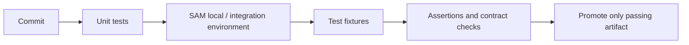
#### Skill 3.2.1 — Testing deployed code with AWS services and tools

Deployed tests exercise real IAM, event mappings, resource policies, and VPC paths that unit
tests cannot see.
Keep pure logic tests fast locally, then run a narrow staging
integration path against the packaged artifact.

A successful `sam build` or stack creation is not proof that an API
integration works.

Deploy a test stack, invoke its endpoint/event with a known ID, and assert
response, persisted state, and logs.
#### Skill 3.2.2 — Writing integration tests and mock APIs for external dependencies

A mock API makes third-party success, throttling, malformed response, and timeout behavior
deterministic; an integration test verifies the client contract at that boundary.

- Mock external paid/nondeterministic systems while retaining selected AWS integrations in staging.

Mocking every dependency can hide IAM, mapping, and network
misconfiguration.

Point the staging endpoint to a mock URL and assert
timeout/retry/idempotency behavior as well as success.
#### Skill 3.2.3 — Testing applications with development endpoints such as API Gateway stages

API Gateway stages provide separate deployment/configuration boundaries and URLs, while
custom domains/base-path mappings can preserve a stable client hostname.
Use a development/staging stage for safe endpoint tests; do not aim test
clients at production because code is shared.

Changing a Lambda alias alone does not create a distinct API
stage or isolate stage variables.

Invoke the stage URL with test credentials and assert the response
includes a safe environment/version marker.
#### Skill 3.2.4 — Deploy application stack updates to existing staging/test environments using SAM or CloudFormation

SAM transforms serverless shorthand into CloudFormation resources; CloudFormation updates an
existing stack toward declared desired state.
Update the staging stack with version-controlled IaC rather than
clicking console changes or recreating it manually.

A stack update can succeed while the application behavior or an integration
permission remains wrong.

Review the change set/template diff, deploy parameters for test, then run a
post-deploy smoke test.
#### Skill 3.2.5 — Testing event-driven applications through payload, routing, permissions, retries, and consumers

Event-driven testing follows the full path: producer envelope, event pattern/subscription
filter, target invocation permission, consumer result, retry, and DLQ/destination.

- Test a real routed event when the risk is wiring, not only a consumer unit test.

Producer `PutEvents` success does not prove a rule matched or
a target accepted delivery.

Publish a known event ID, verify one expected consumer result,
then send an invalid event and verify retry/failure handling.

### Task 3: Automate deployment testing
**Plain-language goal.** Make test events, environments, infrastructure, and approved
versions reproducible so a pipeline proves the same release each time.
**End-to-end scenario.** A pipeline builds one commit, deploys a SAM stack to test, invokes
saved API and SQS payloads, verifies an alias targets the approved Lambda version, and
promotes the same artifact only after assertions pass.
#### Decision table
| Requirement | Mechanism | Why |
|---|---|---|
| Repeat input | Saved JSON event fixtures | Exercises success and failure paths consistently |
| Repeat infrastructure | SAM/CloudFormation | Desired state is reviewed and reproducible |
| Known function release | Lambda version + alias | Stable integration target, movable traffic |
| Known container release | Immutable image tag/digest | Avoids `latest` drift |
| Separate API behavior | API Gateway stage/environment | Isolated endpoint/configuration |
| Assisted test writing | Amazon Q Developer + review | Generate ideas, then validate assertions |
#### Implementation walkthrough
1. Keep representative test events in source control. Include invalid input, duplicate delivery, timeout, and authorization-denied cases—not only happy paths.
2. Build once and attach an immutable identity to the artifact. A pipeline should deploy that same identity through environments.
3. Use IaC change sets/review where appropriate, then update the existing test stack rather than manually recreating resources.
4. Point integration clients to aliases, immutable image references, or approved branches. An alias permits a stable name while the version changes under controlled deployment.
5. Run post-deploy smoke tests against the actual test endpoint and query expected state. Fail the pipeline on an assertion, not merely on deployment completion.
6.
Use Amazon Q Developer-generated tests as draft material; inspect fixtures, security
assumptions, and expected results before accepting them.
#### Configuration mechanics
| SAM/CloudFormation concern | Testable evidence |
|---|---|
| Parameters/environment | Test endpoint returns expected environment marker, not secret |
| IAM role | Allowed call succeeds and denied call remains denied |
| Event source | Saved event reaches handler and expected state changes |
| Lambda alias | Deployment output shows approved version |
| API stage | Test uses intended stage URL/custom domain mapping |
#### What fails in production, and how to respond
- **Test passes against a different image:** Record and assert deployed image digest/version in test output.
- **IaC deploy succeeds but feature is broken:** Run API/event smoke assertions after deploy; stack success only means resources reached desired state.
- **Manual change causes drift:** Bring the change back into IaC and use drift detection/change review rather than treating console state as canonical.
#### Why tempting alternatives are wrong
- A Lambda alias without a published version does not create a reproducible release.
- A pipeline that rebuilds from a floating dependency can test a different artifact than it promotes.
- Infrastructure as code alone is not test automation; it needs invocation and assertions.

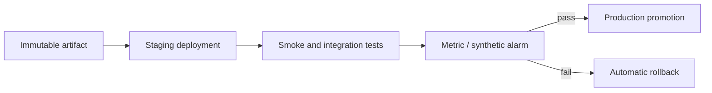
#### Skill 3.3.1 — Creating application test events including JSON for Lambda, API Gateway, and SAM resources

Lambda, API Gateway, and SAM each expect a structured event envelope with
headers/context/records that handler code must parse correctly.
Save captured or documented representative fixtures rather than
inventing a simplified body.

A test that omits `Records`, base64 payloads, or API request context cannot
catch trigger-specific parsing defects.

Version success, invalid, authorization-denied, and duplicate fixtures and
run them in pipeline tests.
#### Skill 3.3.2 — Deploy API resources to various environments

API deployments bind routes/integrations to a stage whose variables, authorizer, throttling,
and endpoint are environment-specific.

- Promote the same API definition with environment parameters, keeping dev/test/prod dependencies separated.

Updating source without deploying the API/stage leaves clients
on the old configuration.

Deploy to the intended stage, call its URL, and assert the route
reaches the expected alias/backend.
#### Skill 3.3.3 — Creating integration environments using approved versions such as Lambda aliases, image tags, Amplify branches, or Copilot environments

A Lambda alias points to a published version, an image digest identifies exact container
bits, and deployment branches/environments isolate test traffic/configuration.
Use immutable approved identities for integration tests rather than
`$LATEST` or `latest`.

Rebuilding in production can deploy different dependencies than
the tested release.

Capture the alias version/image digest in test output and verify
promotion reuses it.
#### Skill 3.3.4 — Implementing and deploy IaC templates with AWS SAM or CloudFormation

This compact template makes runtime, code location, and nonsecret configuration reviewable.
Parameters vary by environment; desired state stays versioned.

```yaml
Transform: AWS::Serverless-2016-10-31
Parameters:
  Environment:
    Type: String
Resources:
  OrdersFunction:
    Type: AWS::Serverless::Function
    Properties:
      CodeUri: src/
      Handler: app.handler
      Runtime: python3.12
      Environment:
        Variables:
          ENVIRONMENT: !Ref Environment
```

SAM/CloudFormation describe resources, dependencies, permissions, and configuration as
reviewed desired state.

Use IaC for repeatable stack updates; use a change set when impact
review matters.

Manual console fixes create drift and are not captured for the next
environment.

Parameterize environment names, validate/build the template, deploy an
existing test stack, and assert a real behavior afterward.
#### Skill 3.3.5 — Managing service-specific development, test, and production environments

Each service has environment-scoped resources/configuration: separate API stages, Lambda
aliases/variables, tables/buckets, queues/buses, and roles as needed.

- Isolate accounts or stacks according to risk, while sharing only deliberate artifacts and templates.

Same source code does not imply shared credentials, endpoints,
or data are safe.

Add an environment tag/name to resources and test that staging
cannot write to production data.
#### Skill 3.3.6 — Using Amazon Q Developer to generate automated tests, then review and validate them

Amazon Q Developer may draft test cases, but fixtures and assertions still need human
validation against the actual handler contract and security policy.
Use it to accelerate a test matrix or boilerplate, not to replace review of
event shapes and expected outcomes.

Generated code is not evidence of correctness until it executes
against controlled inputs.

Run generated tests, add a negative authorization/duplicate case,
and inspect for static credentials or broad permissions.

### Task 4: Deploy code by using AWS CI/CD services
**Plain-language goal.** Promote a known release through source, build, test, deployment,
health verification, and rollback with the existing workflow.
**End-to-end scenario.** A commit to the approved branch triggers CodePipeline.
CodeBuild tests and packages a SAM application.
CodeDeploy shifts 10% of a Lambda alias’s traffic, CloudWatch alarms watch errors and
latency, and the prior version resumes traffic automatically if an alarm breaches.
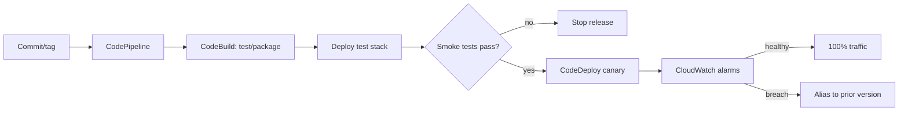
#### Decision table
| Service/cue | Responsibility | Exam selection rule |
|---|---|---|
| CodePipeline | Orchestrates stages | Use for source → build → test → deploy flow |
| CodeBuild | Builds and tests | Use for managed build commands/buildspec |
| CodeDeploy | Controlled deployment | Use for Lambda/ECS/EC2 deployment strategies |
| Canary | Small traffic first | Reduce blast radius with alarm rollback |
| Linear | Incremental traffic shifts | Gradual exposure over intervals |
| Blue/green | Replacement environment | Fast switch/rollback with extra capacity |
| Rolling | Batches on existing fleet | Update incrementally where appropriate |
#### Implementation walkthrough
1. Use a repository commit, tag, label, or branch as the auditable source trigger. The pipeline should receive the intended release, not a developer’s local directory.
2. CodeBuild runs tests and produces the deployable artifact. Store build specification and dependencies with the source so builds are repeatable.
3. Update the existing SAM/CloudFormation template rather than creating a parallel manual infrastructure path. Use environment-specific parameters/configuration.
4. For Lambda, publish a version, point an alias at it, and let deployment configuration shift alias traffic. Attach alarms that represent user harm, such as errors or latency.
5. Define rollback before release: known prior version, alarm criteria, and existing strategy. Verify rollback through post-deployment health signals.
6.
Use API Gateway stages/custom domains and runtime configuration to retain stable
client-facing addresses while environments differ.
#### Configuration mechanics
| Strategy | Initial exposure | Rollback shape | Best cue |
|---|---|---|---|
| Canary | Small percentage | Shift alias/traffic back | Minimize blast radius |
| Linear | Increasing percentages | Stop and return traffic | Gradual confidence |
| Blue/green | New environment | Switch back environment | Near-instant switch, spare capacity |
| Rolling | Batch of existing fleet | Replace/restore batches | Incremental fleet update |
#### What fails in production, and how to respond
- **Canary alarm breaches:** CodeDeploy stops/rolls back alias traffic to known good version; investigate with version-tagged logs and traces.
- **Build succeeds but wrong branch releases:** Restrict source trigger/branch rules and use immutable release labels.
- **Blue/green has no spare capacity:** It cannot meet a replacement-environment requirement without capacity; use canary/linear if the requirement favors traffic shifting instead.
#### Why tempting alternatives are wrong
- CodePipeline is orchestration, not the service that executes compilation; CodeBuild does builds/tests.
- Deploying all traffic at once is wrong when the prompt requires limited initial exposure and automatic rollback.
- Changing production configuration by hand is not a reliable rollback or CI/CD strategy.
#### Skill 3.4.1 — Understanding Lambda ZIP archives, layers, and container-image deployment packages

ZIP functions package code/dependencies, layers share compatible runtime libraries, and
container-image functions pull a tagged/digested ECR image.
Select the smallest package type meeting dependency/runtime needs; use
a layer for shared libraries, not per-function configuration.

`$LATEST`/an unpinned image is not a reproducible deployment artifact.

Build the exact package, run it in a Lambda-compatible test, and record ZIP
hash or image digest.
#### Skill 3.4.2 — Understanding API Gateway stages and custom domains

API Gateway stages expose deployments under distinct configuration contexts; a custom
domain/base-path mapping gives clients a stable public name while routing to an API/stage.

- Use stages for dev/test/prod behavior and custom domains for client-facing URLs/certificates.

A custom domain does not by itself supply a separate
deployment or environment.

Map the intended base path, configure its certificate, and invoke
each stage-specific endpoint in a test.
#### Skill 3.4.3 — Update existing SAM and CloudFormation templates

Updating an existing SAM/CloudFormation template applies a reviewed diff to the stack and
preserves declarative ownership of resources.
Modify the template and deploy the stack; avoid manual resource edits that
introduce drift.

Replacing a stack to make a small change risks data/resource
replacement when an in-place update was required.

Generate/review a change set, update test first, and inspect
first-failed events on error.
#### Skill 3.4.4 — Managing application environments using AWS services

Environment management combines separate resource names/accounts/stacks with external
configuration, roles, and deployment controls.
Isolate production data and credentials from development; promote the
same artifact with environment-specific parameters.

Copying production secrets into a dev environment is not environment
management.

Use IaC parameters/tags and least-privilege roles, then prove a staging
request reaches only staging resources.
#### Skill 3.4.5 — Deploy application versions with strategies that match risk and availability requirements

Canary sends a small initial percentage, linear increases traffic in steps, blue/green
switches to a replacement environment, and rolling replaces batches.

- Choose canary/linear for gradual exposure with alarms, blue/green for rapid environment switch with capacity, and rolling for incremental fleet replacement.

All-at-once deployment cannot meet a limited-blast-radius
requirement.

Attach user-impact alarms and preserve a known-good version
before shifting traffic.
#### Skill 3.4.6 — Commit code to repositories to invoke existing build, test, and deployment actions

A commit to an approved branch/tag can trigger existing CodePipeline source, CodeBuild test,
and deployment actions.
Let the established pipeline consume the repository revision rather than
manually uploading local code.

Pushing to any branch is not sufficient when the pipeline is
configured for a specific branch or tag.

Enforce branch protection/source filters, include buildspec in
source, and record the source revision in the release.
#### Skill 3.4.7 — Using orchestrated workflows to deploy code through environments

CodePipeline coordinates source, build, test, approval, and deploy stages; CodeBuild
executes build commands; CodeDeploy manages supported controlled deployments.
Use orchestration when a release must pass ordered gates across
environments, not a standalone build service.

CodePipeline does not compile the application itself, and CodeBuild does
not provide canary traffic shifting.

Define artifact handoff, failure stop behavior, and post-deploy tests in the
pipeline.
#### Skill 3.4.8 — Perform rollbacks through existing deployment strategies and known-good versions

Rollback returns traffic/configuration to a recorded known-good Lambda version, task set, or
environment using the deployment strategy and health alarms.

- Use automated rollback for breached canary/linear alarms; use controlled manual rollback only when the deployment type requires it.

Editing production source or console fields during an incident
is not a reproducible rollback.

Record prior version and alarm state, trigger a controlled
failure in staging, and verify traffic/logs identify the restored release.
#### Skill 3.4.9 — Using labels and branches for version and release management

Branches organize ongoing work, tags/labels identify a release candidate, and immutable
artifact metadata ties a deployment back to source.
Trigger release pipelines from protected release branches or tags when the
requirement calls for controlled promotion.

A mutable branch name does not guarantee that tomorrow’s build
uses the reviewed revision.

Tag the approved commit, build once, and persist SHA/tag/digest in
the deployment record.
#### Skill 3.4.10 — Using runtime configuration for dynamic deployments, such as API Gateway stage variables consumed by Lambda

Runtime configuration separates behavior from deployed code; API Gateway stage variables can
select a Lambda alias or backend parameter at request time.
Use stage variables/AppConfig for controlled environment/feature
variation, not for secrets embedded in client-visible configuration.

Changing a stage variable changes routing/configuration but does not
publish new Lambda code.

Set a stage variable to an approved alias, invoke the stage, and log the
safe selected version.
#### Skill 3.4.11 — Configuring blue/green, canary, and rolling strategies for releases

Blue/green maintains old and replacement environments, canary shifts a small percentage
before full rollout, and rolling updates batches of an existing fleet.

- Match the required rollback speed, spare capacity, and blast radius rather than selecting the fashionable strategy.

Blue/green needs replacement capacity; canary needs a
version/traffic routing mechanism.

Configure CodeDeploy/SAM traffic shifting plus CloudWatch alarms
and test an alarm-driven rollback.

## Domain 4: Troubleshooting and Optimization (18%)

### Task 1: Assist in a root cause analysis
**Plain-language goal.** Use time-correlated evidence to identify the failing condition,
then prove a targeted fix rather than guessing from a single alarm.
**End-to-end scenario.** Checkout latency rises after a release.
A dashboard shows Lambda duration rose at the same time.
X-Ray traces identify an external-payment segment, and structured logs for the same trace
IDs show repeated connection timeouts.
#### Decision table
| Signal | Best question answered | Tool/example |
|---|---|---|
| Metric | When, how much, how widespread? | CloudWatch duration/error/throttle graph |
| Log | What happened in one execution? | CloudWatch Logs Insights query |
| Trace | Which hop was slow or failed? | X-Ray service map/segments |
| Deployment event | Which resource/change failed? | CloudFormation/SAM/service output |
| Dashboard | What changed across components? | Correlated health view |
| EMF metric | What business signal changed? | CheckoutFailures by safe dimension |
#### Implementation walkthrough
1. Start with the symptom, affected scope, and time window. Compare a baseline to the degraded interval and annotate deployment/version changes.
2. Use metrics to identify the component and whether errors, duration, throttles, or dependency latency moved first. Metrics establish correlation, not proof.
3. Query structured logs by request ID, trace ID, route, version, and error class. Avoid searching a huge log group with unstructured text alone.
4. Use traces to find the slow segment and inspect annotations/metadata that are safe to record. Follow the request across API, Lambda, queue, and downstream calls.
5. For deployment failures, read stack events/service output from the first failed resource; later failures can be consequences.
6.
Form a hypothesis, reproduce or compare evidence, apply one narrow change, and verify
metrics return toward baseline.
#### What fails in production, and how to respond
- **Error graph spikes but no root cause:** Correlate logs/traces and release history; the graph only says the symptom exists.
- **CloudFormation update rolls back:** Find the earliest failed resource event, then inspect IAM, quota, template property, or dependency output.
- **Integration returns 403 or timeout:** Check identity/permissions separately from endpoint, DNS/network path, event shape, and timeout settings.
#### Why tempting alternatives are wrong
- Changing Lambda memory before locating the slow trace segment may hide the symptom and spend more without fixing a downstream timeout.
- Searching logs without a bounded time range or correlation field is slow and produces false leads.
- Treating the latest visible stack error as root cause ignores cascade failures.

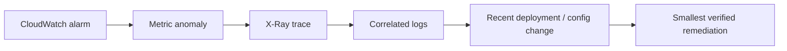
#### Skill 4.1.1 — Debugging code to identify reproducible defects

Reproduce a defect with fixed input, version, environment, and time window, then reduce it
to the smallest failing path before changing code.
Start from evidence and a deterministic fixture, not a speculative
rewrite.

A symptom that disappears after random configuration changes is not a
demonstrated root cause.

Capture request/trace ID and release version, write a failing regression
test, fix one cause, and rerun the same fixture.
#### Skill 4.1.2 — Interpret application metrics, logs, and traces together

Metrics reveal timing/scale, logs reveal event detail, and traces reveal the hop-by-hop
request path; together they turn correlation into a testable hypothesis.

- Use metrics to bound the incident, trace a slow/failed request, then query logs by trace/request ID.

An error-rate dashboard alone cannot locate a latency
bottleneck.

Compare baseline and degraded windows with version annotations
and identify the first moving dependency.
#### Skill 4.1.3 — Query logs to find relevant data efficiently

CloudWatch Logs Insights filters and aggregates structured fields over a bounded time range,
reducing cost/noise versus broad text search.
Query by request ID, trace ID, route, version, and error class; use
metrics/traces first when the failing scope is unknown.

Searching every log group for one vague exception can find
unrelated historical failures.

Filter the incident window, project safe fields, sort by timestamp,
and correlate a result to a trace.
#### Skill 4.1.4 — Implementing custom metrics such as CloudWatch EMF

Embedded Metric Format writes a JSON log event containing `_aws` metric metadata so
CloudWatch extracts a metric without a separate PutMetricData call.
Emit EMF for business signals such as `PaymentFailures` when Lambda
Errors cannot explain user impact.

High-cardinality IDs as metric dimensions create excessive cost and
unusable cardinality.

Use low-cardinality safe dimensions (for example route/environment), graph
the result, and alarm on a tested threshold.
#### Skill 4.1.5 — Reviewing application health through dashboards and insights

A dashboard combines service and business metrics into a shared health view;
Insights/queries let operators drill from a symptom to evidence.

- Use a dashboard for ongoing visibility and alarms/notifications for required action.

A dashboard does not wake an on-call responder and is not an
alerting mechanism by itself.

Place traffic, error rate, p95 latency, throttles, dependency
metrics, and deployment annotations on one incident view.
#### Skill 4.1.6 — Troubleshoot deployment failures from service output logs and first failed resources

CloudFormation/SAM failure investigation starts with the earliest failed resource event,
then checks its service logs, permissions, quota, property, and dependency.
Fix the root resource failure before chasing rollback/cascade events.

The final rollback message is often a consequence, not the
original failure.

Read stack events in timestamp order, reproduce with the
template/change set, and verify the stack plus application smoke test.
#### Skill 4.1.7 — Debugging service integration issues across endpoint, identity, network, payload, timeout, and error handling

Integration diagnosis separates endpoint/DNS/route reachability, identity/resource policy,
payload contract, timeout budget, and downstream error handling.
Test one layer at a time from caller to target instead of widening IAM
immediately.

A 403 indicates an authorization path; a timeout usually requires
network/dependency/timeout analysis, not the same fix.

Correlate a request ID, verify endpoint resolution/connectivity, validate
signed identity, then replay the exact payload.

### Task 2: Instrument code for observability
**Plain-language goal.** Design safe logs, metrics, traces, health signals, and alerts
before an incident so operators can explain unexpected behavior.
**End-to-end scenario.** A checkout Lambda emits a structured log with request ID, route,
deployment version, outcome, and safe duration; it emits an EMF payment-failure metric;
X-Ray annotations make a tenant and feature path searchable; alarms notify the on-call team
when failures cross an actionable threshold.
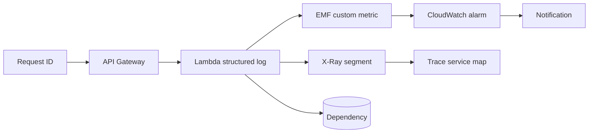
#### Decision table
| Instrument | Purpose | Safe field example |
|---|---|---|
| Structured log | Detailed event record | requestId, route, outcome, durationMs |
| Metric | Numeric trend/alert | OrdersAccepted, PaymentFailure count |
| Trace | Request path and latency | segment for payment dependency |
| Annotation | Indexed trace dimension | tenantTier, featureFlag—not a secret |
| Health/readiness | Traffic eligibility | database dependency ready |
| Alarm/notification | Actionable response | error rate beyond threshold |
#### Implementation walkthrough
1. Define an event schema before logging: timestamp, level, request/correlation ID, operation, safe subject identifier, outcome, duration, version, and error class.
2. Use structured JSON so Logs Insights can filter and aggregate fields. Do not force investigators to parse prose strings.
3. Emit custom metrics for application behavior that infrastructure metrics cannot express, such as orders accepted or validation failures. EMF can create metrics from log events.
4. Enable tracing and create segments around meaningful downstream work. Add safe annotations used for filtering; put sensitive/high-cardinality diagnostic detail in nonindexed metadata only when appropriate.
5. Configure alarms only for conditions with an owner and response. Notification without a useful threshold creates alert fatigue.
6.
Distinguish liveness from readiness: a process can be running but not ready to accept
traffic because a required dependency is unavailable.
#### What fails in production, and how to respond
- **Logs contain authorization header:** Sanitize at the logging boundary, rotate exposed credentials, and review retention/access.
- **Alarm fires continuously on normal noise:** Choose baseline-informed, actionable threshold/evaluation periods rather than alerting every transient error.
- **Trace lacks downstream visibility:** Instrument the client call/propagate context and ensure supported service integrations are configured.
#### Why tempting alternatives are wrong
- More logs are not automatically better; noisy or secret-bearing logs reduce diagnosability and create risk.
- A dashboard is not an alert; it shows information but does not notify responders.
- A health endpoint returning 200 while dependencies are unusable is liveness only, not readiness.
#### Skill 4.2.1 — Understanding differences among logging, monitoring, and observability

Logging records individual events, monitoring tracks known metrics/alarms, and observability
connects logs, metrics, traces, and context to answer new questions.
Emit all three forms for distributed flows: structured logs for
details, metrics for trends, traces for paths.

More raw log lines are not observability if they cannot be queried or
correlated.

Propagate one correlation ID and verify an operator can move from an alarm
to the request trace and logs.
#### Skill 4.2.2 — Implementing effective logs for application behavior and state

A safe structured event is queryable without recovering a request body or credential.
Keep identifiers low-risk and retain deployment version for correlation.

```json
{
  "level": "INFO",
  "requestId": "abc-123",
  "route": "POST /orders",
  "outcome": "accepted",
  "durationMs": 42,
  "version": "42"
}
```

Effective application logs use structured JSON with timestamp, level, request ID, operation,
outcome, duration, version, and safe error class.

- Log state transitions and boundary failures, not entire request bodies or secrets.

Free-form strings and unbounded debug payloads make Logs
Insights and incident privacy worse.

Define an allowlist schema and test that a failed request emits
searchable fields without tokens/PII.
#### Skill 4.2.3 — Emitting custom application metrics

Custom metrics turn domain outcomes—orders accepted, validation failures, queue-age
breach—into count, gauge, or latency time series for dashboards/alarms.
Add custom metrics when infrastructure metrics cannot state the business
symptom.

Per-user/request-ID dimensions make metrics expensive and cannot
replace logs for individual records.

Emit a metric with low-cardinality dimensions, compare it to a
known test event, and attach an actionable alarm.
#### Skill 4.2.4 — Adding trace annotations for searchable safe dimensions

X-Ray annotations are indexed key/value dimensions for filtering traces; metadata is
nonindexed detail.
Put safe, low-cardinality fields such as environment, route, or tenant
tier in annotations; keep secrets and high-cardinality identifiers out.

An annotation is searchable observability data, not a secure store for
customer identifiers.

Add an annotation around the dependency segment and query traces by it
during a test incident.
#### Skill 4.2.5 — Implementing notification alerts for actions such as quota risk or deployment completion

CloudWatch alarms evaluate a metric over defined periods and can notify SNS or trigger a
deployment rollback; quota alarms use service usage/limit signals.

- Alert only when a named owner can take a documented action; use a dashboard for passive information.

Alerting on every transient error creates noise and does not
meet an actionable-alert requirement.

Set threshold/evaluation periods from baseline, test the alarm
path, and include runbook/version context in notification.
#### Skill 4.2.6 — Implementing tracing with AWS services and tools

X-Ray tracing propagates trace context across supported services and records
segments/subsegments with timing and errors for downstream calls.
Use tracing to locate the slow hop in a distributed request; use logs for
detailed values and metrics for fleet trend.

A trace without propagated context fragments the request and
cannot prove end-to-end latency.

Enable active tracing, instrument an external/database call, and
verify the service map shows the dependency.
#### Skill 4.2.7 — Implementing structured logging for application events and user actions

Structured logging emits typed JSON fields so an operator can filter `requestId`, `route`,
`outcome`, `durationMs`, and deployment version without parsing prose.
Standardize schema at the logger boundary and retain only safe
user-action indicators.

Logging raw authorization headers or full user payloads turns observability
into a data-disclosure risk.

Run a Logs Insights aggregation for failures by route/version and verify
sensitive fields are absent.
#### Skill 4.2.8 — Configuring health checks and readiness probes

Liveness answers whether a process runs; readiness answers whether it can safely receive
traffic because required dependencies/configuration are usable.

- Configure load balancer/container readiness checks when traffic must avoid instances that are starting or disconnected from a required dependency.

Returning HTTP 200 from a process that cannot serve requests
is liveness only, not readiness.

Make readiness fail during a controlled dependency outage while
liveness stays healthy, then verify traffic is withheld.

### Task 3: Optimize applications by using AWS services and features
**Plain-language goal.** Measure the bottleneck, choose the smallest relevant resource,
caching, filtering, or code change, and verify the improvement.
**End-to-end scenario.** A product API is slow during traffic peaks.
Metrics show CPU-bound Lambda duration, traces show repeated product reads, and SNS
subscribers receive many irrelevant messages.
The team increases Lambda memory after a test, adds a safe cache-aside layer for products,
and filters notifications by event type.
#### Decision table
| Evidence | Targeted optimization | Avoid |
|---|---|---|
| CPU-bound Lambda duration | Test higher memory | Blindly increasing timeout |
| Repeated identical safe reads | Application/ElastiCache cache | Caching personalized responses with shared key |
| Irrelevant SNS deliveries | Subscription filter policy | Filtering only after every consumer runs |
| Downstream overload | Reserved concurrency / queue | Unlimited parallelism |
| Variant response by header | Include necessary header in cache key | Serving one variant to all users |
| Slow unknown path | Profile/trace/log timing | Guessing based on cost alone |
#### Implementation walkthrough
1. Define concurrency as simultaneous units of work. In Lambda it affects downstream pressure, account limits, and throughput—not simply speed of one invocation.
2. Profile first: compare duration, initialization, memory use, downstream segment time, query count, and throttles. Change one variable and compare before/after.
3. For Lambda, test memory settings because more memory also grants more CPU. Choose the lowest setting that meets latency and reliability objectives after measurement.
4. Use SNS filter policies when a subscription only needs matching message attributes. This avoids delivery and processing work for irrelevant consumers.
5. Use cache-aside only for data that can safely be stale. Select a key that includes every request dimension that changes the response, define TTL, and invalidate/update after writes.
6.
Read timestamps and duration fields in logs to locate bottlenecks; pair them with traces so
a slow dependency is not mistaken for local code.
#### Configuration mechanics
| Cache choice | Best fit | Key rule |
|---|---|---|
| CloudFront/content cache | HTTP content variants | Include only headers/cookies/query values that vary response |
| ElastiCache | Shared low-latency data | Define invalidation and stale-data behavior |
| In-process cache | Short-lived reusable computation | It disappears with instance/Lambda lifecycle |
| DynamoDB DAX / store cache pattern | DynamoDB read acceleration | Do not bypass authorization/tenant keying |
#### What fails in production, and how to respond
- **Cache returns another user’s response:** The cache key omitted identity/tenant/variant. Purge, correct the key, and assess exposure.
- **Higher Lambda memory costs more but does not help:** Trace shows I/O or downstream dependency dominates; optimize connection/query/service path instead.
- **High concurrency overloads RDS:** Cap function concurrency, buffer through SQS, use connection management, and right-size based on downstream capacity.
#### Why tempting alternatives are wrong
- Increasing provisioned concurrency treats cold starts, not a slow database query.
- A subscription filter policy belongs on the subscription; filtering inside every consumer still spends delivery/compute.
- A global cache without invalidation/TTL is not a safe performance design.
#### Skill 4.3.1 — Understanding concurrency and its throughput/downstream implications

Concurrency is simultaneous work: Lambda executions, queue consumers, or container requests;
it determines throughput and downstream pressure.
Increase it only when the dependency capacity and account limits
support it; cap reserved concurrency or buffer via SQS to protect a database/provider.

Higher concurrency can worsen an outage by overwhelming the already slow
downstream service.

Load-test at a controlled concurrency and observe throttles, connection
count, queue age, and p95 latency.
#### Skill 4.3.2 — Profile application performance before changing resources

A profile combines p50/p95 duration, init time, CPU/memory, query count, dependency
segments, cache hit rate, throttles, and cost before a change.

- Optimize the measured dominant component, not the most familiar AWS setting.

Increasing Lambda memory cannot fix a third-party call that
owns most of the trace time.

Capture a baseline, change one variable, rerun the same load, and
compare evidence.
#### Skill 4.3.3 — Choosing minimum memory and compute power through measured tests

Lambda memory selection changes memory and CPU, so the right value is the lowest measured
setting that meets latency/reliability objectives at representative load.
Test adjacent sizes for CPU-bound code; investigate network/database time
before increasing memory for I/O-bound work.

Selecting the largest memory value without measurement can
increase cost with no user benefit.

Record duration, Max Memory Used, throttles, and estimated cost for
each run.
#### Skill 4.3.4 — Using SNS subscription filter policies to optimize messaging

SNS subscription filter policies evaluate message attributes or body scope before delivery,
so irrelevant subscribers do not receive/process the message.
Use a filter policy when one topic has consumers interested in
different event types/regions; use EventBridge when rule-based event routing is the central
requirement.

Filtering inside every Lambda after delivery still consumes invocation and
downstream work.

Publish messages with explicit attributes and test matching and nonmatching
deliveries.
#### Skill 4.3.5 — Cache content based on request headers when those headers vary the response

An HTTP cache key must include each header, cookie, query parameter, or identity dimension
that changes the response, such as `Accept-Language` or tenant.

- Forward/include only required variant headers to preserve cache hit rate; do not share-cache personalized content unless the key is safe.

A product-only key for tenant pricing risks cross-tenant data
exposure.

Request two language/tenant variants and confirm neither receives
the other’s cached response.
#### Skill 4.3.6 — Implementing application-level caching with safe keys and expiry/invalidation

Application cache-aside uses a complete key, bounded TTL, authoritative-store miss path, and
write invalidation/update policy.
Cache repeated, safely stale reads in ElastiCache/DAX/application memory
according to sharing and durability needs.

An in-process Lambda cache disappears on cold start and cannot
be treated as shared durable state.

Test cold miss, hit, write invalidation, and expired entry behavior
while monitoring hit rate and stale reads.
#### Skill 4.3.7 — Optimize resource usage through right-sizing, reuse, batching, and controlled concurrency

Right-sizing removes unused capacity, connection/client reuse avoids setup cost, batching
balances throughput against retry blast radius, and concurrency caps protect downstream
systems.
Apply the smallest control identified by profile evidence: reuse
SDK/database connections, tune batch size, or queue/cap work.

Larger batches can replay more successful records when one record fails.

Change one lever and compare latency, errors, throttles, and cost under
identical load.
#### Skill 4.3.8 — Analyzing performance issues with baseline, evidence, and verified targeted changes

Performance analysis starts with a baseline and a hypothesis tied to metrics, logs, and
traces, then validates one targeted change against the same workload.

- Fix the measured slow dependency, hot partition, cache miss pattern, or CPU limit rather than applying blanket scaling.

A lower average duration can hide worse tail latency or error
rate, so compare the relevant SLO evidence.

Record before/after p95, errors, throughput, cost, and the
changed version/configuration.
#### Skill 4.3.9 — Using application logs to identify bottlenecks through correlated timings and outcomes

Correlated structured logs expose per-step timestamps/durations, request ID, version, and
safe outcome; joining them to trace IDs isolates a bottleneck.
Use logs to explain the slow request after metrics identify the affected
interval and traces identify the likely hop.

An uncorrelated stack trace tells you an error happened but
rarely identifies where total latency accumulated.

Query a bounded window, calculate/inspect dependency timings, and
compare a slow request to a healthy one.
