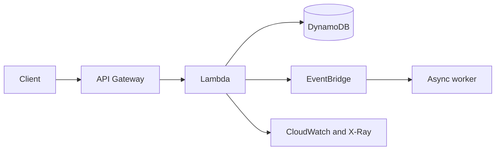
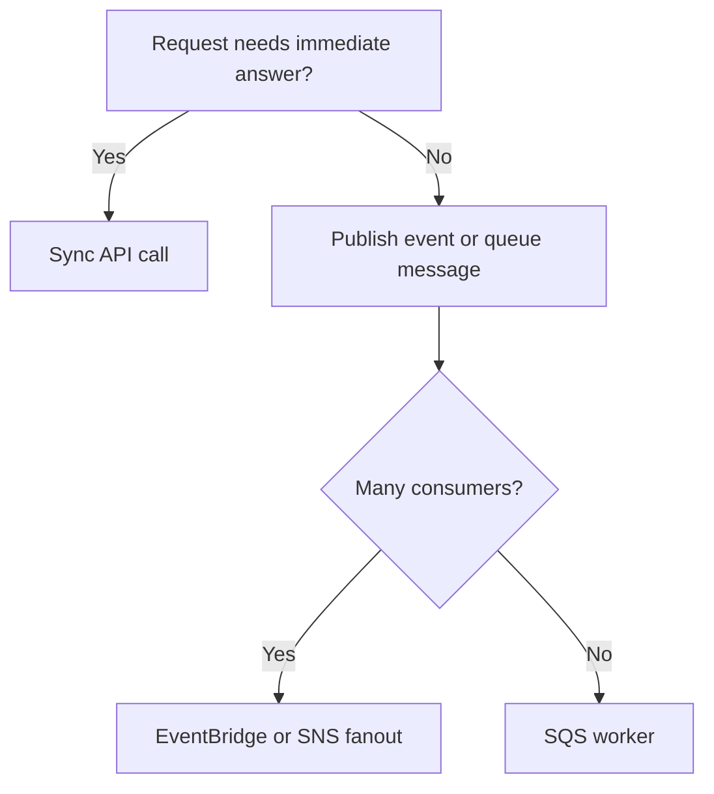
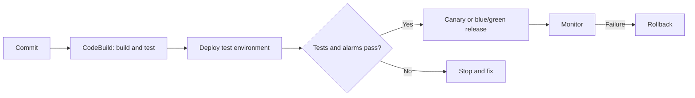

# AWS Certified Developer – Associate (DVA-C02)

This guide follows the **DVA-C02 Exam Guide v2.1**. The exam has 50 scored questions, 15 unscored questions, 130 minutes, and a scaled passing score of 720. Questions can be multiple choice or multiple response; unanswered questions are incorrect, so make the best selection.

## Exam map

| Domain | Weight | What you are really being asked |
|---|---:|---|
| 1. Development with AWS Services | 32% | How should the application be built and connected? |
| 2. Security | 26% | Who can call it, and how is data protected? |
| 3. Deployment | 24% | How is a tested version promoted safely? |
| 4. Troubleshooting and Optimization | 18% | How do you observe, diagnose, and improve it? |

**Beginner rule:** identify the constraint before naming a service: asynchronous work, user identity, secret storage, repeatable deployment, or evidence from logs. AWS questions often offer several services that work; choose the one that directly solves the stated constraint with the least extra machinery.

## Domain 1: Development with AWS Services (32%)

### Task 1: Develop code for applications hosted on AWS

**Plain language:** build the parts of an app that receive requests, call AWS services, and keep working when another component is slow or unavailable.

**Why it matters:** real applications fail at boundaries—network calls, queues, APIs, and dependencies. The exam tests whether code remains decoupled and recoverable.

**Decision cues:** choose synchronous API calls when a caller needs an immediate result; choose SQS, SNS, EventBridge, Kinesis, or Step Functions when work can happen later. Prefer loose coupling for independent scaling and failure isolation.

**Example:** an order API stores the order, publishes an `OrderCreated` event to EventBridge, and separate inventory and email consumers react without the API waiting for them.

> **Exam Tip:** “one producer, many independent consumers” usually points to fanout—SNS or EventBridge—not a single SQS consumer.
>
> **Exam Trap:** do not call a flaky third-party API repeatedly in one request path; use bounded retries, timeouts, circuit breaking, and a failure path.

**Exam Keywords:** event-driven, decoupled, idempotent, fanout, retry, circuit breaker, SDK, API validation.

#### Official skills — Task 1

- **Skill 1.1.1 — Architectural patterns:** Event-driven reacts to events; microservices split capabilities; a monolith deploys together. Choreography lets services react independently; orchestration has a coordinator such as Step Functions. Use fanout when one event must reach many subscribers.
- **Skill 1.1.2 — Stateful versus stateless:** stateful components remember session/data locally; stateless components keep request state outside the instance, so any healthy instance can serve the next request. Scale stateless web tiers behind a load balancer.
- **Skill 1.1.3 — Tightly versus loosely coupled:** tightly coupled components depend on each other being available now. Loosely coupled components communicate through durable interfaces or queues, reducing blast radius.
- **Skill 1.1.4 — Synchronous versus asynchronous:** synchronous callers wait for a response; asynchronous producers hand off work and continue. Use async for slow, bursty, or retryable background work.
- **Skill 1.1.5 — Fault-tolerant and resilient code:** handle expected failures, use timeouts and retries with backoff, and make retries safe through idempotency. Persist work before acknowledging it.
- **Skill 1.1.6 — Create, extend, and maintain APIs:** validate request shape, transform request/response data when needed, and return meaningful HTTP status codes. API Gateway can apply request validation and mappings at the edge.
- **Skill 1.1.7 — Unit tests in development environments:** test small code units with fake dependencies; AWS SAM can invoke Lambda locally with representative events. Unit tests should be fast and isolated.
- **Skill 1.1.8 — Messaging services:** use SQS for durable work queues, SNS for pub/sub notifications, EventBridge for event routing by rules, and Step Functions for visible multi-step workflows.
- **Skill 1.1.9 — AWS APIs and SDKs:** use an SDK with the execution role’s temporary credentials rather than embedding keys. Handle SDK exceptions and paginate results where an API returns pages.
- **Skill 1.1.10 — Streaming data:** use Kinesis when records arrive continuously and consumers process them in near real time. Design consumers for retries and duplicate delivery.
- **Skill 1.1.11 — Amazon Q Developer:** use it to assist code generation, review, explanations, and refactoring, then review output and protect sensitive inputs.
- **Skill 1.1.12 — EventBridge event-driven patterns:** publish structured events to an event bus and route them by rules to targets. It is a strong fit for application events and cross-service integration.
- **Skill 1.1.13 — Third-party resilience:** add deadlines, bounded exponential-backoff retries, fallback/error handling, and a circuit breaker that stops repeated calls while a dependency is unhealthy.

### Task 2: Develop code for AWS Lambda

**Plain language:** configure small event-driven functions correctly, connect them to AWS, and make their failures and performance predictable.

**Why it matters:** Lambda has execution, retry, concurrency, timeout, and networking behavior that changes the correct answer.

**Decision cues:** a Lambda in a VPC is needed to reach private VPC resources; configure a NAT path only if it must also reach the internet. Use destinations or DLQs for failed asynchronous events. Increase memory when CPU also needs to increase.

**Example:** an S3 upload starts a Lambda that validates an image, writes metadata to DynamoDB, and sends failures to an SQS DLQ for review.

> **Exam Tip:** Lambda’s execution role authorizes AWS calls. Environment variables configure code; Secrets Manager stores rotating secrets.
>
> **Exam Trap:** a VPC-connected Lambda does not gain internet access merely by joining a private subnet.

**Exam Keywords:** execution role, trigger, timeout, concurrency, layer, destination, DLQ, VPC, cold start.

#### Official skills — Task 2

- **Skill 1.2.1 — Private VPC resources:** attach Lambda to the correct VPC subnets and security groups to reach private RDS or ElastiCache. Provide NAT only for outbound internet access.
- **Skill 1.2.2 — Lambda configuration:** set environment variables, memory, timeout, runtime, handler, layers, extensions, triggers, destinations, and concurrency for the workload rather than using defaults blindly.
- **Skill 1.2.3 — Event lifecycle and errors:** know whether invocation is synchronous, asynchronous, or event-source mapped; route failed asynchronous events with Lambda Destinations or a DLQ.
- **Skill 1.2.4 — Lambda test code:** create representative events and run tests with AWS tools such as SAM before promotion.
- **Skill 1.2.5 — Lambda integrations:** connect Lambda to API Gateway, S3, EventBridge, SQS, DynamoDB Streams, and other supported sources with least-privilege permissions.
- **Skill 1.2.6 — Lambda performance tuning:** measure duration and errors, then tune memory, timeout, concurrency, package size, connection reuse, and initialization work.
- **Skill 1.2.7 — Near-real-time transformation:** use Lambda with streams or events to validate, enrich, transform, and route incoming data quickly.

### Task 3: Use data stores in application development

**Plain language:** select and use storage based on how the application reads and writes data, not on habit.

**Why it matters:** DynamoDB models, consistency, indexes, TTL, caching, and search each solve different access needs.

**Decision cues:** DynamoDB is for predictable key-based access at scale; `Query` targets a partition key while `Scan` reads broadly. Use ElastiCache for repeated low-latency reads, S3 lifecycle policies for object retention, and OpenSearch when users need text search.

**Example:** a product service uses DynamoDB with `productId` as the partition key, a GSI for category lookup, ElastiCache for popular products, and OpenSearch for full-text search.

> **Exam Tip:** a high-cardinality partition key spreads requests; a low-cardinality key such as `country` can create a hot partition.
>
> **Exam Trap:** adding a filter to a DynamoDB Scan does not avoid reading scanned items; model an index for the access pattern instead.

**Exam Keywords:** partition key, sort key, GSI, LSI, Query, Scan, strong consistency, eventual consistency, TTL, cache.

| Need | Best cue | Typical choice |
|---|---|---|
| Key-based lookup | known partition key | DynamoDB `GetItem` or `Query` |
| Alternate lookup | different key pattern | DynamoDB GSI |
| Full-text search | words, relevance, facets | OpenSearch Service |
| Hot repeated reads | low latency, cacheable | ElastiCache |
| Expire records/objects | retention deadline | DynamoDB TTL or S3 lifecycle |

#### Official skills — Task 3

- **Skill 1.3.1 — High-cardinality partition keys:** choose many distinct key values to distribute traffic and avoid hot partitions.
- **Skill 1.3.2 — Consistency models:** strongly consistent reads return the latest successful write; eventually consistent reads may briefly be stale but use fewer read resources.
- **Skill 1.3.3 — Query versus Scan:** Query is targeted by partition key and optional sort-key condition; Scan examines every item. Prefer Query for performance and cost.
- **Skill 1.3.4 — DynamoDB keys and indexing:** define partition/sort keys from access patterns; create a GSI when an alternate partition/sort-key query is required.
- **Skill 1.3.5 — Serialization and deserialization:** convert application objects to storage-safe representations and back, preserving types and handling missing/changed fields safely.
- **Skill 1.3.6 — Use and maintain data stores:** select the store and use SDK operations, permissions, backups, capacity mode, and error handling appropriate to the application.
- **Skill 1.3.7 — Data lifecycles:** expire or transition data with DynamoDB TTL and S3 lifecycle rules instead of hand-written deletion jobs when lifecycle is policy-based.
- **Skill 1.3.8 — Data caching:** cache safe, frequently requested values with ElastiCache and define expiration/invalidation so stale data is acceptable.
- **Skill 1.3.9 — Specialized data stores:** select OpenSearch Service for search-oriented access patterns, not as a substitute for a transactional primary database.

## Domain 2: Security (26%)

### Task 1: Implement authentication and/or authorization for applications and AWS services

**Plain language:** authenticate (prove who someone is) and authorize (decide what they may do) without putting long-lived credentials in code.

**Why it matters:** credentials, tokens, IAM policies, roles, and microservice identity are common test scenarios.

**Decision cues:** Cognito commonly provides application user sign-in and tokens; IAM roles provide temporary AWS credentials for workloads; STS `AssumeRole` enables temporary cross-account or delegated access. Bearer tokens must be validated before granting access.

**Example:** a web user signs in through Cognito, sends a JWT bearer token to API Gateway, and the Lambda function uses its execution role to read a DynamoDB table.

> **Exam Tip:** use IAM roles and temporary credentials for workloads on AWS; do not create access keys for Lambda or EC2.
>
> **Exam Trap:** authentication alone is not fine-grained authorization. A valid user token does not automatically mean the user may access every tenant’s record.

**Exam Keywords:** Cognito, JWT, bearer token, IAM role, STS, least privilege, resource policy, tenant.

#### Official skills — Task 1

- **Skill 2.1.1 — Federated access:** use an identity provider such as Cognito with IAM to let users sign in and obtain scoped access without creating separate IAM users for application users.
- **Skill 2.1.2 — Bearer tokens:** validate token signature, issuer, audience, expiry, and required claims; require HTTPS because possession of a bearer token grants access.
- **Skill 2.1.3 — Programmatic AWS access:** configure SDK/CLI credential providers and temporary credentials rather than hard-coded access keys.
- **Skill 2.1.4 — Authenticated AWS calls:** sign SDK requests with valid credentials and grant only the permissions needed by the caller.
- **Skill 2.1.5 — Assume an IAM role:** call STS to obtain temporary role credentials when the trust policy permits the principal to assume the role.
- **Skill 2.1.6 — IAM principal permissions:** use identity-based and resource-based policies with least privilege; explicitly scope actions, resources, and conditions.
- **Skill 2.1.7 — Fine-grained application authorization:** evaluate ownership, tenant ID, roles, and claims in application logic or policy so a signed-in user can access only permitted data.
- **Skill 2.1.8 — Cross-service authentication:** allow services to call each other with service roles, signed AWS requests, and scoped resource policies instead of passing a user’s static secret between services.

### Task 2: Implement encryption by using AWS services

**Plain language:** protect data while it travels and while it is stored, and control which identities may use encryption keys.

**Why it matters:** questions distinguish TLS, KMS keys, certificates, server-side encryption, client-side encryption, and cross-account permissions.

**Decision cues:** TLS protects in transit; KMS-backed server-side encryption protects at rest with AWS performing encryption; client-side encryption encrypts before AWS receives data. Use ACM/Private CA concepts for certificates depending on the situation.

**Example:** an application sends HTTPS traffic to API Gateway, stores S3 objects with SSE-KMS, and gives a cross-account role permission to use the KMS key through both IAM and key policy.

> **Exam Tip:** cross-account KMS use needs permission on the key policy and permission for the caller.
>
> **Exam Trap:** encryption at rest does not encrypt traffic; use TLS for in-transit protection.

**Exam Keywords:** TLS, KMS, CMK/KMS key, key policy, SSE-KMS, client-side encryption, certificate, rotation.

#### Official skills — Task 2

- **Skill 2.2.1 — Encryption at rest and in transit:** use storage encryption for persisted data and TLS/HTTPS for network traffic; they address separate threats.
- **Skill 2.2.2 — Certificate management:** understand issuance, trust, renewal, and private certificates, including AWS Private CA for private PKI use cases.
- **Skill 2.2.3 — Client-side versus server-side encryption:** client-side encrypts before upload; server-side encrypts after AWS receives data. Choose client-side when the application must control plaintext before it reaches the service.
- **Skill 2.2.4 — Encryption keys:** use AWS KMS APIs and permissions to encrypt/decrypt data or data keys; keep key use controlled by IAM and key policies.
- **Skill 2.2.5 — Certificates and SSH keys:** generate and manage development certificates/SSH keys securely; do not commit private keys.
- **Skill 2.2.6 — Cross-account encryption:** enable the other account’s principal through KMS key policy plus appropriate IAM permissions.
- **Skill 2.2.7 — Key rotation:** enable or disable rotation according to the key and compliance requirement; distinguish automatic rotation from manually replacing a key.

### Task 3: Manage sensitive data in application code

**Plain language:** identify secrets and private data, keep them out of code/logs, and reveal only the minimum necessary value.

**Why it matters:** leaked passwords, tokens, PII, and cross-tenant data are security failures even when the application works.

**Decision cues:** Secrets Manager is for managed secrets and rotation workflows; encrypted configuration can use Parameter Store where appropriate. Mask values in UI/logs, and scope every database request to its tenant.

**Example:** a payment service retrieves a database password from Secrets Manager at runtime, logs only a masked customer identifier, and verifies `tenantId` from a token before querying records.

> **Exam Tip:** treat a secret in an environment variable as sensitive configuration—encrypt it and limit access—but do not put the source secret in code or a repository.
>
> **Exam Trap:** redacting a display field is not authorization; the backend query must also enforce tenant isolation.

**Exam Keywords:** PII, PHI, Secrets Manager, masking, sanitization, tenant isolation, least data, redaction.

#### Official skills — Task 3

- **Skill 2.3.1 — Data classification:** recognize PII and PHI so the application applies appropriate access, encryption, retention, and logging controls.
- **Skill 2.3.2 — Sensitive environment variables:** encrypt sensitive Lambda environment variables with KMS and restrict who can read/decrypt them.
- **Skill 2.3.3 — Secret management:** retrieve secrets from managed secret services at runtime and rotate them instead of embedding passwords or API keys.
- **Skill 2.3.4 — Sanitize sensitive data:** remove or redact secrets and private fields before logs, errors, analytics, or external calls.
- **Skill 2.3.5 — Application-level masking and sanitization:** show partial values such as the last four digits when users need confirmation but not the whole value.
- **Skill 2.3.6 — Multi-tenant data access:** bind every access decision and query to a verified tenant context; use tenant-aware keys, conditions, and authorization checks.

## Domain 3: Deployment (24%)

### Task 1: Prepare application artifacts to be deployed to AWS

**Plain language:** package code and its declared dependencies/configuration into a repeatable deployable version.

**Why it matters:** “works on my machine” fails when dependencies, image tags, paths, resources, or environment settings differ.

**Decision cues:** use Lambda ZIP/layers/container images based on deployment and dependency needs; use ECR for container images; keep environment-specific values outside code and use AppConfig when controlled runtime configuration is needed.

**Example:** a Python Lambda build includes pinned dependencies, has a small handler package, stores its image variant in ECR when native dependencies are needed, and reads a feature flag from AppConfig.

> **Exam Tip:** package only required artifacts and make versions immutable or traceable.
>
> **Exam Trap:** do not bake production endpoints and credentials into a reusable artifact; supply approved environment configuration separately.

**Exam Keywords:** artifact, dependency, ECR, container image, ZIP, layer, AppConfig, repository, memory.

#### Official skills — Task 1

- **Skill 3.1.1 — Module dependencies:** package dependencies, configuration references, and container image requirements so deployed code has what it needs.
- **Skill 3.1.2 — Deployment directory structure:** organize source, templates, tests, and build output predictably so packaging tools locate the correct handler and assets.
- **Skill 3.1.3 — Code repositories:** use repositories as the versioned source for deployment workflows, with commits providing an auditable release input.
- **Skill 3.1.4 — Resource requirements:** declare needed memory, CPU/cores, and related runtime resources based on measured workload needs.
- **Skill 3.1.5 — Environment configurations:** prepare controlled development/test/production configuration, including AWS AppConfig where runtime configuration and safe rollout are required.

### Task 2: Test applications in development environments

**Plain language:** prove the deployed pieces work together in a safe environment before production.

**Why it matters:** unit tests do not prove that permissions, event formats, endpoints, and infrastructure wiring work together.

**Decision cues:** mock external dependencies for deterministic integration tests; use API Gateway stages/development endpoints for isolated testing; deploy the same SAM/CloudFormation stack pattern to a staging environment; test producers and consumers for event-driven systems.

**Example:** a staging API Gateway stage invokes a test Lambda, which calls a mocked payment API and publishes a test EventBridge event verified by a test consumer.

> **Exam Tip:** use an environment-specific endpoint/stage and approved configuration; do not test unreviewed code against production.
>
> **Exam Trap:** testing only a Lambda handler misses API Gateway mappings, IAM permissions, and event source behavior.

**Exam Keywords:** integration test, mock, stage, development endpoint, SAM, staging, event-driven test.

#### Official skills — Task 2

- **Skill 3.2.1 — Test deployed code:** invoke and validate deployed code with AWS services and tools, not only local tests.
- **Skill 3.2.2 — Integration tests and mocks:** test component boundaries while mocking external systems that are costly, unavailable, or nondeterministic.
- **Skill 3.2.3 — Development endpoints:** use development API endpoints or API Gateway stages to isolate test traffic and configuration.
- **Skill 3.2.4 — Stack updates in existing environments:** apply an AWS SAM or CloudFormation update to a staging/test stack before production, preserving environment separation.
- **Skill 3.2.5 — Event-driven applications:** test the event payload, routing rule, permissions, retries, and consumer result—not just the producer.

### Task 3: Automate deployment testing

**Plain language:** make repeatable tests and environments so a release is validated the same way every time.

**Why it matters:** manual testing is inconsistent, slow, and hard to reproduce during a rollback investigation.

**Decision cues:** use representative JSON events for Lambda/API/SAM; pin an approved version with Lambda aliases or image tags; use SAM/CloudFormation for reproducible infrastructure; use separate service environments for dev/test/prod.

**Example:** a pipeline deploys a SAM stack to test, runs saved API and SQS event payloads, verifies a Lambda alias points to the approved version, and promotes only on success.

> **Exam Tip:** an alias lets clients use a stable Lambda name while deployments shift the version behind it.
>
> **Exam Trap:** “latest” container images and unpinned versions make a test environment non-reproducible.

**Exam Keywords:** test event, alias, image tag, IaC, SAM, CloudFormation, environment, approved version.

#### Official skills — Task 3

- **Skill 3.3.1 — Application test events:** create realistic JSON payloads for Lambda, API Gateway, and SAM resources to exercise expected and error paths.
- **Skill 3.3.2 — API resources across environments:** deploy API definitions/resources to the required dev, test, and production environments.
- **Skill 3.3.3 — Approved integration versions:** create integration environments using approved Lambda aliases, container tags, Amplify branches, or comparable pinned versions.
- **Skill 3.3.4 — Infrastructure as code:** implement and deploy SAM or CloudFormation templates so infrastructure is reviewed, repeatable, and versioned.
- **Skill 3.3.5 — Service-specific environments:** keep development, test, and production configuration distinct in services such as API Gateway.
- **Skill 3.3.6 — Amazon Q Developer automated tests:** use it to assist generation of automated tests, then validate generated tests and their assertions.

### Task 4: Deploy code by using AWS CI/CD services

**Plain language:** promote a known version through build, test, deployment, verification, and rollback using an existing pipeline/workflow.

**Why it matters:** deployment questions test the safest change path, not designing a pipeline from scratch.

**Decision cues:** CodePipeline coordinates stages; CodeBuild builds/tests; CodeDeploy supports controlled releases. Canary exposes a small percentage first, blue/green switches to a replacement environment, and rolling updates batches the existing fleet.

**Example:** a commit starts CodePipeline, CodeBuild runs tests, SAM deploys a new Lambda version, CodeDeploy shifts 10% traffic through an alias, alarms monitor errors, and the deployment rolls back if alarms fire.

> **Exam Tip:** if the requirement says reduce blast radius and automatically stop on errors, select canary/linear deployment plus alarms and rollback.
>
> **Exam Trap:** a rollback needs a known prior version/artifact and a deployment mechanism; editing production by hand is not a rollback strategy.

**Exam Keywords:** CodePipeline, CodeBuild, CodeDeploy, alias, stage, blue/green, canary, rolling, rollback, branch.

#### Official skills — Task 4

- **Skill 3.4.1 — Lambda packaging options:** distinguish ZIP archives, layers, and container images; choose the package form that fits dependencies and deployment needs.
- **Skill 3.4.2 — API Gateway stages and custom domains:** use stages to separate environments and custom domains to provide stable client-facing API addresses.
- **Skill 3.4.3 — Update IaC templates:** modify existing SAM/CloudFormation templates to change application infrastructure safely and repeatably.
- **Skill 3.4.4 — Manage application environments:** use AWS services to maintain environment-specific application settings and resources.
- **Skill 3.4.5 — Deployment strategies:** deploy versions through strategies that match risk tolerance, availability needs, and rollback requirements.
- **Skill 3.4.6 — Commit-triggered actions:** commit code to a repository so an existing workflow invokes build, test, and deployment steps.
- **Skill 3.4.7 — Orchestrated multi-environment workflows:** use a workflow such as CodePipeline to move code through environments in the required order.
- **Skill 3.4.8 — Application rollbacks:** return traffic/configuration to a previous known-good version using the existing deployment strategy.
- **Skill 3.4.9 — Labels and branches:** use labels/tags and branches to identify versions and manage releases.
- **Skill 3.4.10 — Dynamic deployments from runtime configuration:** use existing runtime values, such as API Gateway stage variables consumed by Lambda, instead of rebuilding code per environment.
- **Skill 3.4.11 — Blue/green, canary, rolling:** blue/green uses two environments; canary shifts a small initial slice; rolling replaces batches. Select based on risk, capacity, and traffic-control requirements.

## Domain 4: Troubleshooting and Optimization (18%)

### Task 1: Assist in a root cause analysis

**Plain language:** use evidence to find why behavior changed instead of guessing at the first error message.

**Why it matters:** a good diagnosis links a symptom to logs, metrics, traces, deployment changes, and an integration boundary.

**Decision cues:** use CloudWatch Logs Insights to search structured logs, CloudWatch dashboards/metrics for trend and scope, X-Ray traces for request paths and latency, and deployment logs for failed resource creation.

**Example:** latency rose after a release. A dashboard shows Lambda duration increased; X-Ray identifies an external API segment; logs show timeouts, pointing to the integration rather than DynamoDB.

> **Exam Tip:** correlate time window, request ID/trace ID, deployment version, and impacted dependency before declaring root cause.
>
> **Exam Trap:** an error rate metric tells you *that* something is wrong, not necessarily *where*; inspect logs and traces.

**Exam Keywords:** Logs Insights, metric, trace, dashboard, EMF, deployment log, correlation ID, integration.

#### Official skills — Task 1

- **Skill 4.1.1 — Debug code defects:** reproduce the defect, inspect inputs/state/control flow, isolate the failing condition, and verify the fix.
- **Skill 4.1.2 — Interpret metrics, logs, and traces:** use metrics for trends, logs for event detail, and traces for request flow and latency across services.
- **Skill 4.1.3 — Query logs:** use CloudWatch Logs Insights to filter, parse, aggregate, and find relevant records efficiently.
- **Skill 4.1.4 — Custom metrics with EMF:** emit business/application metrics in CloudWatch Embedded Metric Format so measurements are available without separate metric API calls.
- **Skill 4.1.5 — Dashboards and insights:** review health using dashboards and diagnostic views to identify affected components and time periods.
- **Skill 4.1.6 — Deployment failure logs:** inspect service output/events and deployment logs to find the failed resource, permission, template, or configuration.
- **Skill 4.1.7 — Service integration issues:** verify endpoint, event shape, permissions, network path, timeout, and response/error handling at the service boundary.

### Task 2: Instrument code for observability

**Plain language:** deliberately emit useful evidence so a future incident can be understood from outside the running process.

**Why it matters:** observability is designed before failure; it combines logs, metrics, traces, health, and alerts.

**Decision cues:** use structured JSON logs for searchability, custom metrics for numeric signals, X-Ray for distributed tracing, CloudWatch alarms/notifications for action, and readiness/health checks to decide whether traffic should reach a component.

**Example:** a checkout Lambda logs `orderId` and outcome (not card data), emits `PaymentFailure` with EMF, annotates traces with `tenantId`, and triggers an alarm when failures exceed a threshold.

> **Exam Tip:** log a correlation ID and deployment/version context so events from one request can be joined across services.
>
> **Exam Trap:** “log everything” can leak secrets and create noise. Log useful structured fields and sanitize sensitive values.

**Exam Keywords:** structured logging, EMF, X-Ray annotation, alarm, SNS notification, health check, readiness probe.

#### Official skills — Task 2

- **Skill 4.2.1 — Logging, monitoring, observability:** logging records events; monitoring watches known signals; observability combines signals to explain unexpected behavior.
- **Skill 4.2.2 — Logging strategy:** record meaningful state, outcomes, errors, IDs, and context at appropriate levels without exposing sensitive data.
- **Skill 4.2.3 — Custom metrics:** emit application measurements such as orders, failures, or latency that infrastructure metrics cannot provide.
- **Skill 4.2.4 — Trace annotations:** add searchable X-Ray annotations to identify requests by safe dimensions such as tenant, route, or feature.
- **Skill 4.2.5 — Notification alerts:** configure alerts for actionable conditions such as quota risk, error thresholds, or deployment completion.
- **Skill 4.2.6 — Tracing:** implement distributed tracing with AWS services/tools such as X-Ray to follow a request across components.
- **Skill 4.2.7 — Structured event/user logs:** use consistent fields (timestamp, level, request ID, action, outcome) for application events and user actions.
- **Skill 4.2.8 — Health checks and readiness probes:** report whether a service is alive and whether it is ready to receive traffic; remove unready targets from traffic.

### Task 3: Optimize applications by using AWS services and features

**Plain language:** measure the bottleneck, then change the smallest relevant setting, code path, cache, or filter.

**Why it matters:** faster and cheaper are outcomes of evidence-driven tuning, not simply choosing a larger resource.

**Decision cues:** concurrency is simultaneous work; profile before optimizing; tune Lambda memory after measuring; filter SNS subscriptions before delivery; cache CloudFront variants using request headers only when those headers truly change the response; use application/ElastiCache caching for repeated data.

**Example:** CloudWatch shows a Lambda is CPU-bound and slow. Increasing memory reduces duration; a cache then prevents repeated profile lookups; an SNS filter policy stops irrelevant notifications reaching a consumer.

> **Exam Tip:** begin with metrics, traces, and logs. The correct optimization matches the observed bottleneck.
>
> **Exam Trap:** caching personalized responses without a correct cache key can expose one user’s content to another.

**Exam Keywords:** concurrency, profiling, memory, cache key, header, subscription filter, bottleneck, duration.

#### Official skills — Task 3

- **Skill 4.3.1 — Concurrency:** define it as the number of work items executing at the same time; control it to protect dependencies and manage throughput.
- **Skill 4.3.2 — Performance profiling:** measure CPU, memory, execution time, calls, and hot paths before changing code or resources.
- **Skill 4.3.3 — Minimum memory and compute:** select the smallest measured resource level that meets performance/reliability needs; in Lambda, memory also affects available CPU.
- **Skill 4.3.4 — Subscription filter policies:** filter SNS messages so only interested subscriptions receive a message, reducing unnecessary downstream processing.
- **Skill 4.3.5 — Cache by request headers:** configure content caching using headers only when the header is part of response variation; include it in the cache key where needed.
- **Skill 4.3.6 — Application-level caching:** cache safe repeated computation/data with an expiration and invalidation approach to reduce latency and backend load.
- **Skill 4.3.7 — Resource usage:** reduce waste through right-sizing, efficient queries, connection reuse, batching where appropriate, and controlled concurrency.
- **Skill 4.3.8 — Analyze performance issues:** compare baseline and degraded behavior, isolate the slow component, and verify improvement after a targeted change.
- **Skill 4.3.9 — Logs and bottlenecks:** use timestamps, durations, request IDs, and downstream result fields in logs to locate slow operations.

## Service-selection quick reference

| If the question says… | Favor | Why |
|---|---|---|
| “durable background work” | SQS | Decouples producer and worker; messages can be retried |
| “route events by content” | EventBridge | Rules route structured events to targets |
| “notify several subscribers” | SNS | Pub/sub fanout |
| “coordinate steps, retries, state” | Step Functions | Explicit workflow/orchestration |
| “user sign-in and tokens” | Cognito | Application identity and federation |
| “temporary AWS permissions” | IAM role + STS | No embedded long-lived credentials |
| “secret/password rotation” | Secrets Manager | Managed secret retrieval and rotation support |
| “search words and relevance” | OpenSearch Service | Search-oriented queries |
| “trace a request across services” | X-Ray | End-to-end request segments and latency |
| “repeatable infrastructure deployment” | SAM or CloudFormation | Versioned infrastructure as code |

## Critical numbers and rules

| Remember | Rule |
|---|---|
| 32 / 26 / 24 / 18 | Domain weights: Development / Security / Deployment / Troubleshooting |
| 50 + 15 | 50 scored and 15 unscored questions |
| 130 minutes | Exam duration |
| 720 / 100–1,000 | Passing score / scaled score range |
| Query before Scan | Model DynamoDB access patterns to avoid broad reads |
| Roles before keys | AWS workloads should use temporary role credentials |
| TLS + encryption at rest | Protect data in transit and at rest separately |
| Retry only safe work | Use idempotency, limits, backoff, and a failure destination |
| Canary = small first | Use alarms and rollback to limit impact |
| Metrics + logs + traces | Trend + detail + request path gives stronger evidence |

## Active recall: practice scenarios

### 1. Decoupling an order workflow
An API must return quickly after accepting an order. Inventory, billing, and email should process independently and receive the same order event. What is the best pattern?

Answer
Publish an `OrderCreated` event to EventBridge (or use SNS fanout when simple notification fanout is the requirement) and let each consumer process independently. This decouples the API and supports multiple consumers; a synchronous chain makes the request depend on every downstream service.

### 2. Private database from Lambda
A Lambda must connect to a private RDS database and also call a public payment API. What networking fact matters?

Answer
Attach Lambda to appropriate VPC subnets/security groups for private RDS access. If it needs public internet egress, provide a route through NAT from private subnets. VPC attachment alone does not supply internet access.

### 3. DynamoDB access pattern
A table stores millions of orders. The application frequently retrieves a customer’s recent orders and rarely audits all orders. What should it prefer?

Answer
Model a key/index that supports a targeted `Query` by customer (with a sort key for time), rather than scanning the whole table. A Scan reads broadly even if a filter later excludes most items.

### 4. Cross-account encrypted object
A role in Account B must read an S3 object encrypted with a KMS key in Account A. What must be considered?

Answer
The role needs S3 access and permission to use the KMS key, while the key policy in Account A must allow the cross-account principal. Granting only an IAM policy in Account B is not sufficient for KMS cross-account access.

### 5. Safe Lambda release
A new Lambda version must receive a small amount of production traffic first and automatically revert when error alarms fire. What deployment approach fits?

Answer
Use a Lambda alias with a canary/linear deployment strategy through the existing deployment tooling and attach CloudWatch alarms for rollback. Sending all traffic at once does not meet the blast-radius requirement.

### 6. Find a latency cause
Requests became slow after a deployment. Which evidence sequence is strongest?

Answer
Compare the affected time window and release version in CloudWatch metrics, inspect X-Ray traces to identify the slow segment, then query correlated structured logs using request/trace IDs. A single error-rate graph cannot establish the root cause alone.

## Final exam checklist

- Can you choose **sync vs async**, **queue vs fanout**, and **choreography vs orchestration** from the requirement?
- Can you explain why a Lambda needs an **execution role**, VPC settings, timeout, concurrency, and failure destination?
- Can you identify a DynamoDB **partition key**, index, `Query`, `Scan`, consistency choice, and lifecycle policy from an access pattern?
- Can you separate **authentication**, **authorization**, **temporary credentials**, **secrets**, **TLS**, and **KMS encryption**?
- Can you choose an artifact, test environment, IaC update, deployment strategy, and rollback path?
- Can you use **metrics, logs, traces, dashboards, alarms, and health checks** as complementary evidence?
