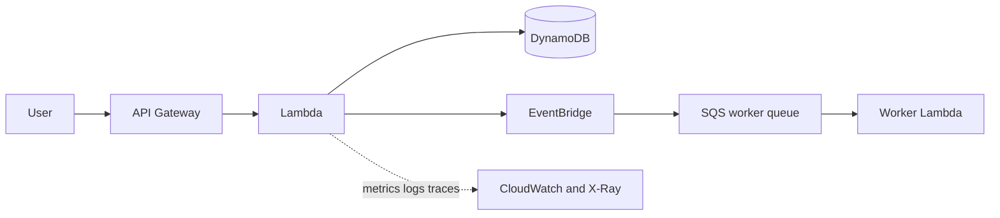
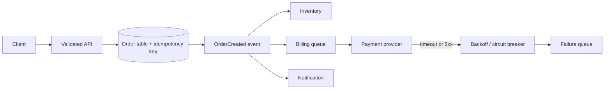
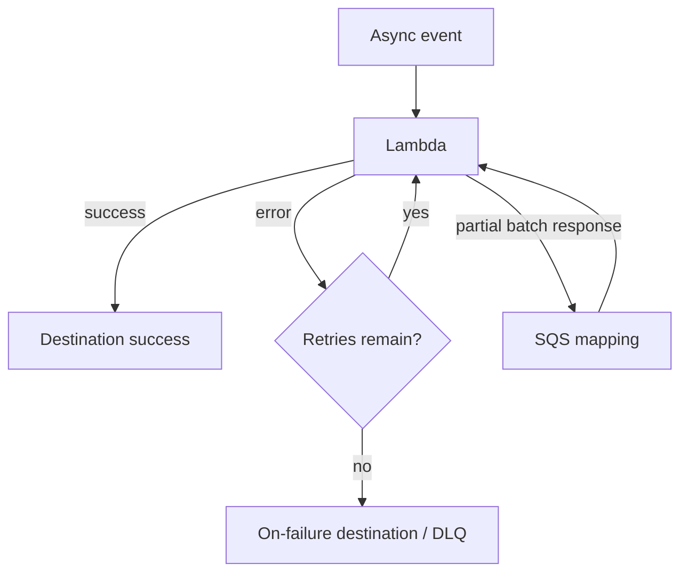
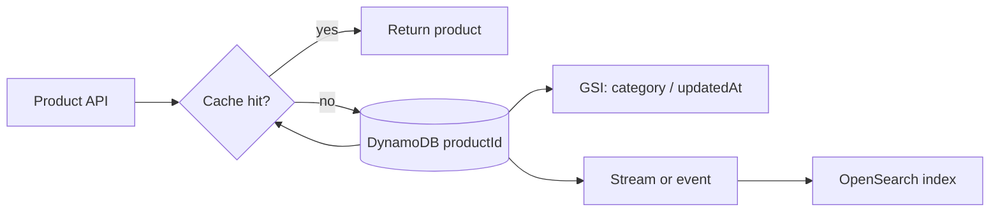
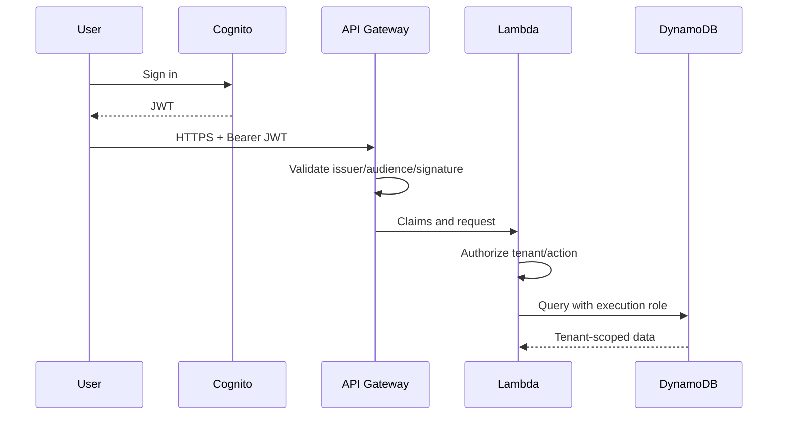
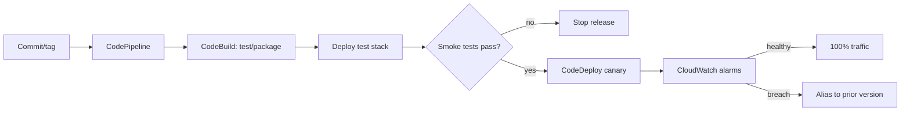
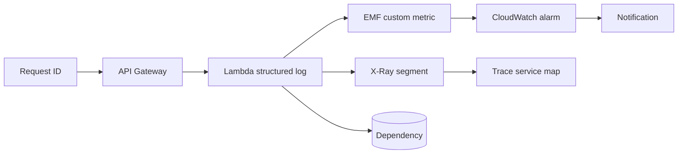
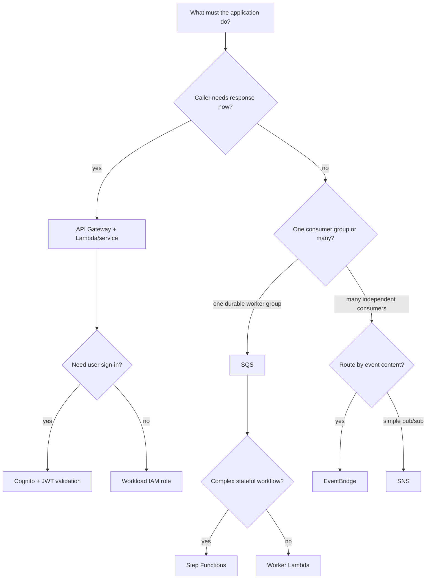

# AWS Certified Developer – Associate (DVA-C02)

This living course follows the **DVA-C02 Exam Guide v2.1**. The exam has **50 scored questions**, **15 unscored questions**, **130 minutes**, and a scaled passing score of **720** on a 100–1,000 scale. Questions are multiple choice or multiple response. An unanswered item is incorrect, so eliminate options that violate a stated constraint and make the best selection.

## How to use this course

A Developer Associate question is usually a miniature production incident or feature request. First identify the boundary: client-to-API, producer-to-worker, application-to-data, workload-to-AWS API, or deployment-to-observability. Then choose the smallest managed capability that protects that boundary. Every task below uses the same loop: requirement, architecture, implementation, failure modes, and distractors.

## Exam map

| Domain | Weight | Core question |
|---|---:|---|
| Development with AWS Services | 32% | How should the application be built, connected, and persisted? |
| Security | 26% | Who may call it, and how are data and credentials protected? |
| Deployment | 24% | How does a known version move safely to production? |
| Troubleshooting and Optimization | 18% | What evidence identifies the cause and smallest useful improvement? |

**Beginner rule:** synchronous means the caller waits; asynchronous means the producer hands work off and can return. Authentication proves identity; authorization decides permission. Logs provide detailed events, metrics show a trend, and traces show the route taken by one request.

## Domain 1: Development with AWS Services (32%)
### Task 1: Develop code for applications hosted on AWS
**Plain-language goal.** Build APIs and service interactions that remain correct when traffic spikes, consumers change, or an external dependency is slow.
A strong answer begins by separating the business requirement from the AWS component. Name the required behavior first—durable handoff, verified identity, repeatable artifact, or evidence for an incident—then choose the managed feature that supplies it. The service name is the last step, not the first.
**End-to-end scenario.** An order endpoint validates a request, records an order, publishes `OrderCreated`, and returns quickly. Inventory, billing, and email process the event independently. A customer must never be charged twice merely because a retry occurred.

#### Decision table
| Requirement cue | Select | Reason |
|---|---|---|
| Caller needs result now | API Gateway + synchronous Lambda/service | HTTP response is part of the contract |
| Durable background work, one worker group | SQS | Buffers bursts and isolates worker failures |
| One business event, content-based routes | EventBridge | Rules route structured events to many targets |
| Simple push notification to many subscribers | SNS | Pub/sub fanout; pair subscriptions with SQS for durability |
| Stateful multi-step business process | Step Functions | Visible orchestration, state, retries, catches |
| Continuous ordered records | Kinesis | Stream processing and consumer checkpoints |
#### Implementation walkthrough
1. Define a request schema and validate it at API Gateway and in code. Return 400 for invalid client input; do not retry a malformed request.
2. Use an idempotency key stored with the business result. On a duplicate request, return the prior outcome instead of repeating the side effect.
3. Persist the accepted order before publishing follow-up work, or use a deliberate transactional/outbox-style design so a successful response does not silently lose the event.
4. Publish a stable event envelope: source, detail-type, timestamp, correlation ID, version, and detail. Consumers must tolerate additive fields.
5. Use SDK clients with the runtime role. Set short timeouts, retry only transient errors with exponential backoff and jitter, and bound attempts.
6. For a third-party payment service, open a circuit after repeated failures; route recoverable work to a queue or failure workflow rather than holding the client request indefinitely.
7. Write unit tests with representative API and event payloads. Assert status code, validation, idempotency, and the outgoing event—not implementation details.
#### What fails in production, and how to respond
- **A worker crashes after receiving a message:** SQS visibility timeout returns the message. Make processing idempotent and send repeatedly failing messages to a DLQ for investigation.
- **The payment API slows down:** A timeout prevents thread or Lambda exhaustion. The circuit breaker and bounded retry prevent a retry storm.
- **A new consumer cannot parse an event:** Version the event contract and make consumers ignore unknown additive fields; do not silently repurpose an existing field.
#### Why tempting alternatives are wrong
- A synchronous chain API → inventory → billing → email makes order acceptance depend on all three services; it violates quick response and failure isolation.
- Using one SQS queue for unrelated independent consumers load-balances messages; it does not give each consumer a copy. Use fanout.
- Retrying every 4xx response repeats bad input. Client errors normally require correction, not backoff.
> **Exam Tip:** Read qualifiers such as *independently*, *least operational overhead*, *private*, *automatic rollback*, and *near real time*. They eliminate otherwise valid services.
> **Trap:** Do not solve a requirement that was not stated. A sophisticated design with extra services is often wrong when a native managed feature answers the exact constraint.
**Keywords:** 1.1.1, 1.1.2, 1.1.3, 1.1.4, 1.1.5, 1.1.6, 1.1.7, 1.1.8, 1.1.9, 1.1.10, 1.1.11, 1.1.12, 1.1.13.
#### Official blueprint coverage, taught in context
The following official skills are preserved. Treat them as capabilities inside the scenario above, rather than a memorization list.
| Official skill | What you must be able to explain or implement |
|---|---|
| **Skill 1.1.1** | Distinguish event-driven, microservices, monolithic, choreography, orchestration, and fanout; choreography lets consumers react, while Step Functions centrally coordinates required steps. |
| **Skill 1.1.2** | Keep compute stateless by placing durable request or session state in a data store so any healthy instance can serve the next request. |
| **Skill 1.1.3** | Explain that queues, events, and stable contracts reduce tight runtime dependency between components. |
| **Skill 1.1.4** | Choose synchronous calls for immediate answers and asynchronous handoff for slow, bursty, or independently retryable work. |
| **Skill 1.1.5** | Implement timeouts, idempotency, bounded retries, error handling, and durable recovery paths. |
| **Skill 1.1.6** | Create and maintain APIs with transformations, validation, and deliberate HTTP status codes. |
| **Skill 1.1.7** | Write and run focused unit tests, including AWS SAM local invocation where appropriate. |
| **Skill 1.1.8** | Write code that uses messaging services for queues, topics, and event routing. |
| **Skill 1.1.9** | Use AWS APIs and SDKs with temporary credentials, pagination, and exception handling. |
| **Skill 1.1.10** | Handle streaming data with ordered records, checkpoints, batch processing, and duplicate-aware consumers. |
| **Skill 1.1.11** | Use Amazon Q Developer to assist development, then review output, test it, and avoid exposing sensitive data. |
| **Skill 1.1.12** | Use EventBridge event buses, rules, targets, schemas, archives, and replay where event routing is required. |
| **Skill 1.1.13** | Implement third-party resilience with retry logic, circuit breakers, fallbacks, and explicit error paths. |
**Checkpoint.** Explain the request path out loud: what starts the work, where durable state lives, which identity acts, how a failure is retried or surfaced, and what signal proves success. If any answer is vague, return to the decision table.
---
### Task 2: Develop code for AWS Lambda
**Plain-language goal.** Configure event-driven functions so their networking, permissions, scaling, and failure behavior match the trigger.
A strong answer begins by separating the business requirement from the AWS component. Name the required behavior first—durable handoff, verified identity, repeatable artifact, or evidence for an incident—then choose the managed feature that supplies it. The service name is the last step, not the first.
**End-to-end scenario.** An image upload to S3 starts a Lambda that validates metadata, writes a DynamoDB record, and emits a notification. A separate SQS consumer resizes images. Both functions must reach a private database, but only one needs public internet egress.

#### Decision table
| Situation | Configuration | Why |
|---|---|---|
| Lambda reaches private RDS | VPC private subnets + security group | Creates network path to private resource |
| VPC Lambda calls public API | NAT path from private subnet | VPC attachment alone has no internet access |
| Async invoke fails | Destination or DLQ | Captures terminal invocation outcome |
| SQS event source fails | Visibility timeout, retries, DLQ, partial batch response | Source mapping controls redelivery |
| Protect downstream database | Reserved concurrency | Caps this function's parallelism |
| Reduce cold-start impact | Provisioned concurrency after measurement | Keeps environments initialized |
#### Implementation walkthrough
1. Start with the event source: API Gateway is synchronous; EventBridge and S3 invoke asynchronously; SQS, Kinesis, and DynamoDB Streams use event source mappings. Their retry ownership differs.
2. Grant the execution role only the S3, DynamoDB, KMS, or log permissions the handler needs. Environment variables configure names and endpoints; they are not a substitute for secret storage.
3. Set timeout slightly above measured normal duration but below the caller or queue visibility design. Increase memory after measuring because Lambda memory also changes CPU allocation.
4. Put SDK clients and database connection initialization outside the handler when reusable. Reuse connections, but still handle a stale connection on the next invocation.
5. For batch sources, make each record independently safe to retry. Report failed item identifiers when partial batch response is supported so successful records are not needlessly repeated.
6. Use test events matching the real trigger shape. A hand-written JSON body is not equivalent to an SQS Records envelope or API Gateway request context.
#### Configuration mechanics
| Knob | Primary effect | Common mistake |
|---|---|---|
| Memory | Memory and CPU allocation | Increasing it without measuring duration/cost |
| Timeout | Maximum invocation time | Making it longer than upstream timeouts |
| Reserved concurrency | Ceiling and isolation | Starving other functions unintentionally |
| Batch size | Throughput per invoke | Making retries replay too much work |
| Visibility timeout | Time before SQS redelivery | Setting it shorter than Lambda runtime |
#### What fails in production, and how to respond
- **Timeout while processing an event:** The invocation may be retried. Make writes idempotent, set a safe timeout, inspect duration, and send terminal failures to the configured destination.
- **Database connection exhaustion:** Limit concurrency, use RDS Proxy when appropriate, reuse connections, and avoid opening one connection per record.
- **Function cannot reach the internet:** Check subnet route tables and NAT. A security group permits traffic but does not create an egress route.
#### Why tempting alternatives are wrong
- Putting a Lambda in a public subnet does not assign it a public IP or magically provide internet egress.
- Raising timeout alone does not fix CPU-bound work; measure and tune memory or redesign the work.
- A DLQ is not a retry policy. It receives exhausted failures; configure source and function behavior first.
> **Exam Tip:** Read qualifiers such as *independently*, *least operational overhead*, *private*, *automatic rollback*, and *near real time*. They eliminate otherwise valid services.
> **Trap:** Do not solve a requirement that was not stated. A sophisticated design with extra services is often wrong when a native managed feature answers the exact constraint.
**Keywords:** 1.2.1, 1.2.2, 1.2.3, 1.2.4, 1.2.5, 1.2.6, 1.2.7.
#### Official blueprint coverage, taught in context
The following official skills are preserved. Treat them as capabilities inside the scenario above, rather than a memorization list.
| Official skill | What you must be able to explain or implement |
|---|---|
| **Skill 1.2.1** | Describe Lambda access to private VPC resources through subnets, security groups, DNS, and routes. |
| **Skill 1.2.2** | Configure environment variables, memory, concurrency, timeout, runtime, handler, layers, extensions, triggers, and destinations. |
| **Skill 1.2.3** | Handle event lifecycle and errors with code, Lambda Destinations, dead-letter queues, and source-specific retry behavior. |
| **Skill 1.2.4** | Write and run Lambda test code using AWS services and tools such as SAM. |
| **Skill 1.2.5** | Integrate Lambda with API Gateway, S3, EventBridge, SQS, DynamoDB Streams, and other AWS services using least privilege. |
| **Skill 1.2.6** | Tune Lambda by measuring duration, errors, throttles, memory use, initialization cost, and downstream limits. |
| **Skill 1.2.7** | Use Lambda for near-real-time transformation, validation, enrichment, and routing of event or stream records. |
**Checkpoint.** Explain the request path out loud: what starts the work, where durable state lives, which identity acts, how a failure is retried or surfaced, and what signal proves success. If any answer is vague, return to the decision table.
---
### Task 3: Use data stores in application development
**Plain-language goal.** Choose a store and data model from the reads and writes the application must perform, then make cost and latency predictable.
A strong answer begins by separating the business requirement from the AWS component. Name the required behavior first—durable handoff, verified identity, repeatable artifact, or evidence for an incident—then choose the managed feature that supplies it. The service name is the last step, not the first.
**End-to-end scenario.** A marketplace needs product lookup by ID, a seller’s products ordered by update time, popular-product reads under low latency, automatic expiration for temporary carts, and full-text product search.

#### Decision table
| Access pattern | Model or service | Explanation |
|---|---|---|
| One item by known key | DynamoDB GetItem | Direct primary-key lookup |
| All seller products newest first | Partition key sellerId, sort key updatedAt; Query | Targeted partition and ordered range |
| Lookup by category | GSI with category key | Alternate access pattern needs alternate index |
| Search words/relevance | OpenSearch Service | Inverted-index search, not transactional source of truth |
| Repeated safe reads | ElastiCache | Low-latency cache with expiry/invalidation |
| Expire temporary data | DynamoDB TTL / S3 lifecycle | Managed lifecycle, not a cron deletion loop |
#### Implementation walkthrough
1. Write the access patterns before declaring a DynamoDB key. A partition key selects a collection; a sort key orders and filters within that collection.
2. Use a high-cardinality partition key such as seller ID or a deliberately distributed key. Avoid a low-cardinality key such as `status` when it concentrates writes.
3. Use Query when you know the partition key. Use Scan only for intentional table-wide work; a filter expression removes returned items after capacity has been consumed.
4. Create a GSI when the application must query a different partition key. A GSI has its own keys and can be eventually consistent; project only attributes the index needs.
5. Serialize application objects deliberately: preserve numeric/string types, validate input, use a schema version for evolving objects, and tolerate missing old fields.
6. Use cache-aside for safe repeated reads: read cache, load miss from authoritative store, populate cache, and invalidate or expire after a write.
#### Configuration mechanics
| Operation | Needs partition key? | Reads broad data? | Typical use |
|---|---:|---:|---|
| GetItem | Yes | No | Exact primary key |
| Query | Yes | No | One key collection/range |
| Scan | No | Yes | Administrative or exceptional bulk work |
| GSI Query | GSI partition key | No | Alternate lookup |
| Filter expression | Depends | It can | Refine result, not avoid reads |
#### What fails in production, and how to respond
- **Hot partition throttles:** Redistribute key design, add write sharding when genuinely required, and use SDK backoff. Increasing total capacity does not cure one hot key.
- **Customer sees stale value:** Choose strongly consistent DynamoDB reads only where the immediate latest value is required; otherwise eventual reads and cache expiry may be acceptable.
- **Expired cart still appears briefly:** TTL is asynchronous cleanup. The application should treat an item past its expiry timestamp as absent if immediate behavior matters.
#### Why tempting alternatives are wrong
- A Scan plus filter is not a substitute for a Query or GSI; it still reads broadly.
- OpenSearch is not normally the source of truth for transactions; synchronize it from a durable system of record.
- Caching every response without a safe key or invalidation plan can return another user’s data.
> **Exam Tip:** Read qualifiers such as *independently*, *least operational overhead*, *private*, *automatic rollback*, and *near real time*. They eliminate otherwise valid services.
> **Trap:** Do not solve a requirement that was not stated. A sophisticated design with extra services is often wrong when a native managed feature answers the exact constraint.
**Keywords:** 1.3.1, 1.3.2, 1.3.3, 1.3.4, 1.3.5, 1.3.6, 1.3.7, 1.3.8, 1.3.9.
#### Official blueprint coverage, taught in context
The following official skills are preserved. Treat them as capabilities inside the scenario above, rather than a memorization list.
| Official skill | What you must be able to explain or implement |
|---|---|
| **Skill 1.3.1** | Describe high-cardinality partition keys and balanced partition access. |
| **Skill 1.3.2** | Describe strongly consistent and eventually consistent database reads and their trade-offs. |
| **Skill 1.3.3** | Describe Query versus Scan operations and their capacity implications. |
| **Skill 1.3.4** | Define DynamoDB primary keys, sort keys, and secondary indexes from access patterns. |
| **Skill 1.3.5** | Serialize and deserialize persistence data safely across application and schema changes. |
| **Skill 1.3.6** | Use, manage, and maintain appropriate data stores with SDK operations, permissions, capacity, backups, and error handling. |
| **Skill 1.3.7** | Manage data lifecycle with DynamoDB TTL, S3 lifecycle rules, and retention requirements. |
| **Skill 1.3.8** | Use data caching services with safe keys, expiration, and invalidation. |
| **Skill 1.3.9** | Choose specialized stores such as OpenSearch Service based on search access patterns. |
**Checkpoint.** Explain the request path out loud: what starts the work, where durable state lives, which identity acts, how a failure is retried or surfaced, and what signal proves success. If any answer is vague, return to the decision table.
---
## Domain 2: Security (26%)
### Task 1: Implement authentication and/or authorization for applications and AWS services
**Plain-language goal.** Prove identity, authorize the requested action, and use temporary AWS credentials instead of long-lived keys.
A strong answer begins by separating the business requirement from the AWS component. Name the required behavior first—durable handoff, verified identity, repeatable artifact, or evidence for an incident—then choose the managed feature that supplies it. The service name is the last step, not the first.
**End-to-end scenario.** A customer signs in to a shopping application through Cognito. The browser sends a JWT to API Gateway. The API must only return records for the customer’s tenant. The Lambda uses its execution role to read DynamoDB, and a reporting service in another account assumes a narrowly scoped role.

#### Decision table
| Need | Correct control | Why |
|---|---|---|
| Application-user sign-in | Cognito user pool / federation | Issues user identity tokens |
| API caller proof | Validate JWT or API authorizer | Token must be valid before handler trusts claims |
| Workload calls AWS | IAM execution role | Temporary credentials supplied automatically |
| Cross-account workload access | STS AssumeRole + trust policy | Temporary delegated credentials |
| Tenant record isolation | Claim-aware application authorization and data condition | Authentication alone is not permission to all records |
| Service-to-service call | Service role / signed AWS request | Avoid passing user secrets between services |
#### Implementation walkthrough
1. Separate authentication from authorization. Authentication establishes a principal; authorization checks action, resource, tenant, ownership, and context.
2. Validate bearer token signature, issuer, audience, expiry, and relevant claims at a trusted boundary. Use HTTPS because anyone holding an unprotected bearer token can present it.
3. Use the SDK default credential provider chain in AWS. Lambda and EC2 should receive temporary role credentials; do not embed access key pairs.
4. For AssumeRole, configure both sides: the target role trust policy allows the caller, and the caller has permission to call `sts:AssumeRole`.
5. Tie DynamoDB keys or query conditions to a verified tenant claim. Never accept a tenant identifier from an untrusted request body without comparing it to the authenticated context.
6. Use least privilege with action, resource, and condition. Test denied cases as carefully as allowed cases.
#### Configuration mechanics
| Identity | Used by | Credential lifetime model | Do not confuse with |
|---|---|---|---|
| Cognito user token | Application user | Expiring JWT | AWS workload role |
| Lambda execution role | Lambda code | Temporary AWS credentials | End-user identity |
| STS assumed role | Delegated/cross-account caller | Temporary AWS credentials | IAM user access key |
| Resource policy | Resource-side trust | Grants/limits principal | Application tenant check |
#### What fails in production, and how to respond
- **Valid user reads another tenant:** The token only proves identity. Enforce tenant ownership in authorization and the data access pattern.
- **Cross-account AssumeRole is denied:** Inspect target trust policy and caller identity policy; both must permit the relationship.
- **Leaked access key in source:** Revoke or rotate it, remove it from history where required, and migrate workload code to a role.
#### Why tempting alternatives are wrong
- An IAM user for every mobile app user is an operational and security anti-pattern; use application identity/federation.
- A valid JWT does not automatically grant DynamoDB access or tenant-level authorization.
- Putting AWS keys in a browser, Lambda code, or repository creates long-lived credentials outside AWS rotation controls.
> **Exam Tip:** Read qualifiers such as *independently*, *least operational overhead*, *private*, *automatic rollback*, and *near real time*. They eliminate otherwise valid services.
> **Trap:** Do not solve a requirement that was not stated. A sophisticated design with extra services is often wrong when a native managed feature answers the exact constraint.
**Keywords:** 2.1.1, 2.1.2, 2.1.3, 2.1.4, 2.1.5, 2.1.6, 2.1.7, 2.1.8.
#### Official blueprint coverage, taught in context
The following official skills are preserved. Treat them as capabilities inside the scenario above, rather than a memorization list.
| Official skill | What you must be able to explain or implement |
|---|---|
| **Skill 2.1.1** | Use identity providers such as Amazon Cognito and IAM federation for federated access. |
| **Skill 2.1.2** | Secure applications with bearer-token validation and protected transport. |
| **Skill 2.1.3** | Configure programmatic AWS access with credential providers and temporary credentials. |
| **Skill 2.1.4** | Make authenticated AWS service calls with valid signed requests and scoped permissions. |
| **Skill 2.1.5** | Assume IAM roles through STS using a matching trust policy and caller permission. |
| **Skill 2.1.6** | Define least-privilege permissions for IAM principals with identity and resource policies. |
| **Skill 2.1.7** | Implement fine-grained application authorization using claims, ownership, tenant context, and resource checks. |
| **Skill 2.1.8** | Handle cross-service authentication in microservices through service identities and signed AWS calls. |
**Checkpoint.** Explain the request path out loud: what starts the work, where durable state lives, which identity acts, how a failure is retried or surfaced, and what signal proves success. If any answer is vague, return to the decision table.
---
### Task 2: Implement encryption by using AWS services
**Plain-language goal.** Protect data in transit and at rest, then ensure the right principal can use the key or certificate without exposing key material.
A strong answer begins by separating the business requirement from the AWS component. Name the required behavior first—durable handoff, verified identity, repeatable artifact, or evidence for an incident—then choose the managed feature that supplies it. The service name is the last step, not the first.
**End-to-end scenario.** A document API accepts HTTPS uploads, stores objects with SSE-KMS, and lets a compliance role in another AWS account decrypt approved files. Internal services use private certificates for mutual trust.
#### Decision table
| Requirement | Choose | Why |
|---|---|---|
| Protect network traffic | TLS/HTTPS | Encrypts data while moving |
| Encrypt object after AWS receives it | Server-side encryption, often SSE-KMS | Service performs encryption and integrates with KMS |
| Encrypt before cloud receives plaintext | Client-side encryption | Application controls plaintext boundary |
| Private internal PKI | AWS Private CA | Issues and manages private certificates |
| Cross-account KMS use | Key policy plus caller IAM permission | KMS authorization needs both sides considered |
| Planned KMS key lifecycle | Rotation configuration | New key material/managed rotation behavior, not application rewrite |
#### Implementation walkthrough
1. Use TLS for every client and service endpoint that carries sensitive data. Encryption at rest does not encrypt traffic; TLS does not encrypt stored copies.
2. Choose server-side encryption when AWS can handle plaintext within the service boundary and you need managed integration. Choose client-side encryption when plaintext must never reach the service unencrypted.
3. For SSE-KMS, give the application role access to the S3 object and required KMS action. KMS permissions and S3 permissions solve different gates.
4. A key policy controls key access. Cross-account designs must explicitly permit the external principal or account path and the caller also needs a suitable IAM policy.
5. Use ACM for appropriate public certificate management and AWS Private CA concepts for private certificates. Store private keys safely and never commit SSH keys.
6. Understand rotation as a key management control. Rotating material does not retroactively turn an unauthorized principal into an authorized one.
#### What fails in production, and how to respond
- **S3 read works but decrypt is denied:** The caller may have S3 permission without KMS permission; inspect IAM policy and KMS key policy.
- **HTTPS client rejects certificate:** Check certificate trust chain, hostname, validity, and whether public versus private trust is appropriate.
- **Sensitive data crosses a service in plaintext:** Add TLS; at-rest encryption only protects media after persistence.
#### Why tempting alternatives are wrong
- SSE-S3, SSE-KMS, and client-side encryption are not interchangeable when the question requires control of KMS keys or no plaintext at the service boundary.
- A KMS key policy alone does not grant S3 object access.
- A certificate is not an encryption-at-rest mechanism, and an SSH key is not a TLS certificate.
> **Exam Tip:** Read qualifiers such as *independently*, *least operational overhead*, *private*, *automatic rollback*, and *near real time*. They eliminate otherwise valid services.
> **Trap:** Do not solve a requirement that was not stated. A sophisticated design with extra services is often wrong when a native managed feature answers the exact constraint.
**Keywords:** 2.2.1, 2.2.2, 2.2.3, 2.2.4, 2.2.5, 2.2.6, 2.2.7.
#### Official blueprint coverage, taught in context
The following official skills are preserved. Treat them as capabilities inside the scenario above, rather than a memorization list.
| Official skill | What you must be able to explain or implement |
|---|---|
| **Skill 2.2.1** | Define encryption at rest and in transit as separate protections. |
| **Skill 2.2.2** | Describe certificate issuance, trust, renewal, and private certificate management including AWS Private CA. |
| **Skill 2.2.3** | Compare client-side encryption with server-side encryption. |
| **Skill 2.2.4** | Use encryption keys to encrypt or decrypt data through AWS KMS APIs and permissions. |
| **Skill 2.2.5** | Generate and manage certificates and SSH keys securely for development. |
| **Skill 2.2.6** | Use encryption across account boundaries with KMS key policy and IAM permission design. |
| **Skill 2.2.7** | Enable and disable key rotation according to the key and compliance requirement. |
**Checkpoint.** Explain the request path out loud: what starts the work, where durable state lives, which identity acts, how a failure is retried or surfaced, and what signal proves success. If any answer is vague, return to the decision table.
---
### Task 3: Manage sensitive data in application code
**Plain-language goal.** Classify sensitive values, retrieve secrets at runtime, prevent disclosure, and enforce tenant boundaries in the backend.
A strong answer begins by separating the business requirement from the AWS component. Name the required behavior first—durable handoff, verified identity, repeatable artifact, or evidence for an incident—then choose the managed feature that supplies it. The service name is the last step, not the first.
**End-to-end scenario.** A healthcare scheduling service stores database credentials in Secrets Manager, logs request IDs but not patient notes, shows only the last four digits of an insurance identifier, and requires every query to use the tenant from a verified user claim.
#### Decision table
| Data/control | Correct action | Why |
|---|---|---|
| Database password/API token | Secrets Manager | Central retrieval and rotation workflows |
| Sensitive configuration | Encrypted environment variable with restricted access | Configuration is not source code, but still needs protection |
| PII/PHI in logs | Sanitize or omit | Logs spread to operators and tools |
| User-facing confirmation | Mask value | Reveal minimum useful portion |
| Multi-tenant record | Bind query to verified tenant claim | Prevent horizontal access |
| Nonsecret config | Parameter/AppConfig where suitable | Do not use a secret store for every ordinary setting |
#### Implementation walkthrough
1. Classify fields before coding: PII identifies a person; PHI is health-related protected information. Classification changes access, logging, encryption, retention, and response design.
2. Retrieve secrets at runtime through a permitted role. Cache safely only as long as rotation and outage requirements allow; never print the fetched object on errors.
3. Treat environment variables as configuration. Encrypt sensitive values with KMS and restrict who can view function configuration or decrypt the key.
4. Create a logging allowlist: request ID, route, safe outcome, duration, and error class. Redact tokens, passwords, full identifiers, and payload fields not needed for diagnosis.
5. Mask for display, sanitize for output/logging, and authorize for access. These are three distinct controls.
6. Make the tenant context server-derived from a validated identity and include it in the partition key, condition, or query constraint.
#### What fails in production, and how to respond
- **Secret appears in a stack trace:** Remove it from error serialization, rotate it, and review logs/observability pipelines for disclosure.
- **Tenant ID is supplied in JSON body:** Treat it as untrusted; compare or replace it with token-derived tenant context.
- **Rotated database secret breaks clients:** Use a retrieval/refresh strategy and managed rotation-compatible connection handling rather than hard-coding a cached password forever.
#### Why tempting alternatives are wrong
- Base64 encoding is not encryption.
- Masking a response does not stop an unauthorized backend read.
- A secret in source control is not made safe by adding an environment variable with the same value.
> **Exam Tip:** Read qualifiers such as *independently*, *least operational overhead*, *private*, *automatic rollback*, and *near real time*. They eliminate otherwise valid services.
> **Trap:** Do not solve a requirement that was not stated. A sophisticated design with extra services is often wrong when a native managed feature answers the exact constraint.
**Keywords:** 2.3.1, 2.3.2, 2.3.3, 2.3.4, 2.3.5, 2.3.6.
#### Official blueprint coverage, taught in context
The following official skills are preserved. Treat them as capabilities inside the scenario above, rather than a memorization list.
| Official skill | What you must be able to explain or implement |
|---|---|
| **Skill 2.3.1** | Describe classification including PII and PHI. |
| **Skill 2.3.2** | Encrypt environment variables containing sensitive data and restrict their access. |
| **Skill 2.3.3** | Use secret management services to secure sensitive data. |
| **Skill 2.3.4** | Sanitize sensitive data before logs, errors, analytics, or external calls. |
| **Skill 2.3.5** | Implement application-level masking and sanitization for least disclosure. |
| **Skill 2.3.6** | Implement multi-tenant access patterns that bind authorization and data access to verified tenant context. |
**Checkpoint.** Explain the request path out loud: what starts the work, where durable state lives, which identity acts, how a failure is retried or surfaced, and what signal proves success. If any answer is vague, return to the decision table.
---
## Domain 3: Deployment (24%)
### Task 1: Prepare application artifacts to be deployed to AWS
**Plain-language goal.** Produce an immutable, repeatable artifact containing only required code and dependencies, while keeping environment values outside it.
A strong answer begins by separating the business requirement from the AWS component. Name the required behavior first—durable handoff, verified identity, repeatable artifact, or evidence for an incident—then choose the managed feature that supplies it. The service name is the last step, not the first.
**End-to-end scenario.** A Python API is packaged for Lambda. The same source moves through test and production, while URLs and feature flags differ. A native image dependency may require a container-image package in ECR.
#### Decision table
| Need | Packaging choice | Reason |
|---|---|---|
| Small handler + dependencies | ZIP archive | Simple Lambda artifact |
| Shared dependency used by functions | Layer | Reuse compatible dependency bundle |
| Native/large dependency or container workflow | Container image in ECR | Container packaging model |
| Runtime feature flag | AppConfig | Controlled dynamic configuration |
| Environment endpoint/name | Parameter/environment configuration | Keep artifact portable |
| Reproducible infrastructure | SAM/CloudFormation template | Versioned desired state |
#### Implementation walkthrough
1. Keep source, tests, templates, and build output distinct. The handler path in the package must match the runtime configuration.
2. Pin dependency versions and build in an environment compatible with the Lambda runtime architecture. Do not assume a developer laptop binary will run in Lambda.
3. Tag artifacts immutably or with a traceable commit identifier. “latest” makes an integration test impossible to reproduce.
4. Declare memory, timeout, architecture, and required permissions in IaC rather than clicking a different configuration in each environment.
5. Keep secrets out of the artifact. Supply environment-specific endpoints and feature settings through approved configuration mechanisms.
6. Push container images to ECR and deploy the exact approved digest/tag; scan and test before promotion.
#### Configuration mechanics
| Artifact | What is versioned | What stays external |
|---|---|---|
| Lambda ZIP | Handler and dependencies | Environment names, secrets, flags |
| Layer | Shared dependency bundle | Function-specific config |
| ECR image | Image digest/tag | Runtime variables and role |
| SAM/CloudFormation | Desired infrastructure | Parameter values/secrets references |
#### What fails in production, and how to respond
- **Handler not found after deploy:** Inspect package directory and handler declaration; source layout differs from runtime import path.
- **Native library fails only in Lambda:** Build against a compatible Linux/runtime architecture or choose an appropriate container image workflow.
- **Production URL baked into code:** The same artifact cannot safely move through environments; externalize nonsecret configuration.
#### Why tempting alternatives are wrong
- A layer is not always a speed optimization; it adds version and compatibility management.
- Using an untagged/latest container image defeats approved-version testing.
- Putting a production secret in `template.yaml` or a repository is not environment management.
> **Exam Tip:** Read qualifiers such as *independently*, *least operational overhead*, *private*, *automatic rollback*, and *near real time*. They eliminate otherwise valid services.
> **Trap:** Do not solve a requirement that was not stated. A sophisticated design with extra services is often wrong when a native managed feature answers the exact constraint.
**Keywords:** 3.1.1, 3.1.2, 3.1.3, 3.1.4, 3.1.5.
#### Official blueprint coverage, taught in context
The following official skills are preserved. Treat them as capabilities inside the scenario above, rather than a memorization list.
| Official skill | What you must be able to explain or implement |
|---|---|
| **Skill 3.1.1** | Manage code-module dependencies, environment references, configuration files, and container images inside the package boundary. |
| **Skill 3.1.2** | Organize deployment files and directories so tools find handlers, templates, tests, and artifacts predictably. |
| **Skill 3.1.3** | Use code repositories as versioned deployment inputs. |
| **Skill 3.1.4** | Apply measured application resource requirements such as memory and cores. |
| **Skill 3.1.5** | Prepare environment-specific configuration, including AWS AppConfig where runtime rollout control is needed. |
**Checkpoint.** Explain the request path out loud: what starts the work, where durable state lives, which identity acts, how a failure is retried or surfaced, and what signal proves success. If any answer is vague, return to the decision table.
---
### Task 2: Test applications in development environments
**Plain-language goal.** Test deployed integration boundaries in a safe environment, not only pure functions on a laptop.
A strong answer begins by separating the business requirement from the AWS component. Name the required behavior first—durable handoff, verified identity, repeatable artifact, or evidence for an incident—then choose the managed feature that supplies it. The service name is the last step, not the first.
**End-to-end scenario.** A staging API Gateway invokes a deployed Lambda, which calls a mocked payment endpoint, writes a test DynamoDB table, and publishes an EventBridge event captured by a test consumer.
#### Decision table
| Test level | Answers | AWS-oriented example |
|---|---|---|
| Unit | Does one code unit behave? | Handler validation with fake SDK client |
| Integration | Do components connect correctly? | Deployed Lambda + test table + IAM role |
| Contract/event | Is payload shape accepted? | EventBridge detail schema and consumer test |
| End-to-end | Does user flow succeed? | Staging API request through persistence |
| Mock | Can external dependency be deterministic? | Payment API error/timeout simulation |
#### Implementation walkthrough
1. Create a distinct development or staging endpoint/stage, account, or stack. Test code must not share production data or credentials.
2. Deploy the same IaC shape to staging with environment parameters. This catches IAM, mappings, event sources, and networking that unit tests cannot prove.
3. Mock nondeterministic or paid third-party APIs at their boundary. Test both their expected success shape and realistic timeout/error shapes.
4. For events, assert the producer envelope, routing rule, target permission, consumer processing, retry behavior, and failure destination.
5. Use test data with known assertions and cleanup/TTL. Make test output identify environment and version.
6. Promote only an artifact already tested; rebuilding during promotion changes the thing being approved.
#### What fails in production, and how to respond
- **Unit tests pass but API returns 502:** Inspect API Gateway integration/mapping, Lambda permission, deployed handler, and logs; unit tests did not exercise wiring.
- **Staging invokes production payment provider:** Use environment-specific endpoint configuration and network controls; test isolation is a design requirement.
- **Event reaches no consumer:** Check event pattern, bus, target permission, and dead-letter configuration—not just producer success.
#### Why tempting alternatives are wrong
- A local handler test cannot prove IAM permission or API Gateway mapping.
- Testing directly in production is not a substitute for a staging environment.
- Mocking every AWS service can hide deployment mistakes; deploy selected real integration paths.
> **Exam Tip:** Read qualifiers such as *independently*, *least operational overhead*, *private*, *automatic rollback*, and *near real time*. They eliminate otherwise valid services.
> **Trap:** Do not solve a requirement that was not stated. A sophisticated design with extra services is often wrong when a native managed feature answers the exact constraint.
**Keywords:** 3.2.1, 3.2.2, 3.2.3, 3.2.4, 3.2.5.
#### Official blueprint coverage, taught in context
The following official skills are preserved. Treat them as capabilities inside the scenario above, rather than a memorization list.
| Official skill | What you must be able to explain or implement |
|---|---|
| **Skill 3.2.1** | Test deployed code with AWS services and tools. |
| **Skill 3.2.2** | Write integration tests and mock APIs for external dependencies. |
| **Skill 3.2.3** | Test applications with development endpoints such as API Gateway stages. |
| **Skill 3.2.4** | Deploy application stack updates to existing staging/test environments using SAM or CloudFormation. |
| **Skill 3.2.5** | Test event-driven applications through payload, routing, permissions, retries, and consumers. |
**Checkpoint.** Explain the request path out loud: what starts the work, where durable state lives, which identity acts, how a failure is retried or surfaced, and what signal proves success. If any answer is vague, return to the decision table.
---
### Task 3: Automate deployment testing
**Plain-language goal.** Make test events, environments, infrastructure, and approved versions reproducible so a pipeline proves the same release each time.
A strong answer begins by separating the business requirement from the AWS component. Name the required behavior first—durable handoff, verified identity, repeatable artifact, or evidence for an incident—then choose the managed feature that supplies it. The service name is the last step, not the first.
**End-to-end scenario.** A pipeline builds one commit, deploys a SAM stack to test, invokes saved API and SQS payloads, verifies an alias targets the approved Lambda version, and promotes the same artifact only after assertions pass.
#### Decision table
| Requirement | Mechanism | Why |
|---|---|---|
| Repeat input | Saved JSON event fixtures | Exercises success and failure paths consistently |
| Repeat infrastructure | SAM/CloudFormation | Desired state is reviewed and reproducible |
| Known function release | Lambda version + alias | Stable integration target, movable traffic |
| Known container release | Immutable image tag/digest | Avoids `latest` drift |
| Separate API behavior | API Gateway stage/environment | Isolated endpoint/configuration |
| Assisted test writing | Amazon Q Developer + review | Generate ideas, then validate assertions |
#### Implementation walkthrough
1. Keep representative test events in source control. Include invalid input, duplicate delivery, timeout, and authorization-denied cases—not only happy paths.
2. Build once and attach an immutable identity to the artifact. A pipeline should deploy that same identity through environments.
3. Use IaC change sets/review where appropriate, then update the existing test stack rather than manually recreating resources.
4. Point integration clients to aliases, immutable image references, or approved branches. An alias permits a stable name while the version changes under controlled deployment.
5. Run post-deploy smoke tests against the actual test endpoint and query expected state. Fail the pipeline on an assertion, not merely on deployment completion.
6. Use Amazon Q Developer-generated tests as draft material; inspect fixtures, security assumptions, and expected results before accepting them.
#### Configuration mechanics
| SAM/CloudFormation concern | Testable evidence |
|---|---|
| Parameters/environment | Test endpoint returns expected environment marker, not secret |
| IAM role | Allowed call succeeds and denied call remains denied |
| Event source | Saved event reaches handler and expected state changes |
| Lambda alias | Deployment output shows approved version |
| API stage | Test uses intended stage URL/custom domain mapping |
#### What fails in production, and how to respond
- **Test passes against a different image:** Record and assert deployed image digest/version in test output.
- **IaC deploy succeeds but feature is broken:** Run API/event smoke assertions after deploy; stack success only means resources reached desired state.
- **Manual change causes drift:** Bring the change back into IaC and use drift detection/change review rather than treating console state as canonical.
#### Why tempting alternatives are wrong
- A Lambda alias without a published version does not create a reproducible release.
- A pipeline that rebuilds from a floating dependency can test a different artifact than it promotes.
- Infrastructure as code alone is not test automation; it needs invocation and assertions.
> **Exam Tip:** Read qualifiers such as *independently*, *least operational overhead*, *private*, *automatic rollback*, and *near real time*. They eliminate otherwise valid services.
> **Trap:** Do not solve a requirement that was not stated. A sophisticated design with extra services is often wrong when a native managed feature answers the exact constraint.
**Keywords:** 3.3.1, 3.3.2, 3.3.3, 3.3.4, 3.3.5, 3.3.6.
#### Official blueprint coverage, taught in context
The following official skills are preserved. Treat them as capabilities inside the scenario above, rather than a memorization list.
| Official skill | What you must be able to explain or implement |
|---|---|
| **Skill 3.3.1** | Create application test events including JSON for Lambda, API Gateway, and SAM resources. |
| **Skill 3.3.2** | Deploy API resources to various environments. |
| **Skill 3.3.3** | Create integration environments using approved versions such as Lambda aliases, image tags, Amplify branches, or Copilot environments. |
| **Skill 3.3.4** | Implement and deploy IaC templates with AWS SAM or CloudFormation. |
| **Skill 3.3.5** | Manage service-specific development, test, and production environments. |
| **Skill 3.3.6** | Use Amazon Q Developer to generate automated tests, then review and validate them. |
**Checkpoint.** Explain the request path out loud: what starts the work, where durable state lives, which identity acts, how a failure is retried or surfaced, and what signal proves success. If any answer is vague, return to the decision table.
---
### Task 4: Deploy code by using AWS CI/CD services
**Plain-language goal.** Promote a known release through source, build, test, deployment, health verification, and rollback with the existing workflow.
A strong answer begins by separating the business requirement from the AWS component. Name the required behavior first—durable handoff, verified identity, repeatable artifact, or evidence for an incident—then choose the managed feature that supplies it. The service name is the last step, not the first.
**End-to-end scenario.** A commit to the approved branch triggers CodePipeline. CodeBuild tests and packages a SAM application. CodeDeploy shifts 10% of a Lambda alias’s traffic, CloudWatch alarms watch errors and latency, and the prior version resumes traffic automatically if an alarm breaches.

#### Decision table
| Service/cue | Responsibility | Exam selection rule |
|---|---|---|
| CodePipeline | Orchestrates stages | Use for source → build → test → deploy flow |
| CodeBuild | Builds and tests | Use for managed build commands/buildspec |
| CodeDeploy | Controlled deployment | Use for Lambda/ECS/EC2 deployment strategies |
| Canary | Small traffic first | Reduce blast radius with alarm rollback |
| Linear | Incremental traffic shifts | Gradual exposure over intervals |
| Blue/green | Replacement environment | Fast switch/rollback with extra capacity |
| Rolling | Batches on existing fleet | Update incrementally where appropriate |
#### Implementation walkthrough
1. Use a repository commit, tag, label, or branch as the auditable source trigger. The pipeline should receive the intended release, not a developer’s local directory.
2. CodeBuild runs tests and produces the deployable artifact. Store build specification and dependencies with the source so builds are repeatable.
3. Update the existing SAM/CloudFormation template rather than creating a parallel manual infrastructure path. Use environment-specific parameters/configuration.
4. For Lambda, publish a version, point an alias at it, and let deployment configuration shift alias traffic. Attach alarms that represent user harm, such as errors or latency.
5. Define rollback before release: known prior version, alarm criteria, and existing strategy. Verify rollback through post-deployment health signals.
6. Use API Gateway stages/custom domains and runtime configuration to retain stable client-facing addresses while environments differ.
#### Configuration mechanics
| Strategy | Initial exposure | Rollback shape | Best cue |
|---|---|---|---|
| Canary | Small percentage | Shift alias/traffic back | Minimize blast radius |
| Linear | Increasing percentages | Stop and return traffic | Gradual confidence |
| Blue/green | New environment | Switch back environment | Near-instant switch, spare capacity |
| Rolling | Batch of existing fleet | Replace/restore batches | Incremental fleet update |
#### What fails in production, and how to respond
- **Canary alarm breaches:** CodeDeploy stops/rolls back alias traffic to known good version; investigate with version-tagged logs and traces.
- **Build succeeds but wrong branch releases:** Restrict source trigger/branch rules and use immutable release labels.
- **Blue/green has no spare capacity:** It cannot meet a replacement-environment requirement without capacity; use canary/linear if the requirement favors traffic shifting instead.
#### Why tempting alternatives are wrong
- CodePipeline is orchestration, not the service that executes compilation; CodeBuild does builds/tests.
- Deploying all traffic at once is wrong when the prompt requires limited initial exposure and automatic rollback.
- Changing production configuration by hand is not a reliable rollback or CI/CD strategy.
> **Exam Tip:** Read qualifiers such as *independently*, *least operational overhead*, *private*, *automatic rollback*, and *near real time*. They eliminate otherwise valid services.
> **Trap:** Do not solve a requirement that was not stated. A sophisticated design with extra services is often wrong when a native managed feature answers the exact constraint.
**Keywords:** 3.4.1, 3.4.2, 3.4.3, 3.4.4, 3.4.5, 3.4.6, 3.4.7, 3.4.8, 3.4.9, 3.4.10, 3.4.11.
#### Official blueprint coverage, taught in context
The following official skills are preserved. Treat them as capabilities inside the scenario above, rather than a memorization list.
| Official skill | What you must be able to explain or implement |
|---|---|
| **Skill 3.4.1** | Describe Lambda ZIP archives, layers, and container-image deployment packages. |
| **Skill 3.4.2** | Describe API Gateway stages and custom domains. |
| **Skill 3.4.3** | Update existing SAM and CloudFormation templates. |
| **Skill 3.4.4** | Manage application environments using AWS services. |
| **Skill 3.4.5** | Deploy application versions with strategies that match risk and availability requirements. |
| **Skill 3.4.6** | Commit code to repositories to invoke existing build, test, and deployment actions. |
| **Skill 3.4.7** | Use orchestrated workflows to deploy code through environments. |
| **Skill 3.4.8** | Perform rollbacks through existing deployment strategies and known-good versions. |
| **Skill 3.4.9** | Use labels and branches for version and release management. |
| **Skill 3.4.10** | Use runtime configuration for dynamic deployments, such as API Gateway stage variables consumed by Lambda. |
| **Skill 3.4.11** | Configure blue/green, canary, and rolling strategies for releases. |
**Checkpoint.** Explain the request path out loud: what starts the work, where durable state lives, which identity acts, how a failure is retried or surfaced, and what signal proves success. If any answer is vague, return to the decision table.
---
## Domain 4: Troubleshooting and Optimization (18%)
### Task 1: Assist in a root cause analysis
**Plain-language goal.** Use time-correlated evidence to identify the failing condition, then prove a targeted fix rather than guessing from a single alarm.
A strong answer begins by separating the business requirement from the AWS component. Name the required behavior first—durable handoff, verified identity, repeatable artifact, or evidence for an incident—then choose the managed feature that supplies it. The service name is the last step, not the first.
**End-to-end scenario.** Checkout latency rises after a release. A dashboard shows Lambda duration rose at the same time. X-Ray traces identify an external-payment segment, and structured logs for the same trace IDs show repeated connection timeouts.
#### Decision table
| Signal | Best question answered | Tool/example |
|---|---|---|
| Metric | When, how much, how widespread? | CloudWatch duration/error/throttle graph |
| Log | What happened in one execution? | CloudWatch Logs Insights query |
| Trace | Which hop was slow or failed? | X-Ray service map/segments |
| Deployment event | Which resource/change failed? | CloudFormation/SAM/service output |
| Dashboard | What changed across components? | Correlated health view |
| EMF metric | What business signal changed? | CheckoutFailures by safe dimension |
#### Implementation walkthrough
1. Start with the symptom, affected scope, and time window. Compare a baseline to the degraded interval and annotate deployment/version changes.
2. Use metrics to identify the component and whether errors, duration, throttles, or dependency latency moved first. Metrics establish correlation, not proof.
3. Query structured logs by request ID, trace ID, route, version, and error class. Avoid searching a huge log group with unstructured text alone.
4. Use traces to find the slow segment and inspect annotations/metadata that are safe to record. Follow the request across API, Lambda, queue, and downstream calls.
5. For deployment failures, read stack events/service output from the first failed resource; later failures can be consequences.
6. Form a hypothesis, reproduce or compare evidence, apply one narrow change, and verify metrics return toward baseline.
#### What fails in production, and how to respond
- **Error graph spikes but no root cause:** Correlate logs/traces and release history; the graph only says the symptom exists.
- **CloudFormation update rolls back:** Find the earliest failed resource event, then inspect IAM, quota, template property, or dependency output.
- **Integration returns 403 or timeout:** Check identity/permissions separately from endpoint, DNS/network path, event shape, and timeout settings.
#### Why tempting alternatives are wrong
- Changing Lambda memory before locating the slow trace segment may hide the symptom and spend more without fixing a downstream timeout.
- Searching logs without a bounded time range or correlation field is slow and produces false leads.
- Treating the latest visible stack error as root cause ignores cascade failures.
> **Exam Tip:** Read qualifiers such as *independently*, *least operational overhead*, *private*, *automatic rollback*, and *near real time*. They eliminate otherwise valid services.
> **Trap:** Do not solve a requirement that was not stated. A sophisticated design with extra services is often wrong when a native managed feature answers the exact constraint.
**Keywords:** 4.1.1, 4.1.2, 4.1.3, 4.1.4, 4.1.5, 4.1.6, 4.1.7.
#### Official blueprint coverage, taught in context
The following official skills are preserved. Treat them as capabilities inside the scenario above, rather than a memorization list.
| Official skill | What you must be able to explain or implement |
|---|---|
| **Skill 4.1.1** | Debug code to identify reproducible defects. |
| **Skill 4.1.2** | Interpret application metrics, logs, and traces together. |
| **Skill 4.1.3** | Query logs to find relevant data efficiently. |
| **Skill 4.1.4** | Implement custom metrics such as CloudWatch EMF. |
| **Skill 4.1.5** | Review application health through dashboards and insights. |
| **Skill 4.1.6** | Troubleshoot deployment failures from service output logs and first failed resources. |
| **Skill 4.1.7** | Debug service integration issues across endpoint, identity, network, payload, timeout, and error handling. |
**Checkpoint.** Explain the request path out loud: what starts the work, where durable state lives, which identity acts, how a failure is retried or surfaced, and what signal proves success. If any answer is vague, return to the decision table.
---
### Task 2: Instrument code for observability
**Plain-language goal.** Design safe logs, metrics, traces, health signals, and alerts before an incident so operators can explain unexpected behavior.
A strong answer begins by separating the business requirement from the AWS component. Name the required behavior first—durable handoff, verified identity, repeatable artifact, or evidence for an incident—then choose the managed feature that supplies it. The service name is the last step, not the first.
**End-to-end scenario.** A checkout Lambda emits a structured log with request ID, route, deployment version, outcome, and safe duration; it emits an EMF payment-failure metric; X-Ray annotations make a tenant and feature path searchable; alarms notify the on-call team when failures cross an actionable threshold.

#### Decision table
| Instrument | Purpose | Safe field example |
|---|---|---|
| Structured log | Detailed event record | requestId, route, outcome, durationMs |
| Metric | Numeric trend/alert | OrdersAccepted, PaymentFailure count |
| Trace | Request path and latency | segment for payment dependency |
| Annotation | Indexed trace dimension | tenantTier, featureFlag—not a secret |
| Health/readiness | Traffic eligibility | database dependency ready |
| Alarm/notification | Actionable response | error rate beyond threshold |
#### Implementation walkthrough
1. Define an event schema before logging: timestamp, level, request/correlation ID, operation, safe subject identifier, outcome, duration, version, and error class.
2. Use structured JSON so Logs Insights can filter and aggregate fields. Do not force investigators to parse prose strings.
3. Emit custom metrics for application behavior that infrastructure metrics cannot express, such as orders accepted or validation failures. EMF can create metrics from log events.
4. Enable tracing and create segments around meaningful downstream work. Add safe annotations used for filtering; put sensitive/high-cardinality diagnostic detail in nonindexed metadata only when appropriate.
5. Configure alarms only for conditions with an owner and response. Notification without a useful threshold creates alert fatigue.
6. Distinguish liveness from readiness: a process can be running but not ready to accept traffic because a required dependency is unavailable.
#### What fails in production, and how to respond
- **Logs contain authorization header:** Sanitize at the logging boundary, rotate exposed credentials, and review retention/access.
- **Alarm fires continuously on normal noise:** Choose baseline-informed, actionable threshold/evaluation periods rather than alerting every transient error.
- **Trace lacks downstream visibility:** Instrument the client call/propagate context and ensure supported service integrations are configured.
#### Why tempting alternatives are wrong
- More logs are not automatically better; noisy or secret-bearing logs reduce diagnosability and create risk.
- A dashboard is not an alert; it shows information but does not notify responders.
- A health endpoint returning 200 while dependencies are unusable is liveness only, not readiness.
> **Exam Tip:** Read qualifiers such as *independently*, *least operational overhead*, *private*, *automatic rollback*, and *near real time*. They eliminate otherwise valid services.
> **Trap:** Do not solve a requirement that was not stated. A sophisticated design with extra services is often wrong when a native managed feature answers the exact constraint.
**Keywords:** 4.2.1, 4.2.2, 4.2.3, 4.2.4, 4.2.5, 4.2.6, 4.2.7, 4.2.8.
#### Official blueprint coverage, taught in context
The following official skills are preserved. Treat them as capabilities inside the scenario above, rather than a memorization list.
| Official skill | What you must be able to explain or implement |
|---|---|
| **Skill 4.2.1** | Describe differences among logging, monitoring, and observability. |
| **Skill 4.2.2** | Implement effective logs for application behavior and state. |
| **Skill 4.2.3** | Emit custom application metrics. |
| **Skill 4.2.4** | Add trace annotations for searchable safe dimensions. |
| **Skill 4.2.5** | Implement notification alerts for actions such as quota risk or deployment completion. |
| **Skill 4.2.6** | Implement tracing with AWS services and tools. |
| **Skill 4.2.7** | Implement structured logging for application events and user actions. |
| **Skill 4.2.8** | Configure health checks and readiness probes. |
**Checkpoint.** Explain the request path out loud: what starts the work, where durable state lives, which identity acts, how a failure is retried or surfaced, and what signal proves success. If any answer is vague, return to the decision table.
---
### Task 3: Optimize applications by using AWS services and features
**Plain-language goal.** Measure the bottleneck, choose the smallest relevant resource, caching, filtering, or code change, and verify the improvement.
A strong answer begins by separating the business requirement from the AWS component. Name the required behavior first—durable handoff, verified identity, repeatable artifact, or evidence for an incident—then choose the managed feature that supplies it. The service name is the last step, not the first.
**End-to-end scenario.** A product API is slow during traffic peaks. Metrics show CPU-bound Lambda duration, traces show repeated product reads, and SNS subscribers receive many irrelevant messages. The team increases Lambda memory after a test, adds a safe cache-aside layer for products, and filters notifications by event type.
#### Decision table
| Evidence | Targeted optimization | Avoid |
|---|---|---|
| CPU-bound Lambda duration | Test higher memory | Blindly increasing timeout |
| Repeated identical safe reads | Application/ElastiCache cache | Caching personalized responses with shared key |
| Irrelevant SNS deliveries | Subscription filter policy | Filtering only after every consumer runs |
| Downstream overload | Reserved concurrency / queue | Unlimited parallelism |
| Variant response by header | Include necessary header in cache key | Serving one variant to all users |
| Slow unknown path | Profile/trace/log timing | Guessing based on cost alone |
#### Implementation walkthrough
1. Define concurrency as simultaneous units of work. In Lambda it affects downstream pressure, account limits, and throughput—not simply speed of one invocation.
2. Profile first: compare duration, initialization, memory use, downstream segment time, query count, and throttles. Change one variable and compare before/after.
3. For Lambda, test memory settings because more memory also grants more CPU. Choose the lowest setting that meets latency and reliability objectives after measurement.
4. Use SNS filter policies when a subscription only needs matching message attributes. This avoids delivery and processing work for irrelevant consumers.
5. Use cache-aside only for data that can safely be stale. Select a key that includes every request dimension that changes the response, define TTL, and invalidate/update after writes.
6. Read timestamps and duration fields in logs to locate bottlenecks; pair them with traces so a slow dependency is not mistaken for local code.
#### Configuration mechanics
| Cache choice | Best fit | Key rule |
|---|---|---|
| CloudFront/content cache | HTTP content variants | Include only headers/cookies/query values that vary response |
| ElastiCache | Shared low-latency data | Define invalidation and stale-data behavior |
| In-process cache | Short-lived reusable computation | It disappears with instance/Lambda lifecycle |
| DynamoDB DAX / store cache pattern | DynamoDB read acceleration | Do not bypass authorization/tenant keying |
#### What fails in production, and how to respond
- **Cache returns another user’s response:** The cache key omitted identity/tenant/variant. Purge, correct the key, and assess exposure.
- **Higher Lambda memory costs more but does not help:** Trace shows I/O or downstream dependency dominates; optimize connection/query/service path instead.
- **High concurrency overloads RDS:** Cap function concurrency, buffer through SQS, use connection management, and right-size based on downstream capacity.
#### Why tempting alternatives are wrong
- Increasing provisioned concurrency treats cold starts, not a slow database query.
- A subscription filter policy belongs on the subscription; filtering inside every consumer still spends delivery/compute.
- A global cache without invalidation/TTL is not a safe performance design.
> **Exam Tip:** Read qualifiers such as *independently*, *least operational overhead*, *private*, *automatic rollback*, and *near real time*. They eliminate otherwise valid services.
> **Trap:** Do not solve a requirement that was not stated. A sophisticated design with extra services is often wrong when a native managed feature answers the exact constraint.
**Keywords:** 4.3.1, 4.3.2, 4.3.3, 4.3.4, 4.3.5, 4.3.6, 4.3.7, 4.3.8, 4.3.9.
#### Official blueprint coverage, taught in context
The following official skills are preserved. Treat them as capabilities inside the scenario above, rather than a memorization list.
| Official skill | What you must be able to explain or implement |
|---|---|
| **Skill 4.3.1** | Define concurrency and its throughput/downstream implications. |
| **Skill 4.3.2** | Profile application performance before changing resources. |
| **Skill 4.3.3** | Determine minimum memory and compute power through measured tests. |
| **Skill 4.3.4** | Use SNS subscription filter policies to optimize messaging. |
| **Skill 4.3.5** | Cache content based on request headers when those headers vary the response. |
| **Skill 4.3.6** | Implement application-level caching with safe keys and expiry/invalidation. |
| **Skill 4.3.7** | Optimize resource usage through right-sizing, reuse, batching, and controlled concurrency. |
| **Skill 4.3.8** | Analyze performance issues with baseline, evidence, and verified targeted changes. |
| **Skill 4.3.9** | Use application logs to identify bottlenecks through correlated timings and outcomes. |
**Checkpoint.** Explain the request path out loud: what starts the work, where durable state lives, which identity acts, how a failure is retried or surfaced, and what signal proves success. If any answer is vague, return to the decision table.
---
## Appendix A: Service-selection decision tree

| If the prompt says… | Favor | Anti-keyword / why not another |
|---|---|---|
| durable background work, smooth bursts | SQS | Not SNS alone: consumers need durable work queue |
| multiple independent reactions, event pattern | EventBridge | Not one SQS: it load-balances rather than fans out |
| notification fanout | SNS | Not Step Functions: no required coordinated state |
| user sign-in/JWT/federation | Cognito | Not IAM user: application users are not AWS operators |
| temporary workload credentials | IAM role / STS | Not access keys in source/environment |
| password/API-secret rotation | Secrets Manager | Not plaintext configuration |
| key-based millisecond lookup | DynamoDB | Not OpenSearch: transactional key access |
| words, relevance, faceting | OpenSearch | Not DynamoDB Query: no full-text relevance |
| trace one distributed request | X-Ray | Not metric alone: metrics lack request path |
| repeatable serverless IaC | SAM/CloudFormation | Not console-only configuration |

## Appendix B: Exam keywords, anti-keywords, and traps cheat sheet

| Keyword | Usually means | Anti-keyword |
|---|---|---|
| independently / decouple | Event, queue, fanout | synchronous chain |
| durable / retry later | SQS and idempotent worker | direct Lambda invocation only |
| immediate latest read | DynamoDB strong consistency when required | cache/eventual read |
| alternate DynamoDB lookup | GSI | Scan with filter |
| private database from Lambda | VPC subnet/SG | public subnet assumption |
| user identity | Cognito/JWT | Lambda execution role alone |
| temporary cross-account access | STS AssumeRole | copied static key |
| encrypt in transit | TLS | SSE alone |
| ciphertext before cloud | client-side encryption | server-side encryption |
| safe small release | canary/linear + alarms | all-at-once deploy |
| automatic rollback | known version + deployment/alarm | manual console edit |
| root cause | metric + log + trace correlation | one error chart |
| reduce irrelevant SNS work | subscription filter policy | filter after consumer invocation |

## Appendix C: Critical rules and numbers

| Remember | Rule |
|---|---|
| 32 / 26 / 24 / 18 | Domain weights: Development / Security / Deployment / Troubleshooting |
| 50 + 15 | Scored plus unscored question count |
| 130 minutes | Exam duration |
| 720 | Scaled passing score |
| Query before Scan | Model access pattern; a Scan filter still reads items |
| Roles before keys | AWS workloads use temporary role credentials |
| TLS + at-rest encryption | They protect separate threat paths |
| Idempotency before retry | Duplicate delivery is normal in distributed systems |
| VPC Lambda + NAT | NAT/route is needed for private-subnet internet egress |
| Canary | Small traffic first; alarms provide rollback signal |
| Metrics + logs + traces | Trend + detail + request path |

## Appendix D: Active recall — ten original practice scenarios

### 1. Order fanout
An order API must return after validation. Inventory, fulfillment, and analytics must independently receive the same business event, and a new consumer may be added later. What architecture fits best?

Answer and rationale
Publish a versioned `OrderCreated` event to EventBridge and route it with rules to each consumer, adding SQS where a consumer needs durable buffering. EventBridge matches the independent, extensible, content-routed fanout requirement. One SQS queue would distribute each message to one consumer, not copy it to all. A synchronous API chain makes acceptance depend on every downstream service. SNS can fan out, but EventBridge is the more direct answer when structured event routing/rules are explicit.

### 2. Lambda and private database
A Lambda connects to private RDS and calls a public shipping API. It is placed in private subnets but the shipping call times out. What is missing?

Answer and rationale
Provide a valid egress route through NAT for the private subnets, in addition to appropriate security groups. VPC attachment enables private-resource connectivity; it does not give Lambda a public IP or internet route. Increasing timeout only makes the wait longer. Moving the database public expands exposure and does not address the stated design.

### 3. DynamoDB access pattern
A service retrieves each customer’s recent invoices frequently and audits every invoice rarely. Which design is strongest?

Answer and rationale
Use customer ID as a queryable partition key (or an index supporting it) with time as sort key, then Query recent invoices. A Scan with a filter wastes reads because filtering occurs after items are evaluated. OpenSearch is not the primary transactional answer for a predictable customer/time lookup.

### 4. Tenant isolation
A JWT contains `tenantId`. The API request body also includes `tenantId`. What must code trust?

Answer and rationale
Use the validated token claim as the authorization context and constrain the data access to that tenant. The request body is user-controlled and cannot grant access. Masking returned fields does not prevent an unauthorized read. A valid JWT alone is insufficient unless the code enforces the claim-to-resource relationship.

### 5. Cross-account KMS object
Account B’s role can call `s3:GetObject` on an SSE-KMS object in Account A but gets access denied. What likely remains?

Answer and rationale
Allow the cross-account principal to use the KMS key through the key policy and appropriate caller IAM permission. S3 object permission and KMS decrypt permission are separate gates. Turning off encryption violates the requirement; adding only more S3 permission does not authorize decrypt.

### 6. Artifact reproducibility
A test pipeline passed yesterday, but today the same commit deploys a different container because it references `latest`. What change fits?

Answer and rationale
Build and promote an immutable image tag or digest tied to the commit, and deploy that approved identity. `latest` is floating and makes tests nonreproducible. Rebuilding separately per environment can introduce different dependencies; use one artifact through promotion.

### 7. Safe serverless release
A new Lambda release needs 10% traffic first and automatic recovery when error rate rises. What is required?

Answer and rationale
Use a published Lambda version behind an alias with a canary or linear CodeDeploy strategy and CloudWatch alarms for rollback. An all-at-once alias update has no limited exposure. A DLQ handles invocation failures, not release traffic rollback.

### 8. Failed event processing
An SQS-triggered Lambda succeeds for nine messages but fails one malformed record. How should repeat work be minimized?

Answer and rationale
Validate records and use partial batch response where supported so only failed item identifiers are retried; send exhausted failures to a DLQ. Retrying a whole batch repeats successful work and requires stronger idempotency. Deleting the malformed message without a failure path loses evidence.

### 9. Latency investigation
After deployment, duration rises but error rate stays low. Which evidence path most strongly finds the cause?

Answer and rationale
Compare deployment/version and CloudWatch duration metrics over the affected window, inspect X-Ray traces for the slow segment, and query correlated structured logs by trace/request ID. An error-only alarm is insufficient because the symptom is latency. Raising memory before locating the slow hop is guessing.

### 10. Cache safety
A CloudFront-backed endpoint varies by `Accept-Language` and authenticated tenant. What cache design principle matters?

Answer and rationale
Include every dimension that changes the response in the cache key or do not cache the personalized response at that shared layer. Omitting tenant can expose data across tenants; omitting language returns the wrong variant. Caching is not automatically safe merely because it improves latency.

## Appendix E: Four-week study plan

### Week 1 — Build request and event paths
- Study Domain 1 Task 1 and Task 2 first: sync versus async, queues, EventBridge, Step Functions, Lambda invocation modes, VPC networking, and retries.
- Draw the serverless API and Lambda failure diagrams from memory.
- Lab: API Gateway → Lambda → DynamoDB; publish one EventBridge event; add an SQS consumer and a DLQ.
- Recall prompt: explain why a queue needs idempotent consumers.

### Week 2 — Model data and protect it
- Study Domain 1 Task 3 and all Domain 2 tasks.
- Design three DynamoDB access patterns before choosing a key; practice Query versus Scan explanations.
- Lab: Cognito sign-in → API authorization → tenant-scoped DynamoDB query; retrieve a secret at runtime.
- Recall prompt: distinguish Cognito identity, execution role permissions, STS delegation, TLS, and SSE-KMS.

### Week 3 — Ship repeatably
- Study Domain 3 in order: artifact, deployed integration tests, automated fixtures/IaC, then CI/CD strategies.
- Lab: SAM template with dev/test parameters; deploy test stack; invoke saved events; promote one immutable artifact.
- Simulate a canary rollback with an alarm condition and explain the known-good version.
- Recall prompt: state what CodePipeline, CodeBuild, and CodeDeploy each own.

### Week 4 — Diagnose and decide
- Study Domain 4 and revisit every practice scenario without opening answers.
- Lab: add JSON logs, EMF metric, X-Ray trace/annotation, dashboard, and an actionable alarm to the Week 1 app.
- Introduce one controlled timeout or permission failure; write the metric → trace → log investigation sequence.
- Final review: recite the cheat sheet, critical rules, all task checkpoints, and choose the smallest service for each scenario.

## Final exam checklist

- Can you distinguish queue, pub/sub, event routing, stream, and stateful workflow from the requirement words?
- Can you explain Lambda invocation ownership, VPC networking, timeout/concurrency, and terminal failure handling?
- Can you model a DynamoDB key/index from an access pattern and reject Scan distractors?
- Can you separate authentication, authorization, workload roles, STS, secrets, TLS, and KMS?
- Can you promote one immutable artifact through test, canary/blue-green/rolling deployment, health verification, and rollback?
- Can you use metrics, logs, traces, dashboards, alarms, and readiness as complementary evidence?
## Appendix F: Task-by-task implementation drills
These drills turn each official task into a concrete review sequence. Read the prompt, describe the control boundary, then explain how you would test the design and recognize its failure signal.
### Drill for Task 1.1 Hosted applications
**Situation.** A request contains a valid idempotency key and two retryable downstream failures.

**Design response.** Validate before side effects; persist the idempotency outcome; publish a durable event; return the stable response.

**Evidence to capture.** Record request ID, idempotency key hash, event ID, dependency duration, retry count, and final outcome.

**Configuration rule.** Do not log the full request if it may contain private data.

**Distractor check.** A retry without an idempotency design is duplicate business work, not resilience.

**Hands-on sequence.**
1. Create a minimal development fixture with a known identifier and a deliberately expected outcome.
2. Configure the least-privilege role, template parameter, event source, or endpoint needed by the situation.
3. Exercise one successful path and one controlled failure path; do not stop after a successful deployment.
4. Use the listed evidence fields to correlate the request, deployed version, and downstream result.
5. Change one relevant variable only, repeat the test, and compare to the baseline.

**Exam narration.** State the business constraint first, then the AWS mechanism, then why a plausible alternative misses a stated requirement. This structure prevents answer choices from pulling you toward a familiar but unrelated service.

**Review questions.**
- Which component owns retry and when does it stop?
- Which identity authorizes this operation, and where is the decision enforced?
- What durable record or artifact lets you reproduce the result?
- Which metric, log field, or trace segment proves the expected behavior?
- What is the smallest rollback or recovery action if the test fails?

> **Exam Tip:** A correct design includes an observable outcome and a controlled failure path, not just a named AWS service.

---
### Drill for Task 1.2 Lambda
**Situation.** An SQS batch contains eight valid records and one record that fails validation.

**Design response.** Process records independently, return partial batch failures where supported, and preserve terminal failure evidence in a DLQ.

**Evidence to capture.** Watch Errors, Throttles, Duration, IteratorAge where relevant, DLQ depth, and downstream connection failures.

**Configuration rule.** Set visibility timeout with enough margin for handler runtime and retries.

**Distractor check.** A larger batch improves throughput only if replay cost and downstream capacity remain safe.

**Hands-on sequence.**
1. Create a minimal development fixture with a known identifier and a deliberately expected outcome.
2. Configure the least-privilege role, template parameter, event source, or endpoint needed by the situation.
3. Exercise one successful path and one controlled failure path; do not stop after a successful deployment.
4. Use the listed evidence fields to correlate the request, deployed version, and downstream result.
5. Change one relevant variable only, repeat the test, and compare to the baseline.

**Exam narration.** State the business constraint first, then the AWS mechanism, then why a plausible alternative misses a stated requirement. This structure prevents answer choices from pulling you toward a familiar but unrelated service.

**Review questions.**
- Which component owns retry and when does it stop?
- Which identity authorizes this operation, and where is the decision enforced?
- What durable record or artifact lets you reproduce the result?
- Which metric, log field, or trace segment proves the expected behavior?
- What is the smallest rollback or recovery action if the test fails?

> **Exam Tip:** A correct design includes an observable outcome and a controlled failure path, not just a named AWS service.

---
### Drill for Task 1.3 Data stores
**Situation.** The product endpoint needs lookup by product ID, seller history by date, and a category page.

**Design response.** Write these as three access patterns; use the primary key for ID, a seller/date query pattern, and a GSI for category.

**Evidence to capture.** Watch consumed capacity, throttles, latency, hot-key distribution, cache hit rate, and GSI lag.

**Configuration rule.** Use a schema/version attribute during serialization changes.

**Distractor check.** A filter expression is not an index and cannot make a Scan cheap.

**Hands-on sequence.**
1. Create a minimal development fixture with a known identifier and a deliberately expected outcome.
2. Configure the least-privilege role, template parameter, event source, or endpoint needed by the situation.
3. Exercise one successful path and one controlled failure path; do not stop after a successful deployment.
4. Use the listed evidence fields to correlate the request, deployed version, and downstream result.
5. Change one relevant variable only, repeat the test, and compare to the baseline.

**Exam narration.** State the business constraint first, then the AWS mechanism, then why a plausible alternative misses a stated requirement. This structure prevents answer choices from pulling you toward a familiar but unrelated service.

**Review questions.**
- Which component owns retry and when does it stop?
- Which identity authorizes this operation, and where is the decision enforced?
- What durable record or artifact lets you reproduce the result?
- Which metric, log field, or trace segment proves the expected behavior?
- What is the smallest rollback or recovery action if the test fails?

> **Exam Tip:** A correct design includes an observable outcome and a controlled failure path, not just a named AWS service.

---
### Drill for Task 2.1 Identity and authorization
**Situation.** A signed-in user requests a record using a tenant ID supplied in the URL.

**Design response.** Validate the token at the boundary, derive tenant context from claims, and authorize the action before constructing the data query.

**Evidence to capture.** Record safe principal/tenant hash, authorization result, policy decision reason, request ID, and denied action.

**Configuration rule.** Use roles for AWS calls and user tokens for user identity; they are different identities.

**Distractor check.** A successful authentication result must never be treated as blanket resource permission.

**Hands-on sequence.**
1. Create a minimal development fixture with a known identifier and a deliberately expected outcome.
2. Configure the least-privilege role, template parameter, event source, or endpoint needed by the situation.
3. Exercise one successful path and one controlled failure path; do not stop after a successful deployment.
4. Use the listed evidence fields to correlate the request, deployed version, and downstream result.
5. Change one relevant variable only, repeat the test, and compare to the baseline.

**Exam narration.** State the business constraint first, then the AWS mechanism, then why a plausible alternative misses a stated requirement. This structure prevents answer choices from pulling you toward a familiar but unrelated service.

**Review questions.**
- Which component owns retry and when does it stop?
- Which identity authorizes this operation, and where is the decision enforced?
- What durable record or artifact lets you reproduce the result?
- Which metric, log field, or trace segment proves the expected behavior?
- What is the smallest rollback or recovery action if the test fails?

> **Exam Tip:** A correct design includes an observable outcome and a controlled failure path, not just a named AWS service.

---
### Drill for Task 2.2 Encryption
**Situation.** A role from another account reads a KMS-encrypted object.

**Design response.** Test object access and decrypt permission separately; check caller IAM policy, bucket policy, and KMS key policy.

**Evidence to capture.** Record key identifier, encryption mode, request ID, and authorization result—but never plaintext or key material.

**Configuration rule.** Use TLS for upload/download even when the object uses SSE-KMS.

**Distractor check.** At-rest encryption cannot repair an unencrypted network hop.

**Hands-on sequence.**
1. Create a minimal development fixture with a known identifier and a deliberately expected outcome.
2. Configure the least-privilege role, template parameter, event source, or endpoint needed by the situation.
3. Exercise one successful path and one controlled failure path; do not stop after a successful deployment.
4. Use the listed evidence fields to correlate the request, deployed version, and downstream result.
5. Change one relevant variable only, repeat the test, and compare to the baseline.

**Exam narration.** State the business constraint first, then the AWS mechanism, then why a plausible alternative misses a stated requirement. This structure prevents answer choices from pulling you toward a familiar but unrelated service.

**Review questions.**
- Which component owns retry and when does it stop?
- Which identity authorizes this operation, and where is the decision enforced?
- What durable record or artifact lets you reproduce the result?
- Which metric, log field, or trace segment proves the expected behavior?
- What is the smallest rollback or recovery action if the test fails?

> **Exam Tip:** A correct design includes an observable outcome and a controlled failure path, not just a named AWS service.

---
### Drill for Task 2.3 Sensitive data
**Situation.** A log line needs to help debug an insurance verification without exposing the identifier.

**Design response.** Create a field allowlist, mask the identifier to the last four characters when needed, and omit secret/token payloads.

**Evidence to capture.** Review log access, redaction tests, secret retrieval errors, rotation status, and tenant-denied attempts.

**Configuration rule.** Treat environment-variable readers as sensitive principals when variables contain secrets.

**Distractor check.** Display masking is not a substitute for backend authorization.

**Hands-on sequence.**
1. Create a minimal development fixture with a known identifier and a deliberately expected outcome.
2. Configure the least-privilege role, template parameter, event source, or endpoint needed by the situation.
3. Exercise one successful path and one controlled failure path; do not stop after a successful deployment.
4. Use the listed evidence fields to correlate the request, deployed version, and downstream result.
5. Change one relevant variable only, repeat the test, and compare to the baseline.

**Exam narration.** State the business constraint first, then the AWS mechanism, then why a plausible alternative misses a stated requirement. This structure prevents answer choices from pulling you toward a familiar but unrelated service.

**Review questions.**
- Which component owns retry and when does it stop?
- Which identity authorizes this operation, and where is the decision enforced?
- What durable record or artifact lets you reproduce the result?
- Which metric, log field, or trace segment proves the expected behavior?
- What is the smallest rollback or recovery action if the test fails?

> **Exam Tip:** A correct design includes an observable outcome and a controlled failure path, not just a named AWS service.

---
### Drill for Task 3.1 Artifacts
**Situation.** A build works locally but fails after Lambda deployment due to a native dependency.

**Design response.** Build against the target runtime/architecture, package only required files, and test the exact ZIP or image artifact.

**Evidence to capture.** Record artifact digest, commit, dependency lock version, runtime, architecture, build result, and test result.

**Configuration rule.** Use external configuration for endpoints and feature flags so one artifact can progress.

**Distractor check.** Rebuilding an unpinned artifact for production breaks the approval chain.

**Hands-on sequence.**
1. Create a minimal development fixture with a known identifier and a deliberately expected outcome.
2. Configure the least-privilege role, template parameter, event source, or endpoint needed by the situation.
3. Exercise one successful path and one controlled failure path; do not stop after a successful deployment.
4. Use the listed evidence fields to correlate the request, deployed version, and downstream result.
5. Change one relevant variable only, repeat the test, and compare to the baseline.

**Exam narration.** State the business constraint first, then the AWS mechanism, then why a plausible alternative misses a stated requirement. This structure prevents answer choices from pulling you toward a familiar but unrelated service.

**Review questions.**
- Which component owns retry and when does it stop?
- Which identity authorizes this operation, and where is the decision enforced?
- What durable record or artifact lets you reproduce the result?
- Which metric, log field, or trace segment proves the expected behavior?
- What is the smallest rollback or recovery action if the test fails?

> **Exam Tip:** A correct design includes an observable outcome and a controlled failure path, not just a named AWS service.

---
### Drill for Task 3.2 Development tests
**Situation.** A handler unit test passes but the deployed API returns a gateway error.

**Design response.** Invoke the stage endpoint and inspect API integration, Lambda permission, mapping, runtime logs, and deployed configuration.

**Evidence to capture.** Record stage, artifact version, test fixture ID, response code, trace ID, and expected persisted state.

**Configuration rule.** Mock third-party behavior, but keep selected AWS integration paths real in staging.

**Distractor check.** A local happy-path invocation cannot prove IAM or API Gateway wiring.

**Hands-on sequence.**
1. Create a minimal development fixture with a known identifier and a deliberately expected outcome.
2. Configure the least-privilege role, template parameter, event source, or endpoint needed by the situation.
3. Exercise one successful path and one controlled failure path; do not stop after a successful deployment.
4. Use the listed evidence fields to correlate the request, deployed version, and downstream result.
5. Change one relevant variable only, repeat the test, and compare to the baseline.

**Exam narration.** State the business constraint first, then the AWS mechanism, then why a plausible alternative misses a stated requirement. This structure prevents answer choices from pulling you toward a familiar but unrelated service.

**Review questions.**
- Which component owns retry and when does it stop?
- Which identity authorizes this operation, and where is the decision enforced?
- What durable record or artifact lets you reproduce the result?
- Which metric, log field, or trace segment proves the expected behavior?
- What is the smallest rollback or recovery action if the test fails?

> **Exam Tip:** A correct design includes an observable outcome and a controlled failure path, not just a named AWS service.

---
### Drill for Task 3.3 Automated tests
**Situation.** A release must be tested with the exact same event and infrastructure every time.

**Design response.** Version JSON fixtures and IaC, deploy a test stack, invoke the fixture, assert output/state, and save the artifact identity.

**Evidence to capture.** Record template version, parameters excluding secrets, stack ID, fixture ID, alias/image digest, and assertion outcome.

**Configuration rule.** Use a Lambda alias or immutable image reference as an approved integration target.

**Distractor check.** Stack creation success does not prove the application behavior is correct.

**Hands-on sequence.**
1. Create a minimal development fixture with a known identifier and a deliberately expected outcome.
2. Configure the least-privilege role, template parameter, event source, or endpoint needed by the situation.
3. Exercise one successful path and one controlled failure path; do not stop after a successful deployment.
4. Use the listed evidence fields to correlate the request, deployed version, and downstream result.
5. Change one relevant variable only, repeat the test, and compare to the baseline.

**Exam narration.** State the business constraint first, then the AWS mechanism, then why a plausible alternative misses a stated requirement. This structure prevents answer choices from pulling you toward a familiar but unrelated service.

**Review questions.**
- Which component owns retry and when does it stop?
- Which identity authorizes this operation, and where is the decision enforced?
- What durable record or artifact lets you reproduce the result?
- Which metric, log field, or trace segment proves the expected behavior?
- What is the smallest rollback or recovery action if the test fails?

> **Exam Tip:** A correct design includes an observable outcome and a controlled failure path, not just a named AWS service.

---
### Drill for Task 3.4 CI/CD
**Situation.** A canary must stop automatically when customer-visible errors increase.

**Design response.** Publish a version, shift alias traffic through the deployment strategy, attach relevant CloudWatch alarms, and verify rollback to prior version.

**Evidence to capture.** Record source revision, build ID, deployment ID, traffic percentage, alarm state, version, and rollback result.

**Configuration rule.** Use branch/tag controls to ensure the intended source starts the pipeline.

**Distractor check.** An all-at-once deployment has no initial blast-radius control.

**Hands-on sequence.**
1. Create a minimal development fixture with a known identifier and a deliberately expected outcome.
2. Configure the least-privilege role, template parameter, event source, or endpoint needed by the situation.
3. Exercise one successful path and one controlled failure path; do not stop after a successful deployment.
4. Use the listed evidence fields to correlate the request, deployed version, and downstream result.
5. Change one relevant variable only, repeat the test, and compare to the baseline.

**Exam narration.** State the business constraint first, then the AWS mechanism, then why a plausible alternative misses a stated requirement. This structure prevents answer choices from pulling you toward a familiar but unrelated service.

**Review questions.**
- Which component owns retry and when does it stop?
- Which identity authorizes this operation, and where is the decision enforced?
- What durable record or artifact lets you reproduce the result?
- Which metric, log field, or trace segment proves the expected behavior?
- What is the smallest rollback or recovery action if the test fails?

> **Exam Tip:** A correct design includes an observable outcome and a controlled failure path, not just a named AWS service.

---
### Drill for Task 4.1 Root cause analysis
**Situation.** Latency increased after a release, but error rate is flat.

**Design response.** Bound the time window, compare metrics and release version, locate slow trace segment, then query correlated structured logs.

**Evidence to capture.** Record baseline/degraded duration, trace ID, dependency timing, deployment version, hypothesis, change, and verification.

**Configuration rule.** Read the first failed stack resource event during deployment diagnosis.

**Distractor check.** An error-rate graph alone does not identify a latency root cause.

**Hands-on sequence.**
1. Create a minimal development fixture with a known identifier and a deliberately expected outcome.
2. Configure the least-privilege role, template parameter, event source, or endpoint needed by the situation.
3. Exercise one successful path and one controlled failure path; do not stop after a successful deployment.
4. Use the listed evidence fields to correlate the request, deployed version, and downstream result.
5. Change one relevant variable only, repeat the test, and compare to the baseline.

**Exam narration.** State the business constraint first, then the AWS mechanism, then why a plausible alternative misses a stated requirement. This structure prevents answer choices from pulling you toward a familiar but unrelated service.

**Review questions.**
- Which component owns retry and when does it stop?
- Which identity authorizes this operation, and where is the decision enforced?
- What durable record or artifact lets you reproduce the result?
- Which metric, log field, or trace segment proves the expected behavior?
- What is the smallest rollback or recovery action if the test fails?

> **Exam Tip:** A correct design includes an observable outcome and a controlled failure path, not just a named AWS service.

---
### Drill for Task 4.2 Observability
**Situation.** Operators need to search checkout requests and alert only on actionable payment failures.

**Design response.** Emit JSON logs and EMF metrics, propagate a correlation ID, trace dependency calls, and set alarm thresholds with an owner/runbook.

**Evidence to capture.** Record route, outcome, safe error class, duration, version, request ID, metric dimensions, and readiness state.

**Configuration rule.** Use indexed annotations only for safe, useful trace dimensions.

**Distractor check.** Logging everything creates privacy risk and makes signal harder to find.

**Hands-on sequence.**
1. Create a minimal development fixture with a known identifier and a deliberately expected outcome.
2. Configure the least-privilege role, template parameter, event source, or endpoint needed by the situation.
3. Exercise one successful path and one controlled failure path; do not stop after a successful deployment.
4. Use the listed evidence fields to correlate the request, deployed version, and downstream result.
5. Change one relevant variable only, repeat the test, and compare to the baseline.

**Exam narration.** State the business constraint first, then the AWS mechanism, then why a plausible alternative misses a stated requirement. This structure prevents answer choices from pulling you toward a familiar but unrelated service.

**Review questions.**
- Which component owns retry and when does it stop?
- Which identity authorizes this operation, and where is the decision enforced?
- What durable record or artifact lets you reproduce the result?
- Which metric, log field, or trace segment proves the expected behavior?
- What is the smallest rollback or recovery action if the test fails?

> **Exam Tip:** A correct design includes an observable outcome and a controlled failure path, not just a named AWS service.

---
### Drill for Task 4.3 Optimization
**Situation.** A Lambda is slow, repeated reads dominate traces, and an SNS consumer receives irrelevant events.

**Design response.** Measure baseline; test memory settings; add cache-aside only for safe reads; apply subscription filter policy; compare results after one change at a time.

**Evidence to capture.** Record p50/p95 duration, memory setting, cache hit/miss, downstream calls, consumer deliveries, concurrency, and cost trend.

**Configuration rule.** Include every response-varying header or tenant dimension in a shared cache key.

**Distractor check.** Increasing memory cannot fix an I/O-bound dependency that dominates the trace.

**Hands-on sequence.**
1. Create a minimal development fixture with a known identifier and a deliberately expected outcome.
2. Configure the least-privilege role, template parameter, event source, or endpoint needed by the situation.
3. Exercise one successful path and one controlled failure path; do not stop after a successful deployment.
4. Use the listed evidence fields to correlate the request, deployed version, and downstream result.
5. Change one relevant variable only, repeat the test, and compare to the baseline.

**Exam narration.** State the business constraint first, then the AWS mechanism, then why a plausible alternative misses a stated requirement. This structure prevents answer choices from pulling you toward a familiar but unrelated service.

**Review questions.**
- Which component owns retry and when does it stop?
- Which identity authorizes this operation, and where is the decision enforced?
- What durable record or artifact lets you reproduce the result?
- Which metric, log field, or trace segment proves the expected behavior?
- What is the smallest rollback or recovery action if the test fails?

> **Exam Tip:** A correct design includes an observable outcome and a controlled failure path, not just a named AWS service.

---
## Appendix G: Rapid architecture decision practice
Use these compact drills after the detailed scenarios. Say the reason before the service name.
### API timeout versus queue
**Requirement:** A caller requires an immediate confirmed price, but a receipt email can arrive later.
**Decision:** Use synchronous API processing for price and asynchronous event/queue work for receipt.
**Why:** The chosen control directly addresses the stated boundary while keeping failure behavior observable and reversible.
**Reject:** Do not move the price calculation to an unobserved queue because the caller needs its answer.
**Verification:** Use a representative test input, capture version and correlation ID, then confirm the relevant metric, log, trace, or durable state.
**Memory hook:** Constraints decide architecture; service names follow constraints.

### FIFO claim
**Requirement:** A workflow requires strict ordering within one customer order stream.
**Decision:** State the scope of ordering and choose FIFO only when that ordering/deduplication requirement is explicit.
**Why:** The chosen control directly addresses the stated boundary while keeping failure behavior observable and reversible.
**Reject:** Do not choose FIFO merely because it sounds safer; standard throughput and ordering may be sufficient.
**Verification:** Use a representative test input, capture version and correlation ID, then confirm the relevant metric, log, trace, or durable state.
**Memory hook:** Constraints decide architecture; service names follow constraints.

### DynamoDB consistency
**Requirement:** A screen must display the just-written account status before the response returns.
**Decision:** Use the write result or a strongly consistent read when the stated immediate-read requirement applies.
**Why:** The chosen control directly addresses the stated boundary while keeping failure behavior observable and reversible.
**Reject:** Do not pay for strong consistency everywhere when normal eventual behavior is acceptable.
**Verification:** Use a representative test input, capture version and correlation ID, then confirm the relevant metric, log, trace, or durable state.
**Memory hook:** Constraints decide architecture; service names follow constraints.

### Secret retrieval
**Requirement:** A database password is rotated by policy.
**Decision:** Retrieve it through Secrets Manager using the workload role and plan cache refresh.
**Why:** The chosen control directly addresses the stated boundary while keeping failure behavior observable and reversible.
**Reject:** Do not package the password or assume an old cached value remains valid forever.
**Verification:** Use a representative test input, capture version and correlation ID, then confirm the relevant metric, log, trace, or durable state.
**Memory hook:** Constraints decide architecture; service names follow constraints.

### Certificate trust
**Requirement:** An internal service needs a certificate trusted only within the company.
**Decision:** Use a private certificate/PKI design appropriate to private trust.
**Why:** The chosen control directly addresses the stated boundary while keeping failure behavior observable and reversible.
**Reject:** Do not use a public certificate expectation for a hostname that external public clients do not need to trust.
**Verification:** Use a representative test input, capture version and correlation ID, then confirm the relevant metric, log, trace, or durable state.
**Memory hook:** Constraints decide architecture; service names follow constraints.

### Stage endpoint
**Requirement:** A test team must validate a changed API mapping without disturbing production clients.
**Decision:** Deploy and invoke a separate API stage/environment with its own configuration.
**Why:** The chosen control directly addresses the stated boundary while keeping failure behavior observable and reversible.
**Reject:** Do not point test clients at production just because the Lambda source is shared.
**Verification:** Use a representative test input, capture version and correlation ID, then confirm the relevant metric, log, trace, or durable state.
**Memory hook:** Constraints decide architecture; service names follow constraints.

### Rollback evidence
**Requirement:** A deployment alarm fires during traffic shifting.
**Decision:** Roll back to the recorded known-good version and compare version-tagged telemetry.
**Why:** The chosen control directly addresses the stated boundary while keeping failure behavior observable and reversible.
**Reject:** Do not edit source or console configuration during the incident before preserving evidence.
**Verification:** Use a representative test input, capture version and correlation ID, then confirm the relevant metric, log, trace, or durable state.
**Memory hook:** Constraints decide architecture; service names follow constraints.

### Log query
**Requirement:** A single customer reports a failed checkout at a known time.
**Decision:** Bound Logs Insights by time and correlate request or trace ID before broad text search.
**Why:** The chosen control directly addresses the stated boundary while keeping failure behavior observable and reversible.
**Reject:** Do not search all logs for a vague exception string and call the first match root cause.
**Verification:** Use a representative test input, capture version and correlation ID, then confirm the relevant metric, log, trace, or durable state.
**Memory hook:** Constraints decide architecture; service names follow constraints.

### Cache key
**Requirement:** Responses vary by locale and tenant.
**Decision:** Include both dimensions where cacheable, or avoid shared caching of personalized response.
**Why:** The chosen control directly addresses the stated boundary while keeping failure behavior observable and reversible.
**Reject:** Do not use a global product-only cache key for tenant-specific pricing.
**Verification:** Use a representative test input, capture version and correlation ID, then confirm the relevant metric, log, trace, or durable state.
**Memory hook:** Constraints decide architecture; service names follow constraints.

### Concurrency
**Requirement:** A downstream API begins rejecting calls during a burst.
**Decision:** Bound Lambda concurrency or buffer through SQS, then retry safely within provider limits.
**Why:** The chosen control directly addresses the stated boundary while keeping failure behavior observable and reversible.
**Reject:** Do not increase concurrency because a backlog exists; that can amplify the downstream outage.
**Verification:** Use a representative test input, capture version and correlation ID, then confirm the relevant metric, log, trace, or durable state.
**Memory hook:** Constraints decide architecture; service names follow constraints.
