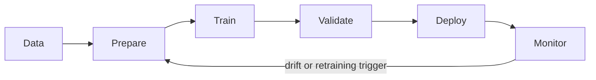
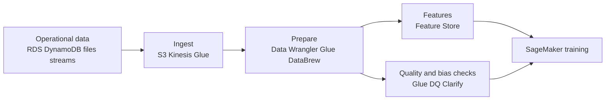
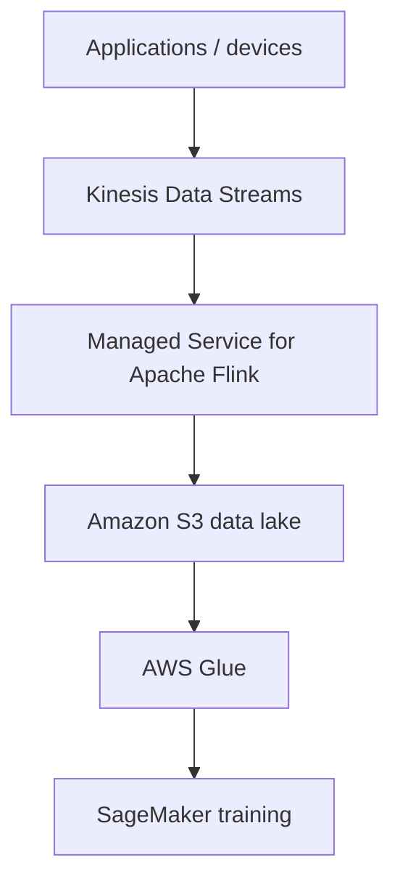
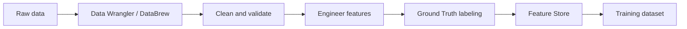
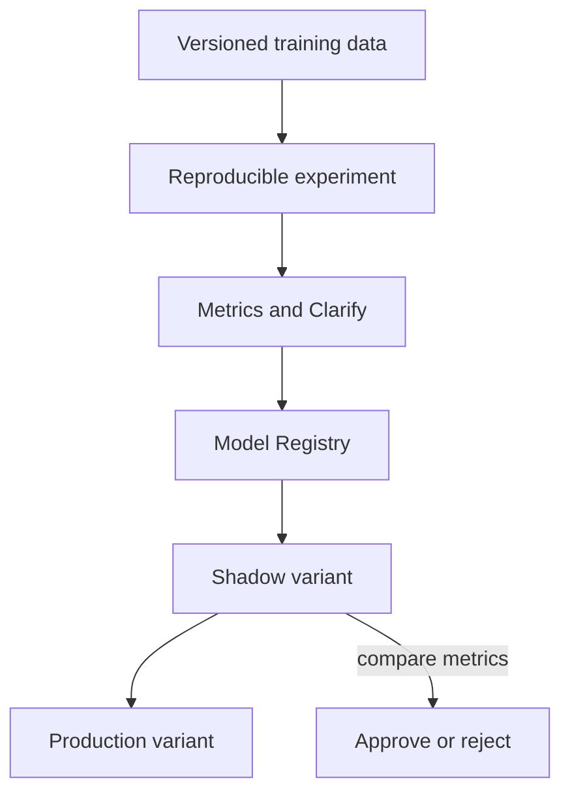
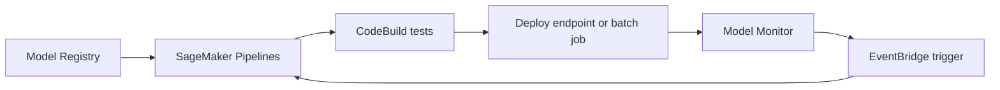
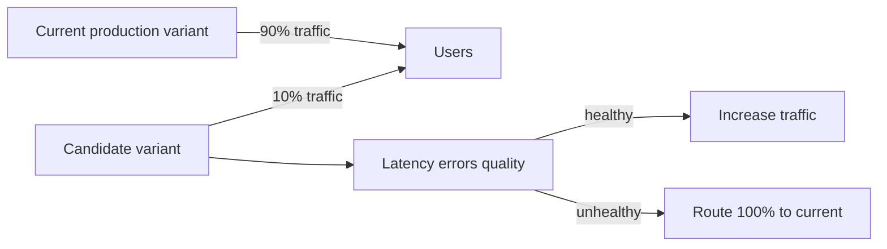
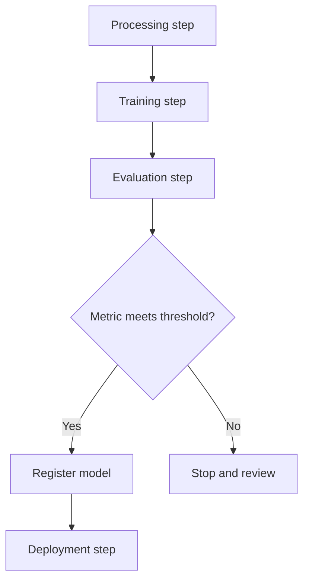
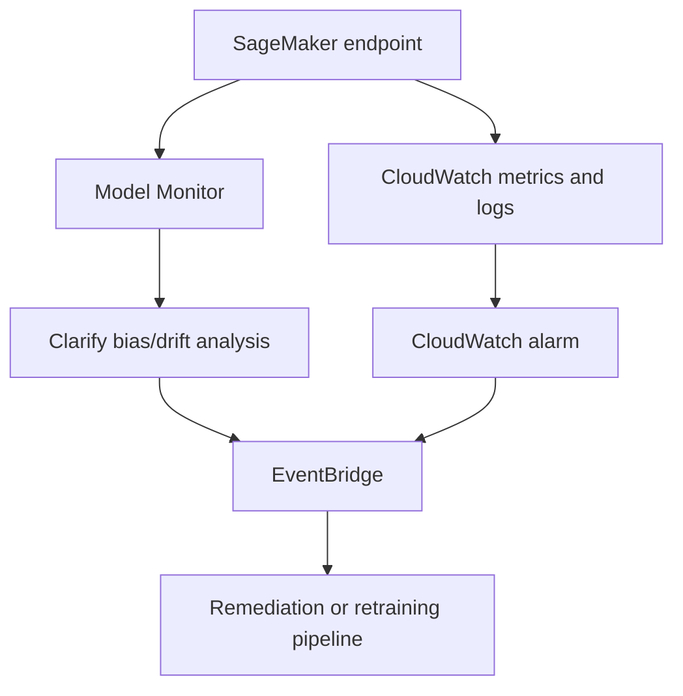
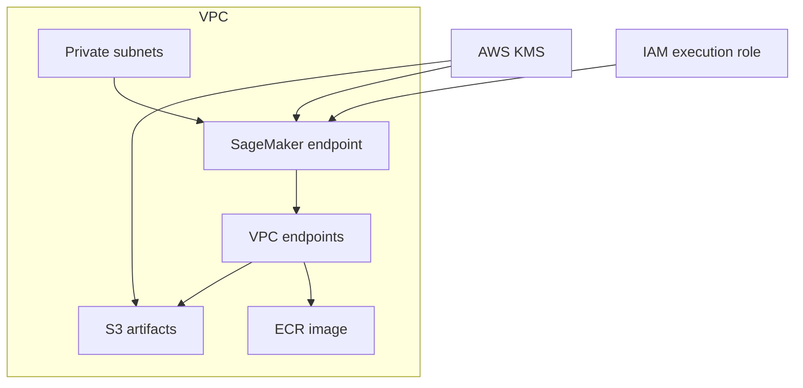

# AWS Certified Machine Learning Engineer – Associate (MLA-C01)

> **Based on the Official AWS Exam Guide (2026)**  
> **Last updated:** July 2026

The **AWS Certified Machine Learning Engineer – Associate** certification validates the ability to build, operationalize, deploy, and maintain machine learning solutions and pipelines on AWS. It is an engineering-focused certification: concentrate on turning data and models into reliable, automated, observable, and secure ML workloads.

## Exam Overview

| Item | Detail |
|---|---|
| Exam code | MLA-C01 |
| Format | Multiple choice, multiple response, ordering, and matching |
| Scored questions | 50 |
| Unscored questions | 15 |
| Duration | 130 minutes |
| Passing score | 720 / 1000 |
| Scoring model | Compensatory — the overall exam score determines pass/fail |

## Domain Weighting

| Domain | Weight | Approx. scored questions |
|---|---:|---:|
| 1. Data Preparation for Machine Learning | 28% | 14 |
| 2. ML Model Development | 26% | 13 |
| 3. Deployment and Orchestration of ML Workflows | 22% | 11 |
| 4. ML Solution Monitoring, Maintenance, and Security | 24% | 12 |

> Study priority: **Domain 1** has the greatest weight, but every domain is substantial. The exam expects you to select AWS services based on requirements, constraints, cost, operational effort, latency, scale, and security.

## What Is In Scope

- Data ingestion, storage, validation, transformation, feature engineering, labeling, and bias mitigation.
- Selecting, training, tuning, evaluating, registering, and comparing ML models.
- Deploying models through real-time, asynchronous, serverless, and batch inference patterns.
- Automating ML pipelines with SageMaker Pipelines, EventBridge, Step Functions, and CI/CD services.
- Monitoring model quality, data quality, infrastructure, costs, security, and compliance.

## What Is Not the Focus

The official guide identifies full end-to-end ML architecture design, deep specialization across multiple ML domains, and model quantization/accuracy analysis as outside the expected target-candidate scope. The test focuses on **engineering and operationalizing** ML workloads on AWS.

---

## Domain 1: Data Preparation for Machine Learning (28%)

Data preparation covers moving data into AWS, choosing formats and storage, transforming and labeling it, and making sure it is trustworthy, secure, representative, and usable by the selected training environment.

### Task 1.1: Ingest and Store Data

#### Data formats and access patterns

| Format | Strengths | Limitations | Typical ML use |
|---|---|---|---|
| **CSV** | Human-readable, universal support | Large, untyped, inefficient for analytics | Small tabular datasets and interchange |
| **JSON** | Nested/semi-structured data | Verbose; slower scans | Events, APIs, documents, annotations |
| **Parquet** | Columnar, compressed, schema-aware | Less convenient for row-by-row reads | Analytics, feature datasets, Glue/Athena/Spark |
| **ORC** | Columnar, compression and predicate pushdown | Primarily Hadoop ecosystem | Large analytical datasets |
| **Avro** | Row-oriented, schema evolution | Not optimized for column scans | Streaming records and Kafka-style pipelines |
| **RecordIO** | Efficient record serialization | Less broadly interoperable | SageMaker algorithm-specific ingestion patterns |

- Choose **Parquet** or **ORC** when training features are drawn from selected columns in a large tabular dataset; column pruning and compression reduce storage and scan cost.
- Choose **CSV** or **JSON** for simple interchange, small inputs, or semi-structured source data where readability matters.
- Choose **Avro** when schemas evolve and records are consumed sequentially, especially in streaming-oriented pipelines.
- Validate schema and record consistency before training. A syntactically valid file can still contain invalid values, missing labels, skewed classes, or incompatible types.

#### Storage services

| Service | Characteristics | ML workload fit |
|---|---|---|
| **Amazon S3** | Object storage, virtually unlimited scale, lifecycle policies, high durability | Primary data lake, training input/output, model artifacts, logs |
| **Amazon EBS** | Block storage attached to EC2 | Low-latency block volumes for EC2-based workloads |
| **Amazon EFS** | Elastic shared POSIX file system | Multiple training instances needing shared files |
| **Amazon FSx** | Managed high-performance file systems | High-throughput or specialized file system requirements |
| **Amazon RDS** | Managed relational database | Operational/tabular source data; export or query for ML |
| **Amazon DynamoDB** | Serverless NoSQL key-value/document store | Online features, event/state data, low-latency lookups |

**Amazon S3** is the standard landing zone for ML data and artifacts. Organize datasets by prefixes such as `raw/`, `validated/`, `features/`, `train/`, `validation/`, and `test/`, then use IAM and bucket policies to control access.

**Amazon S3 Transfer Acceleration** uses globally distributed edge locations to speed transfers over long geographic distances. It is relevant when users or systems upload sizable datasets from distant locations to an S3 bucket.

**Provisioned IOPS** volumes apply when an EBS-backed workload needs predictable, high I/O performance. This is distinct from S3 training input patterns.

#### Streaming ingestion

| Service | Use when | Key distinction |
|---|---|---|
| **Amazon Kinesis Data Streams** | You need durable, ordered stream records with custom consumers and replay | Consumer-managed processing and retention |
| **Amazon Data Firehose** | You need managed delivery of streams to destinations such as S3 | Delivery service, not a replayable stream-processing platform |
| **Amazon Managed Service for Apache Flink** | You need stateful, continuous stream transformation | Managed Apache Flink runtime |
| **Apache Kafka / Amazon MSK** | Existing Kafka ecosystem or Kafka-native clients | Managed Kafka-compatible streaming |

#### SageMaker ingestion services

- **SageMaker Data Wrangler** imports data from common sources and provides visual data preparation, transformations, analysis, and export to SageMaker Pipelines or training workflows.
- **SageMaker Feature Store** stores, shares, and reuses features. It has an **online store** for low-latency inference retrieval and an **offline store** for training and batch use cases.
- Use a feature store to reduce training-serving skew: the same defined feature logic can be consistently available to training and inference workflows.

#### Merge and scale data preparation

- Use **AWS Glue** for managed serverless ETL, catalog integration, and Spark-based transformations.
- Use **Amazon EMR** with Apache Spark when you need framework control, custom dependencies, or extensive cluster-level tuning.
- Use Spark joins to combine data from multiple sources, while controlling partitioning and data skew for large joins.
- Ensure source capacity can sustain extraction: RDS read replicas, DynamoDB exports, S3 parallel reads, and appropriately sized processing compute can prevent ingestion bottlenecks.

#### Troubleshooting checklist

| Symptom | Likely consideration | Investigation or correction |
|---|---|---|
| Slow reads from S3 | Too few partitions/prefixes, small files, serialization overhead | Use partitioned columnar files and parallelize processing |
| Training cannot access input | IAM, bucket policy, KMS key policy, wrong URI | Validate execution role and encryption permissions |
| Glue job runs out of memory | Data skew, wide transformations, insufficient workers | Repartition, address skew, increase worker resources |
| Dataset is too large for local processing | Single-node notebook limitations | Move transformation to Glue, EMR, or SageMaker Processing |
| Source database impact | Heavy extraction against production | Use read replicas, exports, scheduling, and incremental ingestion |

### Task 1.2: Transform Data and Perform Feature Engineering

#### Data cleaning

Data cleaning makes training input consistent and prevents accidental leakage or invalid learning signals.

- **Missing values:** remove rows only when the loss is acceptable; otherwise impute with mean, median, mode, a fixed value, or model-informed logic.
- **Outliers:** investigate before deleting. Use domain knowledge, percentile rules, z-scores, clipping, or robust transformations as appropriate.
- **Deduplication:** remove duplicate rows and duplicated entities to prevent artificially inflated training metrics.
- **Combining datasets:** align keys, timestamp semantics, units, and schemas before joins.
- **Leakage:** never derive a training feature from information unavailable at the time predictions will be made.

#### Feature engineering techniques

| Technique | What it does | Useful for |
|---|---|---|
| **Normalization** | Scales values to a bounded range, commonly 0–1 | Distance-based methods and neural networks |
| **Standardization** | Centers around mean 0 with unit variance | Linear models, SVMs, neural networks |
| **Log transformation** | Compresses long-tailed positive distributions | Spend, counts, income, traffic values |
| **Binning** | Converts continuous values into ranges | Nonlinear relationships and interpretability |
| **Feature splitting** | Breaks composite fields into useful components | Timestamps, addresses, identifiers |
| **One-hot encoding** | One binary field per category | Nominal categories without ordering |
| **Label encoding** | Maps categories to integers | Ordered categories or tree models with careful use |
| **Tokenization** | Breaks text into tokens | NLP inputs and foundation-model workflows |

> Avoid applying transformations using information from the validation or test sets. Fit scaling, imputation, and encoding logic on training data, then apply the fitted transformation to validation and test data.

#### Transformation tools

| Service | Best fit |
|---|---|
| **SageMaker Data Wrangler** | Interactive ML-focused preparation, visual transformations, data quality analysis |
| **AWS Glue DataBrew** | No-code visual cleaning and transformation for analysts and engineers |
| **AWS Glue** | Repeatable serverless ETL and catalog-driven Spark jobs |
| **Amazon EMR / Spark** | Large-scale customized distributed transformation |
| **AWS Lambda** | Lightweight event-driven transformations for individual stream events |
| **Managed Service for Apache Flink** | Stateful or continuous streaming transformations |

#### Data labeling and human review

- **SageMaker Ground Truth** creates labeled datasets using human workers and active learning. It is useful for supervised learning when raw data lacks labels.
- **Amazon Mechanical Turk** provides access to a crowdsourced workforce and can be used in labeling workflows.
- **Amazon Augmented AI (A2I)** supports human review workflows for low-confidence predictions from selected AI services or custom models.
- Label quality matters: create clear instructions, use consensus or audits, monitor annotator disagreement, and protect sensitive data.

### Task 1.3: Ensure Data Integrity and Prepare Data for Modeling

#### Data quality and representativeness

Use **AWS Glue Data Quality** to define, evaluate, and report data quality rules in ETL pipelines. Use DataBrew profile jobs to identify missing values, uniqueness issues, invalid formats, and data distribution concerns.

Common data quality dimensions:

| Dimension | Question |
|---|---|
| Completeness | Are required values missing? |
| Validity | Do values conform to expected type, range, or pattern? |
| Consistency | Do related fields agree with one another? |
| Uniqueness | Are entity records unexpectedly duplicated? |
| Timeliness | Is data current enough for the intended prediction? |
| Representativeness | Does the dataset reflect the population the model will serve? |

#### Bias and imbalance

- **Class imbalance (CI)** occurs when one target class is substantially more common than another. Accuracy can appear high while the model fails the minority class.
- **Difference in proportions of labels (DPL)** is a pre-training bias metric that compares positive-outcome rates between facets.
- **SageMaker Clarify** can analyze pre-training bias and post-training model bias, explain predictions, and help identify disparate outcomes.
- Address imbalance using resampling, class weights, synthetic data generation, threshold tuning, or different evaluation metrics such as precision, recall, and F1 score.
- Identify **selection bias** (dataset sample is not representative) and **measurement bias** (features/labels are systematically measured differently across groups).

#### Dataset splitting

| Split | Purpose | Typical consideration |
|---|---|---|
| Training | Fits model parameters | Largest portion of data |
| Validation | Selects model/hyperparameters | Must not influence final unbiased evaluation repeatedly |
| Test | Final estimate of generalization | Keep isolated until final assessment |

- Shuffle data before a random split when records are independent and identically distributed.
- Use stratified splits for classification when class proportions need preservation.
- Use time-aware splits for chronological data to prevent future information leaking into earlier predictions.
- Use augmentation when it is appropriate to the domain, especially for image, audio, and text datasets, while maintaining label validity.

#### Encryption, privacy, and compliance

- Encrypt S3, EBS, EFS, FSx, database data, and SageMaker artifacts at rest using AWS KMS keys where required.
- Encrypt data in transit with TLS.
- Apply data classification and use masking, tokenization, anonymization, or de-identification for sensitive values.
- **PII** and **PHI** require deliberate access controls, encryption, audit trails, retention handling, and applicable regional/data-residency controls.
- Use least-privilege IAM execution roles for processing and training jobs.

#### Selecting a training data file system

- Use **S3** for standard, scalable, durable training input and output.
- Use **EFS** when training resources need concurrent shared POSIX file access.
- Use **FSx** when high-performance or specialized file-system behavior is required by training workloads.

---

## Domain 2: ML Model Development (26%)

Model development covers choosing an approach that meets the business goal, training and tuning efficiently, managing versions, and evaluating models with metrics that reflect the actual cost of errors.

### Task 2.1: Choose a Modeling Approach

#### Match the problem to the approach

| Business problem | Common approach | AWS option |
|---|---|---|
| Predict a numeric value | Regression | SageMaker built-in algorithms or custom framework |
| Assign a category | Binary or multiclass classification | XGBoost, linear learner, custom models |
| Find similar groups | Clustering | K-means |
| Detect unusual observations | Anomaly detection | Random Cut Forest or service-specific options |
| Rank or recommend items | Recommendation | Amazon Personalize or custom model |
| Extract text/sentiment/entities | Managed AI NLP | Comprehend, Translate, Transcribe |
| Analyze images/video | Managed computer vision | Rekognition, Textract |
| Generate or summarize content | Foundation model inference | Amazon Bedrock |

- Assess whether ML is necessary. A deterministic rule, SQL query, or managed AI service can be lower effort and more reliable for a well-defined problem.
- Evaluate data availability, label quality, data volume, latency, expected accuracy, explainability, risk, and cost before choosing an approach.
- Select a managed AI service when it directly solves the problem; use custom training when the problem or domain requires custom behavior.

#### SageMaker and foundation-model choices

- **SageMaker built-in algorithms** provide managed containers for common ML tasks, reducing custom training code.
- **SageMaker JumpStart** provides foundation models, pre-trained models, solution templates, and deployment options.
- **Amazon Bedrock** provides managed access to foundation models for inference, customization, and evaluation workflows.
- Use model interpretability requirements in selection. Simpler models and tools such as SageMaker Clarify can help explain feature influence and prediction behavior.

#### Cost and complexity tradeoffs

| Option | Cost/operations profile | Use case |
|---|---|---|
| Managed AI service | Lowest ML engineering effort | Standard vision, speech, translation, NLP tasks |
| SageMaker built-in algorithm | Managed training with less custom code | Conventional supervised/unsupervised ML tasks |
| Script mode/custom model | More control, more engineering responsibility | Specialized architectures or existing framework code |
| Foundation model through Bedrock | Managed foundation-model access | Generative AI without hosting model infrastructure |
| Fine-tuned foundation model | Additional customization cost and data requirements | Domain adaptation where prompt-only behavior is insufficient |

### Task 2.2: Train and Refine Models

#### Training fundamentals

- An **epoch** is one full pass through the training dataset.
- A **batch** is the subset processed before a parameter update.
- A **step** is one optimization update, often one batch.
- A larger batch may improve hardware utilization but can increase memory requirements and affect convergence behavior.
- Track training and validation loss separately. Training loss improving while validation loss degrades is a common sign of overfitting.

#### Improve training performance

- Use **early stopping** to stop when validation performance no longer improves.
- Use **distributed training** for large models or datasets; split work across multiple instances/GPUs with framework-supported distribution strategies.
- Use appropriately selected CPU, GPU, or inference-optimized instance families based on the model and workload.
- Use managed Spot training where interruption-tolerant jobs can reduce cost.
- Optimize input pipelines and data format so training hardware is not idle waiting for data.

#### Regularization and generalization

| Technique | Primary effect |
|---|---|
| **L1 regularization** | Encourages sparse weights and can support feature selection |
| **L2 regularization / weight decay** | Penalizes large weights and improves generalization |
| **Dropout** | Randomly disables units during training to reduce co-adaptation |
| **Early stopping** | Stops before overfitting progresses |
| **Data augmentation** | Expands training variation without collecting entirely new data |
| **Feature selection** | Removes noisy or redundant inputs |

- **Underfitting**: both training and validation performance are poor. Consider additional model capacity, better features, more training, or lower regularization.
- **Overfitting**: training performance is much better than validation performance. Consider regularization, more data, augmentation, early stopping, simpler models, or feature selection.
- **Catastrophic forgetting** can occur when fine-tuning a pre-trained model causes it to lose useful prior behavior. Use carefully curated data, suitable learning rates, and appropriate fine-tuning strategy.

#### Hyperparameter tuning

| Method | Behavior | Tradeoff |
|---|---|---|
| Manual search | Engineer selects values | Simple but inefficient at scale |
| Grid search | Exhaustive values on a defined grid | Expensive as dimensions grow |
| Random search | Samples combinations | Often more efficient than grid search |
| Bayesian optimization | Uses prior trial outcomes to choose promising trials | More efficient for costly tuning jobs |

**SageMaker Automatic Model Tuning (AMT)** runs tuning jobs over configured hyperparameter ranges, evaluates an objective metric, and selects the best-performing configuration. Define realistic ranges and a meaningful objective metric; tuning the wrong metric optimizes the wrong outcome.

#### Training options and model management

- Use **SageMaker script mode** with supported frameworks such as TensorFlow and PyTorch when custom training code is needed.
- Bring models built outside SageMaker into SageMaker by packaging model artifacts and compatible inference containers.
- Fine-tune pre-trained models through SageMaker JumpStart or Amazon Bedrock when domain-specific data should adapt a foundation model.
- Use **SageMaker Model Registry** to version models, track approvals, preserve metadata, and support repeatable promotion into deployment workflows.
- Use ensembling, stacking, or boosting only when additional complexity, latency, and cost are justified by performance improvement.
- Reduce model size with pruning, compression, lower-precision data types, or feature selection when storage, inference latency, or device limitations matter.

### Task 2.3: Analyze Model Performance

#### Classification metrics

| Metric | Meaning | Important when |
|---|---|---|
| Accuracy | Fraction of all correct predictions | Classes are balanced and error costs are similar |
| Precision | Of predicted positives, fraction truly positive | False positives are costly |
| Recall | Of actual positives, fraction found | False negatives are costly |
| F1 score | Harmonic mean of precision and recall | Both false positives and false negatives matter |
| ROC-AUC | Ranking/discrimination across thresholds | Comparing binary classifiers across thresholds |
| Confusion matrix | TP, TN, FP, FN counts | Diagnosing exact error types |

#### Regression and evaluation patterns

- **RMSE** penalizes larger prediction errors more strongly than absolute-error metrics. Use it when large errors are disproportionately harmful.
- Create a **baseline** before complex experimentation: a simple heuristic, mean predictor, prior production model, or basic algorithm can establish whether a new model adds value.
- Evaluate on a held-out test set that was not used to tune hyperparameters.
- Use thresholds that reflect business cost; the default 0.5 decision threshold is not universally correct.

#### Explainability, reproducibility, and model comparison

- Use **SageMaker Clarify** for feature attribution and bias analysis. Explanations help validate whether a model relies on sensible signals.
- Use reproducible experiments: version source code, data references, environment/dependency configuration, hyperparameters, model artifacts, and evaluation results.
- A **shadow variant** receives production-like traffic but does not affect user-facing responses. Compare it against the production variant before promotion.
- Use A/B testing when live user traffic can be safely split between variants and business/model performance can be measured.
- Use **SageMaker Debugger** to inspect training behavior and identify convergence issues such as vanishing/exploding gradients or poorly utilized resources.

---

## Domain 3: Deployment and Orchestration of ML Workflows (22%)

This domain evaluates how to choose an inference pattern, provision and automate the required infrastructure, and use repeatable CI/CD and orchestration workflows for ML systems.

### Task 3.1: Select Deployment Infrastructure Based on Architecture and Requirements

#### Inference patterns

| Pattern | Latency | Throughput behavior | Best fit |
|---|---|---|---|
| **Real-time endpoint** | Low | Persistent endpoint; synchronous calls | Interactive APIs and low-latency predictions |
| **Serverless inference** | Low to moderate | Scales automatically; no instance management | Intermittent or unpredictable traffic, smaller models |
| **Asynchronous inference** | Minutes or longer | Queued request, response stored in S3 | Large payloads, long processing, near-real-time workflows |
| **Batch Transform** | Offline | Processes a dataset in bulk | Scheduled scoring and non-interactive workloads |
| **Multi-model endpoint** | Low | Models loaded dynamically from S3 | Many similar models with infrequent individual requests |
| **Multi-container endpoint** | Low | Multiple containers behind one endpoint | Pipelines or distinct models sharing an endpoint |

#### Endpoint selection

- Choose **real-time endpoints** when clients require synchronous response with predictable low latency.
- Choose **serverless inference** when traffic is intermittent and operational overhead should be minimized. Consider cold starts, supported memory/concurrency, and model size constraints.
- Choose **asynchronous inference** for large request/response payloads or inference that takes longer than real-time endpoint expectations. Input/output is integrated with Amazon S3 and notifications can be sent through SNS.
- Choose **Batch Transform** when the workload can process a full S3 dataset offline without a permanently running endpoint.
- Choose **multi-model endpoints** when many models use the same framework/container and keeping one endpoint per model would be inefficient.
- Choose **multi-container endpoints** when multiple containers must participate in the inference workflow, such as preprocessing plus prediction, or when serving multiple models from one endpoint architecture.

#### Compute and deployment targets

| Target | Primary use | Key consideration |
|---|---|---|
| **SageMaker AI endpoint** | Managed model hosting | Built-in endpoint lifecycle, variants, autoscaling, monitoring integration |
| **Amazon EKS** | Kubernetes-native ML serving | Maximum orchestration control; higher cluster operational responsibility |
| **Amazon ECS** | Containerized inference services | Simpler container operations than Kubernetes |
| **AWS Lambda** | Lightweight inference/integration | Runtime, package, memory, and execution-duration constraints |
| **Amazon EC2** | Custom serving infrastructure | Full control, but full operations responsibility |
| **SageMaker Batch Transform** | Offline/bulk scoring | No persistent endpoint cost |

#### Deployment safety

- Version model artifacts, inference code, container images, data schema, and configuration.
- Use **blue/green**, **canary**, or **linear** deployment patterns to limit impact from a faulty model version.
- Define rollback conditions before deployment, including endpoint errors, increased latency, degraded business metrics, or data quality alarms.
- Use endpoint **production variants** to route a percentage of traffic to a new model version.

#### Edge and optimized models

- **SageMaker Neo** compiles models for supported edge hardware to improve inference performance and resource use.
- Edge optimization is relevant where device constraints, latency, network connectivity, or power use matter.
- Compare CPU and GPU requirements: GPUs accelerate many parallel numerical workloads; CPUs can be more cost-effective for small models or lower request rates.

### Task 3.2: Create and Script Infrastructure Based on Architecture and Requirements

#### Infrastructure as code

| Tool | Description | ML infrastructure use |
|---|---|---|
| **AWS CloudFormation** | Declarative AWS-native templates | Version endpoint, roles, S3, pipelines, networking, alarms |
| **AWS CDK** | Define infrastructure in programming languages; synthesizes to CloudFormation | Reusable higher-level ML infrastructure patterns |
| **SageMaker SDK** | Python SDK for SageMaker jobs and deployments | Create training, processing, pipelines, and endpoints programmatically |

- Use IaC to make ML environments repeatable across development, test, and production.
- Pass outputs between stacks through explicit references/exports rather than embedding identifiers in code.
- Separate environment-specific configuration from application/model code.

#### Capacity and scaling

- **On-Demand** resources offer capacity when required without a long-term commitment.
- **Provisioned** resources maintain allocated capacity and can offer more predictable readiness.
- Use endpoint autoscaling policies based on metrics such as **InvocationsPerInstance**, model latency, or CPU utilization.
- Use scheduled scaling for predictable traffic peaks; use target tracking for dynamic demand.
- Account for scale-out time when a model is large or its container startup is slow.

| Requirement | Appropriate capability |
|---|---|
| Request rate changes continuously | Target-tracking endpoint autoscaling |
| Known daily peak | Scheduled scaling |
| Lower training cost, interruption acceptable | Managed Spot training |
| Persistent low-latency inference | Provisioned real-time endpoint |
| Burst/infrequent inference | Serverless or asynchronous inference |

#### Containers and VPC configuration

- Store container images in **Amazon ECR** and use image tags/digests for version traceability.
- Bring a custom container to SageMaker when the provided inference/training containers do not meet framework or dependency requirements.
- Configure SageMaker jobs and endpoints in a VPC when private access to data sources, databases, or internal resources is required.
- VPC configuration requires subnets and security groups. Ensure the execution role, network routes, DNS, and VPC endpoint requirements allow access to required AWS services.
- Apply least privilege to the SageMaker execution role and separately protect the ECR image, S3 artifacts, KMS keys, and secrets.

### Task 3.3: Use Automated Orchestration Tools to Set Up CI/CD Pipelines

#### Orchestration services

| Service | Main role in ML workflow |
|---|---|
| **SageMaker Pipelines** | Native workflow DAG for processing, training, evaluation, registration, and deployment conditions |
| **AWS Step Functions** | General state-machine orchestration across AWS services |
| **Amazon MWAA** | Managed Apache Airflow for complex DAG scheduling and existing Airflow workflows |
| **Amazon EventBridge** | Event/schedule-triggered automation and event routing |
| **AWS CodePipeline** | CI/CD workflow stages and release orchestration |
| **AWS CodeBuild** | Tests, builds, packaging, and artifact creation |
| **AWS CodeDeploy** | Deployment strategies for supported compute targets |

#### SageMaker Pipelines pattern

- A SageMaker Pipeline can chain preprocessing, feature engineering, training, evaluation, model registration, and conditional deployment.
- Use a condition step to register or promote a model only when evaluation metrics meet the defined threshold.
- Track pipeline execution, inputs, outputs, and model package metadata for auditability and repeatability.

#### CI/CD for ML

- Use version control for training code, inference code, infrastructure templates, pipeline definitions, configuration, and tests.
- **GitHub Flow** is often a simplified branch-based workflow; **Gitflow** has longer-lived branches and formal release structure. The important exam concept is controlled changes, tests, and traceable promotion.
- CodeBuild can run unit tests, integration tests, linting, package builds, and container image builds.
- CodePipeline can invoke CodeBuild, deploy IaC, start SageMaker Pipelines, and require manual approvals when needed.
- Add tests for feature schemas, data quality, model metrics, inference contracts, and deployment behavior.

#### Retraining automation

- Trigger retraining from a schedule using EventBridge Scheduler, from a new S3 data arrival event, or from monitoring/drift findings routed through EventBridge.
- Avoid automatic promotion based only on a successful training job. Evaluate the candidate against a baseline and define approval/quality gates.
- Store artifacts and metadata so a previous known-good model can be restored quickly.

---

## Domain 4: ML Solution Monitoring, Maintenance, and Security (24%)

Production ML monitoring goes beyond CPU and error counts. It includes model and data quality, data drift, bias, latency, throughput, availability, cost, auditability, and access control.

### Task 4.1: Monitor Model Inference

#### Model and data drift

- **Data drift** occurs when the statistical distribution of production input data changes compared with the training/baseline data.
- **Model drift** or concept drift occurs when the relationship between input and target changes, reducing predictive performance over time.
- Monitor feature distributions, missing values, schema changes, prediction distributions, model quality where ground truth becomes available, and bias metrics.
- Drift is not automatically a reason to deploy a new model. Investigate whether the change is expected, whether it degrades a business metric, and whether retraining data is representative.

#### SageMaker monitoring tools

| Tool | Purpose |
|---|---|
| **SageMaker Model Monitor** | Detect data quality, model quality, bias drift, and feature-attribution drift issues |
| **SageMaker Clarify** | Analyze bias and explain model predictions/features |
| **Amazon CloudWatch** | Metrics, logs, dashboards, alarms, and automated actions |
| **AWS X-Ray** | Trace requests through distributed applications |
| **CloudWatch Logs Insights** | Query and troubleshoot structured/unstructured logs |

- Establish baseline constraints and statistics from training data before production monitoring begins.
- Capture inference requests and responses securely, respecting privacy and retention requirements.
- Send model monitor violations to CloudWatch and EventBridge for alerting, investigation, or controlled retraining workflows.

#### Production evaluation strategies

- Use **A/B testing** to split traffic between model variants and compare business/model metrics.
- Use **shadow testing** to send production-like traffic to a candidate model without changing customer-visible responses.
- Choose monitoring metrics that match the problem: classification can use precision/recall when labels arrive later; regression can use MAE/RMSE; operations may focus on latency and error rate.

### Task 4.2: Monitor and Optimize Infrastructure and Costs

#### Key infrastructure metrics

| Metric category | Examples | Why it matters |
|---|---|---|
| Availability | Endpoint availability, error rate, failed invocations | User-facing reliability |
| Latency | ModelLatency, OverheadLatency, end-to-end latency | SLA and user experience |
| Throughput | Invocations, requests per instance | Scaling and capacity planning |
| Utilization | CPU, memory, GPU, disk/network use | Right-sizing and bottleneck analysis |
| Scaling | Instance count, queue depth, throttles | Demand response and quotas |
| Cost | Instance-hours, data transfer, storage, idle endpoints | Financial optimization |

#### Observability and troubleshooting

- Use **Amazon CloudWatch Logs** for endpoint, container, Lambda, and application logs.
- Use **CloudWatch dashboards** to combine endpoint, infrastructure, and business-relevant metrics.
- Use **CloudWatch alarms** for errors, latency, utilization, throttling, and monitoring violations.
- Use **AWS X-Ray** when tracing requests across API Gateway, Lambda, services, and downstream dependencies.
- Use **CloudTrail** to audit management events and API calls, including model/deployment/retraining actions.
- Use **EventBridge** to react to service events and route them to remediation workflows.

#### Cost management

| Tool or method | Use |
|---|---|
| **AWS Cost Explorer** | Analyze historical and forecast cost by service, account, tag, or time |
| **AWS Budgets** | Set cost or usage thresholds and send alerts |
| **AWS Trusted Advisor** | Review optimization recommendations and service limits checks |
| **AWS Compute Optimizer** | Right-size supported compute resources using utilization data |
| **SageMaker Inference Recommender** | Help select instance configurations for model serving |
| **Resource tags** | Allocate and analyze costs by application, team, environment, model, or project |

- Stop or delete unused endpoints; persistent real-time endpoints accrue cost while provisioned.
- Consider serverless, asynchronous, or batch inference for workloads that do not need continuously provisioned real-time capacity.
- Use managed Spot training for interruption-tolerant training jobs.
- Select on-demand, Savings Plans, reserved capacity, or Spot options based on workload duration, flexibility, and interruption tolerance.
- Monitor quotas and capacity issues. A scaling failure can be caused by account-level service quotas, instance availability, subnet IP capacity, or restrictive IAM policies.

### Task 4.3: Secure AWS Resources

#### Identity and access management

- Use IAM roles rather than static credentials for SageMaker processing, training, pipelines, endpoints, and CI/CD services.
- Apply least privilege to each role: separate roles can be used for data preparation, training, deployment, and monitoring.
- Scope access to specific S3 prefixes, ECR repositories, KMS keys, CloudWatch log groups, and model resources where possible.
- Use resource-based policies where applicable, including S3 bucket policies and KMS key policies.
- **SageMaker Role Manager** helps define and manage SageMaker IAM permissions for common personas/workflows.

#### Network and data protection

- Place SageMaker jobs/endpoints in private subnets when the workload must access private resources or restrict network exposure.
- Use security groups to control inbound/outbound traffic and route tables/NAT/VPC endpoints to provide only required connectivity.
- Use VPC endpoints for private access to AWS services when appropriate to the architecture and organizational policy.
- Encrypt data at rest using KMS for S3 artifacts, EBS volumes, training outputs, and endpoint-related resources when supported.
- Encrypt traffic in transit with TLS and protect secrets using **AWS Secrets Manager** rather than embedding them in code or images.

#### Security in CI/CD and operations

- Restrict who can modify pipeline definitions, deployment configuration, model approval status, and production endpoints.
- Use code review, protected branches, artifact versioning, and automated tests before production promotion.
- Audit actions through CloudTrail and retain logs according to the organization’s compliance requirements.
- Diagnose access-denied errors by checking the execution role policy, trust policy, S3 bucket policy, KMS key policy, VPC endpoint policy, and service control policies where applicable.
- Use AWS Config and organizational controls to identify configuration drift and enforce compliance requirements.

---

## Appendix A: Service Selection Cheat Sheet

| Need | Choose |
|---|---|
| Central ML data lake and artifacts | Amazon S3 |
| Shared POSIX training file system | Amazon EFS |
| High-performance/specialized training file system | Amazon FSx |
| Visual ML data preparation | SageMaker Data Wrangler |
| No-code data cleaning | AWS Glue DataBrew |
| Serverless scalable ETL | AWS Glue |
| Custom large-scale Spark ETL | Amazon EMR |
| Streaming ingestion with replay | Kinesis Data Streams |
| Managed streaming delivery to S3 | Amazon Data Firehose |
| Stateful stream processing | Managed Service for Apache Flink |
| Reusable features for training and inference | SageMaker Feature Store |
| Human data labeling | SageMaker Ground Truth |
| Bias and explanation analysis | SageMaker Clarify |
| Data/model quality monitoring | SageMaker Model Monitor |
| Managed conventional ML algorithm | SageMaker built-in algorithm |
| Custom TensorFlow/PyTorch training | SageMaker script mode |
| Foundation-model access | Amazon Bedrock |
| Pretrained model/template | SageMaker JumpStart |
| Hyperparameter tuning | SageMaker Automatic Model Tuning |
| Model version/approval management | SageMaker Model Registry |
| Synchronous low-latency inference | SageMaker real-time endpoint |
| Intermittent inference traffic | SageMaker serverless inference |
| Long-running/large-payload inference | SageMaker asynchronous inference |
| Scheduled bulk scoring | SageMaker Batch Transform |
| Native ML workflow DAG | SageMaker Pipelines |
| General AWS workflow orchestration | AWS Step Functions |
| Airflow-based orchestration | Amazon MWAA |
| Build and tests | AWS CodeBuild |
| CI/CD release stages | AWS CodePipeline |
| Scheduled/event retraining trigger | Amazon EventBridge |
| Metrics/logs/alarms | Amazon CloudWatch |
| API and deployment audit trail | AWS CloudTrail |
| Distributed request tracing | AWS X-Ray |
| Cost analysis and forecasting | AWS Cost Explorer |
| Budget alerts | AWS Budgets |
| Right-sizing | Compute Optimizer / Inference Recommender |
| Encryption key management | AWS KMS |
| Application secrets | AWS Secrets Manager |
| Container image registry | Amazon ECR |
| Private ML workload isolation | Amazon VPC + private subnets + security groups |

---

## Appendix B: Exam Traps to Remember

1. **Model Monitor** detects data/model quality issues; **Clarify** analyzes bias and explainability.
2. **Feature Store online store** serves low-latency inference features; **offline store** supports training and batch workloads.
3. **Batch Transform** is offline bulk inference; it is not an always-on API.
4. **Asynchronous inference** handles long-running or large-payload requests; output is stored in S3.
5. **Serverless inference** suits intermittent traffic, but consider cold starts and model/runtime limits.
6. **SageMaker Pipelines** is ML-native orchestration; **Step Functions** is general-purpose state-machine orchestration; **MWAA** is managed Airflow.
7. Do not use accuracy alone for an imbalanced classification problem; consider precision, recall, and F1.
8. Use the test set only for final evaluation. Do not tune repeatedly against it.
9. Train transformations on the training split, then apply them to validation/test splits to avoid leakage.
10. A production model must be monitored for both infrastructure health and changing data/model behavior.
11. KMS-encrypted data needs both service/data access and appropriate **KMS key permissions**.
12. A successful training job does not justify automatic production deployment without defined evaluation and approval gates.

---

## Appendix C: AWS Resources

- AWS Machine Learning Blog: https://aws.amazon.com/blogs/machine-learning/
- SageMaker AI Developer Guide: https://docs.aws.amazon.com/sagemaker/
- Amazon Bedrock User Guide: https://docs.aws.amazon.com/bedrock/
- AWS Well-Architected Machine Learning Lens: https://docs.aws.amazon.com/wellarchitected/latest/machine-learning-lens/
- AWS What’s New: https://aws.amazon.com/about-aws/whats-new/
- AWS Prescriptive Guidance: https://docs.aws.amazon.com/prescriptive-guidance/latest/

---

**Good luck on the AWS Certified Machine Learning Engineer – Associate (MLA-C01) exam!**
