# AWS Certified Solutions Architect – Associate (SAA-C03)

This is a design exam: read the constraints, then choose the AWS design that satisfies them with the least operational work. The official scored domains are Secure (30%), Resilient (26%), High-Performing (24%), and Cost-Optimized (20%).

## Exam map and method

- The exam has 50 scored questions and 15 unscored questions. A multiple-choice question has one answer; a multiple-response question has more than one. Guess rather than leave an answer blank.
- Scaled scores run from 100 to 1,000; 720 is the passing score. Domain scores are feedback, not separate pass/fail gates.
- Start every scenario with: **What must be protected? What may fail? What is slow? What is expensive?** Then eliminate choices that solve a different problem.

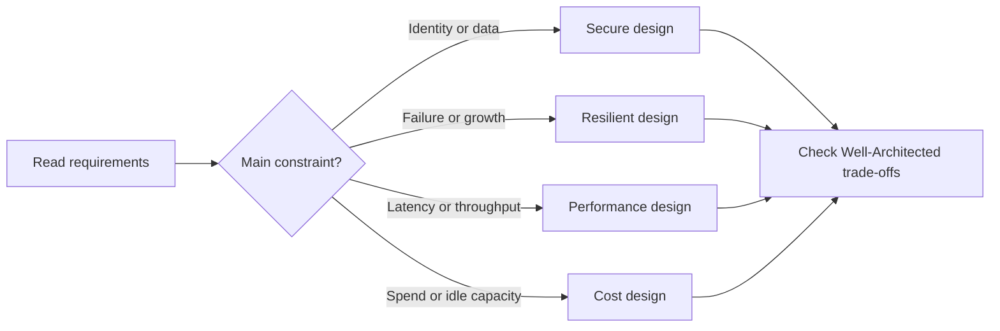

## Well-Architected: the six lenses

| Pillar | Beginner meaning | Typical SAA-C03 decision |
|---|---|---|
| Operational Excellence | Run and improve systems predictably. | Infrastructure as code, monitoring, runbooks, automation. |
| Security | Protect identities, systems, and data. | Least-privilege roles, private subnets, encryption. |
| Reliability | Recover from faults and meet availability goals. | Multi-AZ, backups, health checks, decoupling. |
| Performance Efficiency | Use the right resources as demand changes. | Auto Scaling, caching, purpose-built databases. |
| Cost Optimization | Pay for useful capacity and understand spend. | Rightsizing, S3 lifecycle, Savings Plans. |
| Sustainability | Reduce wasted resources and energy. | Managed/serverless services, efficient storage and scaling. |

**Critical rules**

1. The root user is for account-level emergencies, not daily work. Protect it with MFA and do not create root access keys.
2. Security groups are stateful allow lists; network ACLs are stateless subnet filters. An NACL needs return traffic rules too.
3. Put internet-facing load balancers in public subnets and application/database resources in private subnets unless the requirement says otherwise.
4. Multi-AZ improves availability; an RDS read replica primarily scales reads and can be promoted for recovery.
5. S3 is object storage, EBS is block storage for one EC2 instance at a time, and EFS is shared elastic file storage.
6. A queue absorbs bursts and separates producers from consumers; do not use synchronous calls when independent retryable work is acceptable.
7. A backup is not automatically a disaster-recovery plan: choose recovery point objective (RPO, acceptable data loss) and recovery time objective (RTO, acceptable downtime).
8. Prefer managed services when they meet the requirement; they usually remove patching, capacity, and failover work.

---

## Domain 1: Design Secure Architectures (30%)

### Task 1.1: Design secure access to AWS resources

#### Architecture studio

**ELI5 expansion:** Give people and workloads a badge that expires, and put each team in the room it needs—not a master key that opens every room.

**Reference architecture:** Corporate identity provider → IAM Identity Center → permission set → target-account role → resource policy and KMS key policy.

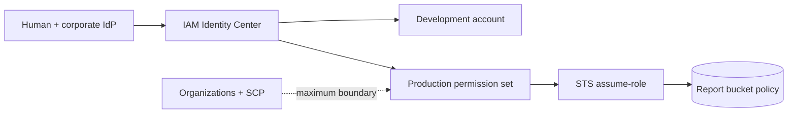

| Decision | Prefer | Why | Alternative / boundary |
|---|---|---|---|
| Primary selection | Use IAM Identity Center for workforce access across accounts; use an IAM role for AWS services and cross-account callers; use Cognito for application customers. | Fits the stated outcome with managed operations. | An IAM user is a narrow fallback for a human when federation is impossible. It is not the normal identity for an application. |
| Operational control | Managed AWS service first | Removes undifferentiated patching, failover, and fleet work. | Choose self-managed only when a named compatibility/control constraint requires it. |
| Scale signal | Measure the bottleneck | Use a business or saturation metric rather than a guessed server count. | Alarm before an explicit quota or capacity ceiling is reached. |

**Configuration knobs that make the design real**

- Configure the role trust policy (who may assume it), permission policy (what it may do), session duration, MFA condition, permission boundary, and resource ARN/prefix conditions.
- Define least-privilege IAM roles and resource policies before deploying the data path.
- Use CloudWatch metrics, alarms, logs, and a runbook that says who owns a failed request, job, or recovery.
- Test the failure path, not only the healthy request path: deny an expected permission, stop one target, and verify the design degrades as intended.

**Failure and operational implications**

- A broad trust policy lets an unintended principal assume the role. A broad resource policy can expose a bucket across accounts. CloudTrail and IAM Access Analyzer reveal these paths.
- Make retrying components idempotent. A retry must not create a duplicate order, object, record, or payment.
- Watch an outcome metric as well as infrastructure metrics: error rate, queue age, p95 latency, replication lag, recovery time, or cache hit rate.
- Treat quotas as architecture inputs. Request increases and pre-create standby capacity before an incident, not during it.

**Selection drill**

1. Name the hard constraint: security boundary, availability target, latency, throughput, data model, compliance rule, or cost goal.
2. Eliminate any answer that violates that constraint even if it solves a different problem well.
3. Prefer the answer with the fewest operational components when it satisfies every stated requirement.
4. Check whether the requirement implies an AZ failure, Region failure, a public path, cross-account access, or interruption tolerance.

> **Exam signal:** Look for **centralized workforce SSO, temporary credentials, cross-account administration, guardrails**.
>
> **Common trap:** An SCP is a guardrail, not a grant. Both the SCP and the identity/resource policy path must allow the request.
>
> **Official coverage retained:** IAM users/groups/roles, STS, cross-account role access, IAM Identity Center/federation, Organizations/SCPs, resource policies, root protection.

**ELI5:** Identity answers “who is asking?” and authorization answers “what may they do?” AWS should give each human or workload only the small set of permissions it needs.

**Why it matters:** A leaked credential or overly broad policy can affect every resource it can reach. Good identity boundaries limit the blast radius.

**Service selection and alternatives**

| Need | Choose | Why / alternative |
|---|---|---|
| Workforce sign-in across accounts | AWS IAM Identity Center | Central sign-in and permission sets; federate an existing directory when it already owns employee identities. |
| AWS service or application permission | IAM role | Short-lived credentials through STS; better than embedding IAM-user keys. |
| Long-lived human identity in one account | IAM user only when federation is unavailable | Use groups and MFA; do not use it for applications. |
| Organization-wide guardrails | AWS Organizations, SCPs, Control Tower | SCPs set the maximum allowed permission; they do not grant a permission. |
| Service-owned resource protection | Resource policy | S3 bucket, KMS key, SQS queue, SNS topic, and similar services can name principals directly. |

**Realistic scenario:** A company has development, test, and production accounts. Employees sign in once through IAM Identity Center; a production administrator assumes a tightly controlled role with MFA. An SCP blocks all accounts from disabling CloudTrail. A bucket policy permits a reporting role from another account to read only its report prefix.

**Official scope map — knowledge**

- **Access control and management across accounts:** separate accounts form security and billing boundaries; use cross-account roles and AWS Organizations instead of sharing credentials.
- **Federated identity services:** understand IAM, IAM Identity Center, and federation from a corporate directory into IAM roles.
- **Global infrastructure:** choose Regions for residency and use Availability Zones for isolated failure domains; these choices can affect access and data boundaries.
- **Security practices:** apply least privilege, explicit resource scoping, MFA, credential rotation, and audit trails.
- **Shared responsibility:** AWS secures the cloud infrastructure; the customer configures identities, data, network rules, and workloads in the cloud.

**Official scope map — skills**

- **IAM and root-user protections:** enable MFA, avoid root keys, use strong recovery practices, and give everyday administrators individual identities.
- **Flexible authorization:** combine IAM users only where needed, groups for shared human permissions, roles for temporary access, and identity/resource policies for authorization.
- **Role-based access control:** use STS, role switching, and cross-account trust policies rather than permanent cross-account keys.
- **Multi-account security strategy:** use Control Tower for landing-zone governance and SCPs to set organization guardrails.
- **Resource policies:** choose them when the resource must name a caller or enable cross-account access; pair them with identity policies when required.
- **Directory federation:** federate a directory to IAM roles when employees already authenticate through a corporate identity provider.

> **Exam Tip:** “Temporary credentials,” “an EC2 application,” or “cross-account access” usually points to an IAM role and STS.
>
> **Exam Trap:** An SCP cannot grant access. It can only restrict what an account’s otherwise-allowed identities may do.
>
> **Exam Keywords:** least privilege, MFA, STS, assume role, trust policy, federation, IAM Identity Center, SCP, resource policy, shared responsibility.

### Task 1.2: Design secure workloads and applications

#### Architecture studio

**ELI5 expansion:** Put the public door in front, keep the valuable rooms private, and let each room accept traffic only from the room immediately before it.

**Reference architecture:** Viewer → CloudFront/WAF → public ALB → private application security group → database security group; secrets arrive through a private endpoint.

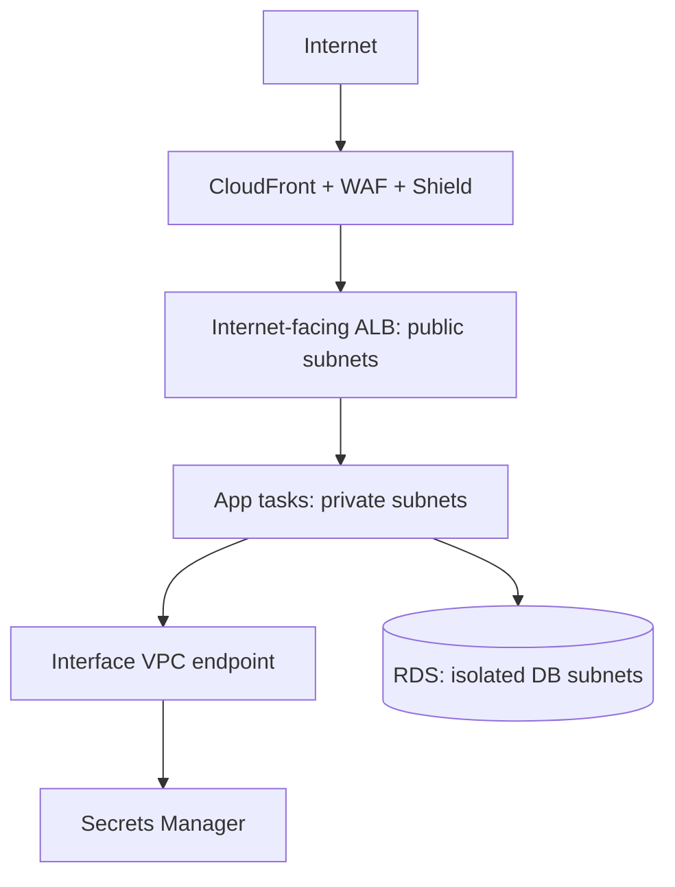

| Decision | Prefer | Why | Alternative / boundary |
|---|---|---|---|
| Primary selection | Use WAF for Layer 7 request filtering, Shield for DDoS coverage, Cognito for customer sign-in, and Secrets Manager for rotating credentials. | Fits the stated outcome with managed operations. | Use a NAT gateway for general outbound internet access; use interface or gateway endpoints when the target AWS service supports private access. |
| Operational control | Managed AWS service first | Removes undifferentiated patching, failover, and fleet work. | Choose self-managed only when a named compatibility/control constraint requires it. |
| Scale signal | Measure the bottleneck | Use a business or saturation metric rather than a guessed server count. | Alarm before an explicit quota or capacity ceiling is reached. |

**Configuration knobs that make the design real**

- Set SG source to the preceding SG instead of a CIDR; configure WAF managed rules/rate rules; set Secrets Manager rotation; set route tables and endpoint policies.
- Define least-privilege IAM roles and resource policies before deploying the data path.
- Use CloudWatch metrics, alarms, logs, and a runbook that says who owns a failed request, job, or recovery.
- Test the failure path, not only the healthy request path: deny an expected permission, stop one target, and verify the design degrades as intended.

**Failure and operational implications**

- A public IP or 0.0.0.0/0 database rule bypasses tiering. A missing endpoint route can force private traffic through NAT. A secret in user data can leak into logs.
- Make retrying components idempotent. A retry must not create a duplicate order, object, record, or payment.
- Watch an outcome metric as well as infrastructure metrics: error rate, queue age, p95 latency, replication lag, recovery time, or cache hit rate.
- Treat quotas as architecture inputs. Request increases and pre-create standby capacity before an incident, not during it.

**Selection drill**

1. Name the hard constraint: security boundary, availability target, latency, throughput, data model, compliance rule, or cost goal.
2. Eliminate any answer that violates that constraint even if it solves a different problem well.
3. Prefer the answer with the fewest operational components when it satisfies every stated requirement.
4. Check whether the requirement implies an AZ failure, Region failure, a public path, cross-account access, or interruption tolerance.

> **Exam signal:** Look for **web exploits, SQL injection, private service-to-service traffic, rotating password, customer registration**.
>
> **Common trap:** A NAT gateway permits initiated egress only. It does not accept unsolicited internet traffic for a private instance.
>
> **Official coverage retained:** secure VPCs, segmentation, security groups/NACLs, WAF/Shield, Cognito, GuardDuty/Macie, Secrets Manager, endpoints, VPN/Direct Connect.

**ELI5:** A secure application has locked doors at every layer: network paths, user login, application secrets, and protection against hostile requests.

**Why it matters:** A public IP, open security group, exposed secret, or unfiltered web request can bypass a well-designed application.

**Service selection and alternatives**

| Need | Choose | Why / alternative |
|---|---|---|
| Web attack filtering | AWS WAF | Filter SQL injection and common web attacks at CloudFront, ALB, or API Gateway; Shield addresses DDoS protection. |
| DDoS resilience | AWS Shield | Standard is automatic; Advanced is for enhanced protection/support needs. |
| Customer app sign-up/sign-in | Amazon Cognito | User pools for application users; IAM Identity Center is for workforce access. |
| Store a database password | AWS Secrets Manager | Encrypts and can rotate secrets; Systems Manager Parameter Store is suitable for simpler parameters. |
| Private AWS service access | VPC endpoint / PrivateLink | Keeps traffic off the public internet; NAT gateway is for private-subnet outbound internet access. |
| Private on-premises connection | Site-to-Site VPN or Direct Connect | VPN uses encrypted internet paths; Direct Connect is dedicated connectivity. |

**Realistic scenario:** A public shopping site uses CloudFront and WAF in front of an ALB. The ALB reaches EC2 instances only in private subnets. The instances retrieve rotating database credentials from Secrets Manager through a VPC endpoint. A security group allows web traffic only from the ALB security group.

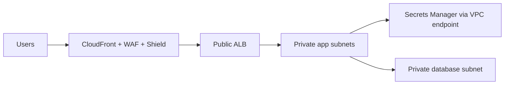

**Official scope map — knowledge**

- **Configuration and credential security:** do not put credentials in source code, images, or user data; use roles, Secrets Manager, and controlled configuration.
- **AWS service endpoints:** know public endpoints, interface endpoints/PrivateLink, and gateway endpoints so private workloads can reach services safely.
- **Ports, protocols, and traffic:** use security groups, NACLs, route tables, and controlled ingress/egress to allow only required flows.
- **Secure application access:** distinguish workforce access, customer identity, API authorization, and private service-to-service access.
- **Security-service use cases:** Cognito handles app identity, GuardDuty detects suspicious activity, and Macie discovers sensitive data in S3.
- **External threats:** recognize DDoS and injection attacks; combine Shield, WAF, safe application design, and restricted network exposure.

**Official scope map — skills**

- **Secure VPC design:** place security groups, route tables, NACLs, and NAT gateways deliberately; route private workloads outward without making them publicly reachable.
- **Segmentation:** use public subnets for internet-facing entry points and private subnets for application and data tiers.
- **Application security integration:** use Shield, WAF, IAM Identity Center where workforce login fits, and Secrets Manager for sensitive values.
- **External connectivity:** select VPN or Direct Connect for secure paths to and from on-premises networks.

> **Exam Tip:** Security groups can reference another security group. This is cleaner than maintaining application-tier IP addresses.
>
> **Exam Trap:** A NAT gateway lets private instances initiate outbound connections; it does not make them reachable from the internet.
>
> **Exam Keywords:** public/private subnet, security group, NACL, WAF, Shield, Cognito, GuardDuty, Macie, Secrets Manager, PrivateLink, VPN, Direct Connect.

### Task 1.3: Determine appropriate data security controls

#### Architecture studio

**ELI5 expansion:** Lock stored data, protect it while it travels, keep a recoverable copy, and make data disappear on schedule when policy says it should.

**Reference architecture:** TLS terminates at an ACM-integrated endpoint; KMS authorizes encryption/decryption; AWS Backup retains recovery points; lifecycle controls archival and deletion.

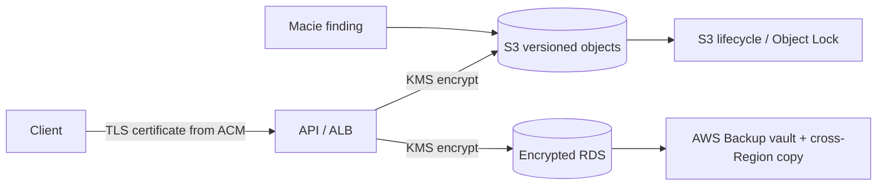

| Decision | Prefer | Why | Alternative / boundary |
|---|---|---|---|
| Primary selection | Use KMS for integrated key management, ACM for supported TLS endpoints, AWS Backup for centrally governed backups, and Macie to discover sensitive S3 data. | Fits the stated outcome with managed operations. | CloudHSM fits dedicated HSM/control requirements. Parameter Store suits simple encrypted configuration but does not provide Secrets Manager-style rotation. |
| Operational control | Managed AWS service first | Removes undifferentiated patching, failover, and fleet work. | Choose self-managed only when a named compatibility/control constraint requires it. |
| Scale signal | Measure the bottleneck | Use a business or saturation metric rather than a guessed server count. | Alarm before an explicit quota or capacity ceiling is reached. |

**Configuration knobs that make the design real**

- Choose AWS-managed versus customer-managed KMS key; define key policy/grants, S3 versioning/Object Lock, backup vault/retention/copy, TLS listener policy, and lifecycle transition days.
- Define least-privilege IAM roles and resource policies before deploying the data path.
- Use CloudWatch metrics, alarms, logs, and a runbook that says who owns a failed request, job, or recovery.
- Test the failure path, not only the healthy request path: deny an expected permission, stop one target, and verify the design degrades as intended.

**Failure and operational implications**

- A KMS key policy can block a restore even when the backup exists. A lifecycle expiration can violate retention. Un-tested restores leave RTO as a guess.
- Make retrying components idempotent. A retry must not create a duplicate order, object, record, or payment.
- Watch an outcome metric as well as infrastructure metrics: error rate, queue age, p95 latency, replication lag, recovery time, or cache hit rate.
- Treat quotas as architecture inputs. Request increases and pre-create standby capacity before an incident, not during it.

**Selection drill**

1. Name the hard constraint: security boundary, availability target, latency, throughput, data model, compliance rule, or cost goal.
2. Eliminate any answer that violates that constraint even if it solves a different problem well.
3. Prefer the answer with the fewest operational components when it satisfies every stated requirement.
4. Check whether the requirement implies an AZ failure, Region failure, a public path, cross-account access, or interruption tolerance.

> **Exam signal:** Look for **encrypt at rest and in transit, retention, immutable records, key access, backup copy, classify PII**.
>
> **Common trap:** Encryption is not authorization: the caller needs access to the data and, for customer-managed encryption, permission to use the key.
>
> **Official coverage retained:** KMS/key policies/grants, ACM/TLS, backups/replication, recovery, classification, lifecycle/retention, key rotation and certificate renewal.

**ELI5:** Data needs labels, locked storage, protected travel, a recovery copy, and a plan for when to delete it.

**Why it matters:** A workload can have perfect servers yet still fail compliance or lose customer information if the data is exposed, unrecoverable, or kept forever.

**Service selection and alternatives**

| Need | Choose | Why / alternative |
|---|---|---|
| Encryption keys with AWS integration | AWS KMS | Managed keys and key policies; CloudHSM is for dedicated hardware key-control requirements. |
| TLS certificate for AWS-integrated endpoint | AWS Certificate Manager | Deploy certificates to supported services; manage renewal where ACM supports it. |
| Central backup policy | AWS Backup | Schedule, retain, and govern supported-resource backups; service-native snapshots can be enough for a narrow need. |
| S3 retention transition/deletion | S3 Lifecycle | Move objects to colder classes or expire them automatically. |
| Sensitive-data discovery in S3 | Amazon Macie | Finds and classifies sensitive information. |

**Realistic scenario:** A healthcare application classifies records as confidential, encrypts S3 and RDS data with KMS, serves APIs over TLS certificates from ACM, gives a backup vault a retention policy, and uses S3 Lifecycle to archive records after the retention period.

**Official scope map — knowledge**

- **Data access and governance:** use identities, policies, classification, logging, and ownership rules to control who can use data.
- **Data recovery:** know backups, snapshots, replication, restore testing, RPO, and RTO.
- **Retention and classification:** classify sensitivity, retain for the required period, then archive or delete with policy.
- **Encryption and key management:** distinguish encryption at rest, encryption in transit, KMS keys, key policy, and certificate lifecycle.

**Official scope map — skills**

- **Compliance alignment:** select controls such as encryption, logging, retention, access restriction, and evidence services to satisfy stated requirements.
- **Encryption at rest:** use KMS-integrated encryption for services such as S3, EBS, RDS, and backups when required.
- **Encryption in transit:** use ACM and TLS for client-to-service or service-to-service connections.
- **Key access policies:** control KMS key use with key policies, IAM policy, grants, and explicit cross-account design.
- **Backups and replication:** implement copies, replication, and restore paths that meet durability and recovery goals.
- **Data lifecycle and protection policies:** restrict access, set lifecycle and retention, and use immutable or protected backups where required.
- **Key rotation and certificate renewal:** plan KMS key rotation and renew or use managed renewal for certificates before expiry.

> **Exam Tip:** If the question requires AWS-managed encryption with access control, start with KMS and check both the key policy and caller permission.
>
> **Exam Trap:** Encryption does not replace authorization. A user still needs permission to access both the data and, where applicable, the key.
>
> **Exam Keywords:** KMS, CMK, key policy, TLS, ACM, backup, replication, retention, lifecycle, classification, Macie.

---

## Domain 2: Design Resilient Architectures (26%)

### Task 2.1: Design scalable and loosely coupled architectures

#### Architecture studio

**ELI5 expansion:** Let the cashier accept an order quickly, place it on a ticket rail, and allow cooks to work at their own safe speed.

**Reference architecture:** Synchronous API acknowledgement → durable queue → independently scaled workers → events fan out to independent consumers.

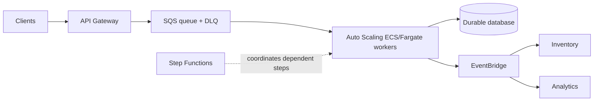

| Decision | Prefer | Why | Alternative / boundary |
|---|---|---|---|
| Primary selection | Use SQS for buffered work consumed once, SNS for straightforward fan-out, EventBridge for content-based event routing, and Step Functions for stateful multi-step orchestration. | Fits the stated outcome with managed operations. | A direct API call is appropriate only when the caller truly needs an immediate response. Use API Gateway for managed APIs and an ALB for HTTP services behind compute. |
| Operational control | Managed AWS service first | Removes undifferentiated patching, failover, and fleet work. | Choose self-managed only when a named compatibility/control constraint requires it. |
| Scale signal | Measure the bottleneck | Use a business or saturation metric rather than a guessed server count. | Alarm before an explicit quota or capacity ceiling is reached. |

**Configuration knobs that make the design real**

- Set SQS visibility timeout longer than processing time, DLQ max receives, retention, long polling, FIFO message group/deduplication IDs, worker concurrency, and idempotency key.
- Define least-privilege IAM roles and resource policies before deploying the data path.
- Use CloudWatch metrics, alarms, logs, and a runbook that says who owns a failed request, job, or recovery.
- Test the failure path, not only the healthy request path: deny an expected permission, stop one target, and verify the design degrades as intended.

**Failure and operational implications**

- A too-short visibility timeout duplicates work. No DLQ hides poison messages. Non-idempotent consumers can double-charge when delivery is retried.
- Make retrying components idempotent. A retry must not create a duplicate order, object, record, or payment.
- Watch an outcome metric as well as infrastructure metrics: error rate, queue age, p95 latency, replication lag, recovery time, or cache hit rate.
- Treat quotas as architecture inputs. Request increases and pre-create standby capacity before an incident, not during it.

**Selection drill**

1. Name the hard constraint: security boundary, availability target, latency, throughput, data model, compliance rule, or cost goal.
2. Eliminate any answer that violates that constraint even if it solves a different problem well.
3. Prefer the answer with the fewest operational components when it satisfies every stated requirement.
4. Check whether the requirement implies an AZ failure, Region failure, a public path, cross-account access, or interruption tolerance.

> **Exam signal:** Look for **burst absorption, asynchronous processing, retry later, fan-out, independent release cadence**.
>
> **Common trap:** SQS delivers work; it is not a workflow engine and does not make processing exactly once by itself.
>
> **Official coverage retained:** APIs, caching, microservices, events, horizontal scaling, containers, queues/topics, serverless, read replicas, workflow orchestration.

**ELI5:** Build components like separate queues at a busy kitchen. One slow station should not stop ordering, and more cooks can be added when demand rises.

**Why it matters:** Independent scaling and asynchronous communication prevent a traffic spike or one failed component from taking down the whole system.

**Service selection and alternatives**

| Need | Choose | Why / alternative |
|---|---|---|
| Buffered work, one consumer per message | Amazon SQS | Decouples producers and workers; SNS/EventBridge fan out events to many targets. |
| Event routing by rule | Amazon EventBridge | Route events by content; SNS is simpler publish/subscribe notification. |
| API front door | Amazon API Gateway | Managed REST/HTTP API controls; ALB is often a better fit for HTTP services behind containers/EC2. |
| Stateful workflow | AWS Step Functions | Coordinates retries and steps; use SQS for simple independent jobs. |
| Run containers without servers | AWS Fargate with ECS/EKS | Choose ECS for AWS-native simplicity, EKS when Kubernetes compatibility/control is needed. |
| Shared/cache read data | ElastiCache or read replica | Cache repeated reads; replicas scale relational database reads. |

**Realistic scenario:** An order API places a message on SQS and returns quickly. Auto Scaling workers process orders at their own rate. SNS sends the order event to inventory and analytics. Step Functions manages the payment-and-shipping workflow with retries.

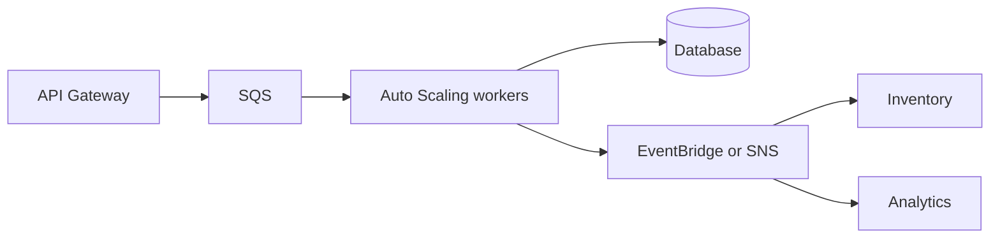

**Official scope map — knowledge**

- **API creation and management:** recognize API Gateway and REST APIs as managed API front doors.
- **Managed-service use cases:** use services such as Transfer Family, SQS, and Secrets Manager when their managed capability matches the requirement.
- **Caching:** cache repeated, safe-to-cache reads to lower latency and backend load.
- **Microservices principles:** stateless services scale horizontally more easily; state belongs in durable shared services.
- **Event-driven design:** events let producers and consumers evolve and fail independently.
- **Horizontal versus vertical scaling:** add instances for horizontal scale; enlarge one instance for vertical scale, with a ceiling.
- **Edge accelerators:** CDNs move cacheable content near viewers.
- **Container migration:** package applications into images, store them in ECR, and run with ECS, EKS, or Fargate.
- **Load balancing:** ALB routes Layer 7 HTTP/HTTPS traffic by host, path, and header.
- **Multi-tier architecture:** separate web, application, and data concerns with controlled paths.
- **Queues and messaging:** distinguish queue delivery from publish/subscribe fan-out.
- **Serverless patterns:** Lambda and Fargate scale managed compute without server fleet management.
- **Storage characteristics:** object, file, and block storage solve different persistence and sharing needs.
- **Container orchestration:** ECS and EKS schedule, replace, and scale containers.
- **Read replicas:** use them for read-heavy relational workloads, not to increase writes.
- **Workflow orchestration:** Step Functions coordinates dependent steps, branches, retries, and error handling.

**Official scope map — skills**

- **Event-driven, microservice, and multi-tier designs:** select the pattern that isolates components and meets communication requirements.
- **Component scaling strategy:** pick the metric and scaling method for each tier, not one fixed capacity for all tiers.
- **Loose-coupling services:** use queues, topics, events, and asynchronous workflow where direct dependency is unnecessary.
- **When to use containers:** choose containers for packaged long-running services or portability; choose Lambda for short event-driven functions.
- **When to use serverless:** choose Lambda/Fargate patterns to remove server operations when runtime constraints fit.
- **Purpose-built compute, storage, networking, and database:** match the workload’s access and processing pattern rather than forcing every need into EC2 and one database.
- **Purpose-built services:** prefer managed AWS services when they deliver the needed function with less operational work.

> **Exam Tip:** “Absorb bursts,” “retry later,” and “decouple” are queue clues; “fan out” is an SNS or EventBridge clue.
>
> **Exam Trap:** SQS does not make a process synchronous or instantly complete. It stores work until a consumer succeeds.
>
> **Exam Keywords:** SQS, SNS, EventBridge, API Gateway, ALB, Step Functions, Lambda, Fargate, ECS, EKS, stateless, read replica, cache.

### Task 2.2: Design highly available and/or fault-tolerant architectures

#### Architecture studio

**ELI5 expansion:** Do not put all spare tires in the same car: distribute failure handling across instances, AZs, and—when required—Regions.

**Reference architecture:** Health check → load balancer → targets in multiple AZs → managed database failover → protected recovery copy outside the Region.

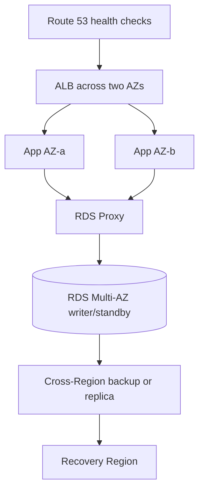

| Decision | Prefer | Why | Alternative / boundary |
|---|---|---|---|
| Primary selection | Use Multi-AZ for local availability, read replicas for read scaling, Route 53 health checks for DNS failover, and the DR pattern matching RPO/RTO. | Fits the stated outcome with managed operations. | Backup/restore minimizes cost; pilot light keeps core services ready; warm standby keeps a reduced environment running; active-active minimizes downtime at the highest complexity/cost. |
| Operational control | Managed AWS service first | Removes undifferentiated patching, failover, and fleet work. | Choose self-managed only when a named compatibility/control constraint requires it. |
| Scale signal | Measure the bottleneck | Use a business or saturation metric rather than a guessed server count. | Alarm before an explicit quota or capacity ceiling is reached. |

**Configuration knobs that make the design real**

- Place ASG capacity in two or more AZs; configure health checks/grace periods, RDS Multi-AZ, backup copy destination, Route 53 failover records, alarms, and RDS Proxy connection limits.
- Define least-privilege IAM roles and resource policies before deploying the data path.
- Use CloudWatch metrics, alarms, logs, and a runbook that says who owns a failed request, job, or recovery.
- Test the failure path, not only the healthy request path: deny an expected permission, stop one target, and verify the design degrades as intended.

**Failure and operational implications**

- One-AZ workers, one NAT path, or one writer without a tested failover is a single point of failure. Standby capacity can fail quotas during a regional event.
- Make retrying components idempotent. A retry must not create a duplicate order, object, record, or payment.
- Watch an outcome metric as well as infrastructure metrics: error rate, queue age, p95 latency, replication lag, recovery time, or cache hit rate.
- Treat quotas as architecture inputs. Request increases and pre-create standby capacity before an incident, not during it.

**Selection drill**

1. Name the hard constraint: security boundary, availability target, latency, throughput, data model, compliance rule, or cost goal.
2. Eliminate any answer that violates that constraint even if it solves a different problem well.
3. Prefer the answer with the fewest operational components when it satisfies every stated requirement.
4. Check whether the requirement implies an AZ failure, Region failure, a public path, cross-account access, or interruption tolerance.

> **Exam signal:** Look for **survive an AZ loss, fail over automatically, business continuity, RPO, RTO, no single point of failure**.
>
> **Common trap:** Multi-AZ protects a database writer locally; it does not make a cross-Region recovery plan. A read replica is normally asynchronous and primarily serves reads.
>
> **Official coverage retained:** AZ/Region design, Route 53, DR/RPO/RTO, distributed design, failover, immutable replacement, proxies, quotas, durable replication, monitoring/X-Ray.

**ELI5:** Availability means the service stays usable; fault tolerance means it can keep working even when parts fail. Spread important parts so one failure cannot end the service.

**Why it matters:** A single AZ, instance, NAT device, database writer, or manual recovery step can become a single point of failure.

**Service selection and alternatives**

| Need | Choose | Why / alternative |
|---|---|---|
| Automatic local failure recovery | Multi-AZ managed service / Auto Scaling across AZs | Survives an instance or AZ problem; read replicas serve read scale. |
| DNS-based endpoint failover | Route 53 health checks and failover routing | Direct traffic to a healthy endpoint. |
| Connection pooling/protection | Amazon RDS Proxy | Reuses connections and helps applications handle database failovers. |
| Disaster recovery | Backup/restore, pilot light, warm standby, or active-active | Choose from lowest cost/slowest recovery to highest cost/fastest recovery. |
| Trace a request across services | AWS X-Ray | Shows request path and latency; CloudWatch gives operational metrics/logs. |

**Realistic scenario:** A payment API has an ALB and Auto Scaling group in two AZs, RDS Multi-AZ with RDS Proxy, and Route 53 health checks. Backups are copied to another Region. The business allows minutes of recovery but little data loss, so it uses warm standby rather than backup-and-restore only.

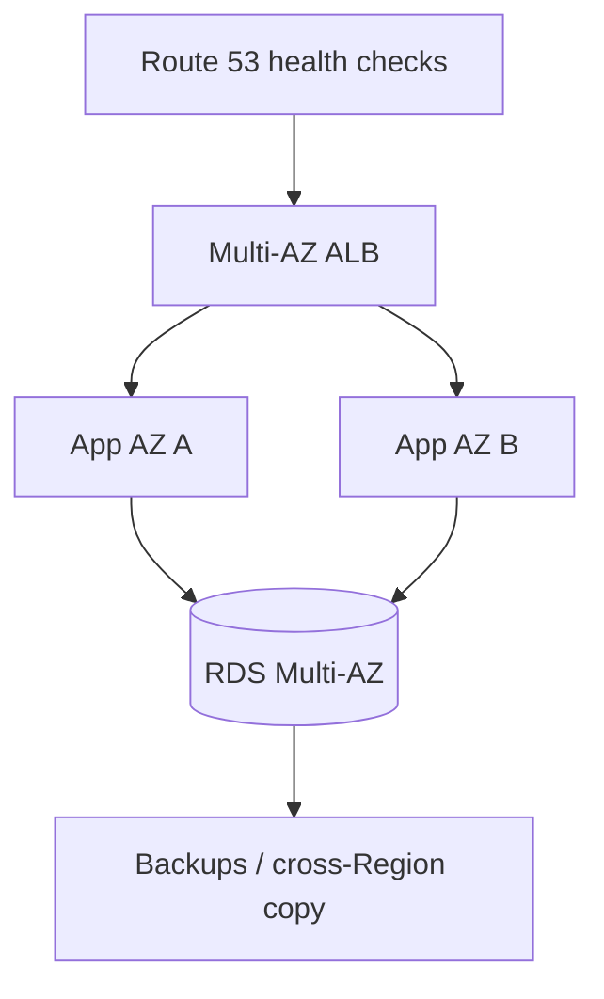

**Official scope map — knowledge**

- **Global infrastructure and Route 53:** use AZs for local redundancy, Regions for geographic recovery, and Route 53 for DNS and health-based routing.
- **Managed-service use cases:** recognize managed capabilities, including services such as Comprehend and Polly, when a managed application feature removes custom infrastructure.
- **Networking basics:** route tables determine subnet traffic paths and must support the intended failover/network design.
- **DR strategies:** compare backup/restore, pilot light, warm standby, active-active, plus RPO and RTO.
- **Distributed patterns:** use redundancy, idempotency, retries, and independently replaceable components.
- **Failover:** detect unhealthy components and redirect or promote a replacement.
- **Immutable infrastructure:** replace a bad artifact or instance rather than repairing it in place.
- **Load balancing:** health checks and multi-target routing remove a single application server dependency.
- **Proxy concepts:** RDS Proxy manages and pools database connections around application scaling/failover.
- **Quotas and throttling:** know service limits, request increases, and capacity needs in standby environments.
- **Storage durability and replication:** choose backup and replication behavior that preserves data through the expected failure.
- **Workload visibility:** use X-Ray tracing and operational telemetry to observe failures and latency.

**Official scope map — skills**

- **Automation for integrity:** use repeatable deployment and replacement automation so infrastructure returns to a known good state.
- **HA/fault tolerance across AZs or Regions:** select services and placement that meet the stated failure scope.
- **Business metrics:** choose availability, latency, error-rate, queue-depth, and recovery metrics that reflect the requirement.
- **Single-point-of-failure mitigation:** add redundancy and health-based routing for critical components.
- **Data durability and availability:** use backups, replication, and tested restores.
- **Appropriate DR:** map RPO/RTO and budget to backup/restore, pilot light, warm standby, or active-active.
- **Legacy and non-cloud-native reliability:** use services such as load balancers, proxies, replication, and migration patterns when code changes are limited.
- **Purpose-built services:** select managed services where their built-in recovery and availability satisfy the need.

> **Exam Tip:** Match DR choices to the numbers: lower RTO/RPO generally requires more running infrastructure and cost.
>
> **Exam Trap:** Multi-AZ is not a cross-Region DR strategy, and a read replica is not the same thing as Multi-AZ synchronous standby.
>
> **Exam Keywords:** Multi-AZ, Route 53 failover, health check, RPO, RTO, pilot light, warm standby, active-active, immutable, RDS Proxy, quotas, X-Ray.

---

## Domain 3: Design High-Performing Architectures (24%)

### Task 3.1: Determine high-performing and/or scalable storage solutions

#### Architecture studio

**ELI5 expansion:** A bucket is for named objects, a shared folder is for many machines, and a block volume is a disk for one server.

**Reference architecture:** Application access pattern → correct storage abstraction → performance configuration → backup/replication and lifecycle controls.

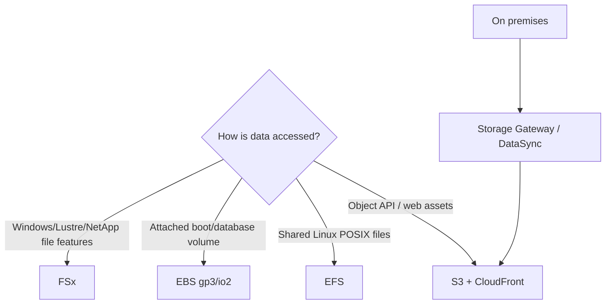

| Decision | Prefer | Why | Alternative / boundary |
|---|---|---|---|
| Primary selection | Use S3 for massive durable objects, EFS for elastic shared Linux NFS, EBS for low-latency EC2 block volumes, and FSx for specialized file systems. | Fits the stated outcome with managed operations. | Storage Gateway exposes cloud storage to hybrid applications; DataSync moves files. Neither replaces an EFS mount for a cloud-native shared POSIX workload. |
| Operational control | Managed AWS service first | Removes undifferentiated patching, failover, and fleet work. | Choose self-managed only when a named compatibility/control constraint requires it. |
| Scale signal | Measure the bottleneck | Use a business or saturation metric rather than a guessed server count. | Alarm before an explicit quota or capacity ceiling is reached. |

**Configuration knobs that make the design real**

- Set EBS volume type/size/IOPS/throughput, EFS performance and throughput mode/access points, S3 multipart upload/prefix/lifecycle, and FSx deployment/file-system type.
- Define least-privilege IAM roles and resource policies before deploying the data path.
- Use CloudWatch metrics, alarms, logs, and a runbook that says who owns a failed request, job, or recovery.
- Test the failure path, not only the healthy request path: deny an expected permission, stop one target, and verify the design degrades as intended.

**Failure and operational implications**

- Using EBS as a shared filesystem creates attachment and consistency problems. Tiny S3 objects can create request overhead. Under-provisioned IOPS becomes database latency.
- Make retrying components idempotent. A retry must not create a duplicate order, object, record, or payment.
- Watch an outcome metric as well as infrastructure metrics: error rate, queue age, p95 latency, replication lag, recovery time, or cache hit rate.
- Treat quotas as architecture inputs. Request increases and pre-create standby capacity before an incident, not during it.

**Selection drill**

1. Name the hard constraint: security boundary, availability target, latency, throughput, data model, compliance rule, or cost goal.
2. Eliminate any answer that violates that constraint even if it solves a different problem well.
3. Prefer the answer with the fewest operational components when it satisfies every stated requirement.
4. Check whether the requirement implies an AZ failure, Region failure, a public path, cross-account access, or interruption tolerance.

> **Exam signal:** Look for **shared Linux files, object archive, boot disk, high IOPS, hybrid file cache**.
>
> **Common trap:** S3 is object storage, not a POSIX filesystem; EBS is block storage, not a multi-instance shared file system.
>
> **Official coverage retained:** hybrid storage, S3/EFS/EBS characteristics, object/file/block, storage performance knobs, scaling capacity and throughput.

**ELI5:** Pick storage by how the application touches data: named objects, a shared folder, or a disk attached to a server.

**Why it matters:** A correct but mismatched storage type creates latency, throughput, sharing, or scaling limits.

**Service selection and alternatives**

| Need | Choose | Why / alternative |
|---|---|---|
| Massive objects, web assets, data lake | Amazon S3 | Virtually scalable object storage; use CloudFront for faster global delivery. |
| Shared POSIX file system for Linux | Amazon EFS | Elastic NFS shared by many compute nodes. |
| Low-latency block volume for EC2 | Amazon EBS | Choose SSD volume types for transactional IOPS and HDD for throughput-oriented workloads. |
| Hybrid cached local file access | Storage Gateway | Connects on-premises applications to AWS storage. |

**Realistic scenario:** A rendering fleet needs shared source files, so it mounts EFS. Its database server uses provisioned-IOPS EBS. Completed videos go to S3 and CloudFront distributes the popular results.

**Official scope map — knowledge**

- **Hybrid storage:** use Storage Gateway, DataSync, or suitable file/object patterns when on-premises and AWS data must work together.
- **Storage services:** distinguish S3, EFS, and EBS use cases and configurations.
- **Object, file, block:** objects are API-addressed data, files are shared hierarchical filesystems, and blocks are virtual disks for an operating system.

**Official scope map — skills**

- **Performance configuration:** select throughput, IOPS, access mode, caching, and location that meet demand.
- **Future scaling:** choose a storage service whose capacity and throughput growth model fits expected demand.

> **Exam Tip:** “Many Linux instances need the same files” points to EFS; “boot volume or database disk” points to EBS.
>
> **Exam Trap:** EBS is not a shared multi-instance filesystem by itself.
>
> **Exam Keywords:** S3, EFS, EBS, object, file, block, IOPS, throughput, Storage Gateway.

### Task 3.2: Design high-performing and elastic compute solutions

#### Architecture studio

**ELI5 expansion:** Use the smallest engine that fits, then add engines based on the queue or request pressure that actually predicts slowdowns.

**Reference architecture:** Request or event → purpose-built compute → metric-based scaling → durable state in managed services.

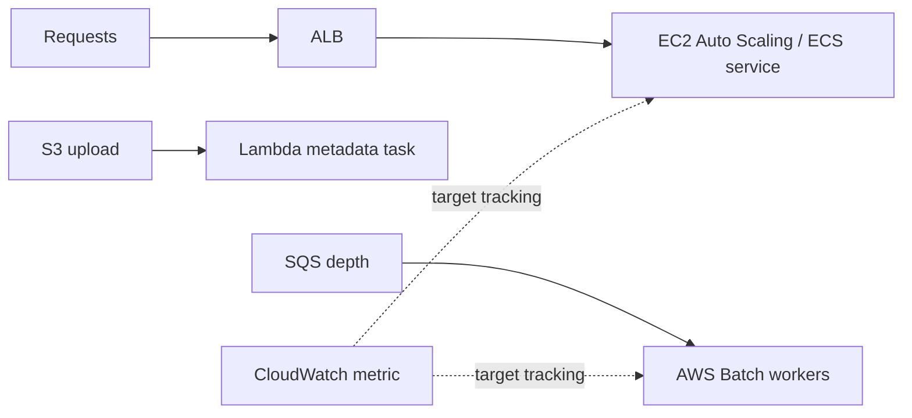

| Decision | Prefer | Why | Alternative / boundary |
|---|---|---|---|
| Primary selection | Choose Lambda for short event-driven code, Fargate for containers without hosts, EC2 for host-level control/special hardware, Batch for queued batch jobs, and EMR for big-data frameworks. | Fits the stated outcome with managed operations. | ECS is AWS-native container orchestration; EKS fits Kubernetes operational requirements. Vertical scaling is a short-term option with a machine ceiling. |
| Operational control | Managed AWS service first | Removes undifferentiated patching, failover, and fleet work. | Choose self-managed only when a named compatibility/control constraint requires it. |
| Scale signal | Measure the bottleneck | Use a business or saturation metric rather than a guessed server count. | Alarm before an explicit quota or capacity ceiling is reached. |

**Configuration knobs that make the design real**

- Set ASG min/max/desired and target tracking metric; configure Lambda memory, timeout, reserved/provisioned concurrency; set ECS task CPU/memory and service autoscaling; select EC2 family.
- Define least-privilege IAM roles and resource policies before deploying the data path.
- Use CloudWatch metrics, alarms, logs, and a runbook that says who owns a failed request, job, or recovery.
- Test the failure path, not only the healthy request path: deny an expected permission, stop one target, and verify the design degrades as intended.

**Failure and operational implications**

- Scaling workers on CPU instead of queue age/depth can react too late. Reserved concurrency can protect a downstream database but can also throttle the function deliberately.
- Make retrying components idempotent. A retry must not create a duplicate order, object, record, or payment.
- Watch an outcome metric as well as infrastructure metrics: error rate, queue age, p95 latency, replication lag, recovery time, or cache hit rate.
- Treat quotas as architecture inputs. Request increases and pre-create standby capacity before an incident, not during it.

**Selection drill**

1. Name the hard constraint: security boundary, availability target, latency, throughput, data model, compliance rule, or cost goal.
2. Eliminate any answer that violates that constraint even if it solves a different problem well.
3. Prefer the answer with the fewest operational components when it satisfies every stated requirement.
4. Check whether the requirement implies an AZ failure, Region failure, a public path, cross-account access, or interruption tolerance.

> **Exam signal:** Look for **spiky requests, event-driven under 15 minutes, containerized service, batch queue, GPU or memory-bound workload**.
>
> **Common trap:** Lambda memory also changes CPU allocation; more memory can lower duration. It is not automatically the cheapest option for continuously busy long-running work.
>
> **Official coverage retained:** Batch/EMR/Fargate, distributed/edge compute, queues, EC2 and AWS Auto Scaling, Lambda patterns, ECS/EKS, decoupled components, metrics, resource sizing.

**ELI5:** Compute is the engine. Choose the engine type, make more engines appear when demand rises, and avoid making every engine wait on a slow neighbor.

**Why it matters:** Correct scaling uses a relevant metric and the smallest suitable compute platform, not just larger servers.

**Service selection and alternatives**

| Need | Choose | Why / alternative |
|---|---|---|
| General customizable server | Amazon EC2 | Pick instance family for CPU, memory, storage, network, or accelerator demand. |
| Event-driven short execution | AWS Lambda | Automatically scales by concurrency; tune memory because CPU scales with it. |
| Container service | ECS/EKS with Fargate or EC2 | Fargate removes node management; EC2 capacity offers more host control. |
| Batch job queue | AWS Batch | Schedules batch work on appropriate compute. |
| Big-data processing | Amazon EMR | Managed distributed data-processing framework. |

**Realistic scenario:** A video service puts uploads in S3, invokes Lambda for light metadata work, and submits heavy transcoding to AWS Batch. API containers scale on target request count per target, while queue workers scale on SQS depth.

**Official scope map — knowledge**

- **Compute use cases:** identify Batch, EMR, and Fargate alongside EC2 and Lambda.
- **Distributed and edge computing:** place processing near users or data when latency and geography require it.
- **Queues and publish/subscribe:** use asynchronous messaging to remove direct scaling dependencies.
- **Scaling capabilities:** understand EC2 Auto Scaling and AWS Auto Scaling for target resources.
- **Serverless patterns:** use Lambda/Fargate when managed elastic execution fits the runtime.
- **Container orchestration:** use ECS/EKS to schedule and operate container workloads.

**Official scope map — skills**

- **Independent scale:** decouple workloads so an API, worker, database, and cache can each scale on its own demand.
- **Scaling metrics and conditions:** choose CPU, request count, latency, concurrency, queue depth, or custom metrics that predict pressure.
- **Compute options/features:** match EC2 family and feature set to workload requirements.
- **Resource type and size:** set resources such as Lambda memory or instance size based on measured/business demand.

> **Exam Tip:** A queue depth metric is usually better than CPU for scaling asynchronous workers.
>
> **Exam Trap:** More Lambda memory can improve performance because it also increases available CPU; memory is not only a capacity setting.
>
> **Exam Keywords:** EC2 Auto Scaling, target tracking, Lambda concurrency, Fargate, ECS, EKS, Batch, EMR, queue depth, instance family.

### Task 3.3: Determine high-performing database solutions

#### Architecture studio

**ELI5 expansion:** Choose the database by the question you ask of the data, then reduce work with replicas, a cache, and sane connection management.

**Reference architecture:** Application → cache check → proxy-managed relational writes/reads or a purpose-built NoSQL store → replica/cache for read pressure.

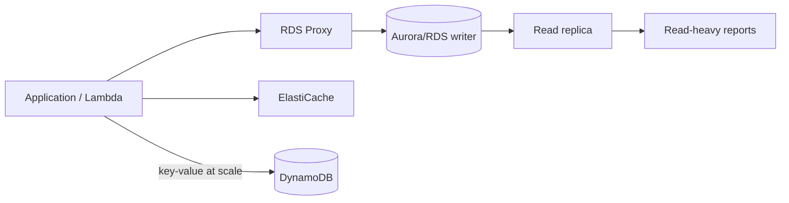

| Decision | Prefer | Why | Alternative / boundary |
|---|---|---|---|
| Primary selection | Use Aurora/RDS for transactions and SQL, DynamoDB for predictable key-based access at scale, ElastiCache for hot reads, and RDS Proxy for connection bursts. | Fits the stated outcome with managed operations. | Use a read replica to scale relational reads. Use Multi-AZ for high availability. Use Redshift for warehouse analytics, not OLTP transaction processing. |
| Operational control | Managed AWS service first | Removes undifferentiated patching, failover, and fleet work. | Choose self-managed only when a named compatibility/control constraint requires it. |
| Scale signal | Measure the bottleneck | Use a business or saturation metric rather than a guessed server count. | Alarm before an explicit quota or capacity ceiling is reached. |

**Configuration knobs that make the design real**

- Choose engine/version/instance class, Multi-AZ, replica count, IOPS, Aurora capacity range, DynamoDB partition key and capacity mode, cache TTL/eviction, and proxy connection limits.
- Define least-privilege IAM roles and resource policies before deploying the data path.
- Use CloudWatch metrics, alarms, logs, and a runbook that says who owns a failed request, job, or recovery.
- Test the failure path, not only the healthy request path: deny an expected permission, stop one target, and verify the design degrades as intended.

**Failure and operational implications**

- A hot DynamoDB partition throttles despite spare table capacity. Cache without TTL/invalidation serves stale data. Thousands of Lambda connections can exhaust a relational DB without a proxy.
- Make retrying components idempotent. A retry must not create a duplicate order, object, record, or payment.
- Watch an outcome metric as well as infrastructure metrics: error rate, queue age, p95 latency, replication lag, recovery time, or cache hit rate.
- Treat quotas as architecture inputs. Request increases and pre-create standby capacity before an incident, not during it.

**Selection drill**

1. Name the hard constraint: security boundary, availability target, latency, throughput, data model, compliance rule, or cost goal.
2. Eliminate any answer that violates that constraint even if it solves a different problem well.
3. Prefer the answer with the fewest operational components when it satisfies every stated requirement.
4. Check whether the requirement implies an AZ failure, Region failure, a public path, cross-account access, or interruption tolerance.

> **Exam signal:** Look for **joins and transactions, key lookup at massive scale, hot repeated reads, too many connections, read-only reports**.
>
> **Common trap:** A Multi-AZ standby does not accept read traffic for scale. Adding a read replica does not solve a write bottleneck.
>
> **Official coverage retained:** database location, cache, access pattern, capacity/IOPS, connections/proxies, engines/migrations, replication, relational/non-relational/in-memory selection.

**ELI5:** A database should match the shape of the question: transactions and joins, key-value access at scale, a graph, a document, a cache, or analytics.

**Why it matters:** Database performance comes from data model, access pattern, capacity, connections, replicas, and caching—not merely a larger instance.

**Service selection and alternatives**

| Need | Choose | Why / alternative |
|---|---|---|
| Relational transactions | Amazon RDS or Aurora | Choose compatible engine and managed relational features; Aurora targets cloud-native performance/availability. |
| Predictable key-value scale | Amazon DynamoDB | Serverless NoSQL access by key; design partition keys for distribution. |
| Low-latency repeated reads | ElastiCache | Keep hot values in memory; cache does not replace the source database. |
| Read scale for relational DB | Read replicas | Send read-only traffic to replicas. |
| Too many short database connections | RDS Proxy | Pools and manages application connections. |

**Realistic scenario:** A retail catalog stores orders in Aurora, sends dashboards to read replicas, caches popular product pages in ElastiCache, and uses RDS Proxy so thousands of Lambda invocations do not overwhelm connections.

**Official scope map — knowledge**

- **Infrastructure scope:** understand AZ and Region placement for database latency, availability, and replication.
- **Caching strategies/services:** use ElastiCache to reduce repeat read pressure and latency.
- **Access patterns:** separate read-intensive, write-intensive, key-based, relational, and analytical requirements.
- **Capacity planning:** know capacity units, instance types, and Provisioned IOPS as sizing tools.
- **Connections and proxies:** manage connection storms and reuse with proxy patterns.
- **Engines and migration:** choose engines for requirements and distinguish homogeneous from heterogeneous migrations.
- **Replication:** understand read replicas and their read-scaling/replication role.
- **Database types:** compare serverless, relational, non-relational, and in-memory services.

**Official scope map — skills**

- **Read replicas:** configure and route read traffic to replicas when read demand is the bottleneck.
- **Database architecture:** select placement, availability, scaling, connection, backup, and cache components.
- **Database engine:** choose a suitable engine, such as MySQL or PostgreSQL, when compatibility/features matter.
- **Database type:** choose Aurora for relational managed workloads and DynamoDB for scalable key-value/document access where the access pattern fits.
- **Caching integration:** put caching before a read-heavy backend and define invalidation/TTL behavior.

> **Exam Tip:** First identify the access pattern. “Known key, huge scale, single-digit milliseconds” strongly favors DynamoDB.
>
> **Exam Trap:** A Multi-AZ standby does not accept read traffic for read scaling; use read replicas for that requirement.
>
> **Exam Keywords:** Aurora, RDS, DynamoDB, ElastiCache, read replica, Multi-AZ, RDS Proxy, IOPS, relational, NoSQL.

### Task 3.4: Determine high-performing and/or scalable network architectures

#### Architecture studio

**ELI5 expansion:** Take each kind of traffic through the shortest suitable entrance, then use a traffic director that understands its protocol.

**Reference architecture:** Viewer or on-premises source → edge/connection service → protocol-matched load balancer → private workloads and private service endpoints.

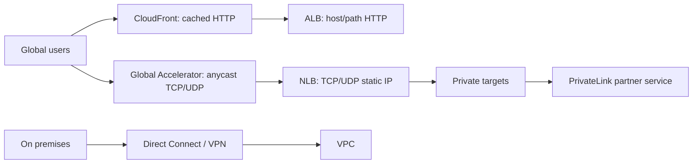

| Decision | Prefer | Why | Alternative / boundary |
|---|---|---|---|
| Primary selection | CloudFront caches web content; Global Accelerator improves global routing with static anycast IPs; ALB is Layer 7; NLB is Layer 4; GWLB inserts appliances. | Fits the stated outcome with managed operations. | PrivateLink publishes one private service. VPC peering connects two VPCs directly; Transit Gateway is a scalable hub for many VPCs; Direct Connect is dedicated hybrid connectivity. |
| Operational control | Managed AWS service first | Removes undifferentiated patching, failover, and fleet work. | Choose self-managed only when a named compatibility/control constraint requires it. |
| Scale signal | Measure the bottleneck | Use a business or saturation metric rather than a guessed server count. | Alarm before an explicit quota or capacity ceiling is reached. |

**Configuration knobs that make the design real**

- Plan non-overlapping CIDRs, subnet sizes, route tables, health checks, ALB rules, NLB listeners/target groups, CloudFront cache behavior/origin, and Global Accelerator endpoint groups.
- Define least-privilege IAM roles and resource policies before deploying the data path.
- Use CloudWatch metrics, alarms, logs, and a runbook that says who owns a failed request, job, or recovery.
- Test the failure path, not only the healthy request path: deny an expected permission, stop one target, and verify the design degrades as intended.

**Failure and operational implications**

- Overlapping CIDRs block future peering. A wrong route table blackholes traffic. CloudFront forwarding every request or cookie can destroy cache hit ratio.
- Make retrying components idempotent. A retry must not create a duplicate order, object, record, or payment.
- Watch an outcome metric as well as infrastructure metrics: error rate, queue age, p95 latency, replication lag, recovery time, or cache hit rate.
- Treat quotas as architecture inputs. Request increases and pre-create standby capacity before an incident, not during it.

**Selection drill**

1. Name the hard constraint: security boundary, availability target, latency, throughput, data model, compliance rule, or cost goal.
2. Eliminate any answer that violates that constraint even if it solves a different problem well.
3. Prefer the answer with the fewest operational components when it satisfies every stated requirement.
4. Check whether the requirement implies an AZ failure, Region failure, a public path, cross-account access, or interruption tolerance.

> **Exam signal:** Look for **global static IP, cache content at edge, path routing, UDP/TCP, private partner service, many VPCs**.
>
> **Common trap:** CloudFront is a CDN cache; Global Accelerator is not a general cache. PrivateLink is service-level exposure, not full network transit.
>
> **Official coverage retained:** edge services, subnet tiers/routing/addressing, ELB, VPN/Direct Connect/PrivateLink, global/hybrid topology, placement and scalable network configuration.

**ELI5:** Networking is the road system: choose the closest entrance, enough lanes, correct routes, and a traffic director that understands the protocol.

**Why it matters:** A workload can have fast compute and storage but still be slow because traffic crosses unnecessary distance, routes incorrectly, or uses the wrong load balancer.

**Service selection and alternatives**

| Need | Choose | Why / alternative |
|---|---|---|
| Cached global HTTP content | CloudFront | CDN edge caching for cacheable web content. |
| Global TCP/UDP acceleration | AWS Global Accelerator | Anycast static IPs and AWS backbone routing; not primarily a cache. |
| HTTP/HTTPS routing | Application Load Balancer | Layer 7 host/path routing. |
| TCP/UDP or static IP load balancing | Network Load Balancer | Layer 4 performance and static addresses. |
| Private service exposure across VPCs/accounts | PrivateLink | Private endpoint to a service; VPC peering is network-to-network connectivity. |

**Realistic scenario:** A global game API uses Global Accelerator for fast regional entry, an NLB for TCP traffic, private subnets for game servers, and PrivateLink to consume a partner service without exposing it to the internet.

**Official scope map — knowledge**

- **Edge services:** compare CloudFront caching with Global Accelerator traffic acceleration.
- **Network architecture:** plan subnet tiers, route tables, CIDR/IP address growth, and secure placement.
- **Load balancing:** understand ALB behavior and where another ELB type fits.
- **Connection options:** compare VPN, Direct Connect, and PrivateLink for hybrid or private connectivity.

**Official scope map — skills**

- **Topology:** create global, hybrid, and multi-tier layouts matching traffic paths and trust boundaries.
- **Scalable configuration:** reserve address space and choose routing/connectivity that can grow.
- **Resource placement:** place resources in the Region, AZ, subnet, and edge path that meet latency and access requirements.
- **Load-balancing strategy:** choose ALB, NLB, or Gateway Load Balancer based on protocol and inspection needs.

> **Exam Tip:** CloudFront caches; Global Accelerator accelerates traffic to healthy regional endpoints and supplies static anycast IPs.
>
> **Exam Trap:** PrivateLink exposes a specific service privately; it is not a full replacement for VPC peering or Transit Gateway.
>
> **Exam Keywords:** CloudFront, Global Accelerator, ALB, NLB, GWLB, PrivateLink, VPN, Direct Connect, CIDR, route table.

### Task 3.5: Determine high-performing data ingestion and transformation solutions

#### Architecture studio

**ELI5 expansion:** Bring data in at the speed it arrives, store it in a query-friendly shape, and transform it with the least machinery that meets the time window.

**Reference architecture:** Batch or stream source → secure ingestion → S3 lake → catalog/transform → governed query → visualization.

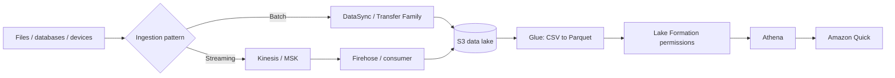

| Decision | Prefer | Why | Alternative / boundary |
|---|---|---|---|
| Primary selection | Use Glue for managed ETL, Athena for SQL directly on S3, Kinesis for AWS-native streams, MSK for Kafka compatibility, DataSync for online file movement, and Snow Family for constrained/offline transfers. | Fits the stated outcome with managed operations. | Firehose delivers streams with minimal consumer operations; Kinesis Data Streams suits custom real-time consumers. EMR fits large/custom distributed transforms. |
| Operational control | Managed AWS service first | Removes undifferentiated patching, failover, and fleet work. | Choose self-managed only when a named compatibility/control constraint requires it. |
| Scale signal | Measure the bottleneck | Use a business or saturation metric rather than a guessed server count. | Alarm before an explicit quota or capacity ceiling is reached. |

**Configuration knobs that make the design real**

- Choose stream shard/on-demand capacity and retention; configure Glue workers/job bookmarks/partitions; set S3 prefixes and Parquet compression; configure Lake Formation grants and Athena workgroup output controls.
- Define least-privilege IAM roles and resource policies before deploying the data path.
- Use CloudWatch metrics, alarms, logs, and a runbook that says who owns a failed request, job, or recovery.
- Test the failure path, not only the healthy request path: deny an expected permission, stop one target, and verify the design degrades as intended.

**Failure and operational implications**

- Small CSV files increase query cost and job overhead. A public upload endpoint exposes data. Missing partitions make Athena scan too much data; non-idempotent stream consumers duplicate results.
- Make retrying components idempotent. A retry must not create a duplicate order, object, record, or payment.
- Watch an outcome metric as well as infrastructure metrics: error rate, queue age, p95 latency, replication lag, recovery time, or cache hit rate.
- Treat quotas as architecture inputs. Request increases and pre-create standby capacity before an incident, not during it.

**Selection drill**

1. Name the hard constraint: security boundary, availability target, latency, throughput, data model, compliance rule, or cost goal.
2. Eliminate any answer that violates that constraint even if it solves a different problem well.
3. Prefer the answer with the fewest operational components when it satisfies every stated requirement.
4. Check whether the requirement implies an AZ failure, Region failure, a public path, cross-account access, or interruption tolerance.

> **Exam signal:** Look for **SQL on S3, scheduled ETL, CSV to Parquet, real-time telemetry, managed SFTP, data lake governance**.
>
> **Common trap:** Athena queries data; it is not the ETL engine. DataSync transfers files; Kinesis processes continuous records.
>
> **Official coverage retained:** Athena/Lake Formation/Quick, batch and streaming ingestion, DataSync/Storage Gateway, Glue, secure endpoints, throughput/volume, data lake/transfer/visualization/format transforms.

**ELI5:** Ingestion brings data in, transformation makes it usable, and analytics asks questions of it. Pick based on size, speed, frequency, and who needs the result.

**Why it matters:** A nightly batch, continuous stream, and petabyte migration need very different transfer, storage, compute, and security choices.

**Service selection and alternatives**

| Need | Choose | Why / alternative |
|---|---|---|
| Scheduled/serverless ETL | AWS Glue | Catalog and transform data; EMR fits more controlled large-scale frameworks. |
| Query S3 with SQL | Amazon Athena | Serverless query; Redshift is for managed warehouse workloads. |
| Real-time streaming | Amazon Kinesis or Amazon MSK | Kinesis is AWS-native streaming; MSK is managed Kafka compatibility. |
| Managed delivery to destinations | Amazon Data Firehose | Delivery stream to supported targets with minimal consumer management. |
| Move files/data | DataSync, Storage Gateway, Transfer Family, Snow Family | Choose online transfer, hybrid access, managed file protocol, or offline large transfer. |
| Govern a data lake | Lake Formation | Central permissions/governance for lake data. |

**Realistic scenario:** Factories upload hourly CSV files through Transfer Family. DataSync moves legacy files to S3. Glue converts CSV to Parquet and catalogs tables. Lake Formation governs access, Athena queries the lake, and Quick visualizes results. Live sensors use Kinesis instead.

**Official scope map — knowledge**

- **Analytics and visualization:** recognize Athena, Lake Formation, and Amazon Quick as services for query, governance, and visualization.
- **Ingestion frequency:** distinguish batch, micro-batch, near-real-time, and continuous ingestion.
- **Data transfer:** compare DataSync and Storage Gateway with other transfer choices.
- **Transformation:** use Glue for managed ETL and format transformation.
- **Secure ingestion endpoints:** protect upload/API access with authentication, authorization, encryption, and private connectivity where needed.
- **Size and speed:** choose transfer and processing based on volume, bandwidth, latency, and time window.
- **Streaming services:** select Kinesis or an appropriate streaming service when ordered/continuous records are needed.

**Official scope map — skills**

- **Data lakes:** build an S3-based lake with cataloging, governance, and controlled access.
- **Streaming architectures:** design producers, streams, consumers, buffering, and destination processing.
- **Transfer solutions:** select online, hybrid, managed protocol, or offline transfer mechanisms.
- **Visualization:** make transformed/queryable data available to a visualization service and audience.
- **Data-processing compute:** choose compute such as EMR when data-processing requirements exceed a simple managed transform.
- **Ingestion configuration:** set partitions, frequency, scaling, and delivery configuration for the demand.
- **Format transformation:** convert formats such as CSV to Parquet to improve analytics efficiency and cost.

> **Exam Tip:** “Query files in S3 with SQL without managing servers” is Athena; “catalog/transform ETL” is Glue.
>
> **Exam Trap:** Kinesis is for streams; DataSync is for moving existing files/data between storage locations.
>
> **Exam Keywords:** data lake, S3, Glue, Athena, Lake Formation, Kinesis, MSK, Firehose, DataSync, Storage Gateway, Parquet, EMR.

---

## Domain 4: Design Cost-Optimized Architectures (20%)

### Task 4.1: Design cost-optimized storage solutions

#### Architecture studio

**ELI5 expansion:** Keep each byte in the cheapest tier that still meets its required retrieval time, durability, sharing, and retention.

**Reference architecture:** Data creation → access classification → lifecycle transition/expiration → backup/restore policy → tagged cost review.

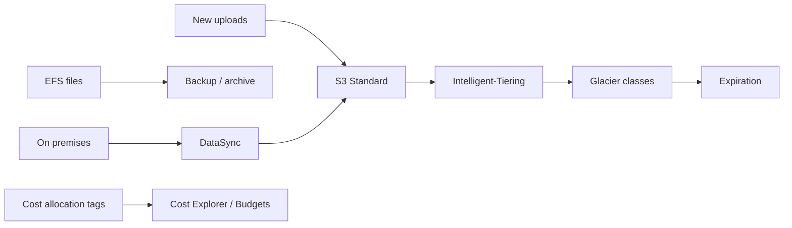

| Decision | Prefer | Why | Alternative / boundary |
|---|---|---|---|
| Primary selection | Use Intelligent-Tiering for unknown access patterns, Glacier classes for archival with retrieval trade-offs, EFS for shared files, FSx for specialized file systems, and EBS type by IOPS/throughput need. | Fits the stated outcome with managed operations. | Requester Pays shifts eligible request/transfer costs to downloaders. One Zone options reduce cost only when a single-AZ durability trade-off is acceptable. |
| Operational control | Managed AWS service first | Removes undifferentiated patching, failover, and fleet work. | Choose self-managed only when a named compatibility/control constraint requires it. |
| Scale signal | Measure the bottleneck | Use a business or saturation metric rather than a guessed server count. | Alarm before an explicit quota or capacity ceiling is reached. |

**Configuration knobs that make the design real**

- Set lifecycle transition/expiration and noncurrent-version rules, S3 versioning, Object Lock where required, EBS gp3 IOPS/throughput, EFS lifecycle, FSx capacity, and allocation tags.
- Define least-privilege IAM roles and resource policies before deploying the data path.
- Use CloudWatch metrics, alarms, logs, and a runbook that says who owns a failed request, job, or recovery.
- Test the failure path, not only the healthy request path: deny an expected permission, stop one target, and verify the design degrades as intended.

**Failure and operational implications**

- Archive retrieval can be slow and charged. Forgetting noncurrent versions silently grows cost. A lifecycle can conflict with legal retention unless Object Lock/retention is designed first.
- Make retrying components idempotent. A retry must not create a duplicate order, object, record, or payment.
- Watch an outcome metric as well as infrastructure metrics: error rate, queue age, p95 latency, replication lag, recovery time, or cache hit rate.
- Treat quotas as architecture inputs. Request increases and pre-create standby capacity before an incident, not during it.

**Selection drill**

1. Name the hard constraint: security boundary, availability target, latency, throughput, data model, compliance rule, or cost goal.
2. Eliminate any answer that violates that constraint even if it solves a different problem well.
3. Prefer the answer with the fewest operational components when it satisfies every stated requirement.
4. Check whether the requirement implies an AZ failure, Region failure, a public path, cross-account access, or interruption tolerance.

> **Exam signal:** Look for **unpredictable access, archive, deletion after N days, shared file system, charge downloaders, track team cost**.
>
> **Common trap:** Lowest storage price is not lowest total cost when retrieval, early deletion, request, backup, and operational requirements are ignored.
>
> **Official coverage retained:** Requester Pays, tags/billing tools, FSx/EFS/S3/EBS, backup, HDD/SSD, lifecycle, hybrid transfer, access/tiering, size and storage autoscaling.

**ELI5:** Store data in the cheapest place that still retrieves it fast enough, protects it long enough, and supports the way it is used.

**Why it matters:** Storage cost is driven by data size, requests, retrieval, copies, lifecycle duration, and transfer—not just price per GB.

**Service selection and alternatives**

| Need | Choose | Why / alternative |
|---|---|---|
| Unknown/changing S3 access pattern | S3 Intelligent-Tiering | Automatically moves eligible objects between access tiers. |
| Long-lived archive | S3 Glacier classes | Lower storage cost with retrieval trade-offs. |
| Frequent block storage | EBS SSD | Match SSD IOPS needs; HDD types suit throughput-oriented workloads. |
| Shared file data | EFS or FSx | EFS is elastic managed NFS; FSx targets specific filesystem needs. |
| Charge data consumers | S3 Requester Pays | Requester pays request/data-transfer charges for access. |

**Realistic scenario:** A media company keeps newly uploaded assets in S3 Standard, automatically transitions older originals through lifecycle rules to archive tiers, deletes temporary renders after 30 days, tags assets by business unit, and uses Cost Explorer to review storage growth.

**Official scope map — knowledge**

- **Access options:** recognize S3 Requester Pays for charging requesters for qualifying access costs.
- **Cost-management features:** use allocation tags and consolidated/multi-account billing to attribute and analyze spend.
- **Cost-management tools:** use Cost Explorer for analysis, Budgets for thresholds/alerts, and Cost and Usage Report for detailed data.
- **Storage service use cases:** compare FSx, EFS, S3, and EBS.
- **Backup strategies:** account for backup frequency, retention, copies, and restore needs.
- **Block storage:** distinguish HDD and SSD volume types for throughput, IOPS, and cost.
- **Data lifecycles:** move or remove data based on age and access needs.
- **Hybrid storage:** compare DataSync, Transfer Family, and Storage Gateway.
- **Access patterns:** identify frequent, infrequent, archive, and unpredictable access.
- **Tiering:** use cold object tiers where retrieval delay/cost is acceptable.
- **Storage types:** object, file, and block have different cost and capability models.

**Official scope map — skills**

- **Storage strategy:** choose batch uploads versus individual uploads based on request, processing, and workflow needs.
- **Storage size:** estimate capacity including versions, replicas, backups, and growth.
- **Lowest-cost transfer:** choose the transfer method that meets volume/time requirements without unnecessary network cost.
- **Storage auto scaling:** use it where a storage service or capacity setting must grow automatically.
- **S3 lifecycle:** implement transition and expiration rules.
- **Backup/archive:** select retention and archive solutions matching restore and compliance requirements.
- **Migration to storage:** choose the right service for moving data into AWS storage.
- **Storage tier:** select a class based on access frequency and retrieval tolerance.
- **Lifecycle:** select the complete data path from creation through archive/deletion.
- **Cost-effective service:** pick the lowest-cost service that still meets filesystem, performance, and access requirements.

> **Exam Tip:** An explicit “unpredictable access” requirement points toward S3 Intelligent-Tiering rather than guessing one static class.
>
> **Exam Trap:** Glacier-class storage can be cheap to store but costly or slow to retrieve; do not select it for frequent immediate access.
>
> **Exam Keywords:** lifecycle, Intelligent-Tiering, Glacier, Requester Pays, EBS SSD/HDD, EFS, FSx, tags, Cost Explorer, Budgets, CUR.

### Task 4.2: Design cost-optimized compute solutions

#### Architecture studio

**ELI5 expansion:** Commit only to predictable baseline work; let elastic, interruptible, or nonproduction work use capacity that can disappear or stop.

**Reference architecture:** Classify workload availability and utilization → choose compute platform → choose purchase option → scale/stop based on demand → continuously rightsize.

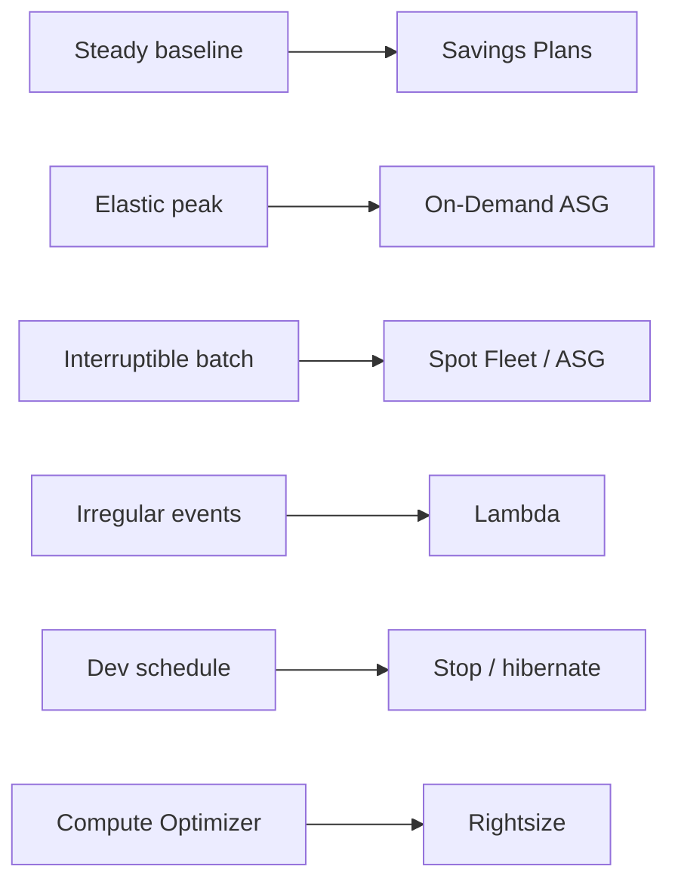

| Decision | Prefer | Why | Alternative / boundary |
|---|---|---|---|
| Primary selection | Use Savings Plans for steady commitment with flexibility, Spot for interruption-tolerant jobs, On-Demand for uncertain capacity, Lambda for sporadic events, and Fargate when containers should not require hosts. | Fits the stated outcome with managed operations. | Reserved Instances can fit a more specific reservation model. EC2 can beat Fargate at sustained utilization if the team accepts instance operations. |
| Operational control | Managed AWS service first | Removes undifferentiated patching, failover, and fleet work. | Choose self-managed only when a named compatibility/control constraint requires it. |
| Scale signal | Measure the bottleneck | Use a business or saturation metric rather than a guessed server count. | Alarm before an explicit quota or capacity ceiling is reached. |

**Configuration knobs that make the design real**

- Set mixed-instances policy/Spot allocation and interruption handling, ASG min/max, schedules, hibernation support, Lambda memory/concurrency, Fargate task CPU/memory, and budget alerts.
- Define least-privilege IAM roles and resource policies before deploying the data path.
- Use CloudWatch metrics, alarms, logs, and a runbook that says who owns a failed request, job, or recovery.
- Test the failure path, not only the healthy request path: deny an expected permission, stop one target, and verify the design degrades as intended.

**Failure and operational implications**

- Spot without checkpointing loses work. A Savings Plan cannot rescue an oversized or idle fleet. Stopping instances saves compute but leaves EBS/storage costs.
- Make retrying components idempotent. A retry must not create a duplicate order, object, record, or payment.
- Watch an outcome metric as well as infrastructure metrics: error rate, queue age, p95 latency, replication lag, recovery time, or cache hit rate.
- Treat quotas as architecture inputs. Request increases and pre-create standby capacity before an incident, not during it.

**Selection drill**

1. Name the hard constraint: security boundary, availability target, latency, throughput, data model, compliance rule, or cost goal.
2. Eliminate any answer that violates that constraint even if it solves a different problem well.
3. Prefer the answer with the fewest operational components when it satisfies every stated requirement.
4. Check whether the requirement implies an AZ failure, Region failure, a public path, cross-account access, or interruption tolerance.

> **Exam signal:** Look for **steady baseline, interruptible batch, nights and weekends, spiky API, rightsize, production versus development**.
>
> **Common trap:** Savings Plans are pricing commitments, not a capacity reservation and not a substitute for an availability design.
>
> **Official coverage retained:** cost tools/tags, Regions, Spot/RI/Savings Plans, edge/hybrid compute, instance families/sizes, containers/serverless/microservices, scaling/hibernation, ELB selection.

**ELI5:** Pay for compute only while it produces value. Use flexible capacity for flexible work and commitments only for steady demand you understand.

**Why it matters:** Idle instances, oversized families, always-on nonproduction systems, and the wrong purchase model are common avoidable costs.

**Service selection and alternatives**

| Need | Choose | Why / alternative |
|---|---|---|
| Steady flexible compute spend | Savings Plans | Discount commitment with flexibility; Reserved Instances can fit more specific reservation needs. |
| Interruptible fault-tolerant work | Spot Instances | Large discount, but AWS can reclaim capacity; use for batch/stateless/flexible tasks. |
| Irregular event work | Lambda | Pay by invocation/duration; avoid it for unsuitable long-running execution. |
| Container workload without hosts | Fargate | Pay for requested task resources; EC2 can be cheaper at sustained high utilization with operations accepted. |
| Temporarily paused EC2 environment | Hibernation or scheduled stop | Preserve state where supported; verify requirements and storage cost. |

**Realistic scenario:** A development environment stops nights and weekends. Stateless image processing uses Spot capacity in an Auto Scaling group. A stable production baseline uses Savings Plans, while traffic bursts use On-Demand capacity. The team uses Compute Optimizer to identify oversized instances.

**Official scope map — knowledge**

- **Cost-management features:** allocate compute cost with tags and consolidated billing.
- **Cost tools:** analyze, alert, and export cost information with Cost Explorer, Budgets, and Cost and Usage Report.
- **Global infrastructure:** Region and AZ choices can affect price and availability design.
- **Purchasing options:** compare Spot, Reserved Instances, and Savings Plans.
- **Distributed/edge compute:** use edge processing when it reduces transfer/latency enough to justify it.
- **Hybrid compute:** recognize Outposts for AWS infrastructure at an on-premises location.
- **Instance families/sizes:** select memory-, compute-, storage-, network-, or accelerator-oriented resources appropriately.
- **Utilization optimization:** containers, serverless, and microservices can remove idle or overprovisioned capacity.
- **Scaling:** Auto Scaling and hibernation can reduce idle running time.

**Official scope map — skills**

- **Load-balancing cost/fit:** select ALB for Layer 7, NLB for Layer 4, and Gateway Load Balancer for network appliance insertion.
- **Elastic scaling:** choose horizontal/vertical scaling and hibernation when appropriate.
- **Cost-effective compute:** compare Lambda, EC2, and Fargate using runtime, utilization, operations, and flexibility.
- **Availability classes:** spend differently for production, development, test, and interruptible workloads according to their required uptime.
- **Instance family:** choose the family matching the actual bottleneck.
- **Instance size:** rightsize with utilization evidence rather than defaulting to oversized capacity.

> **Exam Tip:** Spot is attractive only when interruption is acceptable and the design can retry or replace capacity.
>
> **Exam Trap:** Savings Plans reduce cost through commitment; they do not reserve capacity or solve an interruption-tolerance requirement by themselves.
>
> **Exam Keywords:** Spot, On-Demand, Reserved Instances, Savings Plans, rightsize, Compute Optimizer, Auto Scaling, hibernation, Lambda, Fargate.

### Task 4.3: Design cost-optimized database solutions

#### Architecture studio

**ELI5 expansion:** Do not rent a huge always-on database to serve a small, intermittent, or cacheable workload; match the bill to the data model and demand.

**Reference architecture:** Workload access pattern → suitable database type → cache/proxy → controlled replicas/backups → cost-tagged monitoring.

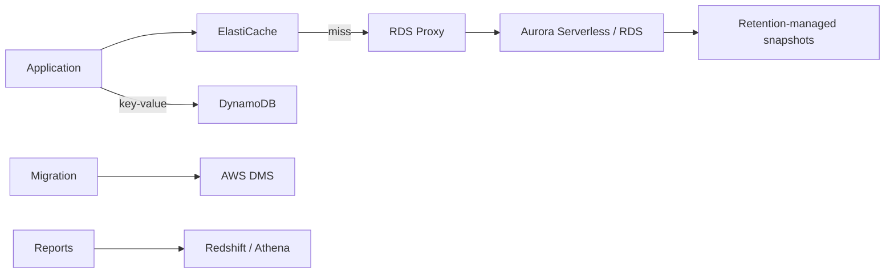

| Decision | Prefer | Why | Alternative / boundary |
|---|---|---|---|
| Primary selection | Use DynamoDB for suitable key-value/document access, Aurora/RDS for relational requirements, serverless relational capacity for variable use, ElastiCache for hot reads, and Redshift for warehouse analytics. | Fits the stated outcome with managed operations. | Provisioned capacity often fits sustained high utilization. Use read replicas only where the read workload and consistency model justify their recurring cost. |
| Operational control | Managed AWS service first | Removes undifferentiated patching, failover, and fleet work. | Choose self-managed only when a named compatibility/control constraint requires it. |
| Scale signal | Measure the bottleneck | Use a business or saturation metric rather than a guessed server count. | Alarm before an explicit quota or capacity ceiling is reached. |

**Configuration knobs that make the design real**

- Set Aurora Serverless capacity range or RDS instance/storage/IOPS, DynamoDB on-demand/provisioned/autoscaling, cache TTL, proxy pool, snapshot retention, replica count, and DMS task settings.
- Define least-privilege IAM roles and resource policies before deploying the data path.
- Use CloudWatch metrics, alarms, logs, and a runbook that says who owns a failed request, job, or recovery.
- Test the failure path, not only the healthy request path: deny an expected permission, stop one target, and verify the design degrades as intended.

**Failure and operational implications**

- Unused replicas and long snapshot retention add cost. A cache with no expiry becomes stale. A database proxy protects connections but does not reduce expensive queries by itself.
- Make retrying components idempotent. A retry must not create a duplicate order, object, record, or payment.
- Watch an outcome metric as well as infrastructure metrics: error rate, queue age, p95 latency, replication lag, recovery time, or cache hit rate.
- Treat quotas as architecture inputs. Request increases and pre-create standby capacity before an incident, not during it.

**Selection drill**

1. Name the hard constraint: security boundary, availability target, latency, throughput, data model, compliance rule, or cost goal.
2. Eliminate any answer that violates that constraint even if it solves a different problem well.
3. Prefer the answer with the fewest operational components when it satisfies every stated requirement.
4. Check whether the requirement implies an AZ failure, Region failure, a public path, cross-account access, or interruption tolerance.

> **Exam signal:** Look for **intermittent relational use, read-heavy catalog, key-value scale, analytics scans, reduce idle capacity, migrate engines**.
>
> **Common trap:** Serverless is not automatically cheaper for sustained heavy load; compare utilization, latency needs, and minimum capacity before choosing.
>
> **Official coverage retained:** cost tools/tags, caching, retention, capacity, proxy/connections, engines/migrations, replicas, relational/nonrelational/Aurora/DynamoDB, backup and columnar/time-series choices.

**ELI5:** The cheapest database is the one that fits the data model and demand without paying for unused capacity, unnecessary copies, or avoidable reads.

**Why it matters:** Database bills rise through idle provisioned capacity, excessive I/O, connection storms, replicas, retention, and selecting a complex engine for a simple access pattern.

**Service selection and alternatives**

| Need | Choose | Why / alternative |
|---|---|---|
| Variable relational usage | Aurora Serverless or suitable serverless relational option | Adjusts capacity with demand; provisioned may fit predictable high utilization. |
| Key-value serverless access | DynamoDB | Pay model and scaling match suitable access patterns. |
| Reduce expensive database reads | ElastiCache | Cache hot data before scaling the database. |
| Analytical columnar queries | Redshift | Purpose-built warehouse rather than transactional RDS. |
| Migration | AWS DMS | Move data; use suitable schema conversion when engines differ. |

**Realistic scenario:** A startup with daytime-only relational traffic uses an appropriate serverless database configuration, caches catalog reads, retains snapshots for its policy period, and moves an old database with AWS DMS. A separate reporting workload uses a columnar warehouse instead of querying the transactional database.

**Official scope map — knowledge**

- **Cost-management features:** use cost-allocation tags and consolidated/multi-account billing to attribute database spend.
- **Cost-management tools:** use Cost Explorer, Budgets, and Cost and Usage Report to analyze, alert on, and report database cost.
- **Caching:** reduce database reads and capacity need with an appropriate cache.
- **Retention:** balance compliance/recovery needs against long-term snapshot and backup cost.
- **Capacity planning:** choose capacity units and provisioned size based on demand rather than peak guesses.
- **Connections/proxies:** manage connection count efficiently with proxying when it avoids overprovisioning.
- **Engines/migrations:** choose engines for compatibility and distinguish homogeneous from heterogeneous moves.
- **Replication:** account for the cost and purpose of read replicas.
- **Types/services:** compare relational/non-relational choices including Aurora and DynamoDB.

**Official scope map — skills**

- **Backup and retention:** set snapshot frequency and retention to satisfy recovery requirements without needless copies.
- **Engine selection:** select an engine such as MySQL or PostgreSQL for compatibility and feature needs.
- **Cost-effective database service:** compare DynamoDB, RDS, and serverless choices against access pattern and utilization.
- **Cost-effective database type:** select time-series, columnar, relational, or key-value format for the workload rather than paying to force a mismatch.
- **Schema/data migration:** move schemas and data across locations or engines with an appropriate migration approach.

> **Exam Tip:** If demand is intermittent and the question asks to reduce idle relational capacity, investigate serverless options before buying a larger reserved database.
>
> **Exam Trap:** A cache lowers backend work but needs an invalidation/TTL plan; it is not durable system-of-record storage.
>
> **Exam Keywords:** Aurora Serverless, DynamoDB, RDS, ElastiCache, snapshots, retention, DMS, schema migration, columnar, time series.

### Task 4.4: Design cost-optimized network architectures

#### Architecture studio

**ELI5 expansion:** Every unnecessary network hop is a toll booth: keep private traffic private and local, and cache repeat downloads near viewers.

**Reference architecture:** Private subnet → endpoint for supported AWS services or local-AZ NAT for egress; hub routing for many VPCs; CDN for repeat public content.

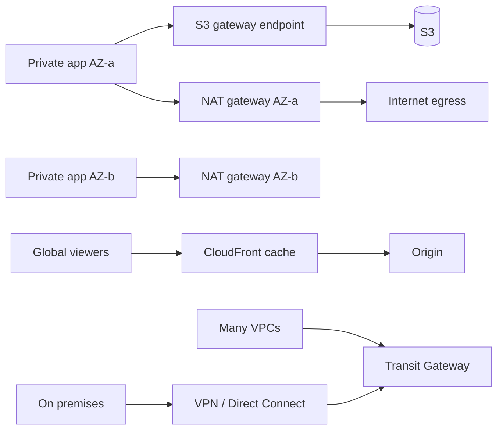

| Decision | Prefer | Why | Alternative / boundary |
|---|---|---|---|
| Primary selection | Use gateway endpoints for S3/DynamoDB private access, interface endpoints for PrivateLink services, a NAT gateway for managed egress, Transit Gateway for hub-and-spoke, and CloudFront for cacheable global delivery. | Fits the stated outcome with managed operations. | A NAT instance can cost less at low scale but creates instance management and availability work. VPN is quick encrypted internet connectivity; Direct Connect is dedicated predictable connectivity. |
| Operational control | Managed AWS service first | Removes undifferentiated patching, failover, and fleet work. | Choose self-managed only when a named compatibility/control constraint requires it. |
| Scale signal | Measure the bottleneck | Use a business or saturation metric rather than a guessed server count. | Alarm before an explicit quota or capacity ceiling is reached. |

**Configuration knobs that make the design real**

- Create endpoint routes/policies, deploy NAT per AZ when availability matters, keep workloads using their local NAT, set TGW route tables, configure CloudFront cache keys/TTL, and set VPN/DX bandwidth/redundancy.
- Define least-privilege IAM roles and resource policies before deploying the data path.
- Use CloudWatch metrics, alarms, logs, and a runbook that says who owns a failed request, job, or recovery.
- Test the failure path, not only the healthy request path: deny an expected permission, stop one target, and verify the design degrades as intended.

**Failure and operational implications**

- One shared NAT can be cheaper but becomes an AZ dependency and adds cross-AZ data processing. Sending S3 access through NAT wastes money. Over-broad routes can send private traffic to public paths.
- Make retrying components idempotent. A retry must not create a duplicate order, object, record, or payment.
- Watch an outcome metric as well as infrastructure metrics: error rate, queue age, p95 latency, replication lag, recovery time, or cache hit rate.
- Treat quotas as architecture inputs. Request increases and pre-create standby capacity before an incident, not during it.

**Selection drill**

1. Name the hard constraint: security boundary, availability target, latency, throughput, data model, compliance rule, or cost goal.
2. Eliminate any answer that violates that constraint even if it solves a different problem well.
3. Prefer the answer with the fewest operational components when it satisfies every stated requirement.
4. Check whether the requirement implies an AZ failure, Region failure, a public path, cross-account access, or interruption tolerance.

> **Exam signal:** Look for **NAT bill, private S3 access, many VPCs, cache images globally, dedicated bandwidth, avoid cross-AZ transfer**.
>
> **Common trap:** An endpoint is not a general internet gateway. A single NAT gateway is a cost/availability trade-off, not a universal best practice.
>
> **Official coverage retained:** cost tools/tags, ELB, NAT gateway versus NAT instance, private/dedicated/VPN connections, routing/TGW/peering/DNS, endpoints, CDN, review/throttling/bandwidth.

**ELI5:** Network cost is often a toll problem: avoid unnecessary hops, avoid sending traffic through the public internet or NAT when a private AWS route fits, and cache repeat downloads at the edge.

**Why it matters:** NAT processing, cross-AZ/Region transfer, duplicated VPN capacity, and unoptimized routes can create large recurring costs.

**Service selection and alternatives**

| Need | Choose | Why / alternative |
|---|---|---|
| Private access to AWS services | VPC endpoint | Avoids NAT for supported service traffic; gateway endpoints suit S3/DynamoDB. |
| Highly available private-subnet egress | NAT gateway per AZ | Avoids cross-AZ dependency/transfer; a single shared gateway can cost less where availability is lower priority. |
| Long-term predictable hybrid bandwidth | Direct Connect | Dedicated connectivity; VPN is faster to establish over the internet. |
| Many VPC connections | Transit Gateway | Hub-and-spoke routing; VPC peering can fit a small simple mesh. |
| Repeat global content | CloudFront | Edge caching reduces origin and transfer load. |

**Realistic scenario:** Private application subnets access S3 through a gateway endpoint instead of a NAT gateway. Each AZ uses its local NAT gateway for resilient egress. A company with many VPCs uses Transit Gateway, while a small two-VPC environment uses peering. CloudFront caches public product images.

**Official scope map — knowledge**

- **Cost-management features:** use cost-allocation tags and billing structures to attribute network-related spend.
- **Cost-management tools:** use Cost Explorer, Budgets, and Cost and Usage Report to analyze, alert on, and report network cost.
- **Load balancing:** understand ALB traffic and cost/architecture implications.
- **NAT gateways:** compare a NAT instance and NAT gateway, including operations, availability, and processing cost.
- **Connectivity:** compare private/dedicated lines and VPN connections.
- **Routing, topology, peering:** understand Transit Gateway and VPC peering topology trade-offs.
- **Network services:** use services such as DNS when name resolution and routing behavior are required.

**Official scope map — skills**

- **NAT placement/type:** decide between one shared NAT gateway and one per AZ based on cost versus availability and cross-AZ traffic.
- **Connections:** choose Direct Connect, VPN, or internet paths based on security, bandwidth, latency, and cost requirements.
- **Cost-minimizing routes:** avoid needless Region-to-Region, AZ-to-AZ, private-to-public, and NAT paths; evaluate Global Accelerator and VPC endpoints.
- **CDN and edge cache:** use CloudFront where repeated content and global viewers justify edge delivery.
- **Existing-workload review:** identify network transfer, NAT, routing, and topology waste in an existing design.
- **Throttling:** choose rate limits/backpressure that protect downstream capacity and prevent wasteful bursts.
- **Bandwidth allocation:** select one or more VPN connections or Direct Connect bandwidth that meets actual throughput and resilience requirements.

> **Exam Tip:** For private workloads reaching S3 or DynamoDB, check a gateway VPC endpoint before accepting NAT gateway data-processing charges.
>
> **Exam Trap:** One NAT gateway may be cheaper but can be an availability risk and can add cross-AZ traffic; the lowest line-item cost is not always the lowest architecture cost.
>
> **Exam Keywords:** VPC endpoint, NAT gateway, NAT instance, Transit Gateway, VPC peering, Direct Connect, VPN, CloudFront, route, throttling, bandwidth.

---

## Fast comparison sheet

| If the requirement says... | Start with... | Do not confuse with... |
|---|---|---|
| Customer app login | Cognito | IAM Identity Center for workforce login |
| AWS workload permissions | IAM role | IAM user access keys |
| Web request filtering | WAF | Shield, which focuses on DDoS protection |
| Queue buffered work | SQS | SNS/EventBridge fan-out |
| Event routing | EventBridge | SQS point-to-point work queue |
| Shared Linux files | EFS | EBS block volume |
| Massive object data | S3 | EFS filesystem |
| Read scale for RDS | Read replica | Multi-AZ standby |
| Relational failover | RDS Multi-AZ | Read replica |
| Global cache | CloudFront | Global Accelerator traffic acceleration |
| Private AWS service access | VPC endpoint | NAT gateway outbound internet access |
| Managed ETL | Glue | Athena, which queries data |
| File transfer | DataSync | Kinesis stream ingestion |
| Variable serverless key-value | DynamoDB | Aurora relational database |

## Active recall scenarios

### 1. Cross-account reports
A finance role in a central account needs to read only monthly reports in an S3 bucket in every business account. Employees already authenticate through a corporate directory. What identity design minimizes permanent credentials?

Answer
Federate employees through IAM Identity Center or the corporate identity provider, then let the finance role assume cross-account roles or use narrowly scoped bucket/resource policies as appropriate. Use short-lived STS credentials; do not create shared IAM users or cross-account access keys.

### 2. Burst-proof image pipeline
Uploads arrive in bursts, processing can take several minutes, and users only need an acknowledgement immediately. What architecture protects the upload API and lets processing scale independently?

Answer
Put the job on SQS (or an event pattern that delivers to a queue), return an acknowledgement, and scale workers on queue depth. Lambda, ECS/Fargate, or Batch depends on runtime and processing requirements. A synchronous API-to-worker call would couple the upload rate to worker availability.

### 3. Low RPO, moderate RTO
A regional outage is acceptable only if data loss is very small and recovery takes minutes, not hours. Which DR thinking applies?

Answer
Compare warm standby or active-active against the stated RPO/RTO. Backup and restore is usually cheaper but slower; pilot light keeps core components ready but still needs scale-up. The right answer must name the strategy that meets both recovery measures, not just “take backups.”

### 4. Private S3 traffic bill
Private EC2 instances use a NAT gateway solely to reach S3, and NAT processing charges are growing. What should change?

Answer
Add an S3 gateway VPC endpoint and route S3 traffic through it. This keeps supported traffic private and avoids the NAT path for that access. Do not make the instances public merely to avoid NAT cost.

### 5. Read-heavy product catalog
A relational product catalog has read latency spikes but writes are modest. Which two levers should you evaluate first?

Answer
Evaluate ElastiCache for repeated hot reads and read replicas for relational read scale. Multi-AZ improves availability rather than read throughput. The final choice depends on cacheability, consistency, and query pattern.

## Final checklist

- Can you explain why an IAM role is safer than an application access key?
- Can you draw public, private application, and private database subnet traffic paths?
- Can you match SQS, SNS, EventBridge, and Step Functions to their communication role?
- Can you select an RPO/RTO-appropriate DR strategy?
- Can you distinguish S3, EBS, EFS, and FSx by access pattern?
- Can you choose Multi-AZ versus read replicas, CloudFront versus Global Accelerator, and VPN versus Direct Connect?
- Can you identify a VPC endpoint, lifecycle rule, Spot capacity, cache, or rightsize opportunity in a cost scenario?

---

## Appendix A: Architecture keyword decision tree

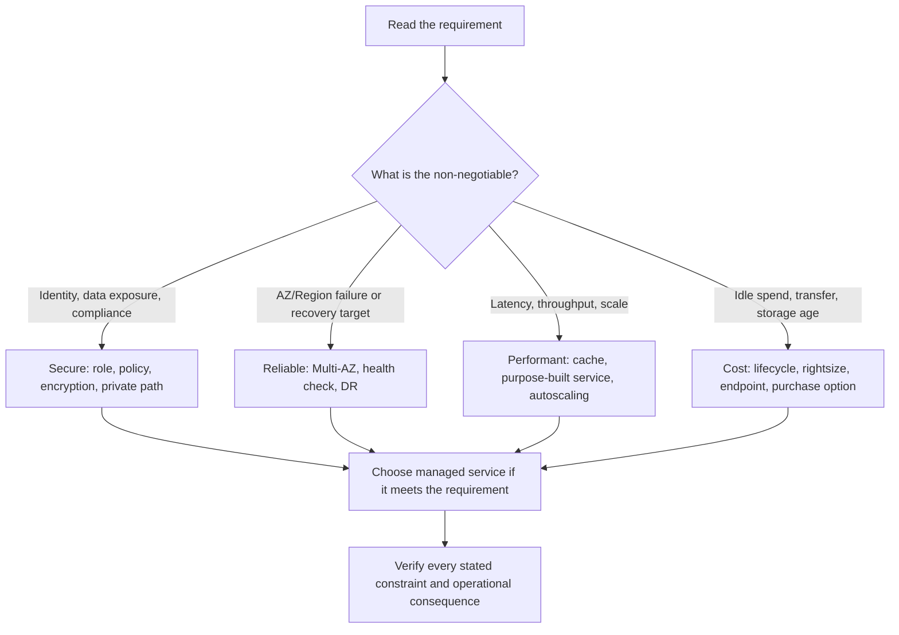

| Requirement words | First architecture question | Strong starting services | Verify before choosing |
|---|---|---|---|
| workforce, many accounts, temporary access | Who authenticates and which account boundary applies? | IAM Identity Center, IAM roles, Organizations | Trust policy, SCP, MFA, resource policy |
| customer sign-up, mobile/web user | Is this an application identity rather than AWS workforce access? | Cognito | User-pool auth flow and API authorization |
| prevent SQL injection, bot, DDoS | Is the threat Layer 7 or volumetric? | WAF, Shield, CloudFront | Web ACL association and rate rules |
| private AWS API/service access | Can traffic use an endpoint instead of NAT/public internet? | Gateway endpoint, interface endpoint, PrivateLink | Route table, DNS, endpoint policy |
| absorb burst, retry later | Can producer and consumer be asynchronous? | SQS, DLQ, Lambda/ECS worker | Visibility timeout, idempotency, queue age |
| fan-out event to many independent targets | Do receivers need content-based routing? | SNS, EventBridge | Filtering, retries, DLQs, event schema |
| HA in one Region | What fails: host, AZ, database, NAT? | ALB, ASG, Multi-AZ RDS | Multi-AZ placement and health checks |
| regional outage | What RPO and RTO are actually required? | Backup, pilot light, warm standby, active-active | Cross-Region data path and tested recovery |
| shared files | Do several Linux clients need POSIX semantics? | EFS | Throughput, access points, mount/network access |
| known key at vast scale | Is a key-value access pattern sufficient? | DynamoDB | Partition key distribution and secondary indexes |
| joins and transactions | Does the workload need relational semantics? | RDS, Aurora | Engine compatibility, connections, replica/read split |
| public cacheable content | Can viewers reuse the same response/object? | CloudFront | Cache key, TTL, invalidation, origin access |
| global TCP/UDP, static IP | Is speed-to-regional endpoint more important than cache? | Global Accelerator, NLB | Endpoint health and protocol |
| query data in S3 | Is SQL-on-files enough, or is ETL required first? | Athena, Glue, Lake Formation | Partitioning, Parquet, permissions |
| unknown object access pattern | Can the storage tier move automatically? | S3 Intelligent-Tiering | Retrieval/monitoring charges and minimum duration |
| predictable baseline / interruptible batch | What commitment and interruption risk are allowed? | Savings Plans, Spot, ASG | Checkpointing, fallback capacity, utilization |

## Appendix B: Comparison tables for exam decisions

### Identity and perimeter controls

| Option | Principal / layer | Best use | Key configuration | Do not confuse with |
|---|---|---|---|---|
| IAM user | Individual AWS identity | Narrow legacy human case | MFA, access-key rotation, group/policy | Workload identity |
| IAM role + STS | Workforce or workload temporary session | EC2/Lambda access and cross-account access | Trust policy + permissions policy | A permanent access key |
| IAM Identity Center | Workforce federation | Central SSO across accounts | Permission sets, assignments, external IdP | Cognito customer identity |
| Cognito user pool | Application customer | Sign-up/sign-in and tokens | App client, user pool, authorizer | IAM Identity Center |
| SCP | Organization guardrail | Limit maximum permissions | Attach to root/OU/account | An allow/grant policy |
| Resource policy | Resource-side authorization | Cross-account S3/KMS/SQS/SNS access | Principal, action, resource, conditions | Identity policy only |

| Control | Scope | Stateful? | Best use | Key trap |
|---|---|---:|---|---|
| Security group | ENI/resource | Yes | Allow traffic between tiers by SG reference | Return traffic is automatic |
| Network ACL | Subnet | No | Broad subnet allow/deny boundary | Must allow return ephemeral ports |
| AWS WAF | HTTP(S) Layer 7 | N/A | SQLi, XSS, bot/rate controls | Does not replace Shield DDoS service |
| AWS Shield | DDoS protection | N/A | Baseline DDoS protection / advanced support | Does not write web request rules |

### Storage and integration

| Service | Data model | Best use | Knobs that matter | Alternative when |
|---|---|---|---|---|
| S3 | Object | Data lake, backups, static assets | storage class, versioning, lifecycle, encryption | Shared POSIX file access is required |
| EBS | Block | EC2 boot and database disks | gp3/io2, IOPS, throughput, snapshots | Many instances need shared files |
| EFS | File / NFS | Shared elastic Linux file system | throughput/performance mode, access points | Windows/Lustre/NetApp features are required |
| FSx | Specialized file | Windows, Lustre, NetApp, OpenZFS needs | file-system type, capacity, deployment | Generic Linux NFS is enough |

| Service | Delivery pattern | Choose when | Configure | Trap |
|---|---|---|---|---|
| SQS | Queue | One worker should handle each buffered task | visibility timeout, DLQ, retention | Not fan-out by itself |
| SNS | Pub/sub topic | Push the same message to many subscribers | subscriptions, filters, DLQs | Not durable worker buffering alone |
| EventBridge | Event bus | Route events by content across targets/accounts | rules, event pattern, archive | Not a work queue substitute |
| Step Functions | Stateful workflow | Ordered steps, choices, retries, compensation | Retry/Catch, Standard/Express, Map | Not necessary for one independent job |

### Databases and recovery

| Feature | Primary purpose | Replication behavior | Reads | Exam phrase |
|---|---|---|---|---|
| RDS Multi-AZ | Availability/failover | Synchronous standby within Region | Standby does not scale reads | "automatic failover" |
| Read replica | Read scaling / promote for recovery | Usually asynchronous | Yes, route read traffic | "read-heavy" |
| Aurora Global Database | Cross-Region DR/read locality | Cross-Region replication | Regional readers | "global low-latency reads" |
| DynamoDB global tables | Multi-Region active-active key-value | Multi-Region replication | Local reads/writes | "active-active NoSQL" |

| DR strategy | Running secondary environment | Typical RTO | Typical RPO | Cost / operational implication |
|---|---|---|---|---|
| Backup and restore | None until incident | Hours | Hours to day, design-dependent | Lowest cost, restore and scale during event |
| Pilot light | Core data/services | Tens of minutes to hours | Low with replication | Scale application tier after failover |
| Warm standby | Reduced but functional stack | Minutes | Low | Pay for running secondary baseline |
| Active-active | Full multiple Regions | Seconds to minutes | Very low | Highest complexity, routing and conflict design |

### Compute, network, and cost

| Option | Best fit | Scaling / operational model | Beware |
|---|---|---|---|
| EC2 | Custom OS, special hardware, steady hosts | You select/manage instances and ASG | Idle capacity and patching |
| Lambda | Event-driven short execution | Scales by concurrency | Timeout, downstream connection bursts |
| Fargate | Container workloads without nodes | Task CPU/memory, service autoscaling | Sustained utilization may favor EC2 |
| ECS on EC2 | Container efficiency with host control | You manage cluster capacity | Node operations |

| Load balancer | Layer / protocol | Select when | Avoid if |
|---|---|---|---|
| ALB | Layer 7 HTTP/HTTPS | host/path/header routing, web apps | Need TCP/UDP or static IP focus |
| NLB | Layer 4 TCP/UDP/TLS | very high performance, static IP | Need rich HTTP routing |
| GWLB | Network appliance insertion | transparent firewall/inspection fleet | You only need web routing |

| Network choice | Best use | Primary benefit | Boundary |
|---|---|---|---|
| CloudFront | Cacheable public HTTP content | Edge cache lowers latency/origin load | Not generic TCP acceleration |
| Global Accelerator | Global TCP/UDP and static anycast IP | AWS backbone to healthy endpoints | Does not cache application content |
| Site-to-Site VPN | Encrypted hybrid connectivity quickly | Uses internet | Variable internet path |
| Direct Connect | Predictable dedicated hybrid connection | Consistent private connectivity | Lead time/cost; use resilient design |
| PrivateLink | Consume/publish one private service | No broad VPC connectivity | Not transitive routing |

| Cost lever | Use when | Guardrail |
|---|---|---|
| On-Demand | Demand is unknown or cannot be interrupted | Rightsize and scale down |
| Savings Plans | Baseline spend is predictable | Commitment does not fix overprovisioning |
| Spot | Job tolerates interruption | Checkpoint/retry and diversify capacity |
| S3 lifecycle | Access decreases with age | Check retrieval and retention requirements |
| Gateway endpoint | Private S3/DynamoDB traffic | Configure routes/policy; not generic egress |
| NAT per AZ | Resilient private egress is required | Higher fixed cost; keep traffic local to AZ |

## Appendix C: Critical rules and numbers

| Rule or number | Why it matters on SAA-C03 |
|---|---|
| 50 scored + 15 unscored questions | Answer every question; unscored items are not identified. |
| 130 minutes | Practice reading constraints before choosing services. |
| 720 / 1000 scaled pass score | Domain scores are feedback; the exam uses compensatory scoring. |
| 30% / 26% / 24% / 20% | Secure, Resilient, High-Performing, Cost-Optimized domain weights. |
| 3 AZs minimum per Region | Design AZ-level availability, but verify an actual Region's availability. |
| S3 object maximum: 5 TB | Use multipart upload for large objects. |
| Lambda maximum runtime: 15 minutes | Use Batch, ECS/Fargate, or EMR for longer jobs. |
| Lambda memory: 128 MB–10,240 MB | Memory selection also affects available CPU. |
| Default Lambda account concurrency: 1,000 | A quota, not a scaling guarantee; request increases where needed. |
| SQS visibility timeout | Must cover processing plus safe buffer; otherwise messages may be redelivered. |
| SQS standard delivery | At-least-once; consumers must be idempotent. |
| Security groups | Stateful; allow rules only, return traffic is automatically permitted. |
| NACLs | Stateless; explicitly permit return traffic as well. |
| Multi-AZ RDS | Availability and automatic failover, not read scaling. |
| Read replica | Read scale and potential promotion; generally asynchronous. |
| EBS | AZ-scoped block storage; snapshots provide durable copies. |
| S3 durability | Designed for 11 nines durability; availability and replication requirements are separate decisions. |
| Gateway endpoint | Private route for S3/DynamoDB without NAT data processing. |
| RPO | Maximum acceptable data loss measured in time. |
| RTO | Maximum acceptable recovery time. |

## Appendix D: 30 exam traps and keyword pairs

1. **IAM role** means temporary credentials; **IAM user access key** is not the default workload answer.
2. **SCP** limits maximum permissions; it does not grant an allow.
3. **Cognito** is customer identity; **IAM Identity Center** is workforce SSO.
4. **WAF** filters HTTP(S); **Shield** addresses DDoS protection.
5. **Security group** is stateful; **NACL** is stateless.
6. **Public subnet** has a route to an internet gateway; a public IP alone does not make every subnet public.
7. **NAT gateway** is outbound for private subnets; it cannot receive unsolicited inbound connections.
8. **VPC endpoint** can avoid NAT for supported AWS services; it is not general internet egress.
9. **KMS encryption** does not replace IAM or resource authorization.
10. **ACM** manages supported AWS-integrated TLS certificates; it is not a database credential vault.
11. **Secrets Manager** supports secret rotation; **Parameter Store** is often simpler configuration storage.
12. **SQS** buffers work; **SNS** fans out notifications.
13. **EventBridge** matches event content; **Step Functions** manages stateful workflow steps.
14. **FIFO SQS** preserves order per message group; it does not make every distributed side effect magically exactly-once.
15. **DLQ** preserves repeated failures; it does not cure the underlying poison message.
16. **Multi-AZ** is availability; **read replica** is primarily read scale.
17. **Backup** is a copy; **DR** includes a tested recovery architecture and RPO/RTO.
18. **CloudFront** caches; **Global Accelerator** routes traffic quickly using anycast IPs.
19. **ALB** understands HTTP; **NLB** handles Layer 4 TCP/UDP and static IP needs.
20. **PrivateLink** exposes a service; **Transit Gateway** connects many networks.
21. **S3** is object storage; **EFS** is shared file storage; **EBS** is attached block storage.
22. **EFS** is shared Linux NFS; **FSx** is selected for specialized filesystem behavior.
23. **DynamoDB** starts from known key access patterns; **RDS/Aurora** starts from relational SQL/transactions.
24. **ElastiCache** reduces repeated reads; it is not the durable system of record.
25. **RDS Proxy** manages connections; it does not add query indexes or read replicas.
26. **Glue** transforms/categorizes data; **Athena** queries data in S3.
27. **Kinesis** handles continuous records; **DataSync** moves existing files/data.
28. **Spot** is for interruption-tolerant workloads; **Savings Plans** are steady-spend commitments.
29. **Single NAT gateway** can reduce line-item cost; per-AZ NAT reduces AZ dependency and cross-AZ transfer.
30. **Most cost-effective** still means meeting the stated availability, security, and performance requirements.

## Appendix E: Original scenario questions with hidden rationales

### Question 1: Central engineering access

A company has 30 AWS accounts. Engineers authenticate with a corporate identity provider, and production access must be temporary, auditable, and centrally administered. Which design requires the least credential management?

- A. Create one IAM user and access key per engineer in each account.
- B. Use IAM Identity Center federated with the corporate identity provider and assign permission sets to accounts.
- C. Put all engineers in an Amazon Cognito user pool and attach an S3 bucket policy.
- D. Share the root credentials through a password vault.

Answer and rationale
**B** is correct. IAM Identity Center provides workforce federation, central account assignment, and short-lived role sessions. A creates permanent credentials and a large operational burden. C is for application customers, not workforce AWS account access. D violates root-user security practices.

### Question 2: Private database password rotation

Private ECS tasks need a database password that rotates automatically. The tasks must retrieve it without a public internet path. Which combination is best?

- A. Put the password in the container image and use a NAT gateway.
- B. Store it in Secrets Manager and use an interface VPC endpoint with a task IAM role.
- C. Put it in a public S3 object encrypted with SSE-S3.
- D. Use an IAM user access key in an environment variable.

Answer and rationale
**B** is correct. Secrets Manager supports managed secret rotation, the IAM role controls retrieval, and an interface endpoint keeps supported traffic private. A and D embed long-lived secrets. C makes the secret retrieval design needlessly exposed and lacks rotation.

### Question 3: Burst-tolerant orders

An order API receives ten times its normal traffic during promotions. Orders may take several minutes to process, while customers only need an immediate acknowledgement. What design is best?

- A. API Gateway synchronously invokes one EC2 worker.
- B. API Gateway writes to SQS; workers scale based on queue depth and use a DLQ.
- C. Increase the API Gateway timeout until the worker finishes.
- D. Send each order directly to an RDS read replica.

Answer and rationale
**B** decouples intake from processing and provides buffering, scaling, and failure handling. A/C couple customer latency to worker capacity. D is wrong because a read replica is not the destination for transactional writes.

### Question 4: Regional recovery objective

A business requires recovery from a regional outage within minutes and can lose only a few seconds of data. It can afford a running secondary environment. Which direction best fits?

- A. Periodic backups restored manually in the recovery Region.
- B. Pilot light with no replicated data.
- C. Warm standby with cross-Region replication and failover routing.
- D. One Multi-AZ database in the primary Region only.

Answer and rationale
**C** best matches a low RTO and low RPO without necessarily paying for full active-active operation. A is usually slower. B without replicated data fails the RPO requirement. D handles local AZ failure, not a regional outage.

### Question 5: Shared render inputs

Hundreds of Linux render workers in multiple AZs need concurrent access to the same directory tree. Completed files should be retained cheaply for years. Which storage design fits?

- A. EBS volumes shared among all workers and EBS snapshots for archive.
- B. EFS for active shared files and S3 lifecycle rules for completed objects.
- C. S3 mounted as a required POSIX file system for all writes.
- D. Instance store for active files and no archive.

Answer and rationale
**B** separates shared POSIX file access from low-cost object archive. A is not a normal shared filesystem design. C confuses object storage with POSIX behavior. D loses data on instance failure.

### Question 6: Read-heavy relational catalog

A product catalog uses Aurora PostgreSQL. Writes are moderate, but repeated product reads create high latency. Thousands of Lambda invocations also open connections at once. Which pair addresses both pressure points?

- A. Multi-AZ and a larger writer.
- B. ElastiCache and RDS Proxy.
- C. DynamoDB global tables and CloudFront only.
- D. A second NAT gateway and an NACL.

Answer and rationale
**B** caches repeat reads and pools database connections. A improves availability, not the primary read/connection bottlenecks. C may require a data-model migration and does not solve relational connection management. D is unrelated.

### Question 7: Global game endpoint

A latency-sensitive TCP game service needs two static anycast IP addresses and must route users to healthy regional endpoints. The payload is not cacheable web content. Which service is the fit?

- A. CloudFront
- B. Global Accelerator
- C. Application Load Balancer only
- D. S3 Transfer Acceleration

Answer and rationale
**B** provides static anycast IPs and uses the AWS global network to healthy endpoints for TCP/UDP workloads. A is a CDN cache. C has no global anycast entry point by itself. D accelerates transfers to S3, not game endpoint routing.

### Question 8: Lake query cost

A team receives daily CSV files into S3 and queries years of data with Athena. Queries are slow and scan too much data. What is the most direct architecture improvement?

- A. Convert data to partitioned Parquet using Glue, then query through Athena.
- B. Send all files through an internet-facing NAT gateway.
- C. Place a read replica in front of S3.
- D. Use an EBS volume for every CSV file.

Answer and rationale
**A** uses a managed transform to create a columnar, partitioned dataset that Athena can scan efficiently. The other choices do not make file analytics more efficient and several misuse unrelated services.

### Question 9: Savings without data loss

Private instances in two AZs reach S3 through NAT gateways. NAT processing charges are growing. The application must remain private and highly available. What change lowers cost without weakening the design?

- A. Give every instance a public IP and remove NAT.
- B. Create an S3 gateway VPC endpoint and keep one NAT gateway per AZ for other egress.
- C. Move all instances into one AZ with one NAT gateway.
- D. Use a security group rule that allows S3 traffic.

Answer and rationale
**B** routes S3 traffic privately without NAT processing while retaining local-AZ egress resilience for destinations that need NAT. A weakens isolation; C adds an AZ failure risk; D does not create a route.

### Question 10: Interruptible nightly processing

A nightly image-processing job can restart from checkpoints and has no strict completion deadline. The company wants the lowest compute cost while retaining automatic scale-out. Which approach is most suitable?

- A. Fixed On-Demand EC2 instances running all day.
- B. Spot Instances in an Auto Scaling group or AWS Batch with checkpoint/retry handling.
- C. A large Reserved Instance for each job.
- D. RDS Multi-AZ with read replicas.

Answer and rationale
**B** uses discounted interruptible capacity because the workload can resume safely. A wastes idle time. C adds a commitment that may not match the job's schedule. D is a database availability/read-scale design, not compute processing.

## Appendix F: Four-week study plan

| Week | Primary objective | Daily study rhythm | Hands-on / recall deliverable |
|---|---|---|---|
| 1 | Secure architectures (30%) | Day 1 identities; Day 2 VPC segmentation; Day 3 encryption/backups; Day 4 WAF/endpoints; Day 5 review | Draw the multi-account and private three-tier diagrams from memory; explain every policy layer. |
| 2 | Resilient architectures (26%) | Day 1 queues/events; Day 2 scaling; Day 3 Multi-AZ; Day 4 DR; Day 5 scenarios | Build a queue/DLQ thought experiment; state RPO/RTO and choose a DR strategy for four businesses. |
| 3 | High performance (24%) | Day 1 storage; Day 2 compute; Day 3 databases; Day 4 network; Day 5 ingestion | Produce one storage, compute, database, network, and lake decision table without looking. |
| 4 | Cost plus integration (20%) | Day 1 storage cost; Day 2 compute pricing; Day 3 database cost; Day 4 network cost; Day 5 full mock/review | Answer all ten scenarios, explain rejected options aloud, and revisit weak keywords. |

### Daily 45-minute loop

1. **10 minutes:** Read one task's ELI5 explanation and redraw its reference architecture.
2. **10 minutes:** Cover the answer column of a comparison table and choose from the requirement wording.
3. **10 minutes:** Explain one trap in your own words, including why the tempting alternative is wrong.
4. **10 minutes:** Answer two scenario questions or invent one with an RPO/RTO, access pattern, or cost constraint.
5. **5 minutes:** Record one uncertain keyword for targeted review tomorrow.

## Final review checklist

- [ ] I can justify IAM roles, policy layers, workforce federation, Cognito, and private service access.
- [ ] I can draw a segmented VPC and distinguish SGs from NACLs, WAF from Shield, and NAT from endpoints.
- [ ] I can turn an RPO/RTO statement into a DR strategy and explain why Multi-AZ is not cross-Region DR.
- [ ] I can select SQS, SNS, EventBridge, or Step Functions based on delivery and orchestration semantics.
- [ ] I can select S3, EBS, EFS, and FSx from data access patterns and performance knobs.
- [ ] I can distinguish relational reads, Multi-AZ, replicas, cache, proxy, and DynamoDB access patterns.
- [ ] I can select ALB, NLB, GWLB, CloudFront, Global Accelerator, VPN, Direct Connect, PrivateLink, and Transit Gateway.
- [ ] I can explain how Glue, Athena, Kinesis, DataSync, Lake Formation, and EMR fit a data-lake architecture.
- [ ] I can find cost waste in idle compute, storage lifecycle, backup retention, NAT paths, and unnecessary data transfer.

## Appendix G: The six Well-Architected pillars in one application

Use the pillars as a trade-off conversation, not six independent checklists. A design can be very cheap and still be wrong if it misses a recovery target; it can be highly available and still be wrong if it exposes customer records.

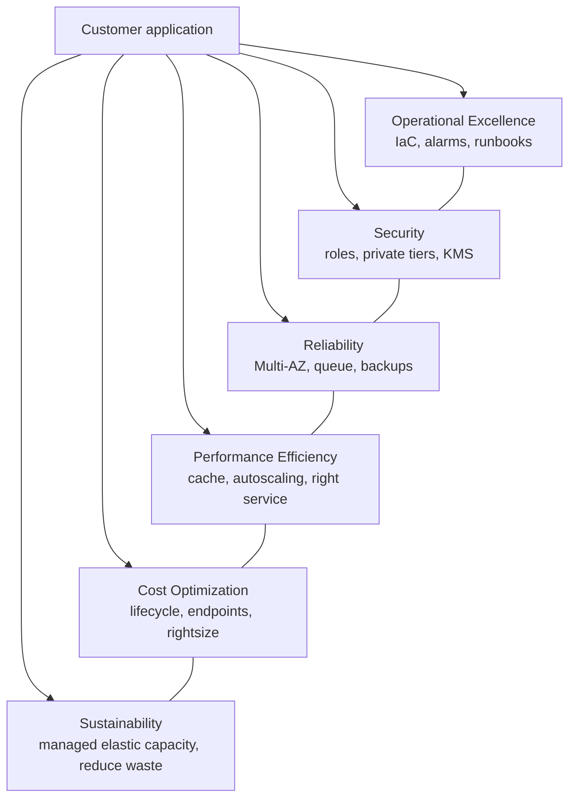

### Operational Excellence: make the architecture repeatable and observable

**ELI5:** Do not rely on the one person who remembers which console button fixes production. Give the team a recipe, gauges, and an incident playbook.

| Design choice | Concrete implementation | Failure prevented | Exam interpretation |
|---|---|---|---|
| Repeatable infrastructure | CloudFormation stacks, parameters, change sets, tags | Manual configuration drift | "Most operationally efficient" favors automation/managed services |
| Actionable observability | CloudWatch metrics, logs, alarms, dashboards; CloudTrail for API activity | Silent failures and slow detection | Select the metric that reflects user impact |
| Safe operations | Runbooks, rollback plan, health checks, immutable replacement | Risky in-place repair | Replace unhealthy ASG/ECS instances |
| Learning loop | Post-incident review, quota review, cost review | Repeated incident or surprise scale limit | Inspect existing workload metrics before rightsizing |

**In context:** An SQS worker architecture needs an alarm on `ApproximateAgeOfOldestMessage`, not just EC2 CPU. Queue age tells the operator whether customers are waiting. A runbook can say: inspect the DLQ, identify the poison message, correct it, replay safely with an idempotency key, and observe the queue draining.

### Security: reduce blast radius at every boundary

**ELI5:** A locked front door is useful, but a safe house also locks rooms, labels valuables, and records who entered.

| Boundary | Control | Concrete question | Consequence if omitted |
|---|---|---|---|
| Human identity | IAM Identity Center, MFA, least-privilege role | Can a developer reach production only by an audited role session? | Shared, permanent, hard-to-revoke access |
| Workload identity | IAM role, STS, resource policy | Does the Lambda/ECS task need a static key? | Secrets leak into code, images, or logs |
| Network | Private subnet, SG references, endpoint | Is the database reachable only from its application tier? | Internet or lateral exposure |
| Data | KMS, TLS, backup vault, lifecycle | Who can decrypt, and how is restore tested? | Exposed or unrecoverable data |
| Detection | CloudTrail, GuardDuty, Macie, Config | Can the team find an unusual call or sensitive S3 object? | Incident discovered late |

**In context:** A private workload that accesses Secrets Manager through an interface endpoint, with an IAM task role scoped to one secret ARN, has a smaller blast radius than a public instance with a shared access key. The endpoint is a route decision; the IAM policy is still the authorization decision.

### Reliability: design for the failures that matter

**ELI5:** Assume individual machines, an AZ, and sometimes a Region can fail. Decide which failures the business can wait through and which it cannot.

| Failure scope | Typical pattern | Validate with | Do not overclaim |
|---|---|---|---|
| Instance/process | ASG, ECS service, Lambda retry | Target health and replacement test | One instance restart is not AZ resilience |
| Availability Zone | Multi-AZ ALB/ASG/RDS, per-AZ NAT | Remove one AZ path in a test | Multi-AZ does not cover regional loss |
| Region | Replication + Route 53 failover + DR runbook | Timed recovery exercise | A backup alone has unknown RTO |
| Downstream dependency | SQS, retries, DLQ, circuit-breaking behavior | Simulate timeout/5xx | Retry without idempotency can amplify damage |

**In context:** A payment workflow can accept an order to SQS during a temporary inventory outage. Workers retry with backoff, move repeatedly failing tasks to a DLQ, and use an idempotency key. This is more reliable than holding an API connection open while every dependency recovers.

### Performance Efficiency: eliminate the real bottleneck

**ELI5:** Make the slow line faster by finding the actual slow station, not by buying a larger building.

| Symptom | First measurement | Likely architecture lever | Misleading quick fix |
|---|---|---|---|
| Repeat read latency | Cache hit rate, database CPU/query time | ElastiCache and a TTL/invalidation strategy | Only increase DB instance size |
| Async backlog | Queue age and visible messages | Scale worker concurrency on queue pressure | Scale API instances on CPU |
| Connection exhaustion | Database connections / proxy metrics | RDS Proxy, pool sizing | Add read replicas for writes/connections |
| Global web latency | Cache hit ratio, viewer geography | CloudFront / regional placement | Treat Global Accelerator as a page cache |
| Slow lake queries | Bytes scanned, partitions, file sizes | Parquet, partitions, Glue compaction | Add compute without changing data layout |

**In context:** When an API is slow because the database is saturated by repeated catalog reads, caching popular values can lower latency and database load. Read replicas help if the workload needs fresh relational reads that cannot be served safely from cache. The correct answer follows the access pattern.

### Cost Optimization: minimize total cost while satisfying requirements

**ELI5:** A cheap component that causes downtime, retrieval fees, or engineering work can be expensive overall. Pay for useful capacity, not merely low unit price.

| Cost signal | Investigation | Better-fit lever | Guardrail |
|---|---|---|---|
| Large NAT data-processing bill | Which destinations are AWS services? | Gateway/interface endpoint | Endpoint must support the target and have correct routes |
| Idle EC2/Fargate | Utilization by environment and schedule | ASG schedule, stop nonprod, Lambda/Fargate/Spot | Preserve production availability requirements |
| Growing S3 bill | Object age, version count, access frequency | Lifecycle, Intelligent-Tiering, expiration | Respect restore and retention requirements |
| RDS cost | CPU, connections, read mix, backup retention | Cache, proxy, serverless/rightsizing | Do not remove Multi-AZ if availability is required |
| Cross-AZ/Region transfer | Flow paths and topology | Keep traffic local, endpoint, cache, routing review | Avoid introducing a single AZ failure point |

**In context:** Sending private S3 traffic through NAT is often a direct cost smell. An S3 gateway endpoint removes that NAT path. However, a single shared NAT may still be a false economy for applications that must remain available during an AZ failure.

### Sustainability: avoid running and storing what has no value

**ELI5:** The cleanest server is the one that never had to run. Reduce waste with elastic managed services, efficient data formats, and timely deletion.

| Workload choice | Sustainability improvement | Complementary exam outcome |
|---|---|---|
| Scale-to-zero / event-driven compute | Avoids idle servers | Cost optimization |
| Auto Scaling and right sizing | Matches capacity to demand | Performance efficiency + cost |
| S3 lifecycle and expiration | Avoids retaining unnecessary data | Cost + compliance alignment |
| Parquet and partitions | Scans less data for analytics | Performance + lower compute use |
| Managed Multi-AZ services | Shares efficient managed fleet operations | Reliability without building spare hosts manually |

## Appendix H: Requirement-to-service mini drills

| If the scenario says... | Explain the decision, not just the service |
|---|---|
| "one application needs temporary access to another account's bucket" | Use an IAM role with a trust policy plus the required identity/resource/KMS permissions; do not distribute a shared key. |
| "block common web attacks before they reach the app" | Associate a WAF web ACL with CloudFront, ALB, or API Gateway; Shield addresses DDoS. |
| "private workload must read S3 cheaply" | Add an S3 gateway endpoint and route it privately; security groups alone do not create the path. |
| "messages must be processed later when capacity returns" | Use SQS plus DLQ and idempotent workers; set visibility timeout longer than processing. |
| "two consumers need the same business event" | Fan out with SNS or route with EventBridge; each consumer can receive independently. |
| "database writer must fail over in an AZ outage" | Use Multi-AZ; do not describe a read replica as the synchronous standby. |
| "global users load static images repeatedly" | Use CloudFront with an appropriate cache key/TTL and controlled origin access. |
| "millions of predictable key lookups" | Model DynamoDB partition/sort keys around the access pattern; avoid hot partitions. |
| "Linux fleet shares active media files" | Use EFS; publish completed objects to S3 for low-cost lifecycle management. |
| "long analytics retention with occasional SQL" | Use S3 lake + Parquet/partitions + Athena; Glue performs needed transforms. |
| "batch job can stop and restart" | Use Spot with checkpoint/retry design rather than uninterrupted On-Demand capacity. |
| "NAT cost rises with S3 and DynamoDB traffic" | Use gateway endpoints; then review whether remaining egress needs NAT per AZ. |
| "must recover in minutes with little data loss" | Choose warm standby or active-active according to exact RPO/RTO; name cross-Region replication and failover. |
| "frequent secret rotation" | Secrets Manager with rotation and role-based retrieval; do not embed passwords in deployment artifacts. |
| "path-based routes to microservices" | ALB listener rules route HTTP requests; NLB is not the Layer 7 path-routing answer. |

## Appendix I: Fast architecture review cards

### Card 1: Secure multi-account application

| Layer | Design | Why it belongs | One check |
|---|---|---|---|
| Governance | Organizations, OUs, SCPs, Control Tower | Separates blast radius and sets maximum permissions | SCP does not block required logging/backup service actions |
| Workforce | IAM Identity Center + permission sets | Central temporary workforce access | Production assignment requires MFA/approval condition where needed |
| Application | IAM roles for compute | No embedded access keys | Trust policy names only the intended service/account |
| Data | S3/RDS KMS encryption + resource policy | Data access is explicit and auditable | Key policy permits required backup/restore path |
| Audit | Organization CloudTrail + Config | Records API/configuration changes | Logs are retained in a protected account |

### Card 2: Segmented VPC traffic rules

| Source | Destination | Permit with | Why |
|---|---|---|---|
| Internet | Public ALB on 443 | ALB SG ingress / WAF | Public TLS entry point only |
| Public ALB | Private app on application port | App SG source = ALB SG | No application CIDR maintenance |
| Private app | DB on database port | DB SG source = app SG | Database has no public client path |
| Private app | S3 | Gateway endpoint route/policy | Private path with no NAT processing |
| Private app | Internet patch/API | NAT gateway in same AZ | Initiated egress without inbound exposure |

### Card 3: Data protection sequence

1. Classify information and decide residency/retention before copying it.
2. Use TLS for movement and KMS-integrated encryption at rest.
3. Grant decrypt/use permissions only to the required role and workload path.
4. Create backups/replicas that meet stated RPO and retention requirements.
5. Test a restore using the same key and access conditions that an incident will use.
6. Archive or delete by lifecycle only after legal and recovery needs are satisfied.

### Card 4: Decoupled high-availability sequence

1. Place stateless targets in at least two AZs behind a health-checked load balancer.
2. Put asynchronous work in SQS and set a DLQ plus visibility timeout.
3. Scale API and workers independently using request/queue metrics.
4. Keep durable state in a managed Multi-AZ service with backups.
5. Make consumers idempotent because retries and redelivery are normal.
6. Add a cross-Region plan only when the requirement names regional recovery/RPO/RTO.

### Card 5: Cost review in five questions

| Question | Likely action |
|---|---|
| Are servers idle by schedule or utilization? | Stop nonproduction, Auto Scale, rightsize, or use serverless. |
| Can the job restart? | Use Spot with checkpointing and fallback capacity. |
| Does data cool down predictably? | Use lifecycle/archive classes and expiration. |
| Is private AWS service traffic traversing NAT? | Add appropriate VPC endpoints and route correctly. |
| Are users downloading the same public objects repeatedly? | Use CloudFront with intentional cache behavior. |

### Exam answer elimination checklist

- Reject an answer that uses permanent keys when a role and STS fit.
- Reject a public database or broad `0.0.0.0/0` path when private tiers are required.
- Reject a single-AZ answer when the scenario explicitly requires AZ fault tolerance.
- Reject backup-only when RTO requires minutes and a running recovery environment is justified.
- Reject a read replica when the requirement is synchronous availability or write scale.
- Reject SQS when every subscriber must receive the event unless it is paired with fan-out.
- Reject CloudFront when the workload needs TCP/UDP acceleration rather than HTTP caching.
- Reject S3/EBS when the required storage semantics point to EFS/FSx.
- Reject a cheaper option that violates a stated compliance, latency, or availability constraint.

### Last-minute recall

- State the constraint first, then select the managed architecture that satisfies it.
- Name one configuration knob and one failure mode for every service choice.
- Explain why the nearest distractor fails the requirement.
