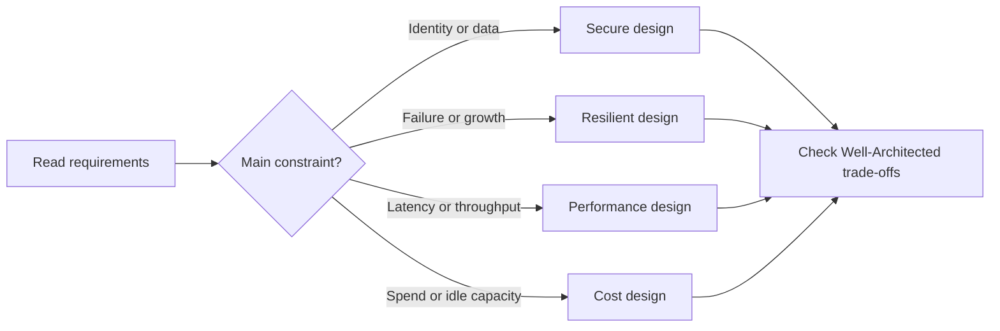
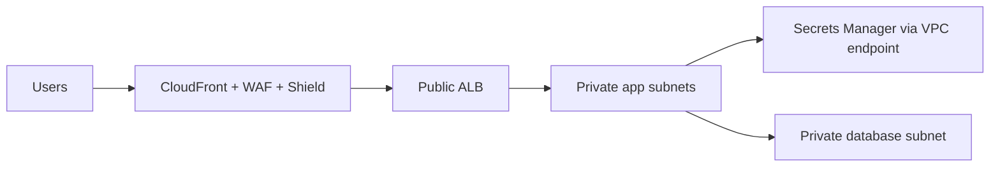
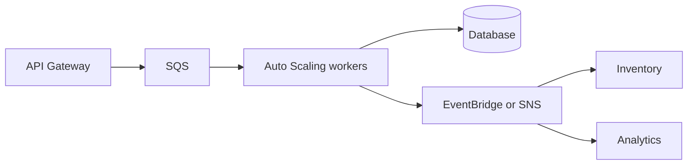
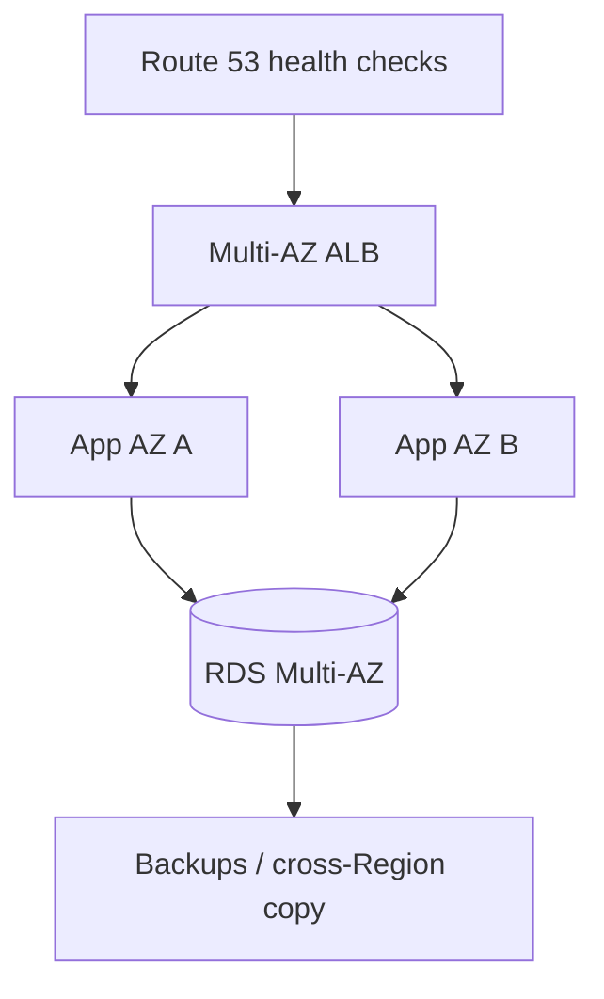

# AWS Certified Solutions Architect – Associate (SAA-C03)

This is a design exam: read the constraints, then choose the AWS design that satisfies them with the least operational work. The official scored domains are Secure (30%), Resilient (26%), High-Performing (24%), and Cost-Optimized (20%).

## Exam map and method

- The exam has 50 scored questions and 15 unscored questions. A multiple-choice question has one answer; a multiple-response question has more than one. Guess rather than leave an answer blank.
- Scaled scores run from 100 to 1,000; 720 is the passing score. Domain scores are feedback, not separate pass/fail gates.
- Start every scenario with: **What must be protected? What may fail? What is slow? What is expensive?** Then eliminate choices that solve a different problem.

## Well-Architected: the six lenses

| Pillar | Beginner meaning | Typical SAA-C03 decision |
|---|---|---|
| Operational Excellence | Run and improve systems predictably. | Infrastructure as code, monitoring, runbooks, automation. |
| Security | Protect identities, systems, and data. | Least-privilege roles, private subnets, encryption. |
| Reliability | Recover from faults and meet availability goals. | Multi-AZ, backups, health checks, decoupling. |
| Performance Efficiency | Use the right resources as demand changes. | Auto Scaling, caching, purpose-built databases. |
| Cost Optimization | Pay for useful capacity and understand spend. | Rightsizing, S3 lifecycle, Savings Plans. |
| Sustainability | Reduce wasted resources and energy. | Managed/serverless services, efficient storage and scaling. |

**Critical rules**

1. The root user is for account-level emergencies, not daily work. Protect it with MFA and do not create root access keys.
2. Security groups are stateful allow lists; network ACLs are stateless subnet filters. An NACL needs return traffic rules too.
3. Put internet-facing load balancers in public subnets and application/database resources in private subnets unless the requirement says otherwise.
4. Multi-AZ improves availability; an RDS read replica primarily scales reads and can be promoted for recovery.
5. S3 is object storage, EBS is block storage for one EC2 instance at a time, and EFS is shared elastic file storage.
6. A queue absorbs bursts and separates producers from consumers; do not use synchronous calls when independent retryable work is acceptable.
7. A backup is not automatically a disaster-recovery plan: choose recovery point objective (RPO, acceptable data loss) and recovery time objective (RTO, acceptable downtime).
8. Prefer managed services when they meet the requirement; they usually remove patching, capacity, and failover work.

---

# Domain 1 — Design Secure Architectures (30%)

## Task 1.1 — Design secure access to AWS resources

**ELI5:** Identity answers “who is asking?” and authorization answers “what may they do?” AWS should give each human or workload only the small set of permissions it needs.

**Why it matters:** A leaked credential or overly broad policy can affect every resource it can reach. Good identity boundaries limit the blast radius.

**Service selection and alternatives**

| Need | Choose | Why / alternative |
|---|---|---|
| Workforce sign-in across accounts | AWS IAM Identity Center | Central sign-in and permission sets; federate an existing directory when it already owns employee identities. |
| AWS service or application permission | IAM role | Short-lived credentials through STS; better than embedding IAM-user keys. |
| Long-lived human identity in one account | IAM user only when federation is unavailable | Use groups and MFA; do not use it for applications. |
| Organization-wide guardrails | AWS Organizations, SCPs, Control Tower | SCPs set the maximum allowed permission; they do not grant a permission. |
| Service-owned resource protection | Resource policy | S3 bucket, KMS key, SQS queue, SNS topic, and similar services can name principals directly. |

**Realistic scenario:** A company has development, test, and production accounts. Employees sign in once through IAM Identity Center; a production administrator assumes a tightly controlled role with MFA. An SCP blocks all accounts from disabling CloudTrail. A bucket policy permits a reporting role from another account to read only its report prefix.

**Official scope map — knowledge**

- **Access control and management across accounts:** separate accounts form security and billing boundaries; use cross-account roles and AWS Organizations instead of sharing credentials.
- **Federated identity services:** understand IAM, IAM Identity Center, and federation from a corporate directory into IAM roles.
- **Global infrastructure:** choose Regions for residency and use Availability Zones for isolated failure domains; these choices can affect access and data boundaries.
- **Security practices:** apply least privilege, explicit resource scoping, MFA, credential rotation, and audit trails.
- **Shared responsibility:** AWS secures the cloud infrastructure; the customer configures identities, data, network rules, and workloads in the cloud.

**Official scope map — skills**

- **IAM and root-user protections:** enable MFA, avoid root keys, use strong recovery practices, and give everyday administrators individual identities.
- **Flexible authorization:** combine IAM users only where needed, groups for shared human permissions, roles for temporary access, and identity/resource policies for authorization.
- **Role-based access control:** use STS, role switching, and cross-account trust policies rather than permanent cross-account keys.
- **Multi-account security strategy:** use Control Tower for landing-zone governance and SCPs to set organization guardrails.
- **Resource policies:** choose them when the resource must name a caller or enable cross-account access; pair them with identity policies when required.
- **Directory federation:** federate a directory to IAM roles when employees already authenticate through a corporate identity provider.

> **Exam Tip:** “Temporary credentials,” “an EC2 application,” or “cross-account access” usually points to an IAM role and STS.
>
> **Exam Trap:** An SCP cannot grant access. It can only restrict what an account’s otherwise-allowed identities may do.
>
> **Exam Keywords:** least privilege, MFA, STS, assume role, trust policy, federation, IAM Identity Center, SCP, resource policy, shared responsibility.

## Task 1.2 — Design secure workloads and applications

**ELI5:** A secure application has locked doors at every layer: network paths, user login, application secrets, and protection against hostile requests.

**Why it matters:** A public IP, open security group, exposed secret, or unfiltered web request can bypass a well-designed application.

**Service selection and alternatives**

| Need | Choose | Why / alternative |
|---|---|---|
| Web attack filtering | AWS WAF | Filter SQL injection and common web attacks at CloudFront, ALB, or API Gateway; Shield addresses DDoS protection. |
| DDoS resilience | AWS Shield | Standard is automatic; Advanced is for enhanced protection/support needs. |
| Customer app sign-up/sign-in | Amazon Cognito | User pools for application users; IAM Identity Center is for workforce access. |
| Store a database password | AWS Secrets Manager | Encrypts and can rotate secrets; Systems Manager Parameter Store is suitable for simpler parameters. |
| Private AWS service access | VPC endpoint / PrivateLink | Keeps traffic off the public internet; NAT gateway is for private-subnet outbound internet access. |
| Private on-premises connection | Site-to-Site VPN or Direct Connect | VPN uses encrypted internet paths; Direct Connect is dedicated connectivity. |

**Realistic scenario:** A public shopping site uses CloudFront and WAF in front of an ALB. The ALB reaches EC2 instances only in private subnets. The instances retrieve rotating database credentials from Secrets Manager through a VPC endpoint. A security group allows web traffic only from the ALB security group.

**Official scope map — knowledge**

- **Configuration and credential security:** do not put credentials in source code, images, or user data; use roles, Secrets Manager, and controlled configuration.
- **AWS service endpoints:** know public endpoints, interface endpoints/PrivateLink, and gateway endpoints so private workloads can reach services safely.
- **Ports, protocols, and traffic:** use security groups, NACLs, route tables, and controlled ingress/egress to allow only required flows.
- **Secure application access:** distinguish workforce access, customer identity, API authorization, and private service-to-service access.
- **Security-service use cases:** Cognito handles app identity, GuardDuty detects suspicious activity, and Macie discovers sensitive data in S3.
- **External threats:** recognize DDoS and injection attacks; combine Shield, WAF, safe application design, and restricted network exposure.

**Official scope map — skills**

- **Secure VPC design:** place security groups, route tables, NACLs, and NAT gateways deliberately; route private workloads outward without making them publicly reachable.
- **Segmentation:** use public subnets for internet-facing entry points and private subnets for application and data tiers.
- **Application security integration:** use Shield, WAF, IAM Identity Center where workforce login fits, and Secrets Manager for sensitive values.
- **External connectivity:** select VPN or Direct Connect for secure paths to and from on-premises networks.

> **Exam Tip:** Security groups can reference another security group. This is cleaner than maintaining application-tier IP addresses.
>
> **Exam Trap:** A NAT gateway lets private instances initiate outbound connections; it does not make them reachable from the internet.
>
> **Exam Keywords:** public/private subnet, security group, NACL, WAF, Shield, Cognito, GuardDuty, Macie, Secrets Manager, PrivateLink, VPN, Direct Connect.

## Task 1.3 — Determine appropriate data security controls

**ELI5:** Data needs labels, locked storage, protected travel, a recovery copy, and a plan for when to delete it.

**Why it matters:** A workload can have perfect servers yet still fail compliance or lose customer information if the data is exposed, unrecoverable, or kept forever.

**Service selection and alternatives**

| Need | Choose | Why / alternative |
|---|---|---|
| Encryption keys with AWS integration | AWS KMS | Managed keys and key policies; CloudHSM is for dedicated hardware key-control requirements. |
| TLS certificate for AWS-integrated endpoint | AWS Certificate Manager | Deploy certificates to supported services; manage renewal where ACM supports it. |
| Central backup policy | AWS Backup | Schedule, retain, and govern supported-resource backups; service-native snapshots can be enough for a narrow need. |
| S3 retention transition/deletion | S3 Lifecycle | Move objects to colder classes or expire them automatically. |
| Sensitive-data discovery in S3 | Amazon Macie | Finds and classifies sensitive information. |

**Realistic scenario:** A healthcare application classifies records as confidential, encrypts S3 and RDS data with KMS, serves APIs over TLS certificates from ACM, gives a backup vault a retention policy, and uses S3 Lifecycle to archive records after the retention period.

**Official scope map — knowledge**

- **Data access and governance:** use identities, policies, classification, logging, and ownership rules to control who can use data.
- **Data recovery:** know backups, snapshots, replication, restore testing, RPO, and RTO.
- **Retention and classification:** classify sensitivity, retain for the required period, then archive or delete with policy.
- **Encryption and key management:** distinguish encryption at rest, encryption in transit, KMS keys, key policy, and certificate lifecycle.

**Official scope map — skills**

- **Compliance alignment:** select controls such as encryption, logging, retention, access restriction, and evidence services to satisfy stated requirements.
- **Encryption at rest:** use KMS-integrated encryption for services such as S3, EBS, RDS, and backups when required.
- **Encryption in transit:** use ACM and TLS for client-to-service or service-to-service connections.
- **Key access policies:** control KMS key use with key policies, IAM policy, grants, and explicit cross-account design.
- **Backups and replication:** implement copies, replication, and restore paths that meet durability and recovery goals.
- **Data lifecycle and protection policies:** restrict access, set lifecycle and retention, and use immutable or protected backups where required.
- **Key rotation and certificate renewal:** plan KMS key rotation and renew or use managed renewal for certificates before expiry.

> **Exam Tip:** If the question requires AWS-managed encryption with access control, start with KMS and check both the key policy and caller permission.
>
> **Exam Trap:** Encryption does not replace authorization. A user still needs permission to access both the data and, where applicable, the key.
>
> **Exam Keywords:** KMS, CMK, key policy, TLS, ACM, backup, replication, retention, lifecycle, classification, Macie.

---

# Domain 2 — Design Resilient Architectures (26%)

## Task 2.1 — Design scalable and loosely coupled architectures

**ELI5:** Build components like separate queues at a busy kitchen. One slow station should not stop ordering, and more cooks can be added when demand rises.

**Why it matters:** Independent scaling and asynchronous communication prevent a traffic spike or one failed component from taking down the whole system.

**Service selection and alternatives**

| Need | Choose | Why / alternative |
|---|---|---|
| Buffered work, one consumer per message | Amazon SQS | Decouples producers and workers; SNS/EventBridge fan out events to many targets. |
| Event routing by rule | Amazon EventBridge | Route events by content; SNS is simpler publish/subscribe notification. |
| API front door | Amazon API Gateway | Managed REST/HTTP API controls; ALB is often a better fit for HTTP services behind containers/EC2. |
| Stateful workflow | AWS Step Functions | Coordinates retries and steps; use SQS for simple independent jobs. |
| Run containers without servers | AWS Fargate with ECS/EKS | Choose ECS for AWS-native simplicity, EKS when Kubernetes compatibility/control is needed. |
| Shared/cache read data | ElastiCache or read replica | Cache repeated reads; replicas scale relational database reads. |

**Realistic scenario:** An order API places a message on SQS and returns quickly. Auto Scaling workers process orders at their own rate. SNS sends the order event to inventory and analytics. Step Functions manages the payment-and-shipping workflow with retries.

**Official scope map — knowledge**

- **API creation and management:** recognize API Gateway and REST APIs as managed API front doors.
- **Managed-service use cases:** use services such as Transfer Family, SQS, and Secrets Manager when their managed capability matches the requirement.
- **Caching:** cache repeated, safe-to-cache reads to lower latency and backend load.
- **Microservices principles:** stateless services scale horizontally more easily; state belongs in durable shared services.
- **Event-driven design:** events let producers and consumers evolve and fail independently.
- **Horizontal versus vertical scaling:** add instances for horizontal scale; enlarge one instance for vertical scale, with a ceiling.
- **Edge accelerators:** CDNs move cacheable content near viewers.
- **Container migration:** package applications into images, store them in ECR, and run with ECS, EKS, or Fargate.
- **Load balancing:** ALB routes Layer 7 HTTP/HTTPS traffic by host, path, and header.
- **Multi-tier architecture:** separate web, application, and data concerns with controlled paths.
- **Queues and messaging:** distinguish queue delivery from publish/subscribe fan-out.
- **Serverless patterns:** Lambda and Fargate scale managed compute without server fleet management.
- **Storage characteristics:** object, file, and block storage solve different persistence and sharing needs.
- **Container orchestration:** ECS and EKS schedule, replace, and scale containers.
- **Read replicas:** use them for read-heavy relational workloads, not to increase writes.
- **Workflow orchestration:** Step Functions coordinates dependent steps, branches, retries, and error handling.

**Official scope map — skills**

- **Event-driven, microservice, and multi-tier designs:** select the pattern that isolates components and meets communication requirements.
- **Component scaling strategy:** pick the metric and scaling method for each tier, not one fixed capacity for all tiers.
- **Loose-coupling services:** use queues, topics, events, and asynchronous workflow where direct dependency is unnecessary.
- **When to use containers:** choose containers for packaged long-running services or portability; choose Lambda for short event-driven functions.
- **When to use serverless:** choose Lambda/Fargate patterns to remove server operations when runtime constraints fit.
- **Purpose-built compute, storage, networking, and database:** match the workload’s access and processing pattern rather than forcing every need into EC2 and one database.
- **Purpose-built services:** prefer managed AWS services when they deliver the needed function with less operational work.

> **Exam Tip:** “Absorb bursts,” “retry later,” and “decouple” are queue clues; “fan out” is an SNS or EventBridge clue.
>
> **Exam Trap:** SQS does not make a process synchronous or instantly complete. It stores work until a consumer succeeds.
>
> **Exam Keywords:** SQS, SNS, EventBridge, API Gateway, ALB, Step Functions, Lambda, Fargate, ECS, EKS, stateless, read replica, cache.

## Task 2.2 — Design highly available and/or fault-tolerant architectures

**ELI5:** Availability means the service stays usable; fault tolerance means it can keep working even when parts fail. Spread important parts so one failure cannot end the service.

**Why it matters:** A single AZ, instance, NAT device, database writer, or manual recovery step can become a single point of failure.

**Service selection and alternatives**

| Need | Choose | Why / alternative |
|---|---|---|
| Automatic local failure recovery | Multi-AZ managed service / Auto Scaling across AZs | Survives an instance or AZ problem; read replicas serve read scale. |
| DNS-based endpoint failover | Route 53 health checks and failover routing | Direct traffic to a healthy endpoint. |
| Connection pooling/protection | Amazon RDS Proxy | Reuses connections and helps applications handle database failovers. |
| Disaster recovery | Backup/restore, pilot light, warm standby, or active-active | Choose from lowest cost/slowest recovery to highest cost/fastest recovery. |
| Trace a request across services | AWS X-Ray | Shows request path and latency; CloudWatch gives operational metrics/logs. |

**Realistic scenario:** A payment API has an ALB and Auto Scaling group in two AZs, RDS Multi-AZ with RDS Proxy, and Route 53 health checks. Backups are copied to another Region. The business allows minutes of recovery but little data loss, so it uses warm standby rather than backup-and-restore only.

**Official scope map — knowledge**

- **Global infrastructure and Route 53:** use AZs for local redundancy, Regions for geographic recovery, and Route 53 for DNS and health-based routing.
- **Managed-service use cases:** recognize managed capabilities, including services such as Comprehend and Polly, when a managed application feature removes custom infrastructure.
- **Networking basics:** route tables determine subnet traffic paths and must support the intended failover/network design.
- **DR strategies:** compare backup/restore, pilot light, warm standby, active-active, plus RPO and RTO.
- **Distributed patterns:** use redundancy, idempotency, retries, and independently replaceable components.
- **Failover:** detect unhealthy components and redirect or promote a replacement.
- **Immutable infrastructure:** replace a bad artifact or instance rather than repairing it in place.
- **Load balancing:** health checks and multi-target routing remove a single application server dependency.
- **Proxy concepts:** RDS Proxy manages and pools database connections around application scaling/failover.
- **Quotas and throttling:** know service limits, request increases, and capacity needs in standby environments.
- **Storage durability and replication:** choose backup and replication behavior that preserves data through the expected failure.
- **Workload visibility:** use X-Ray tracing and operational telemetry to observe failures and latency.

**Official scope map — skills**

- **Automation for integrity:** use repeatable deployment and replacement automation so infrastructure returns to a known good state.
- **HA/fault tolerance across AZs or Regions:** select services and placement that meet the stated failure scope.
- **Business metrics:** choose availability, latency, error-rate, queue-depth, and recovery metrics that reflect the requirement.
- **Single-point-of-failure mitigation:** add redundancy and health-based routing for critical components.
- **Data durability and availability:** use backups, replication, and tested restores.
- **Appropriate DR:** map RPO/RTO and budget to backup/restore, pilot light, warm standby, or active-active.
- **Legacy and non-cloud-native reliability:** use services such as load balancers, proxies, replication, and migration patterns when code changes are limited.
- **Purpose-built services:** select managed services where their built-in recovery and availability satisfy the need.

> **Exam Tip:** Match DR choices to the numbers: lower RTO/RPO generally requires more running infrastructure and cost.
>
> **Exam Trap:** Multi-AZ is not a cross-Region DR strategy, and a read replica is not the same thing as Multi-AZ synchronous standby.
>
> **Exam Keywords:** Multi-AZ, Route 53 failover, health check, RPO, RTO, pilot light, warm standby, active-active, immutable, RDS Proxy, quotas, X-Ray.

---

# Domain 3 — Design High-Performing Architectures (24%)

## Task 3.1 — Determine high-performing and/or scalable storage solutions

**ELI5:** Pick storage by how the application touches data: named objects, a shared folder, or a disk attached to a server.

**Why it matters:** A correct but mismatched storage type creates latency, throughput, sharing, or scaling limits.

**Service selection and alternatives**

| Need | Choose | Why / alternative |
|---|---|---|
| Massive objects, web assets, data lake | Amazon S3 | Virtually scalable object storage; use CloudFront for faster global delivery. |
| Shared POSIX file system for Linux | Amazon EFS | Elastic NFS shared by many compute nodes. |
| Low-latency block volume for EC2 | Amazon EBS | Choose SSD volume types for transactional IOPS and HDD for throughput-oriented workloads. |
| Hybrid cached local file access | Storage Gateway | Connects on-premises applications to AWS storage. |

**Realistic scenario:** A rendering fleet needs shared source files, so it mounts EFS. Its database server uses provisioned-IOPS EBS. Completed videos go to S3 and CloudFront distributes the popular results.

**Official scope map — knowledge**

- **Hybrid storage:** use Storage Gateway, DataSync, or suitable file/object patterns when on-premises and AWS data must work together.
- **Storage services:** distinguish S3, EFS, and EBS use cases and configurations.
- **Object, file, block:** objects are API-addressed data, files are shared hierarchical filesystems, and blocks are virtual disks for an operating system.

**Official scope map — skills**

- **Performance configuration:** select throughput, IOPS, access mode, caching, and location that meet demand.
- **Future scaling:** choose a storage service whose capacity and throughput growth model fits expected demand.

> **Exam Tip:** “Many Linux instances need the same files” points to EFS; “boot volume or database disk” points to EBS.
>
> **Exam Trap:** EBS is not a shared multi-instance filesystem by itself.
>
> **Exam Keywords:** S3, EFS, EBS, object, file, block, IOPS, throughput, Storage Gateway.

## Task 3.2 — Design high-performing and elastic compute solutions

**ELI5:** Compute is the engine. Choose the engine type, make more engines appear when demand rises, and avoid making every engine wait on a slow neighbor.

**Why it matters:** Correct scaling uses a relevant metric and the smallest suitable compute platform, not just larger servers.

**Service selection and alternatives**

| Need | Choose | Why / alternative |
|---|---|---|
| General customizable server | Amazon EC2 | Pick instance family for CPU, memory, storage, network, or accelerator demand. |
| Event-driven short execution | AWS Lambda | Automatically scales by concurrency; tune memory because CPU scales with it. |
| Container service | ECS/EKS with Fargate or EC2 | Fargate removes node management; EC2 capacity offers more host control. |
| Batch job queue | AWS Batch | Schedules batch work on appropriate compute. |
| Big-data processing | Amazon EMR | Managed distributed data-processing framework. |

**Realistic scenario:** A video service puts uploads in S3, invokes Lambda for light metadata work, and submits heavy transcoding to AWS Batch. API containers scale on target request count per target, while queue workers scale on SQS depth.

**Official scope map — knowledge**

- **Compute use cases:** identify Batch, EMR, and Fargate alongside EC2 and Lambda.
- **Distributed and edge computing:** place processing near users or data when latency and geography require it.
- **Queues and publish/subscribe:** use asynchronous messaging to remove direct scaling dependencies.
- **Scaling capabilities:** understand EC2 Auto Scaling and AWS Auto Scaling for target resources.
- **Serverless patterns:** use Lambda/Fargate when managed elastic execution fits the runtime.
- **Container orchestration:** use ECS/EKS to schedule and operate container workloads.

**Official scope map — skills**

- **Independent scale:** decouple workloads so an API, worker, database, and cache can each scale on its own demand.
- **Scaling metrics and conditions:** choose CPU, request count, latency, concurrency, queue depth, or custom metrics that predict pressure.
- **Compute options/features:** match EC2 family and feature set to workload requirements.
- **Resource type and size:** set resources such as Lambda memory or instance size based on measured/business demand.

> **Exam Tip:** A queue depth metric is usually better than CPU for scaling asynchronous workers.
>
> **Exam Trap:** More Lambda memory can improve performance because it also increases available CPU; memory is not only a capacity setting.
>
> **Exam Keywords:** EC2 Auto Scaling, target tracking, Lambda concurrency, Fargate, ECS, EKS, Batch, EMR, queue depth, instance family.

## Task 3.3 — Determine high-performing database solutions

**ELI5:** A database should match the shape of the question: transactions and joins, key-value access at scale, a graph, a document, a cache, or analytics.

**Why it matters:** Database performance comes from data model, access pattern, capacity, connections, replicas, and caching—not merely a larger instance.

**Service selection and alternatives**

| Need | Choose | Why / alternative |
|---|---|---|
| Relational transactions | Amazon RDS or Aurora | Choose compatible engine and managed relational features; Aurora targets cloud-native performance/availability. |
| Predictable key-value scale | Amazon DynamoDB | Serverless NoSQL access by key; design partition keys for distribution. |
| Low-latency repeated reads | ElastiCache | Keep hot values in memory; cache does not replace the source database. |
| Read scale for relational DB | Read replicas | Send read-only traffic to replicas. |
| Too many short database connections | RDS Proxy | Pools and manages application connections. |

**Realistic scenario:** A retail catalog stores orders in Aurora, sends dashboards to read replicas, caches popular product pages in ElastiCache, and uses RDS Proxy so thousands of Lambda invocations do not overwhelm connections.

**Official scope map — knowledge**

- **Infrastructure scope:** understand AZ and Region placement for database latency, availability, and replication.
- **Caching strategies/services:** use ElastiCache to reduce repeat read pressure and latency.
- **Access patterns:** separate read-intensive, write-intensive, key-based, relational, and analytical requirements.
- **Capacity planning:** know capacity units, instance types, and Provisioned IOPS as sizing tools.
- **Connections and proxies:** manage connection storms and reuse with proxy patterns.
- **Engines and migration:** choose engines for requirements and distinguish homogeneous from heterogeneous migrations.
- **Replication:** understand read replicas and their read-scaling/replication role.
- **Database types:** compare serverless, relational, non-relational, and in-memory services.

**Official scope map — skills**

- **Read replicas:** configure and route read traffic to replicas when read demand is the bottleneck.
- **Database architecture:** select placement, availability, scaling, connection, backup, and cache components.
- **Database engine:** choose a suitable engine, such as MySQL or PostgreSQL, when compatibility/features matter.
- **Database type:** choose Aurora for relational managed workloads and DynamoDB for scalable key-value/document access where the access pattern fits.
- **Caching integration:** put caching before a read-heavy backend and define invalidation/TTL behavior.

> **Exam Tip:** First identify the access pattern. “Known key, huge scale, single-digit milliseconds” strongly favors DynamoDB.
>
> **Exam Trap:** A Multi-AZ standby does not accept read traffic for read scaling; use read replicas for that requirement.
>
> **Exam Keywords:** Aurora, RDS, DynamoDB, ElastiCache, read replica, Multi-AZ, RDS Proxy, IOPS, relational, NoSQL.

## Task 3.4 — Determine high-performing and/or scalable network architectures

**ELI5:** Networking is the road system: choose the closest entrance, enough lanes, correct routes, and a traffic director that understands the protocol.

**Why it matters:** A workload can have fast compute and storage but still be slow because traffic crosses unnecessary distance, routes incorrectly, or uses the wrong load balancer.

**Service selection and alternatives**

| Need | Choose | Why / alternative |
|---|---|---|
| Cached global HTTP content | CloudFront | CDN edge caching for cacheable web content. |
| Global TCP/UDP acceleration | AWS Global Accelerator | Anycast static IPs and AWS backbone routing; not primarily a cache. |
| HTTP/HTTPS routing | Application Load Balancer | Layer 7 host/path routing. |
| TCP/UDP or static IP load balancing | Network Load Balancer | Layer 4 performance and static addresses. |
| Private service exposure across VPCs/accounts | PrivateLink | Private endpoint to a service; VPC peering is network-to-network connectivity. |

**Realistic scenario:** A global game API uses Global Accelerator for fast regional entry, an NLB for TCP traffic, private subnets for game servers, and PrivateLink to consume a partner service without exposing it to the internet.

**Official scope map — knowledge**

- **Edge services:** compare CloudFront caching with Global Accelerator traffic acceleration.
- **Network architecture:** plan subnet tiers, route tables, CIDR/IP address growth, and secure placement.
- **Load balancing:** understand ALB behavior and where another ELB type fits.
- **Connection options:** compare VPN, Direct Connect, and PrivateLink for hybrid or private connectivity.

**Official scope map — skills**

- **Topology:** create global, hybrid, and multi-tier layouts matching traffic paths and trust boundaries.
- **Scalable configuration:** reserve address space and choose routing/connectivity that can grow.
- **Resource placement:** place resources in the Region, AZ, subnet, and edge path that meet latency and access requirements.
- **Load-balancing strategy:** choose ALB, NLB, or Gateway Load Balancer based on protocol and inspection needs.

> **Exam Tip:** CloudFront caches; Global Accelerator accelerates traffic to healthy regional endpoints and supplies static anycast IPs.
>
> **Exam Trap:** PrivateLink exposes a specific service privately; it is not a full replacement for VPC peering or Transit Gateway.
>
> **Exam Keywords:** CloudFront, Global Accelerator, ALB, NLB, GWLB, PrivateLink, VPN, Direct Connect, CIDR, route table.

## Task 3.5 — Determine high-performing data ingestion and transformation solutions

**ELI5:** Ingestion brings data in, transformation makes it usable, and analytics asks questions of it. Pick based on size, speed, frequency, and who needs the result.

**Why it matters:** A nightly batch, continuous stream, and petabyte migration need very different transfer, storage, compute, and security choices.

**Service selection and alternatives**

| Need | Choose | Why / alternative |
|---|---|---|
| Scheduled/serverless ETL | AWS Glue | Catalog and transform data; EMR fits more controlled large-scale frameworks. |
| Query S3 with SQL | Amazon Athena | Serverless query; Redshift is for managed warehouse workloads. |
| Real-time streaming | Amazon Kinesis or Amazon MSK | Kinesis is AWS-native streaming; MSK is managed Kafka compatibility. |
| Managed delivery to destinations | Amazon Data Firehose | Delivery stream to supported targets with minimal consumer management. |
| Move files/data | DataSync, Storage Gateway, Transfer Family, Snow Family | Choose online transfer, hybrid access, managed file protocol, or offline large transfer. |
| Govern a data lake | Lake Formation | Central permissions/governance for lake data. |

**Realistic scenario:** Factories upload hourly CSV files through Transfer Family. DataSync moves legacy files to S3. Glue converts CSV to Parquet and catalogs tables. Lake Formation governs access, Athena queries the lake, and Quick visualizes results. Live sensors use Kinesis instead.

**Official scope map — knowledge**

- **Analytics and visualization:** recognize Athena, Lake Formation, and Amazon Quick as services for query, governance, and visualization.
- **Ingestion frequency:** distinguish batch, micro-batch, near-real-time, and continuous ingestion.
- **Data transfer:** compare DataSync and Storage Gateway with other transfer choices.
- **Transformation:** use Glue for managed ETL and format transformation.
- **Secure ingestion endpoints:** protect upload/API access with authentication, authorization, encryption, and private connectivity where needed.
- **Size and speed:** choose transfer and processing based on volume, bandwidth, latency, and time window.
- **Streaming services:** select Kinesis or an appropriate streaming service when ordered/continuous records are needed.

**Official scope map — skills**

- **Data lakes:** build an S3-based lake with cataloging, governance, and controlled access.
- **Streaming architectures:** design producers, streams, consumers, buffering, and destination processing.
- **Transfer solutions:** select online, hybrid, managed protocol, or offline transfer mechanisms.
- **Visualization:** make transformed/queryable data available to a visualization service and audience.
- **Data-processing compute:** choose compute such as EMR when data-processing requirements exceed a simple managed transform.
- **Ingestion configuration:** set partitions, frequency, scaling, and delivery configuration for the demand.
- **Format transformation:** convert formats such as CSV to Parquet to improve analytics efficiency and cost.

> **Exam Tip:** “Query files in S3 with SQL without managing servers” is Athena; “catalog/transform ETL” is Glue.
>
> **Exam Trap:** Kinesis is for streams; DataSync is for moving existing files/data between storage locations.
>
> **Exam Keywords:** data lake, S3, Glue, Athena, Lake Formation, Kinesis, MSK, Firehose, DataSync, Storage Gateway, Parquet, EMR.

---

# Domain 4 — Design Cost-Optimized Architectures (20%)

## Task 4.1 — Design cost-optimized storage solutions

**ELI5:** Store data in the cheapest place that still retrieves it fast enough, protects it long enough, and supports the way it is used.

**Why it matters:** Storage cost is driven by data size, requests, retrieval, copies, lifecycle duration, and transfer—not just price per GB.

**Service selection and alternatives**

| Need | Choose | Why / alternative |
|---|---|---|
| Unknown/changing S3 access pattern | S3 Intelligent-Tiering | Automatically moves eligible objects between access tiers. |
| Long-lived archive | S3 Glacier classes | Lower storage cost with retrieval trade-offs. |
| Frequent block storage | EBS SSD | Match SSD IOPS needs; HDD types suit throughput-oriented workloads. |
| Shared file data | EFS or FSx | EFS is elastic managed NFS; FSx targets specific filesystem needs. |
| Charge data consumers | S3 Requester Pays | Requester pays request/data-transfer charges for access. |

**Realistic scenario:** A media company keeps newly uploaded assets in S3 Standard, automatically transitions older originals through lifecycle rules to archive tiers, deletes temporary renders after 30 days, tags assets by business unit, and uses Cost Explorer to review storage growth.

**Official scope map — knowledge**

- **Access options:** recognize S3 Requester Pays for charging requesters for qualifying access costs.
- **Cost-management features:** use allocation tags and consolidated/multi-account billing to attribute and analyze spend.
- **Cost-management tools:** use Cost Explorer for analysis, Budgets for thresholds/alerts, and Cost and Usage Report for detailed data.
- **Storage service use cases:** compare FSx, EFS, S3, and EBS.
- **Backup strategies:** account for backup frequency, retention, copies, and restore needs.
- **Block storage:** distinguish HDD and SSD volume types for throughput, IOPS, and cost.
- **Data lifecycles:** move or remove data based on age and access needs.
- **Hybrid storage:** compare DataSync, Transfer Family, and Storage Gateway.
- **Access patterns:** identify frequent, infrequent, archive, and unpredictable access.
- **Tiering:** use cold object tiers where retrieval delay/cost is acceptable.
- **Storage types:** object, file, and block have different cost and capability models.

**Official scope map — skills**

- **Storage strategy:** choose batch uploads versus individual uploads based on request, processing, and workflow needs.
- **Storage size:** estimate capacity including versions, replicas, backups, and growth.
- **Lowest-cost transfer:** choose the transfer method that meets volume/time requirements without unnecessary network cost.
- **Storage auto scaling:** use it where a storage service or capacity setting must grow automatically.
- **S3 lifecycle:** implement transition and expiration rules.
- **Backup/archive:** select retention and archive solutions matching restore and compliance requirements.
- **Migration to storage:** choose the right service for moving data into AWS storage.
- **Storage tier:** select a class based on access frequency and retrieval tolerance.
- **Lifecycle:** select the complete data path from creation through archive/deletion.
- **Cost-effective service:** pick the lowest-cost service that still meets filesystem, performance, and access requirements.

> **Exam Tip:** An explicit “unpredictable access” requirement points toward S3 Intelligent-Tiering rather than guessing one static class.
>
> **Exam Trap:** Glacier-class storage can be cheap to store but costly or slow to retrieve; do not select it for frequent immediate access.
>
> **Exam Keywords:** lifecycle, Intelligent-Tiering, Glacier, Requester Pays, EBS SSD/HDD, EFS, FSx, tags, Cost Explorer, Budgets, CUR.

## Task 4.2 — Design cost-optimized compute solutions

**ELI5:** Pay for compute only while it produces value. Use flexible capacity for flexible work and commitments only for steady demand you understand.

**Why it matters:** Idle instances, oversized families, always-on nonproduction systems, and the wrong purchase model are common avoidable costs.

**Service selection and alternatives**

| Need | Choose | Why / alternative |
|---|---|---|
| Steady flexible compute spend | Savings Plans | Discount commitment with flexibility; Reserved Instances can fit more specific reservation needs. |
| Interruptible fault-tolerant work | Spot Instances | Large discount, but AWS can reclaim capacity; use for batch/stateless/flexible tasks. |
| Irregular event work | Lambda | Pay by invocation/duration; avoid it for unsuitable long-running execution. |
| Container workload without hosts | Fargate | Pay for requested task resources; EC2 can be cheaper at sustained high utilization with operations accepted. |
| Temporarily paused EC2 environment | Hibernation or scheduled stop | Preserve state where supported; verify requirements and storage cost. |

**Realistic scenario:** A development environment stops nights and weekends. Stateless image processing uses Spot capacity in an Auto Scaling group. A stable production baseline uses Savings Plans, while traffic bursts use On-Demand capacity. The team uses Compute Optimizer to identify oversized instances.

**Official scope map — knowledge**

- **Cost-management features:** allocate compute cost with tags and consolidated billing.
- **Cost tools:** analyze, alert, and export cost information with Cost Explorer, Budgets, and Cost and Usage Report.
- **Global infrastructure:** Region and AZ choices can affect price and availability design.
- **Purchasing options:** compare Spot, Reserved Instances, and Savings Plans.
- **Distributed/edge compute:** use edge processing when it reduces transfer/latency enough to justify it.
- **Hybrid compute:** recognize Outposts for AWS infrastructure at an on-premises location.
- **Instance families/sizes:** select memory-, compute-, storage-, network-, or accelerator-oriented resources appropriately.
- **Utilization optimization:** containers, serverless, and microservices can remove idle or overprovisioned capacity.
- **Scaling:** Auto Scaling and hibernation can reduce idle running time.

**Official scope map — skills**

- **Load-balancing cost/fit:** select ALB for Layer 7, NLB for Layer 4, and Gateway Load Balancer for network appliance insertion.
- **Elastic scaling:** choose horizontal/vertical scaling and hibernation when appropriate.
- **Cost-effective compute:** compare Lambda, EC2, and Fargate using runtime, utilization, operations, and flexibility.
- **Availability classes:** spend differently for production, development, test, and interruptible workloads according to their required uptime.
- **Instance family:** choose the family matching the actual bottleneck.
- **Instance size:** rightsize with utilization evidence rather than defaulting to oversized capacity.

> **Exam Tip:** Spot is attractive only when interruption is acceptable and the design can retry or replace capacity.
>
> **Exam Trap:** Savings Plans reduce cost through commitment; they do not reserve capacity or solve an interruption-tolerance requirement by themselves.
>
> **Exam Keywords:** Spot, On-Demand, Reserved Instances, Savings Plans, rightsize, Compute Optimizer, Auto Scaling, hibernation, Lambda, Fargate.

## Task 4.3 — Design cost-optimized database solutions

**ELI5:** The cheapest database is the one that fits the data model and demand without paying for unused capacity, unnecessary copies, or avoidable reads.

**Why it matters:** Database bills rise through idle provisioned capacity, excessive I/O, connection storms, replicas, retention, and selecting a complex engine for a simple access pattern.

**Service selection and alternatives**

| Need | Choose | Why / alternative |
|---|---|---|
| Variable relational usage | Aurora Serverless or suitable serverless relational option | Adjusts capacity with demand; provisioned may fit predictable high utilization. |
| Key-value serverless access | DynamoDB | Pay model and scaling match suitable access patterns. |
| Reduce expensive database reads | ElastiCache | Cache hot data before scaling the database. |
| Analytical columnar queries | Redshift | Purpose-built warehouse rather than transactional RDS. |
| Migration | AWS DMS | Move data; use suitable schema conversion when engines differ. |

**Realistic scenario:** A startup with daytime-only relational traffic uses an appropriate serverless database configuration, caches catalog reads, retains snapshots for its policy period, and moves an old database with AWS DMS. A separate reporting workload uses a columnar warehouse instead of querying the transactional database.

**Official scope map — knowledge**

- **Cost-management features:** use cost-allocation tags and consolidated/multi-account billing to attribute database spend.
- **Cost-management tools:** use Cost Explorer, Budgets, and Cost and Usage Report to analyze, alert on, and report database cost.
- **Caching:** reduce database reads and capacity need with an appropriate cache.
- **Retention:** balance compliance/recovery needs against long-term snapshot and backup cost.
- **Capacity planning:** choose capacity units and provisioned size based on demand rather than peak guesses.
- **Connections/proxies:** manage connection count efficiently with proxying when it avoids overprovisioning.
- **Engines/migrations:** choose engines for compatibility and distinguish homogeneous from heterogeneous moves.
- **Replication:** account for the cost and purpose of read replicas.
- **Types/services:** compare relational/non-relational choices including Aurora and DynamoDB.

**Official scope map — skills**

- **Backup and retention:** set snapshot frequency and retention to satisfy recovery requirements without needless copies.
- **Engine selection:** select an engine such as MySQL or PostgreSQL for compatibility and feature needs.
- **Cost-effective database service:** compare DynamoDB, RDS, and serverless choices against access pattern and utilization.
- **Cost-effective database type:** select time-series, columnar, relational, or key-value format for the workload rather than paying to force a mismatch.
- **Schema/data migration:** move schemas and data across locations or engines with an appropriate migration approach.

> **Exam Tip:** If demand is intermittent and the question asks to reduce idle relational capacity, investigate serverless options before buying a larger reserved database.
>
> **Exam Trap:** A cache lowers backend work but needs an invalidation/TTL plan; it is not durable system-of-record storage.
>
> **Exam Keywords:** Aurora Serverless, DynamoDB, RDS, ElastiCache, snapshots, retention, DMS, schema migration, columnar, time series.

## Task 4.4 — Design cost-optimized network architectures

**ELI5:** Network cost is often a toll problem: avoid unnecessary hops, avoid sending traffic through the public internet or NAT when a private AWS route fits, and cache repeat downloads at the edge.

**Why it matters:** NAT processing, cross-AZ/Region transfer, duplicated VPN capacity, and unoptimized routes can create large recurring costs.

**Service selection and alternatives**

| Need | Choose | Why / alternative |
|---|---|---|
| Private access to AWS services | VPC endpoint | Avoids NAT for supported service traffic; gateway endpoints suit S3/DynamoDB. |
| Highly available private-subnet egress | NAT gateway per AZ | Avoids cross-AZ dependency/transfer; a single shared gateway can cost less where availability is lower priority. |
| Long-term predictable hybrid bandwidth | Direct Connect | Dedicated connectivity; VPN is faster to establish over the internet. |
| Many VPC connections | Transit Gateway | Hub-and-spoke routing; VPC peering can fit a small simple mesh. |
| Repeat global content | CloudFront | Edge caching reduces origin and transfer load. |

**Realistic scenario:** Private application subnets access S3 through a gateway endpoint instead of a NAT gateway. Each AZ uses its local NAT gateway for resilient egress. A company with many VPCs uses Transit Gateway, while a small two-VPC environment uses peering. CloudFront caches public product images.

**Official scope map — knowledge**

- **Cost-management features:** use cost-allocation tags and billing structures to attribute network-related spend.
- **Cost-management tools:** use Cost Explorer, Budgets, and Cost and Usage Report to analyze, alert on, and report network cost.
- **Load balancing:** understand ALB traffic and cost/architecture implications.
- **NAT gateways:** compare a NAT instance and NAT gateway, including operations, availability, and processing cost.
- **Connectivity:** compare private/dedicated lines and VPN connections.
- **Routing, topology, peering:** understand Transit Gateway and VPC peering topology trade-offs.
- **Network services:** use services such as DNS when name resolution and routing behavior are required.

**Official scope map — skills**

- **NAT placement/type:** decide between one shared NAT gateway and one per AZ based on cost versus availability and cross-AZ traffic.
- **Connections:** choose Direct Connect, VPN, or internet paths based on security, bandwidth, latency, and cost requirements.
- **Cost-minimizing routes:** avoid needless Region-to-Region, AZ-to-AZ, private-to-public, and NAT paths; evaluate Global Accelerator and VPC endpoints.
- **CDN and edge cache:** use CloudFront where repeated content and global viewers justify edge delivery.
- **Existing-workload review:** identify network transfer, NAT, routing, and topology waste in an existing design.
- **Throttling:** choose rate limits/backpressure that protect downstream capacity and prevent wasteful bursts.
- **Bandwidth allocation:** select one or more VPN connections or Direct Connect bandwidth that meets actual throughput and resilience requirements.

> **Exam Tip:** For private workloads reaching S3 or DynamoDB, check a gateway VPC endpoint before accepting NAT gateway data-processing charges.
>
> **Exam Trap:** One NAT gateway may be cheaper but can be an availability risk and can add cross-AZ traffic; the lowest line-item cost is not always the lowest architecture cost.
>
> **Exam Keywords:** VPC endpoint, NAT gateway, NAT instance, Transit Gateway, VPC peering, Direct Connect, VPN, CloudFront, route, throttling, bandwidth.

---

# Fast comparison sheet

| If the requirement says... | Start with... | Do not confuse with... |
|---|---|---|
| Customer app login | Cognito | IAM Identity Center for workforce login |
| AWS workload permissions | IAM role | IAM user access keys |
| Web request filtering | WAF | Shield, which focuses on DDoS protection |
| Queue buffered work | SQS | SNS/EventBridge fan-out |
| Event routing | EventBridge | SQS point-to-point work queue |
| Shared Linux files | EFS | EBS block volume |
| Massive object data | S3 | EFS filesystem |
| Read scale for RDS | Read replica | Multi-AZ standby |
| Relational failover | RDS Multi-AZ | Read replica |
| Global cache | CloudFront | Global Accelerator traffic acceleration |
| Private AWS service access | VPC endpoint | NAT gateway outbound internet access |
| Managed ETL | Glue | Athena, which queries data |
| File transfer | DataSync | Kinesis stream ingestion |
| Variable serverless key-value | DynamoDB | Aurora relational database |

# Active recall scenarios

## 1. Cross-account reports
A finance role in a central account needs to read only monthly reports in an S3 bucket in every business account. Employees already authenticate through a corporate directory. What identity design minimizes permanent credentials?

Answer
Federate employees through IAM Identity Center or the corporate identity provider, then let the finance role assume cross-account roles or use narrowly scoped bucket/resource policies as appropriate. Use short-lived STS credentials; do not create shared IAM users or cross-account access keys.

## 2. Burst-proof image pipeline
Uploads arrive in bursts, processing can take several minutes, and users only need an acknowledgement immediately. What architecture protects the upload API and lets processing scale independently?

Answer
Put the job on SQS (or an event pattern that delivers to a queue), return an acknowledgement, and scale workers on queue depth. Lambda, ECS/Fargate, or Batch depends on runtime and processing requirements. A synchronous API-to-worker call would couple the upload rate to worker availability.

## 3. Low RPO, moderate RTO
A regional outage is acceptable only if data loss is very small and recovery takes minutes, not hours. Which DR thinking applies?

Answer
Compare warm standby or active-active against the stated RPO/RTO. Backup and restore is usually cheaper but slower; pilot light keeps core components ready but still needs scale-up. The right answer must name the strategy that meets both recovery measures, not just “take backups.”

## 4. Private S3 traffic bill
Private EC2 instances use a NAT gateway solely to reach S3, and NAT processing charges are growing. What should change?

Answer
Add an S3 gateway VPC endpoint and route S3 traffic through it. This keeps supported traffic private and avoids the NAT path for that access. Do not make the instances public merely to avoid NAT cost.

## 5. Read-heavy product catalog
A relational product catalog has read latency spikes but writes are modest. Which two levers should you evaluate first?

Answer
Evaluate ElastiCache for repeated hot reads and read replicas for relational read scale. Multi-AZ improves availability rather than read throughput. The final choice depends on cacheability, consistency, and query pattern.

# Final checklist

- Can you explain why an IAM role is safer than an application access key?
- Can you draw public, private application, and private database subnet traffic paths?
- Can you match SQS, SNS, EventBridge, and Step Functions to their communication role?
- Can you select an RPO/RTO-appropriate DR strategy?
- Can you distinguish S3, EBS, EFS, and FSx by access pattern?
- Can you choose Multi-AZ versus read replicas, CloudFront versus Global Accelerator, and VPN versus Direct Connect?
- Can you identify a VPC endpoint, lifecycle rule, Spot capacity, cache, or rightsize opportunity in a cost scenario?
