# AWS Certified CloudOps Engineer – Associate (SOA-C03)

## Complete Study Guide

**Based on the Official AWS Exam Guide v1.1 (June 2026)**

> A comprehensive, task-by-task study guide covering every domain, task, and skill in the official exam guide, with diagrams, comparison tables, and practice questions.
> **Last updated**: July 2026

---

## Exam Architecture Overview

```mermaid
graph TB
    subgraph "Monitoring"
        CW[CloudWatch]
        CT[CloudTrail]
        AMP[Managed Prometheus]
        G[Managed Grafana]
    end

    subgraph "Compute"
        EC2[EC2]
        LAM[Lambda]
        ECS[ECS/EKS]
    end

    subgraph "Storage & DB"
        S3[S3]
        EBS[EBS]
        EFS[EFS]
        RDS[RDS/Aurora]
        DDB[DynamoDB]
        EC[ElastiCache]
    end

    subgraph "Networking"
        VPC[VPC]
        CF[CloudFront]
        R53[Route 53]
        TGW[Transit Gateway]
        GA[Global Accelerator]
    end

    subgraph "Security & Governance"
        IAM[IAM]
        KMS[KMS]
        SH[Security Hub]
        CFG[Config]
        ORG[Organizations]
    end

    subgraph "Automation"
        CFN[CloudFormation/CDK]
        SSM[Systems Manager]
        EB[EventBridge]
        AB[AWS Backup]
    end

    EC2 --> CW
    LAM --> CW
    ECS --> AMP
    AMP --> G
    CW --> EB
    CT --> EB
    EB --> LAM
    EB --> SSM
    SSM --> EC2
    CF --> VPC
    CF --> EC2
    RDS --> AB
    EBS --> AB
    IAM --> ORG
    VPC --> CF
    R53 --> CF
    TGW --> VPC
    GA --> CF
    S3 --> CF
    EC --> RDS
    DDB --> RDS


## Exam Overview

| Item | Detail |
|---|---|
| Exam Code | SOA-C03 |
| Format | Multiple choice & multiple response |
| Scored questions | 50 |
| Unscored questions | 15 |
| Duration | 130 minutes |
| Passing score | 720 / 1000 (scaled) |
| Scoring model | Compensatory (overall pass) |
| Recommended experience | 1 yr deployment/management/troubleshooting on AWS + 1 yr operations role |
| Effective date | September 30, 2025 |
| Latest guide | v1.1 (June 2026) |

### The Five Content Domains and Their Weights

| Domain | Weight | Questions (approx) |
|---|---|---|
| 1. Monitoring, Logging, Analysis, Remediation, and Performance Optimization | 22% | 11 |
| 2. Reliability and Business Continuity | 22% | 11 |
| 3. Deployment, Provisioning, and Automation | 22% | 11 |
| 4. Security and Compliance | 16% | 8 |
| 5. Networking and Content Delivery | 18% | 9 |

### Out-of-Scope Job Tasks
- Design distributed architectures.
- Design CI/CD pipelines.
- Design hybrid and multi-VPC networking.
- Develop software.
- Define security/compliance/governance requirements.
- Develop ransomware defense strategies.
- Assess and plan resource capacity.
- Analyze costs and TCO.
- Manage billing and invoicing.

> Treat this exam as **operate, troubleshoot, and maintain** — not design or develop.

### What Changed from SOA-C02
- **Domain 6 (Cost & Performance)** merged into Domain 1 — D1 now 22% (was 20%).
- **Reliability** up from 16% to 22%.
- **Deployment** up from 18% to 22%.
- **Security** stays 16%, **Networking** stays 18%.
- New services in scope: Amazon Bedrock, AWS DevOps Agent, Kiro, AWS Health Dashboard, AWS Security Agent, S3 Files.
- Removed: Q Developer, S3 static website hosting.

---

## Domain 1: Monitoring, Logging, Analysis, Remediation, and Performance Optimization (22%)

This domain covers monitoring, logging, automated remediation, and performance tuning. It absorbed the old Domain 6 (cost/performance). Three tasks:

```mermaid
graph LR
    subgraph "Observe"
        A[CloudWatch Metrics] --> D[Dashboards]
        B[CloudWatch Logs] --> D
        C[CloudTrail] --> D
        AMP2[AMP] --> G2[Managed Grafana]
    end

    subgraph "Alert"
        D --> E[Alarms]
        E --> F[Composite Alarms]
        F --> G[SNS / EventBridge]
    end

    subgraph "Remediate"
        G --> H[Lambda]
        G --> I[SSM Runbooks]
        G --> J[Step Functions]
    end

    subgraph "Optimize"
        K[Compute Optimizer] --> L[Right-sizing]
        M[EBS Metrics] --> N[Volume Tuning]
        O[RDS Perf Insights] --> P[DB Tuning]
    end
```

### Task 1.1: Implement Metrics, Alarms, and Filters

#### Skill 1.1.1: Configure monitoring and logging for workloads

**CloudWatch** is the central monitoring service. It collects metrics, logs, and events.

**Metrics types:**

| Type | Description | Example |
|---|---|---|
| AWS service metrics | Automatically collected | CPUUtilization, NetworkIn |
| Custom metrics | Via API/SDK/agent | Business metrics, application latency |
| Metric filters | Extract values from log events | Error count from application logs |
| CloudWatch Agent | Collect custom metrics + logs from EC2/ECS/EKS | Memory, disk, processes |
| EMF (Embedded Metric Format) | Embed metrics in structured logs | High-cardinality async metrics |

**Amazon Managed Service for Prometheus (AMP):**
- Managed Prometheus-compatible monitoring.
- Ideal for container workloads (ECS, EKS).
- Use with **Amazon Managed Grafana** for dashboards.
- Collects metrics via Prometheus agent or remote write.
- Supports Prometheus query language (PromQL).

**CloudTrail:**
- Records API calls (management events by default, data events opt-in).
- Management events: control plane (CreateBucket, RunInstances).
- Data events: data plane (GetObject, PutObject, SQS SendMessage).
- Trails can be multi-Region and multi-account (Organization trail).
- 90-day retention in CloudTrail; export to S3 for longer.
- Integrates with CloudWatch Logs and EventBridge.

#### Skill 1.1.2: Configure CloudWatch Agent

The CloudWatch Agent collects:
- **Metrics:** CPU, memory, disk, network (and custom via statsd/collectd).
- **Logs:** Any log files on the instance.

Deploy methods:
1. **SSM State Manager** — most common for EC2 fleets.
2. **EC2 User Data** — for initial launch.
3. **Docker/ECS task definition** — for containers.

```yaml
# agent config (simplified)
metrics:
  metrics_collected:
    cpu:
      measurement:
        - cpu_usage_idle
        - cpu_usage_user
    memory:
      measurement:
        - mem_used_percent
    disk:
      measurement:
        - disk_used_percent
logs:
  logs_collected:
    files:
      collect_list:
        - file_path: /var/log/myapp/app.log
          log_group_name: /myapp/logs
          log_stream_name: {instance_id}
```

#### Skill 1.1.3: Configure CloudWatch Alarms

**Alarm states:** OK → ALARM → INSUFFICIENT_DATA

| Alarm Type | Description |
|---|---|
| Metric alarm | Single metric threshold |
| Composite alarm | AND/OR logic across multiple alarms |
| Anomaly Detection | ML-based expected band, no static threshold |

**Key alarm actions:**
- **SNS notification** — email, SMS, HTTP endpoint.
- **Auto Scaling action** — scale out/in.
- **EC2 action** — stop, terminate, reboot, recover.
- **Lambda function** — custom remediation.
- **EventBridge** — route to any target.

**Composite alarms:**
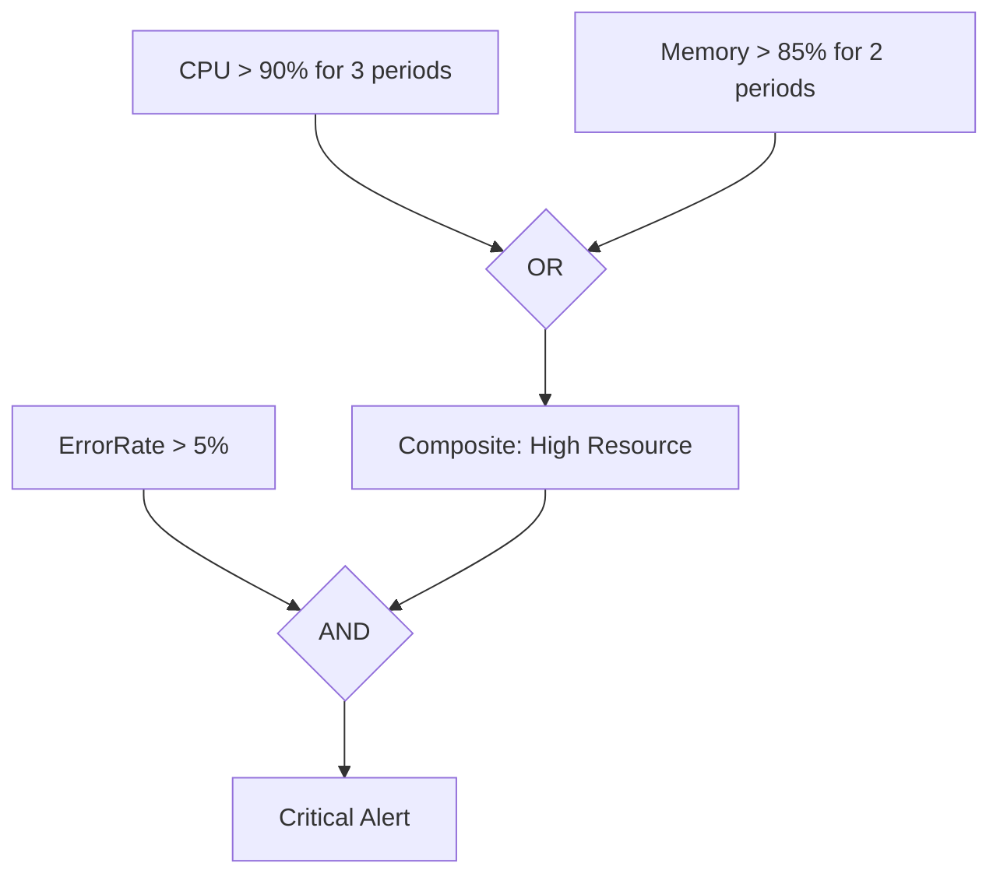

**Anomaly Detection bands:**
- Uses ML to learn metric behavior.
- Set expected band width (1-3 standard deviations).
- Alarm triggers when metric goes outside the band.
- Ideal for metrics with variable baselines (e.g., traffic patterns).

#### Skill 1.1.4: Cross-Account Cross-Region Dashboards

**CloudWatch cross-account observability:**
1. Source account shares metrics/logs with monitoring account.
2. Monitoring account creates dashboards across all linked accounts.
3. No data copy — metrics queried across accounts.

**Dashboard features:**
- Widgets: line charts, stacked areas, numbers, text, pie.
- Auto-refresh (1m, 5m, 15m, 1h).
- Can embed metrics from multiple accounts/Regions.
- Share dashboards via share link (no AWS login needed).

#### Skill 1.1.5: SNS Notifications

**SNS topics:**
- Fan-out delivery to multiple subscribers.
- Delivery retries, dead-letter queues.
- Message filtering (subscriber gets only matching messages).
- Supports: email, SMS, HTTP/HTTPS, Lambda, SQS, Firehose.

### Task 1.2: Identify and Remediate Issues

#### Skill 1.2.1: Automated Remediation

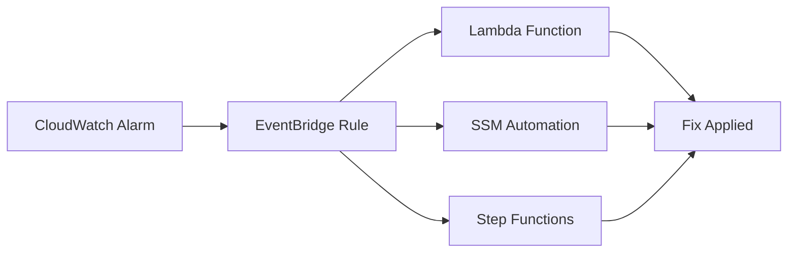

**Common remediation patterns:**

| Scenario | Remediator |
|---|---|
| EC2 CPU high | Lambda → ASG scale out, or SSM to restart service |
| Disk full | Lambda → SSM Run Command to clean logs |
| Failed deployment | Lambda → SSM to rollback to last AMI |
| Unhealthy target | ALB removes from rotation; Lambda investigates |

**AWS Systems Manager Automation:**
- Predefined runbooks (e.g., AWS-RestartEC2Instance, AWS-UpdateLinuxAmi).
- Custom runbooks via YAML/JSON or AWS SDKs.
- Can be triggered by CloudWatch alarms via EventBridge.
- Supports cross-account and cross-Region execution.

#### Skill 1.2.2: EventBridge for Event Routing

**EventBridge patterns:**
- **Default bus:** AWS service events (EC2, S3, CloudWatch).
- **Custom bus:** Application-specific events.
- **Partner bus:** SaaS events (Zendesk, DataDog, Auth0).

**Event pattern example:**
```json
{
  "source": ["aws.ec2"],
  "detail-type": ["EC2 Instance State-change Notification"],
  "detail": {
    "state": ["running", "stopped"]
  }
}
```

**Content-based filtering:**
- Prefix matching, numeric ranges, IP matching, exists/not-exists.
- Dead-letter queue for failed events.
- Archive events for replay/debugging.

#### Skill 1.2.3: SSM Automation Runbooks

**Key SSM capabilities for operations:**
- **Run Command:** Execute scripts on EC2 instances (bash, PowerShell).
- **Automation:** Orchestrate multi-step runbooks.
- **State Manager:** Ensure configuration compliance.
- **Session Manager:** Secure SSH/RDP without open ports.
- **Patch Manager:** Automate OS patching.
- **Inventory:** Collect software inventory.

**Runbook execution:**
- Manual via console/CLI.
- Automatic via CloudWatch alarm → EventBridge → SSM.
- Supports rate controls (percentage, concurrency).

### Task 1.3: Performance Optimization

#### Skill 1.3.1: Compute Optimization

**AWS Compute Optimizer:**
- Analyzes CloudWatch metrics to recommend right-sized instances.
- Supports EC2, EBS, Lambda, ECS, EKS, RDS.
- Shows projected savings and performance risk.
- Export recommendations to S3 or view in console.

**Right-sizing strategy:**
1. Enable Compute Optimizer.
2. Review recommendations (over-provisioned vs under-provisioned).
3. Check resource tags for ownership.
4. Test in dev/staging before prod.

#### Skill 1.3.2: EBS Performance

| Volume Type | Max IOPS | Max Throughput | Use Case |
|---|---|---|---|
| gp3 (default) | 16,000 | 1,000 MB/s | General purpose, boot volumes |
| io2 Block Express | 256,000 | 4,000 MB/s | Critical DBs, low-latency |
| io2 | 64,000 | 1,000 MB/s | Databases, high IOPS |
| st1 (HDD) | — | 500 MB/s | Throughput-intensive, big data |
| sc1 (HDD) | — | 250 MB/s | Infrequent access, lowest cost |

**Key EBS metrics:**
- **VolumeReadOps/WriteOps** — IOPS count.
- **VolumeReadBytes/WriteBytes** — throughput.
- **VolumeQueueLength** — if consistently > 0, volume is bottleneck.
- **BurstBalance** (gp2 only) — if < 20%, consider gp3 or io2.

**Optimization:**
- gp2 → gp3: same or better performance, 20% cheaper.
- Use Multi-Attach for cluster-aware filesystems (only io1/io2).
- Snapshots don't affect performance (incremental, on S3).

#### Skill 1.3.3: S3 Performance

**Performance tuning:**

| Technique | Effect |
|---|---|
| Multipart upload | > 100 MB objects, parallel transfer |
| S3 Transfer Acceleration | Global edge locations speed up uploads |
| AWS DataSync | Automated, scheduled transfers with retry |
| S3 Lifecycle policies | Move to cheaper tiers, reduce cost |
| S3 Prefix-level parallelism | S3 scales horizontally across prefixes |

**Request rate limits:**
- **GET/LIST:** 5,500 req/s per prefix, 3,500 req/s per prefix in IAM.
- **PUT/POST/DELETE/LIST:** 3,500 req/s per prefix, 5,500 req/s with IAM.
- Exceeding → 503 Slow Down.
- Fix: use more prefixes (random hash prefix, key-based partitioning).

#### Skill 1.3.4: Shared Storage Solutions

| Service | Protocol | Use Case | Key Feature |
|---|---|---|---|
| EFS | NFS | Linux shared access, containers | Lifecycle (IA), automatic scaling |
| FSx for Windows | SMB | Windows file shares, AD integration | DFS namespaces, dedup |
| FSx for Lustre | POSIX | HPC, ML training | Burst throughput, S3 backend |
| S3 Files | SMB | Simple managed file share | S3 as backend |

**EFS lifecycle policies:**
- Move files not accessed for N days to Infrequent Access (IA).
- IA: 92% cheaper, same durability, slightly higher latency.
- Available on Standard and One Zone storage classes.

#### Skill 1.3.5: RDS Performance

**RDS Performance Insights:**
- Visualizes database load by wait events, SQL queries, hosts.
- Shows top SQL by DB load (AAS — Average Active Sessions).
- Proactive recommendations (missing indexes, schema changes).
- Retains 7 days (free), up to 2 years (paid).

**RDS Proxy:**
- Connection pooling between app and RDS.
- Reduces connection storms and memory pressure on RDS.
- Supports Aurora MySQL, Aurora PostgreSQL, RDS MySQL, RDS PostgreSQL.
- Auto-scaling proxy capacity.
- Important: RDS Proxy does NOT reduce query latency — it pools connections.

**Key RDS metrics:**
- **FreeableMemory** — if consistently low, scale up.
- **CPUUtilization** — sustained > 80% = scale up.
- **ReadLatency/WriteLatency** — check against SLA.
- **DBConnections** — if near max, use RDS Proxy or scale up.
- **DiskQueueDepth** — high = I/O bottleneck.

#### Skill 1.3.6: EC2 Optimization

**Placement groups:**

| Type | Description | Use Case |
|---|---|---|
| Cluster | Low latency, high bandwidth (single AZ) | HPC, big data |
| Spread | Max isolation (max 7 instances per group per AZ) | Critical apps |
| Partition | Large distributed workloads (hundreds of instances) | Hadoop, Cassandra |

**Enhanced Networking:**
- **ENA (Elastic Network Adapter)** — up to 100 Gbps.
- **ENA Express** — lower latency via SRD protocol.
- **EFA (Elastic Fabric Adapter)** — HPC/ML, bypass OS kernel.
- Enable on instances that support it (check instance type docs).

---

## Domain 2: Reliability and Business Continuity (22%)

Covers scalability, high availability, backup, and disaster recovery.

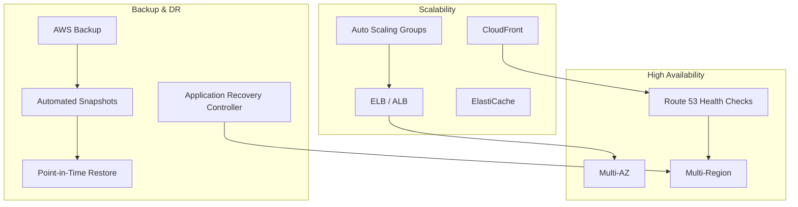

### Task 2.1: Implement Scalability and Elasticity

#### Skill 2.1.1: Scaling in Compute Environments

**Auto Scaling Group (ASG) components:**
- **Launch template / configuration** — what to launch (AMI, instance type, SG).
- **Scaling policies** — when to scale.
- **Health checks** — EC2 or ELB health checks.
- **Cooldown** — prevent rapid scaling oscillation.

**Scaling strategies:**

| Strategy | Description | When to Use |
|---|---|---|
| Simple scaling | +N instances, wait cooldown | Simple, predictable workloads |
| Step scaling | Add/remove based on breach levels | Variable thresholds |
| Target tracking | Maintain metric at target value | Most common, recommended |
| Predictive scaling | ML-based proactive scaling | Predictable patterns (daily/weekly) |

**Target tracking** is the recommended default:
- Set a target (e.g., CPU 60%, ALB request count per target).
- ASG automatically adjusts to maintain the target.
- Supports predefined and custom metrics.

**Instance refresh:**
- Rolling update of instances in an ASG.
- Replaces old instances with new launch template.
- Can pause or rollback.

#### Skill 2.1.2: Caching for Dynamic Scalability

**CloudFront:**
- Global edge cache (600+ PoPs).
- Reduces origin load dramatically.
- TTL-based caching; can invalidate.
- Origin failover (primary + secondary origins).

**ElastiCache:**
- In-memory caching to reduce database load.
- **Redis:** replication (Multi-AZ), persistence, clusters, pub/sub.
- **Memcached:** simpler, multi-node sharding, no persistence.
- Use for: session store, frequent reads, leaderboard, caching query results.

#### Skill 2.1.3: Database Scaling

| Service | Scaling Method |
|---|---|
| RDS/Aurora | Scale up (instance type), read replicas, Aurora Serverless v2 |
| DynamoDB | On-demand (automatic), provisioned (auto-scaling), global tables |
| ElastiCache | Redis Cluster mode (sharding), read replicas |
| Aurora Serverless v2 | Instantly scales capacity from min to max ACU |

**DynamoDB auto-scaling:**
- Target tracking for read/write capacity.
- Scales proactively based on traffic forecast.
- Avoids throttling (429 errors).

**Aurora Serverless v2:**
- Scales from 0.5 to 128 ACUs in fractions of ACU.
- Pay per ACU-second consumed.
- Good for unpredictable/uninterrupted workloads.
- Multi-AZ by default.

### Task 2.2: Implement Highly Available and Resilient Environments

#### Skill 2.2.1: ELB and Route 53 Health Checks

**ELB types:**

| Type | Layer | Use Case |
|---|---|---|
| ALB | L7 (HTTP/HTTPS) | Web apps, container-based, path-based routing |
| NLB | L4 (TCP/UDP/TLS) | Extreme performance, gaming, IoT |
| CLB | L4/L7 | Legacy applications only |
| GWLB | L3/L4 | Third-party appliances (firewalls/IDS) |

**Health check configuration:**
- **Route 53:** checks endpoint health, DNS failover (1-30s interval).
- **ELB health checks:** determine if instance receives traffic.
- **EC2 status checks:** hardware/software status (AWS-managed).

**Route 53 routing policies for HA:**
- **Failover:** active-passive across AZs or Regions.
- **Multivalue:** return multiple IPs, client tries any.
- **Geolocation / Latency:** route to closest Region.

#### Skill 2.2.2: Fault-Tolerant Systems

**Multi-AZ (RDS/Aurora/ElastiCache):**
- Synchronous replication to standby in different AZ.
- Automatic failover (typically < 1 min for RDS, < 30s for Aurora).
- DNS endpoint automatically updates.

**Aurora:**
- 6 copies across 3 AZs (storage-level replication).
- Reader endpoint for read replicas (up to 15).
- Global Database for cross-Region DR.

### Task 2.3: Implement Backup and Restore Strategies

#### Skill 2.3.1: Automate Backups with AWS Backup

**AWS Backup:**
- Centralized backup management across all AWS services.
- Supports: EBS, EC2, RDS, Aurora, DynamoDB, S3, EFS, FSx, etc.
- **Backup plans:** define schedules, retention, lifecycle.
- **Backup vaults:** access control, encryption, lock (immutable).
- **Cross-account backup:** copy to separate account for DR.
- **Compliance:** backup policies enforce backup requirements.

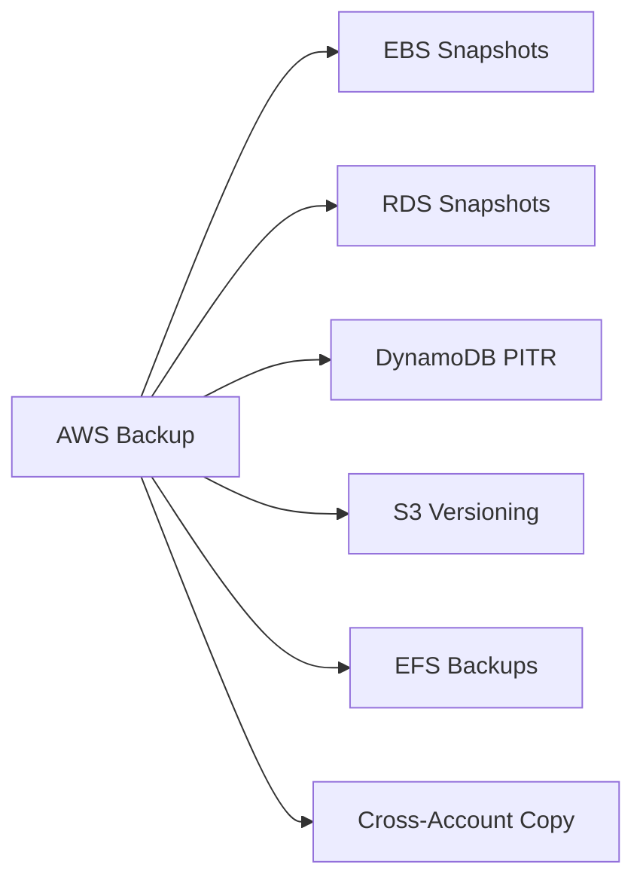

#### Skill 2.3.2: Restore Methods

| Service | Restore Method | RPO | RTO |
|---|---|---|---|
| RDS | Snapshot restore, PITR | 1-5 min | Minutes to hours |
| Aurora | Snapshot, PITR, Global DB | 1 second | Minutes |
| DynamoDB | PITR (35 days), on-demand backup | Seconds | Minutes |
| EBS | Snapshot, AMI | Hours (scheduled) | Minutes |
| S3 | Versioning, Cross-Region Replication | Near-zero (versions) | Seconds |

**PITR (Point-in-Time Restore):**
- Restores to any second within retention window.
- For RDS: enabled by default, 1-35 day retention.
- For DynamoDB: enabled per table, 1-35 day retention.
- Restores to a NEW resource (does not overwrite existing).

#### Skill 2.3.3: Versioning for Storage

**S3 Versioning:**
- Every write creates a new version.
- Delete creates a delete marker (not actual deletion).
- Can list/restore/delete specific versions.
- MFA Delete: require MFA for versioning actions.

**FSx versioning:**
- Available for FSx for Windows.
- Automatic daily snapshots + user-initiated.

#### Skill 2.3.4: Disaster Recovery Strategies

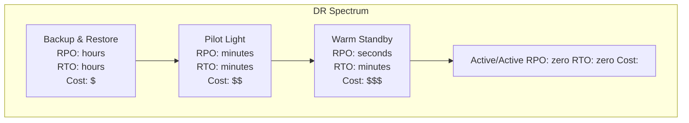

| Strategy | Description | RPO | RTO | Cost |
|---|---|---|---|---|
| Backup & Restore | Regular backups, restore when needed | Hours | Hours | $ |
| Pilot Light | Minimal critical resources always running | Minutes | Minutes | $$ |
| Warm Standby | Full environment running, scaled down | Seconds | Minutes | $$$ |
| Active/Active | Full environments in multiple Regions | ~Zero | ~Zero | $$$$ |

**Multi-Region DR with Aurora Global Database:**
- Primary cluster in one Region, up to 5 secondary (read-only) Regions.
- Replication lag typically < 1 second.
- Planned failover: promote secondary (no data loss).
- Unplanned failover: detach secondary, some data loss possible (< 1s).

---

## Domain 3: Deployment, Provisioning, and Automation (22%)

Covers IaC, resource provisioning, deployment strategies, and operational automation.

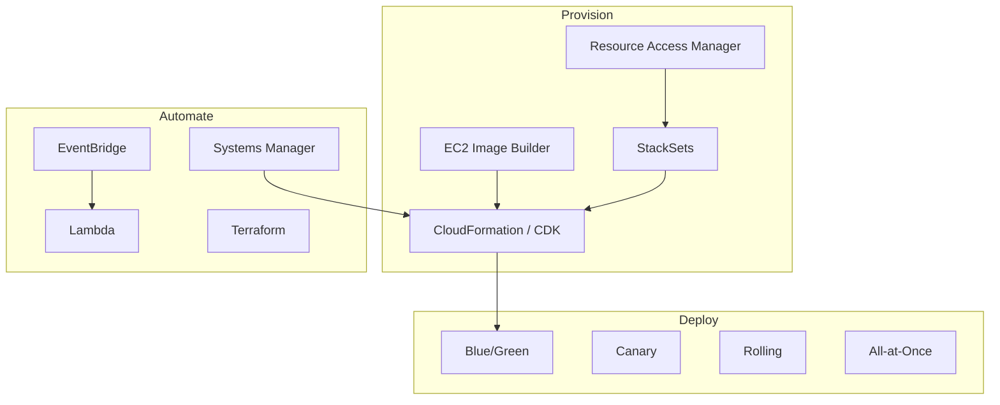

### Task 3.1: Provision and Maintain Cloud Resources

#### Skill 3.1.1: AMIs and Container Images

**EC2 Image Builder:**
- Automates AMI and container image creation.
- Pipeline: source → build → test → distribute.
- Source: existing AMI, marketplace AMI.
- Build: install packages, run scripts.
- Test: run tests (pytest, etc.).
- Distribute: copy to multiple Regions, share with accounts.
- **Ponytail:** always use Image Builder over manual AMI baking.

**ECR (Elastic Container Registry):**
- Stores container images (Docker/OCI).
- Lifecycle policies: expire old images/tags.
- Cross-account access via resource policies.
- Scan images for vulnerabilities (basic scanning free, enhanced via Inspector).

#### Skill 3.1.2: CloudFormation and CDK

**CloudFormation:"
- Declarative IaC — describe desired state, AWS creates it.
- Stack: collection of resources managed as a unit.
- Change sets: preview changes before applying.
- Rollback on failure (by default).
- Nested stacks: break large templates into reusable components.
- Drift detection: detect manual changes outside CloudFormation.
- Stack policies: control what can be updated.
- **Intrinsic functions:** !Ref, !Sub, !GetAtt, !Join, !If, !Select, !FindInMap, !ImportValue.

**CloudFormation StackSets:**
- Deploy same stack across multiple accounts/Regions.
- Managed by administrator account.
- Supports both self-managed and service-managed permissions.
- Use with AWS Organizations for multi-account provisioning.

**AWS CDK (Cloud Development Kit):"
- Define infrastructure using TypeScript, Python, Java, etc.
- Synthesizes to CloudFormation templates.
- Higher-level constructs (L2, L3) abstract common patterns.
- **Ponytail:** CDK = less YAML. Use for complex infrastructure.

**AWS RAM (Resource Access Manager):"
- Share resources across accounts: subnets, Transit Gateways, license manager configs.
- Share via resource shares (within OU, organization, or specific accounts.
- Does NOT share: EC2 instances, RDS, S3 buckets (use bucket policies).

#### Skill 3.1.3: Troubleshoot Deployment Issues

**Common CloudFormation errors:"

| Error | Likely Cause |
|---|---|
| InsufficientCapabilities | Need CAPABILITY_IAM or CAPABILITY_AUTO_EXPAND |
| InvalidSubnetID.NotFound | Wrong Region, typo, or deleted subnet |
| CreationPolicy timeout | Instance/ASG didn't signal success |
| Circular dependency | Resources depend on each other |
| Export already exists | Another stack exports the same Output name |
| Subnet size exhaustion | Not enough IPs in the subnet |

**Subnet sizing:"
- /24 = 251 usable IPs (256 - 5 AWS reserved).
- /25 = 123, /26 = 59, /27 = 27, /28 = 11.
- ENIs, ALBs, NAT Gateways all consume IPs.
- Plan for growth; /24 is a safe minimum for production subnets.

#### Skill 3.1.4: Cross-Region and Cross-Account Provisioning

**Patterns:"

| Pattern | Mechanism | Use Case |
|---|---|---|
| StackSets | CFN StackSets | Same IaC across accounts/Regions |
| Cross-account sharing | RAM | Share subnets, TGWs |
| S3 cross-account | Bucket policy + IAM role | Share data |
| ECR cross-account | Resource policy | Share container images |

#### Skill 3.1.5: Deployment Strategies

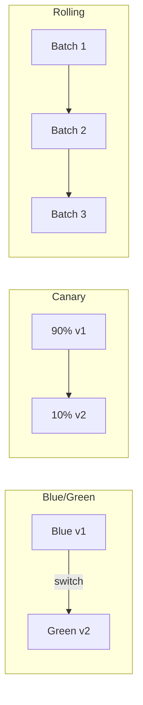

| Strategy | Risk | Downtime | Rollback | Use Case |
|---|---|---|---|---|
| All-at-Once | High | Yes (brief) | Redeploy old | Non-critical, small deployments |
| Rolling | Medium | No | Rolling back batches | Most common, ECS/EC2 |
| Canary | Low | No | Switch traffic back | Critical services, test with real traffic |
| Blue/Green | Lowest | None (instant switch) | Switch back to blue | Production critical, database changes |

**ECS deployment circuit breaker:**
- Monitors CloudWatch alarms during deployment.
- If alarm triggers, rolls back automatically.
- Configure on ECS service.

#### Skill 3.1.6: Third-Party Tools

**Terraform:"
- HashiCorp IaC tool, provider-based.
- State file tracks resources (store in S3 with locking via DynamoDB).
- `terraform plan` / `apply` / `destroy`.
- Modules for reusability.
- Import existing resources with `terraform import`.
- **Ponytail:** CloudFormation is AWS-native; Terraform is multi-cloud. Exam focuses on CFN/CDK.

### Task 3.2: Automate the Management of Existing Resources

#### Skill 3.2.1: Systems Manager for Operations

**Key SSM features for CloudOps:"

| Feature | Purpose |
|---|---|
| Run Command | Execute scripts on managed instances |
| Automation | Multi-step runbooks (remediation, maintenance) |
| State Manager | Ensure configuration compliance (keep state) |
| Session Manager | SSH/RDP without open ports or keys |
| Patch Manager | OS patch scheduling (windows, compliance) |
| Inventory | Software, network, instance metadata |
| Fleet Manager | UI for fleet management |
| OpsCenter | Operational item management, tracking |

**SSM Patch Manager:"
- Patch baselines: define approved patches.
- Patch groups: tag instances for patching schedules.
- Compliance reports: see which instances are compliant.
- Can auto-approve patches after testing window.

#### Skill 3.2.2: Event-Driven Automation

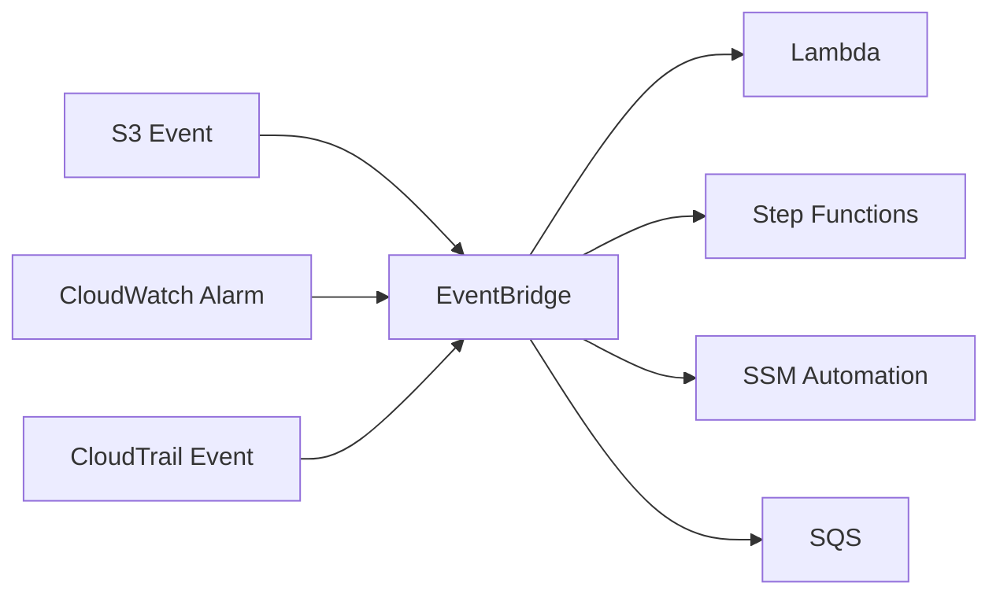

**Event-driven patterns:"

| Trigger | Event Source | Action |
|---|---|---|
| New S3 object | S3 Event Notification | Lambda to process file |
| EC2 state change | EventBridge (default bus) | Lambda to configure instance |
| CloudWatch alarm | CloudWatch → EventBridge | SSM runbook to remediate |
| Scheduled | EventBridge Scheduler | Lambda for periodic maintenance |

---

## Domain 4: Security and Compliance (16%)

Covers IAM, encryption, compliance enforcement, and security services.

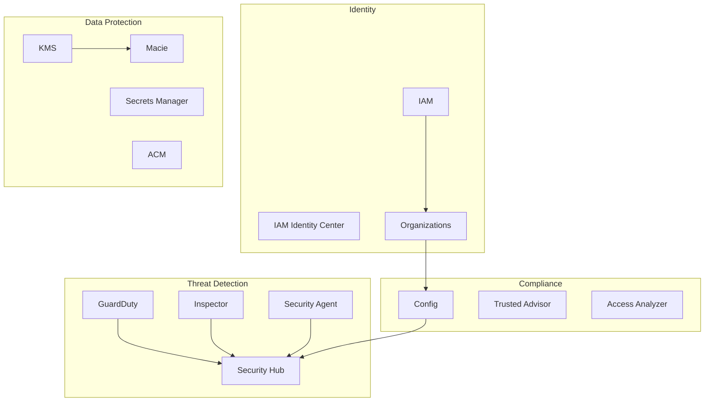

### Task 4.1: Implement and Manage Security and Compliance Tools

#### Skill 4.1.1: IAM Features

**Key IAM concepts:"

| Feature | Description |
|---|---|
| Password policy | Min length, complexity, rotation, prevent reuse |
| MFA | Hardware (key fob) or virtual (app); enforce on root + users |
| Roles | Temporary credentials for EC2, Lambda, cross-account |
| Federated identity | SAML 2.0, OIDC, or custom identity broker |
| Resource policies | Bucket policies, key policies — trust-based access |
| Policy conditions | aws:PrincipalOrgID, aws:SourceIp, aws:SourceVpce |
| IAM roles Anywhere | Use X.509 certs for on-prem workloads to get AWS creds |

**Best practices:"
- Never use root account for daily operations.
- Use groups/policies, not inline policies per user.
- Enforce MFA on all users (condition key: `aws:MultiFactorAuthPresent`).
- Use roles for cross-account (never share access keys).
- Rotate access keys regularly.

#### Skill 4.1.2: Audit Access Issues

**CloudTrail:"
- Management events: control plane API calls (default, 90 days).
- Data events: data plane (S3 objects, Lambda invoke) — opt-in.
- CloudTrail Lake: query trail data with SQL (via Athena).
- Integration with CloudWatch Logs and EventBridge.

**IAM Access Analyzer:"
- Analyzes resource policies to find external access.
- Identifies: public access, cross-account access, unused permissions.
- Generates findings → remediate or archive.
- Supports S3, IAM roles, KMS keys, Lambda, SQS, SNS.

**IAM Policy Simulator:"
- Test what actions a user/role CAN do.
- Evaluate policies without actually making the API call.
- Identify why access was denied.

#### Skill 4.1.3: Multi-Account Strategies

**AWS Organizations:"
- Consolidated billing.
- Service Control Policies (SCPs): permission boundaries for OUs/accounts.
- SCPs are **allow lists** (if not explicitly allowed, denied) or **deny lists**.
- SCPs do NOT grant permissions — they filter what IAM policies allow.

**IAM Identity Center (successor to AWS SSO):"
- Centralized identity management.
- SSO to AWS accounts and business apps (Salesforce, Office 365, etc.).
- Permission sets: map to IAM roles in each account.
- Multi-factor authentication.
- Sync with existing IdP (Okta, Azure AD, etc.).

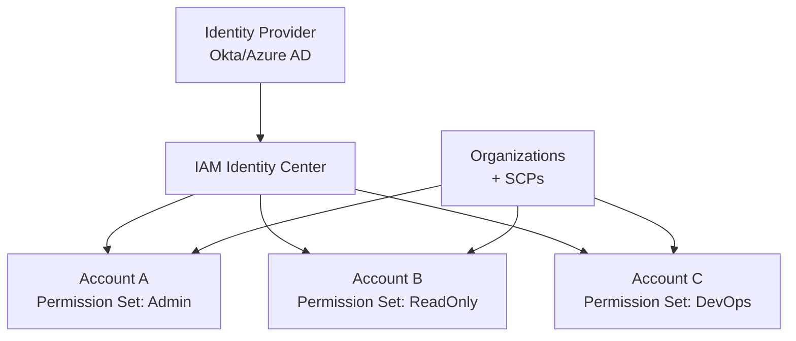

#### Skill 4.1.4: Trusted Advisor Remediation

**Trusted Advisor:**
- Automated checks across: cost optimization, security, performance, fault tolerance, service limits.
- Security checks: exposed access keys, S3 public buckets, security groups open to 0.0.0.0/0.
- Refresh rate: every 5 minutes for paid, daily for free tier.
- Can trigger remediation via Lambda + EventBridge.

#### Skill 4.1.5: Compliance Enforcement

**AWS Config:"
- Records configuration changes over time.
- Config rules: evaluate resources against desired state (e.g., EBS encrypted, S3 versioning enabled).
- Conformance packs: collections of rules + remediation actions.
- Auto-remediation: trigger SSM automation on non-compliant resources.
- Aggregation: centralize across accounts.

**Compliance patterns:"
- Config rule detects non-compliance → SSM auto-remediation → CloudWatch alarm if fails.
- SCPs to prevent non-compliant resources from being created in the first place.
- Config conformance packs for standards (CIS, PCI-DSS, SOC2).

### Task 4.2: Implement Strategies to Protect Data and Infrastructure

#### Skill 4.2.1: Data Classification

**Amazon Macie:"
- ML-powered PII discovery in S3.
- Automatically classifies: PII (names, SSN, emails), financial data, credentials.
- Integration with Lake Formation for data catalog enrichment.
- Findings: sensitive data discovered, bucket is publicly accessible, etc.

#### Skill 4.2.2: Encryption at Rest

**KMS Key Types:"

| Type | Managed By | Rotation | Use Case |
|---|---|---|---|
| AWS managed key (aws/*) | AWS | No automatic | Default encryption |
| Customer managed CMK | You | Yes (annual) | Full control, policies, audit |
| Customer managed key in external KMS | You (key material in CloudHSM/external) | Manual | Regulatory requirements |
| Data key (envelope encryption) | KMS generates | N/A | Used to encrypt actual data |

**Envelope encryption:"
- KMS generates a data key (plaintext + encrypted).
- Application uses plaintext data key to encrypt data.
- Store encrypted data key alongside encrypted data.
- To decrypt: call KMS to decrypt the data key, then decrypt data.
- Benefit: data never goes to KMS, only the small key does.

**KMS key policies vs IAM policies:"
- CMK key policy is the **primary** access control.
- Both key policy AND IAM policy must allow the action (default).
- Can set key policy to allow full access and control via IAM.

#### Skill 4.2.3: Encryption in Transit

**AWS Certificate Manager (ACM):"
- Free SSL/TLS certificates for ALB, CloudFront, API Gateway, Elastic Beanstalk.
- Auto-renewal.
- Cannot export private keys (use with AWS services only).
- For EC2/other: use ACM PCA (Private Certificate Authority) or import.

**TLS best practices:"
- Enforce HTTPS on ALB (default security policy, redirect HTTP).
- Use Security Policy 2023-08 on ALB for modern TLS.
- CloudFront: minimum TLS version, security policy configuration.
- S3: enforce HTTPS via bucket policy.

#### Skill 4.2.4: Securely Store Secrets

**Secrets Manager:"
- Store and rotate secrets (database credentials, API keys).
- Built-in rotation for RDS, Aurora, Redshift, DocumentDB.
- Custom rotation via Lambda.
- Cross-account access via resource policies.
- Integration with CloudFormation (dynamic references).

**Parameter Store (SSM):"
- Store parameters (strings, StringList, SecureString).
- SecureString = encrypted with KMS.
- Free tier: 10,000 parameters.
- **Ponytail:** Secrets Manager for secrets (rotation + audit). Parameter Store for configuration (no rotation).

#### Skill 4.2.5: Security Findings and Remediation

**Security Hub:"
- Centralized security findings dashboard.
- Aggregates from: GuardDuty, Inspector, Macie, Config, IAM Access Analyzer.
- Security standards: CIS AWS Foundations, AWS Foundational Security Best Practices.
- Automated remediation with Config rules and SSM runbooks.
- Integration with EventBridge for custom workflows.

**GuardDuty:"
- Threat detection service (no agents needed for most).
- Detects: compromised credentials, unusual API calls, crypto mining, IAM anomalies.
- S3 protection: detect malicious access patterns.
- EKS protection: runtime monitoring of containers.
- Findings flow to Security Hub.

**Amazon Inspector:"
- Automated vulnerability scanning.
- EC2 instances: OS and package vulnerabilities.
- ECR images: container image vulnerabilities.
- Lambda functions: code vulnerabilities.
- **AWS Security Agent:** lightweight agent for Inspector on EC2/ECS/EKS.
- Generates findings with severity levels (Critical, High, Medium, Low).

---

## Domain 5: Networking and Content Delivery (18%)

Covers VPC configuration, DNS, content delivery, and network troubleshooting.

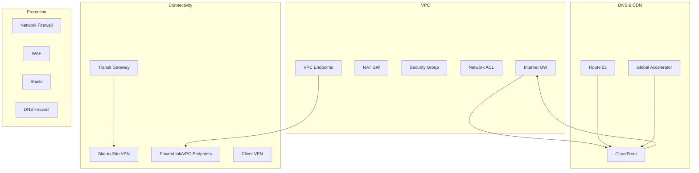

### Task 5.1: Implement and Optimize Networking Features

#### Skill 5.1.1: Configure a VPC

**VPC components:"

| Component | Layer | Stateful? | Use |
|---|---|---|---|
| Security Group | Instance (ENI) | Yes | Allow traffic (default deny all inbound, allow all outbound) |
| Network ACL | Subnet | No | Allow/deny rules (numbered, evaluated in order) |
| Internet Gateway | VPC | N/A | Connect VPC to internet (IPv4 + IPv6) |
| NAT Gateway | Subnet | N/A | Private subnet → internet (outbound only) |
| Egress-only IGW | VPC | N/A | IPv6 outbound only (IPv6 NAT equivalent) |

**Key differences: SG vs NACL:"

| | Security Group | Network ACL |
|---|---|---|
| Scope | Instance (ENI) | Subnet |
| Stateful | Yes | No |
| Rules | Allow only | Allow + Deny |
| Evaluation | All rules evaluated together | Numbered, first match wins |
| Default | Deny inbound, allow outbound | Allow all inbound and outbound |

**Subnet design:"
- Public: route table has route to Internet Gateway.
- Private: no IGW route. Use NAT Gateway for outbound internet.
- Isolated: no IGW, no NAT. For databases, internal services.

#### Skill 5.1.2: Private Networking Connectivity

**VPC Endpoints:"

| Type | Routes traffic via | AWS services | Cross-VPC |
|---|---|---|---|
| Gateway (S3, DynamoDB) | Route table entry | S3, DynamoDB | No |
| Interface (PrivateLink) | ENI with private IP | Most AWS services | Yes |

**Gateway endpoints:"
- Free (no hourly charge, only data processing).
- Added to route table: `pl-xxxxx` → s3 or dynamodb.
- Keeps S3/DynamoDB traffic off the internet.

**Interface endpoints (PrivateLink):"
- Creates an ENI with a private IP in your VPC.
- Powered by AWS PrivateLink.
- Access services like CloudWatch, SSM, KMS, EventBridge, etc.
- **Ponytail:** PrivateLink is blocked by company policy. Use Interface endpoints within the same VPC; on-prem → AWS via public internet.

**VPC Peering:"
- Direct network connection between two VPCs (same or different accounts/Regions).
- Non-transitive: A peered to B, B peered to C ≠ A can reach C.
- Must not have overlapping CIDR ranges.

**Transit Gateway:"
- Hub-and-spoke connectivity for 1000s of VPCs, VPNs, and Direct Connects.
- Transitive routing by default.
- Route tables per attachment to control traffic flow.
- Supports multicast (VPCs only).
- Peering between Transit Gateways (inter-Region).

#### Skill 5.1.3: Network Protection Services

**AWS Network Firewall:"
- Stateful, layer 7 inspection.
- Rules: 5-tuple (protocol, source/dest IP/port, direction).
- Stateful rules: domain filtering, Suricata-compatible IPS rules.
- Deployed in each AZ (firewall subnet).
- Integrates with Route 53 Resolver DNS Firewall.

**Route 53 Resolver DNS Firewall:"
- Domain-level filtering for DNS queries.
- Blocklists, allowlists, domain override rules.
- Protects against DNS exfiltration and malware C2 domains.

**AWS WAF:"
- Web application firewall for ALB, CloudFront, API Gateway, Cognito.
- Web ACLs with rules: IP sets, regex, geo, rate-based, bot control, managed rule groups.
- Bot Control: manage bots (verified, common, suspicious).
- Account takeover prevention (for Cognito).

**AWS Shield:"
- Standard (free): automatic DDoS protection for all AWS customers.
- Advanced (paid): DDoS response team (DRT), enhanced protection, financial protection.

#### Skill 5.1.4: Optimize Network Cost

**Cost optimization techniques:"
- Use VPC endpoints (Gateway) instead of NAT Gateway for S3/DynamoDB — free.
- Evaluate NAT Gateway data processing charges ($0.045/GB).
- Use VPC peering (cheaper than VPN for same-Region).
- Transit Gateway: evaluate per-attachment-hour and data processing costs.
- S3 Transfer Acceleration: compare cost vs Direct Connect vs DataSync.
- Use AWS Cost Explorer to identify top network spend.

### Task 5.2: Configure Domains, DNS, and Content Delivery

#### Skill 5.2.1: Route 53 Resolver

**Route 53 Resolver:"
- Automatically resolves DNS for VPC resources (instances, ELBs, etc.).
- **Inbound endpoint:** forward DNS queries from on-prem to Route 53 (hybrid DNS).
- **Outbound endpoint:** forward VPC DNS queries to on-prem DNS.
- Resolver rules: conditional forwarding (forward specific domains to specific IPs).
- DNS Firewall: filter domains (block malware, exfiltration).

#### Skill 5.2.2: Route 53 Routing Policies

| Policy | Description | Use Case |
|---|---|---|
| Simple | One record, random selection | Single resource, no special routing |
| Weighted | Distribute by weight (0-255) | A/B testing, gradual migration |
| Latency | Route to lowest-latency Region | Global user base, latency-sensitive |
| Failover | Active-passive | DR, health-check based |
| Geolocation | Route by user location | Localization, compliance (GDPR) |
| Multivalue | Return multiple IPs | DNS-level load balancing |
| IP-based | Route by client IP (CIDR) | Enterprise network routing |

**Health checks:"
- Monitor endpoint health (HTTP, HTTPS, TCP).
- Integrate with failover routing.
- Route 53 health checkers are global (from multiple locations).
- Can alarm on health check failure via CloudWatch.

**Query logging:"
- Log DNS queries to CloudWatch Logs, S3, or Kinesis Data Firehose.
- Useful for: troubleshooting, security analysis, audit.

#### Skill 5.2.3: CloudFront and Global Accelerator

| Feature | CloudFront | Global Accelerator |
|---|---|---|
| Layer | L7 (HTTP/HTTPS) | L3/L4 (TCP/UDP) |
| Content | Caches at edge | No caching, routes traffic |
| Use case | Web content, API (HTTP) | Non-HTTP (gaming, IoT, custom) |
| Protocols | HTTP, HTTPS, WebSocket | TCP, UDP, HTTP(TCP) |
| Static IPs | No (CNAME) | Yes (2 anycast IPs) |
| DDoS | Shield Standard + WAF | Shield Advanced included |

**CloudFront key concepts:"
- **Origin:** S3, ALB, HTTP server, or other.
- **Origin Failover:** primary + secondary origin.
- **Behaviors:** path-based routing (e.g., `/api/*` → API origin, `/*` → S3).
- **Cache TTL:** controls how long content is cached.
- **Invalidation:** force cache refresh (`/*` = purge all, expensive).
- **Signed URLs/Cookies:** restrict access to content.
- **Custom error pages:** return friendly errors from edge.
- **Origin Shield:** reduce origin load by routing through a single Regional edge.

### Task 5.3: Troubleshoot Network Connectivity Issues

#### Skill 5.3.1: Troubleshoot VPC Configurations

**Troubleshooting flowchart:"

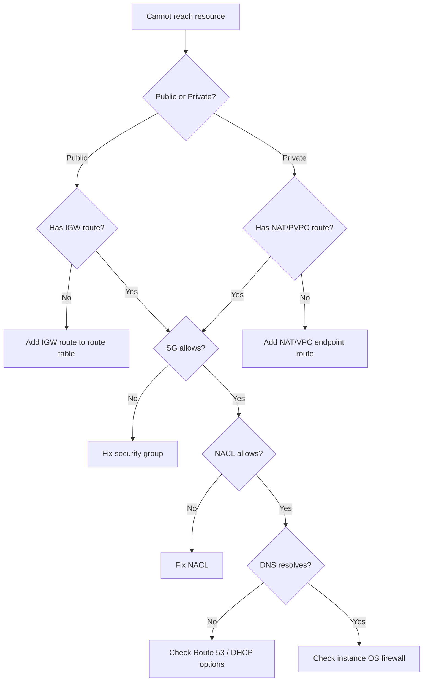

**VPC Reachability Analyzer:"
- Analyzes path between source and destination.
- Checks: route tables, security groups, NACLs, gateways.
- Returns whether path is reachable and what blocks it.
- Saves time vs manual hop-by-hop analysis.

#### Skill 5.3.2: Networking Logs

| Log Type | What It Captures | Enable On |
|---|---|---|
| VPC Flow Logs | All traffic (accepted + rejected) per ENI | VPC, Subnet, or ENI |
| ELB Access Logs | HTTP requests to ALB/NLB/CLB | Load Balancer |
| CloudFront Logs | HTTP requests to distributions | Distribution |
| WAF Logs | Web ACL traffic | Web ACL |

**VPC Flow Logs:"
- Capture: source/dest IP, ports, protocol, action (ACCEPT/REJECT), bytes, packets.
- Destination: S3 or CloudWatch Logs.
- Cannot filter at capture time — use CloudWatch Logs Insights or Athena for analysis.
- **Ponytail:** Flow Logs are essential for network troubleshooting. Always enable.

#### Skill 5.3.3: CloudFront Caching Issues

**Common caching problems:"

| Problem | Cause | Fix |
|---|---|---|
| Stale content | TTL too high | Reduce TTL or invalidate |
| Cache miss | Caching disabled, TTL=0 | Check cache behavior settings |
| 403 from origin | Origin access denied | Check OAI/OAC, SG, origin config |
| High origin load | Cache miss rate high | Increase TTL, add Origin Shield |
| CORS errors | Missing headers | Add CORS headers to CloudFront behavior |

**Troubleshooting steps:"
1. Check `X-Cache` header: `Hit from cloudfront` (cached) vs `Miss from cloudfront` (origin).
2. Check TTL settings in cache behavior.
3. Check if query strings, cookies, or headers are forwarded (may prevent caching).
4. Use CloudFront access logs to see cache hit/miss ratio.

#### Skill 5.3.4: Hybrid Connectivity

**Site-to-Site VPN:"
- IPsec VPN tunnel from on-prem to VPC.
- Two tunnels for redundancy.
- Uses Virtual Private Gateway (VGW) or Transit Gateway.
- **Speed:** up to 10 Gbps (depends on encryption and internet).

**Troubleshooting VPN:"
- Check tunnel status in VPC console.
- IKE errors: mismatched pre-shared key, IKE versions.
- Phase 1/2 failures: firewall blocking UDP 500/4500.
- Asymmetric routing: verify both tunnels have return routes.

#### Skill 5.3.5: CloudWatch Network Monitoring

**Network metrics:"
- VPC Flow Logs → CloudWatch Logs Insights for analysis.
- ELB metrics: RequestCount, TargetResponseTime, HTTPCode_Backend_5xx.
- NAT Gateway metrics: ActiveConnectionCount, BytesOutToDestination, ErrorPortAllocation.
- Transit Gateway metrics: BytesOut, BytesIn, PacketDropCount.
- VPN metrics: TunnelState, TunnelDataIn/Out.

---

## Quick Reference: Critical Numbers

| Item | Value |
|---|---|
| Passing score | 720 / 1000 |
| Scored questions | 50 |
| Unscored questions | 15 |
| Duration | 130 minutes |
| Domains | 5 (22/22/22/16/18) |
| Multiple response questions | 2+ correct from 5+ options |
| SCPs | Filter, do NOT grant permissions |
| EBS gp3 max IOPS | 16,000 |
| EBS gp3 max throughput | 1,000 MB/s |
| S3 GET rate per prefix | 5,500 req/s |
| S3 PUT rate per prefix | 3,500 req/s |
| SG per ENI limit | 5 security groups, 60 rules each |
| NACL rules limit | 20 inbound + 20 outbound (soft), 40 each (hard) |
| /24 subnet usable IPs | 251 |
| CloudTrail default retention | 90 days |
| RDS PITR retention | 1-35 days |
| DynamoDB PITR retention | 1-35 days |
| VPC Flow Logs retention | No limit (S3) / configurable (CW Logs) |
| NAT Gateway AZ redundancy | Create one per AZ |
| Transit Gateway max attachments | 5,000 (per TGW) |
| Max SG rules per SG | 60 inbound + 60 outbound |

---

## Practice Questions

<details>
<summary>Q1: Your EC2 instances in a private subnet need to download patches from the internet. The NAT Gateway in the AZ has failed. What is the FASTEST way to restore connectivity while you investigate the NAT Gateway failure?</summary>

A. Create a new NAT Gateway in the same AZ
B. Update the route table to point to a NAT Gateway in another AZ
C. Launch a bastion host in the public subnet
D. Enable VPC endpoints for the patch repositories

**Answer: B.** Update the route table to use a NAT Gateway in another AZ. This is a one-command change that restores connectivity immediately while you fix the failed one. A requires time to provision and update route tables. C would require SSH tunneling which is more complex. D may not be possible for all patch sources.

</details>

<details>
<summary>Q2: A CloudWatch alarm goes to ALARM state. You configured an SNS topic as the action, but no notification was received. What should you check FIRST?</summary>

A. CloudWatch alarm evaluation periods
B. SNS topic subscription confirmation
C. IAM permissions for the alarm
D. CloudWatch Logs

**Answer: B.** SNS subscriptions require email confirmation — the subscriber must click the confirmation link in the email. This is the most common reason for missing notifications. A would affect whether the alarm triggers, not whether the notification is sent. C would show in the alarm history as authorization failure. D is unrelated.

</details>

<details>
<summary>Q3: You need to ensure that all S3 buckets in your organization have versioning enabled. Which combination of services should you use?</summary>

A. S3 Bucket Policies + IAM
B. AWS Config rule + SSM auto-remediation
C. CloudTrail + Lambda
D. Trusted Advisor + SNS

**Answer: B.** AWS Config rule checks for versioning status. If not enabled, SSM auto-remediation automatically enables it. A requires per-bucket policy management. C is reactive, not enforcement. D only detects, doesn't enforce.

</details>

<details>
<summary>Q4: An Aurora PostgreSQL cluster has high CPU utilization. Performance Insights shows that the top SQL query is a SELECT with a full table scan. What is the best first action?</summary>

A. Scale up the Aurora instance
B. Create an index on the filtered column
C. Enable RDS Proxy
D. Add a read replica

**Answer: B.** A full table scan means a missing index. Creating an index on the filtered column is the root-cause fix — it reduces CPU by eliminating the scan. A masks the problem. C manages connections, not queries. D helps with read scaling but doesn't fix the slow query.

</details>

<details>
<summary>Q5: You are using Terraform to manage AWS resources. A team member manually modified an EC2 instance type in the console. What is the issue and how to prevent it?</summary>

A. The Terraform state file is now out of sync. Use `terraform refresh` and apply CloudFormation drift detection.
B. The change was overwritten on next `terraform apply`. Enable CloudFormation stack policies.
C. The Terraform state file is now out of sync. Use `terraform plan` to see the drift, then `terraform apply` to reconcile. To prevent, use SSM State Manager or IAM policies restricting console access.
D. No issue — Terraform automatically detects and incorporates manual changes.

**Answer: C.** Terraform state is the source of truth — manual changes cause state drift. `terraform plan` shows the drift, `apply` reconciles. Prevention: restrict console access or use SSM State Manager. A mentions CloudFormation which is irrelevant to Terraform. B is wrong — Terraform doesn't use CloudFormation stack policies. D is false.

</details>

<details>
<summary>Q6: A CloudFront distribution returns 504 Gateway Timeout. The origin is an ALB. What is the most likely cause?</summary>

A. CloudFront TTL is too low
B. The ALB target is returning slowly or not responding within the CloudFront timeout
C. The S3 bucket policy denies access
D. DNS resolution is failing

**Answer: B.** 504 means the origin (ALB) didn't respond within CloudFront's timeout (default 30s). Check ALB target health and response times. A affects caching, not timeouts. C would cause 403. D would cause DNS errors, not 504.

</details>

<details>
<summary>Q7: Your company policy requires that all RDS databases be backed up daily with a 30-day retention. Which AWS service provides centralized management for this requirement?</summary>

A. AWS Config
B. AWS Backup
C. AWS Lambda
D. AWS DMS

**Answer: B.** AWS Backup provides centralized backup management with backup plans, schedules, retention policies, and compliance reporting across all supported services. A can detect non-compliance but doesn't manage backups. C requires custom development. D is for data migration.

</details>

<details>
<summary>Q8: A user reports they cannot access an S3 bucket. The bucket policy grants access to their IAM role. What should you check?</summary>

A. S3 versioning status
B. Whether the IAM role has a trust policy allowing the user to assume it
C. S3 replication configuration
D. KMS key policy (if bucket uses SSE-KMS)

**Answer: D (or B depending on context).** If the bucket uses SSE-KMS, the KMS key policy must also grant the IAM role decrypt permissions — this is the most common "gotcha." B is also valid if the user hasn't assumed the role. On the exam, check for SSE-KMS first as it's a classic trap.

</details>
